# Persiapan dan Konfigurasi Framework

**Modul 1 - Dasar-Dasar GIS, Konsep WebGIS, Dasar Pemrograman, dan Github**

## **Persiapan Folder Project**

1. Buat **folder baru** yang akan digunakan sebagai tempat penyimpanan project, kemudian buka **Virtual Studio Code**, lalu **pilih folder** tersebut dengan cara **klik file,** kemudian **klik open folder**, lalu **pilih folder** yang telah dibuat.
    
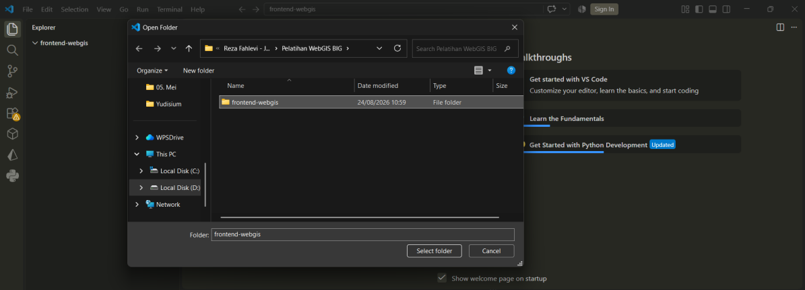
    
2. Selanjutnya setelah memilih folder yang akan menjadi tersebut, berikut ini merupakan halaman awal folder dan project yang akan dirancang dan dibangun.
    
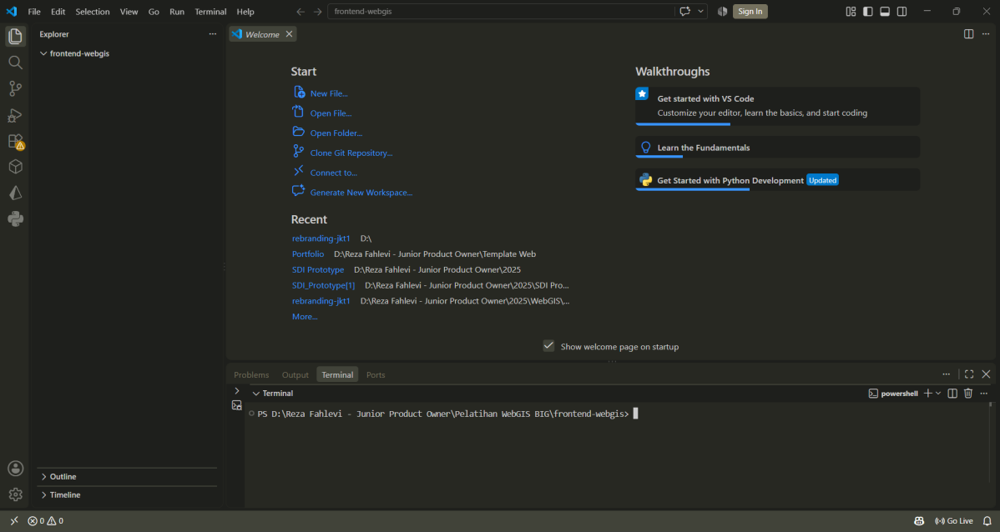
    

## **Konfigurasi Framework Next.JS**

1. Buka tautan [**https://nextjs.org/**](https://nextjs.org/) untuk melihat dokumentasi framework yang akan digunakan oleh penguna.
    
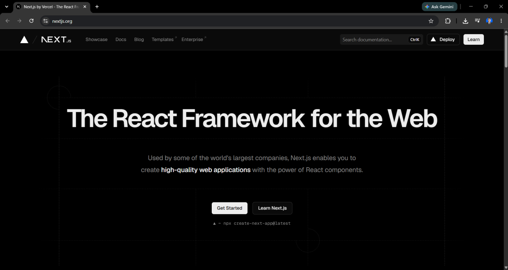
    
2. Tahapan berikutnya untuk melakukan konfigurasi framework dalam perancangan dan pembangunan WebGIS, maka **buka virtual studio code** kemudian **klik terminal** untuk menjalankan perintah konfigurasi framework.
    
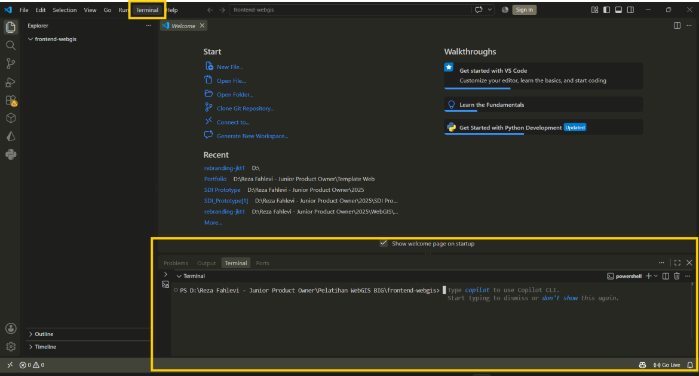
    
3. Selanjutnya pada bagian terminal lakukan konfigurasi Next.js dengan menginput perintah berikut ini **npx create-next-app@latest** kemudian **klik enter**. Selanjutnya input nama project yang akan dirancang oleh penggguna.

    ```bash
    npx create-next-app@latest
    ```

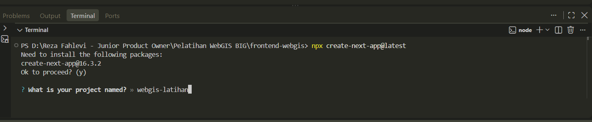

4. Tahapan berikutnya lakukan konfigurasi next.js pada terminal dengan konfigurasi sebagai berikut.

    Jawaban yang dipakai pada pelatihan ini, dibaca dari tangkapan layar langkah 4:

    ```text
    What is your project named? ... webgis-latihan
    Would you like to use the recommended Next.js defaults? ... No, customize settings
    Would you like to use TypeScript? ... No
    Which linter would you like to use? ... None
    Would you like to use React Compiler? ... No
    Would you like to use Tailwind CSS? ... No
    Would you like your code inside a `src/` directory? ... Yes
    Would you like to use App Router? (recommended) ... Yes
    Would you like to customize the import alias (`@/*` by default)? ... No
    Would you like to include AGENTS.md to guide coding agents ... No
    ```

    Pilihan yang perlu diperhatikan:

    | Pertanyaan | Jawaban | Alasan |
    |---|---|---|
    | Recommended defaults | No, customize settings | Supaya tiap pertanyaan dapat dijawab satu per satu |
    | TypeScript | No | Materi memakai JavaScript, bukan TypeScript |
    | Linter | None | Materi tidak memakai linter, dan `npm run lint` tidak akan tersedia |
    | `src/` directory | Yes | Struktur folder mengikuti `src/app`, seperti pada materi berikutnya |
    | App Router | Yes | Materi memakai App Router, sehingga halaman berupa `page.js` |
    | Import alias | No | Impor ditulis relatif, misalnya `./components/Map` |

    Bila jawaban Anda berbeda dari tabel di atas, langkah pada materi berikutnya bisa gagal. Yang paling sering menggagalkan adalah `src/` directory dan App Router.
    
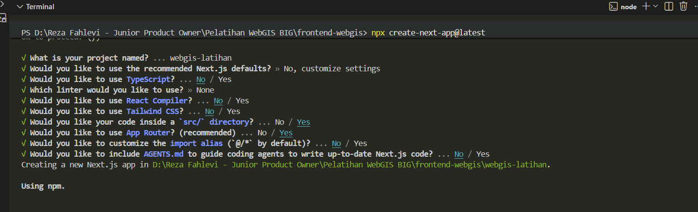
    
5. Selanjutnya tunggu hingga proses konfigurasi dan instalasi framework Next.js selesai, berikut merupakan hasil konfigurasi yang telah selesai.
    
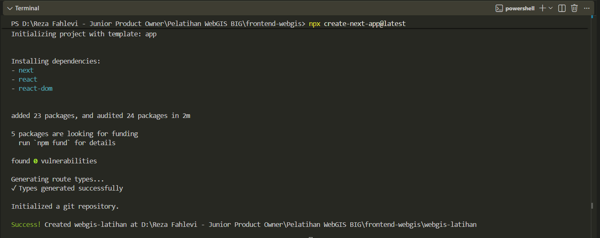
    
6. Hasil dari konfigurasi framework Next.js pada Virtual Studio Code akan menampilkan folder-folder yang menjadi tempat perancangan dan pembangunan WebGIS.
    
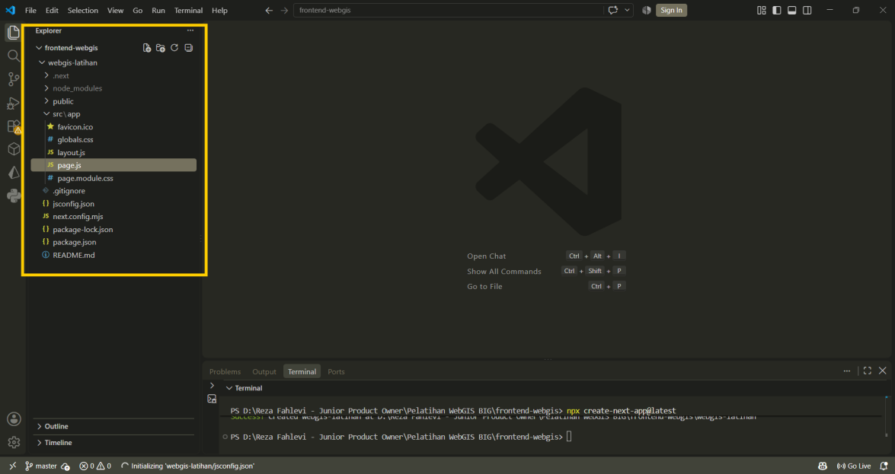
    
7. Tahapan berikutnya buka folder yang telah dibuat sebelumnya dengan nama **folder webgis-latihan** dengan cara **klik file**, kemudian **klik open folder**, lalu pilih folder tersebut. Selanjutnya untuk menjalakan web yang telah dikonfigurasi dengan next js dilakukan dengan cara pada **terminal** ketik **npm run dev**.
    
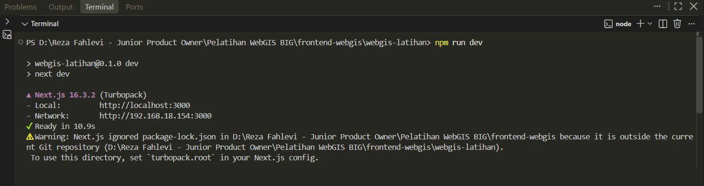
    
8. Untuk melihat dan menjalankan web tersebut, buka **browser** yang terdapat dalam perangkat pengguna kemudian masukan url lokal yang terdapat pada **terminal** yaitu [**http://localhost:3000/**](http://localhost:3000/) maka hasilnya dapat dilihat sebagai berikut.
    
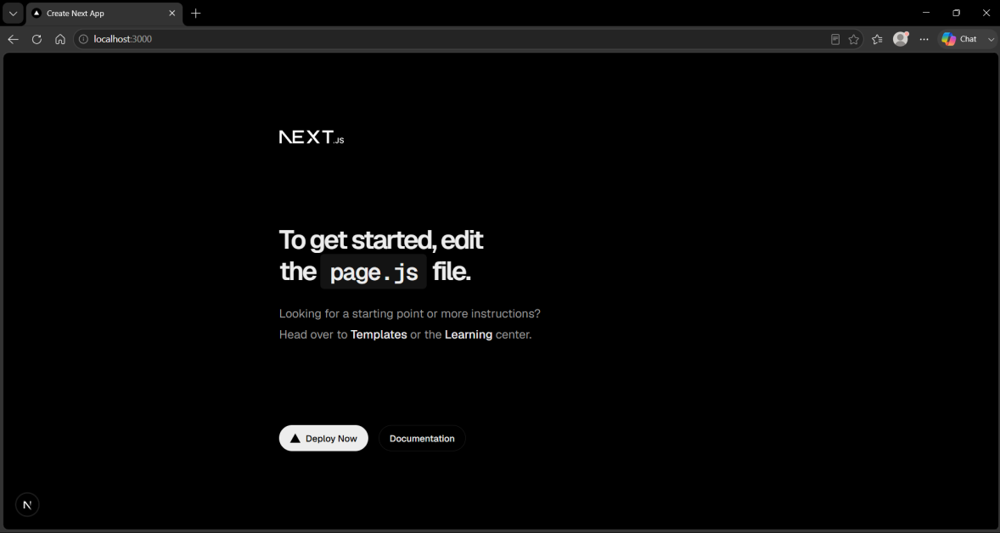
    

## **Konfigurasi Project dengan Repository Github**

1. Buka **web github** melalui tautan berikut ini [**https://github.com/**](https://github.com/) apabila belum memiliki akun maka dapat melakukan registrasi untuk melakukan pembuatan akun github terlebih dahulu.
    
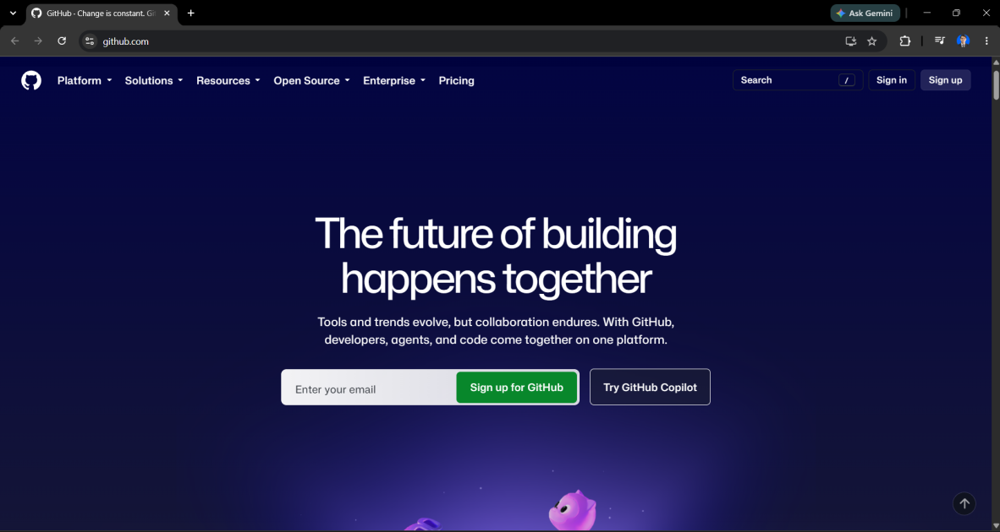
    
2. Selanjutnya setelah login pada github, untuk membuat repository baru sebagai tempat penyimpanan project pada github dengan melakukan **klik tombol new**.
3. Selanjutnya pada halaman new, buat halaman baru dengan menginput nama project yang akan dibuat pada github kemudian klik **create repository**.
    
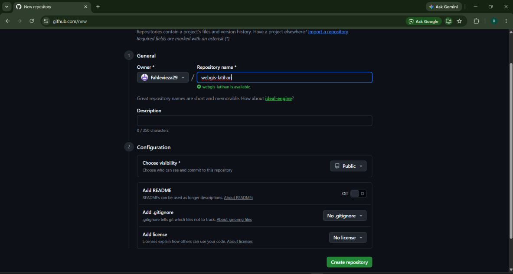
    
4. Setelah selesai pembuatan repository barunya selanjutnya untuk melakukan unggah project yang telah dirancang sebelumnya mengikuti perintah yang ada pada github.
    
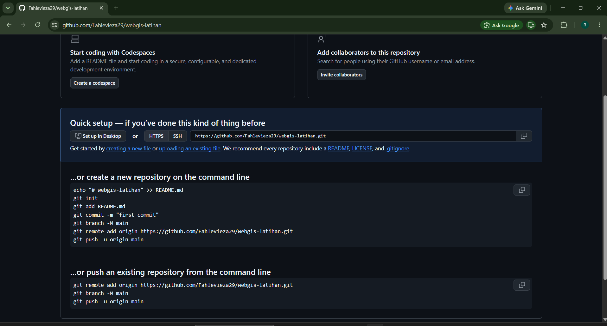
    
5. Selanjutnya untuk mengunggah project yang kita miliki berdasarkan perintah yang sudah ada pada github dilakukan dengan cara **klik kanan** pada folder project, klik **show more option** lalu klik **gitbash**.
    
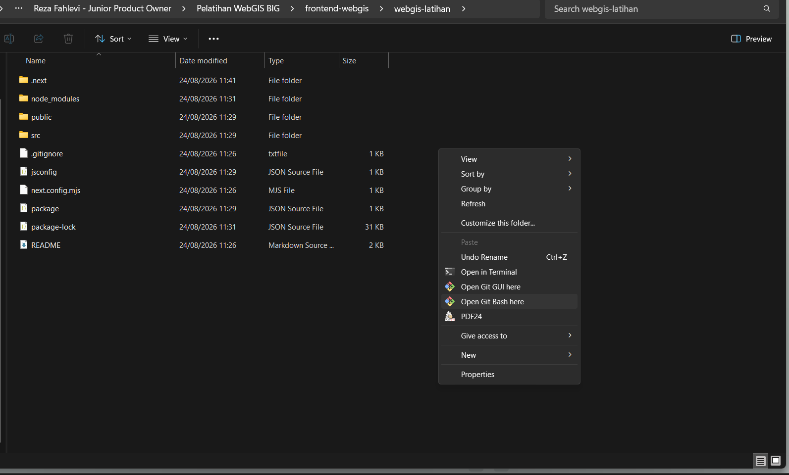
    
6. Pada tampilan gitbash, input perintah-perintah yang telah ada sebelumnya pada poin nomor 4 dengan menyalinnya dari github.
7. Hasil dari project yang telah diunggah pada github maka hasilnya akan menjadi seperti berikut.
    
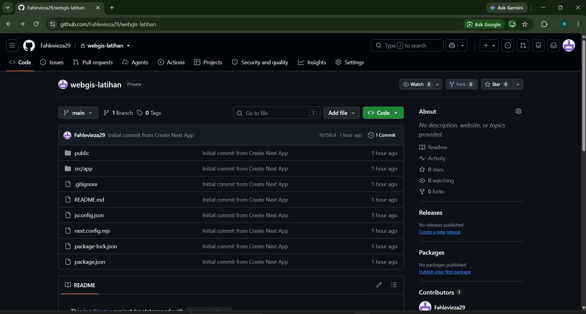
    

## **Cloning Project Github**

Cloning dikerjakan lewat GitHub Desktop.

1. Buka GitHub Desktop, lalu pilih **File > Clone repository**.

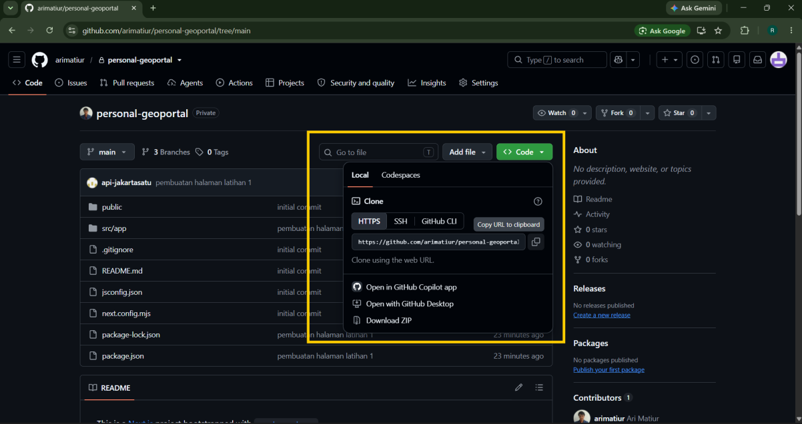
    
2. Pilih tab **GitHub.com**, lalu pilih repositori yang ingin disalin. Tentukan folder tujuan, kemudian klik **Clone**.

3. Setelah selesai, buka terminal pada folder proyek lewat **Repository > Open in Terminal**. Jalankan perintah berikut untuk memasang library dan menjalankan proyeknya.

    ```bash
    npm install
    npm run dev
    ```

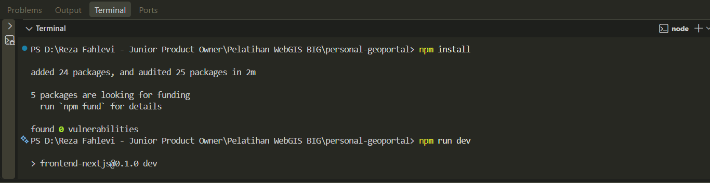

## **Mengirim Perubahan dan Mengambil Hasil Perubahan Web**

Seluruh pekerjaan repositori dikerjakan lewat **GitHub Desktop**. Perintah `git` tidak perlu diketik.

1. **Mengambil perubahan.** Klik **Fetch origin**. Bila muncul tombol **Pull origin** dengan angka, klik tombol itu. Angka tersebut jumlah perubahan yang belum masuk ke salinan Anda.

2. **Mengirim perubahan.** Buka proyek Anda di GitHub Desktop. Berkas yang berubah muncul di daftar **Changes** pada kolom kiri. Tulis ringkasan perubahan di kotak kiri bawah, klik **Commit to main**, lalu klik **Push origin**.

Perubahan yang sudah di-push akan terlihat di halaman GitHub proyek Anda.

## **Penjelasan Perintah Dasar Next.js dan NPM**

| Perintah | Kegunaan |
| --- | --- |
| npx create-next-app@latest | Membuat kerangka awal project menggunakan Next.js. |
| npm install | Menginstall library atau package yang dibutuhkan project. |
| npm run dev | Menjalankan project untuk proses pengembangan. |
| npm run build | Build project |
| npm run start | Menjalankan hasil build project. |
