# Instalasi Aplikasi

**Modul 1 - Dasar-Dasar GIS, Konsep WebGIS, Dasar Pemrograman, dan Github**

## **Instalasi Visual Studio Code, GitHub Desktop, dan Node.js**

1. Buka tautan [https://code.visualstudio.com/download](https://code.visualstudio.com/download), kemudian pilih opsi unduh berdasarkan sistem operasi yang digunakan.
    
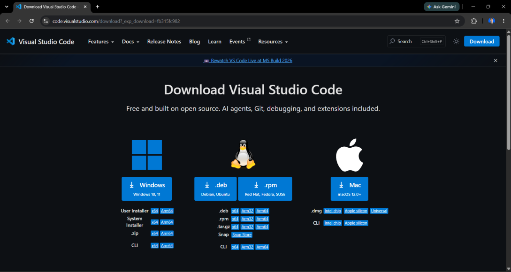
    
2. Tahapan berikutnya setelah proses unduh selesai, maka lakukan proses instalasi kemudian tunggu hingga proses instalasi selesai. Berikut ini merupakan tampilan awal dari Virtual Studio Code.
    
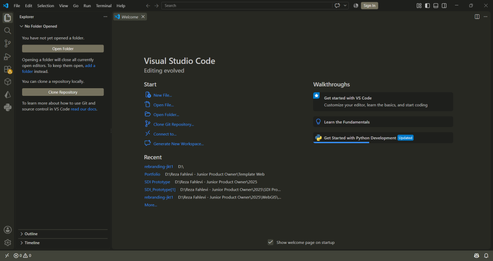
    
3. Selanjutnya unduh **GitHub Desktop** melalui tautan [https://desktop.github.com/download/](https://desktop.github.com/download/), kemudian lakukan proses instalasinya.

    Seluruh pekerjaan repositori pada pelatihan ini dikerjakan lewat GitHub Desktop, mulai dari clone, menyimpan perubahan, sampai mengirimnya ke GitHub. Perintah `git` tidak perlu Anda ketik.

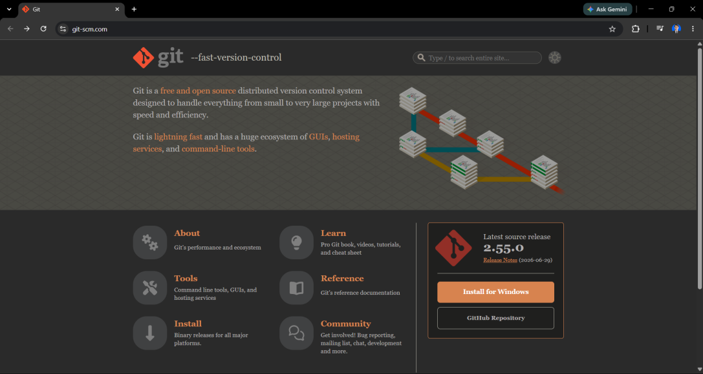
    
4. Tahapan berikutnya instal Node.js yang akan digunakan sebagai package manager untuk melakuan pemrograman menggunakan Javascript, Next.js, Angular serta bahasa pemrograman javascript lainnya. Node.js dapat diunduh pada link berikut ini [https://nodejs.org/en/download](https://nodejs.org/en/download).


    
5. Setelah proses instalasi selesai, untuk melihat apakah Node.js telah terpasang pada perangkat yang digunakan, pengguna dapat melakukan pengecekan pada Windows Powershell kemudian melakukan pengetikan perintah `node --version` untuk melihat versi node yang telah di install.

    ```bash
    node --version
    npm --version
    ```

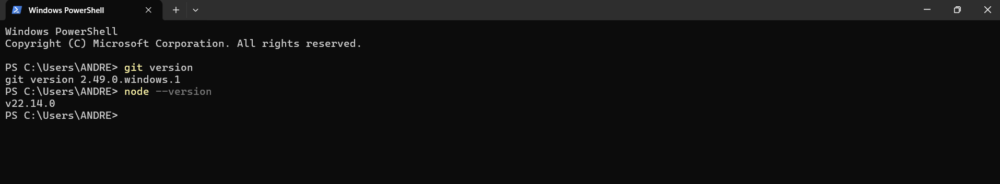

## **Instalasi Postgresql**

1. Buka tautan [https://www.postgresql.org/](https://www.postgresql.org/) kemudian klik menu download lalu pilih sesuai dengan sistem operasi yang digunakan oleh pengguna.
    
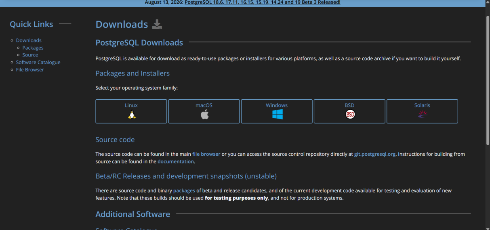
    
2. Tahapan berikutnya lakukan proses instalasi postgresql berdasarkan hasil yang telah diunduh pada perangkat.
    

    
3. Setelah tahapan instalasi selesai maka akan muncul tampilan untuk stackbuilder kemudian pilih Postgresql 18 (x64).
    
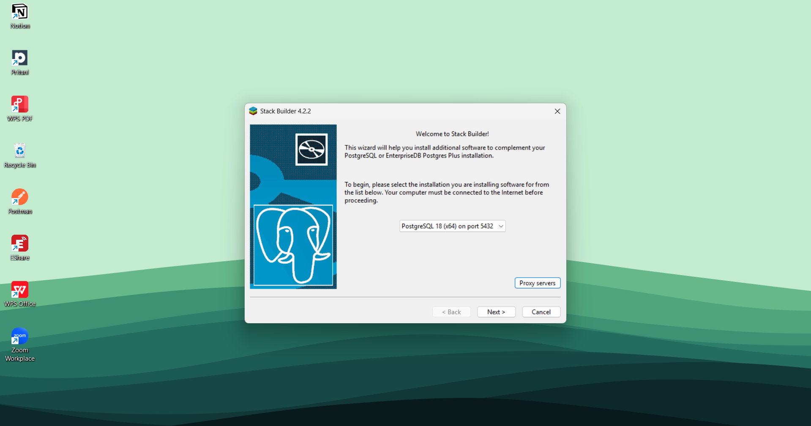
    
4. Selanjutnya pilih mn instalasi exstensi untuk mendukung penyimpanan data dalam bentuk spasial dengan memilih library postgis.
    
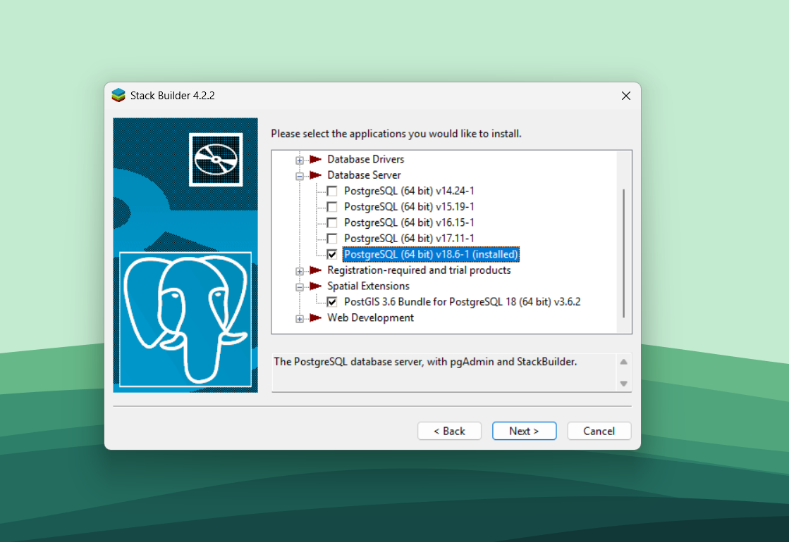
    
5. Setelah tahapan instalasi selesai,buka pgadmin untuk melihat tampilan dari Postgresql yang telah terpasang pada perangkat pengguna.

    ```text
    pgAdmin: buka dari Start Menu, lalu masukkan kata sandi yang dibuat saat instalasi.
    ```
    

    

## **Instalasi Geoserver**

1. Buka tautan [https://geoserver.org/](https://geoserver.org/) kemudian klik menu download lalu pilih versi geoserver yang akan digunakan, kemudian unduh installer geoserver.
    

    

    
2. Setelah selesai download anda bisa menjalankan file installer kemudian saat proses instalasi akan bertemu halaman berikut ini. Klik Visit Adoptium OpenJDK website untuk download JRE 17 kemudian install
    

    
3. Jika sudah install JRE 17, biasanya terinstall di folder C:/Program Files/Eclipse Adoptium/jdk-17.0.20.101-hotspot. Kembali ke installer geoserver dan arahkan folder JRE 17 ke folder hasil instalasi JRE 17. Lanjutkan proses instalasi sampai selesai gunakan semua opsi default saja
    

    
4. Selanjutnya setelah geoserver terinstall, untuk mengaktifkangeoserver yang akan digunakan dilakukan dengan cara membuka aplikasi dengan nama Start Geoserver.
    

    
5. Tahapan berikutnya setelah mengaktifkan geoserver, maka pengguna dapat membukanya pada browser dengan tautan port berikut ini [http://localhost:8080/geoserver/web/?0](http://localhost:8080/geoserver/web/?0). Berikut ini tampilan geoserver.
    
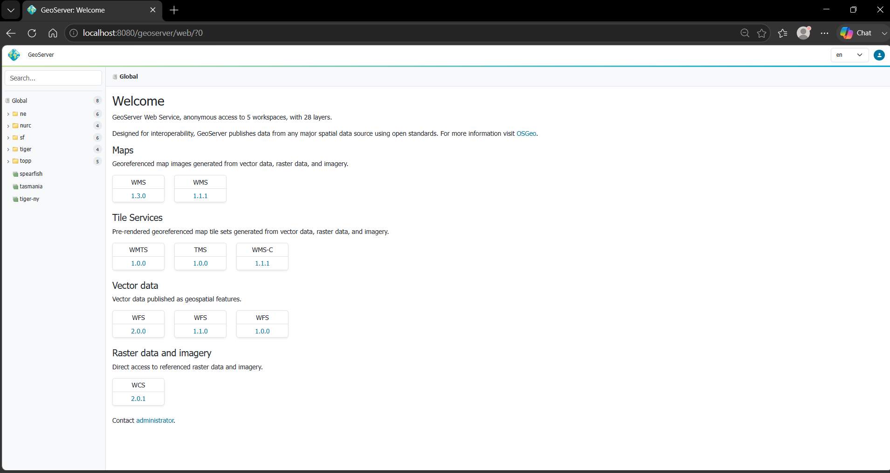
    
6. Selanjutnya pengguna bisa untuk masuk kehalaman login menggunakan akun admin yang telah dibuat pada proses install geoserver.
    

    
7. Berikut ini merupakan hasil tampilan ketika selesai proses login sebagai admin pada geoserver.
    
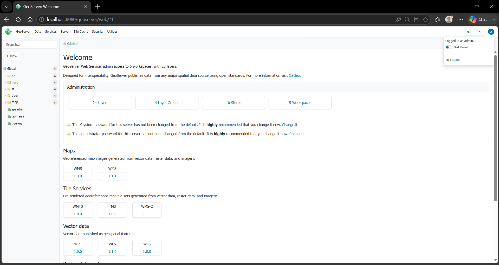
    
8. Jika pengguna ingin menonaktifkan geoserver, pengguna dapat memilih menu Stop Geosever, maka geosever akan nonaktif.
    

    

## **Instalasi QGIS**

1. Buka tautan berikut ini [https://qgis.org/download/](https://qgis.org/download/) kemudian pilih menu download sesuai dengan metode sistem operasi yang digunakan oleh peserta.
    
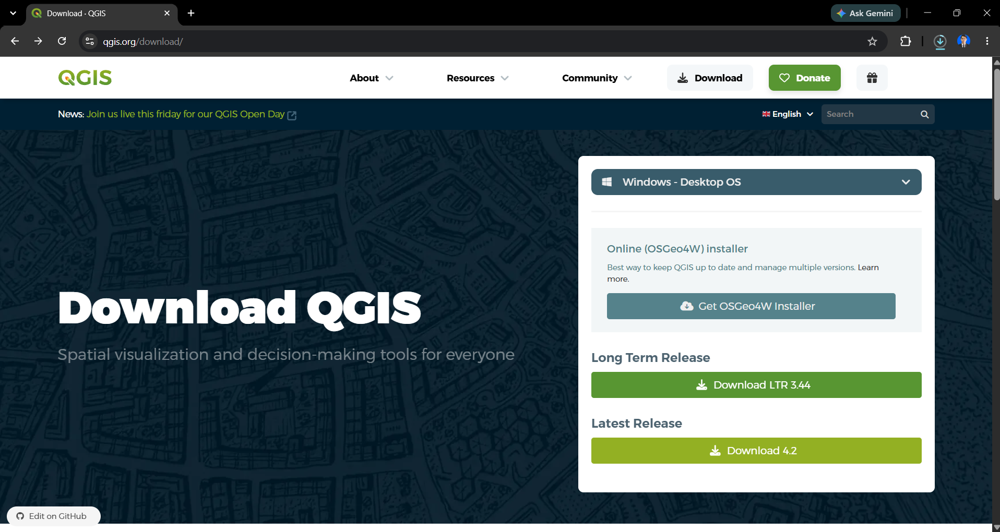
    
2. Selanjutnya setelah selesai mengunduh installer perangkat lunak QGIS, buka installer tersebut maka akan terdapat tampilan berikut ini kemudian klik next.
    

    
3. Tahapan berikutnya klik next hingga muncul proses installasi.
    

    
4. Setelah proses instalasi selesai, buka file qgis desktop.
    

    
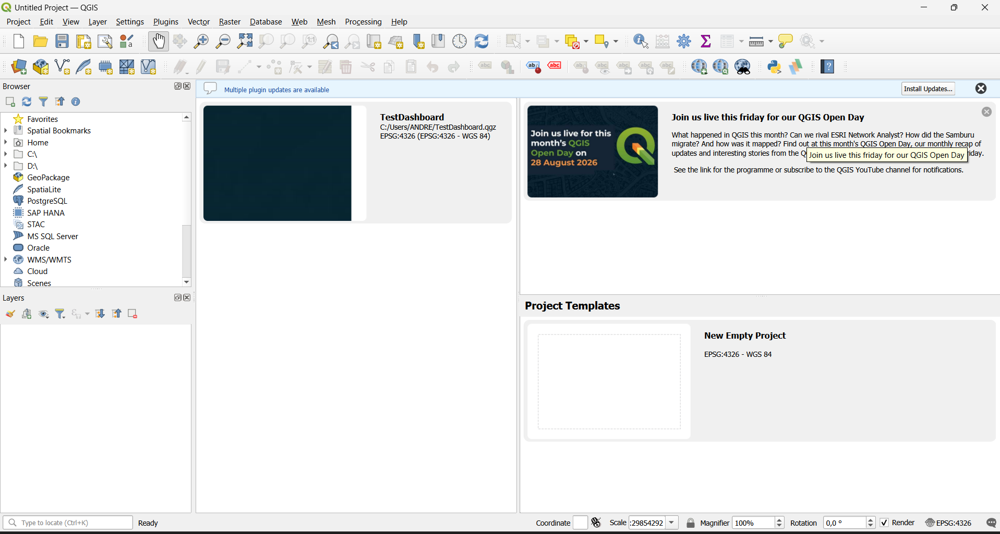