# menampilkan Layer GeoJSON, KML dan WMS Geoserver

**Modul 2 - Pengembangan Front-End : Peta 2D**

## **Menampilkan GeoJSON**

1. Tahap pertama buat **folder baru** pada folder peta dengan nama **layer**, kemudian dalam folder tersebut buat **file baru** dengan nama **Geojson.jsx**.
    
    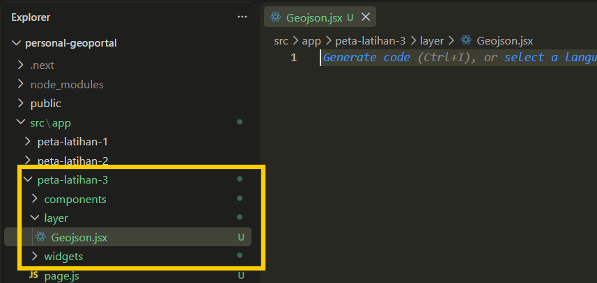
    
2. Kemudian tahap kedua buat fungsi **addGeojson** dengan parameter **map** pada file tersebut.
    
    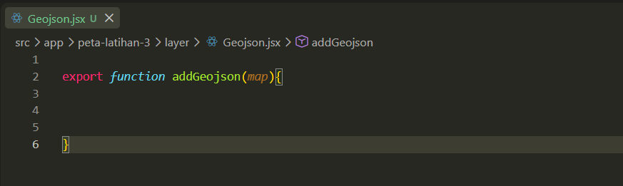
    
3. Tahap ketiga buat data yang akan menjadi data contoh geojson dengan membuat script kerangka untuk menambahkan geojson seperti berikut ini.
    
    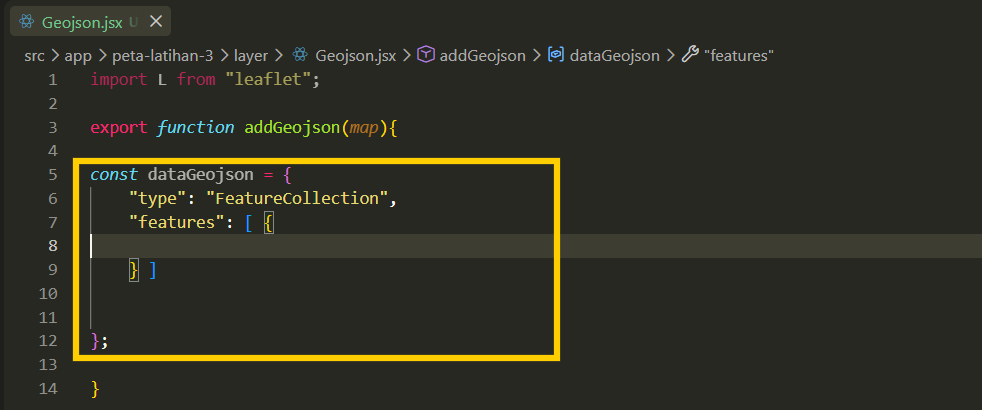
    
4. Kemudian pada variabel **features** buat variabel **type : “Feature”** dan tambahkan isi variabel nama **properties** kemudian isi informasi yang akan ditampilkan dalam peta. Kemudian tambahkan variabel **geometry** untuk menampilkan jenis geometri yang akan ditampilkan bisa dalam bentuk titik, garis atau area.
    
    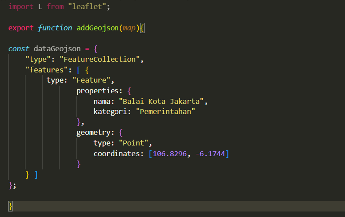
    
5. Kemudian jika ingin menambahkan data lainnya pada akhir **}** data pertama yang berwarna kuning tambahkan tanda koma kemudian buat **{}** lalu isi type, properties serta jenis geometry yang akan ditampilkan.
    
    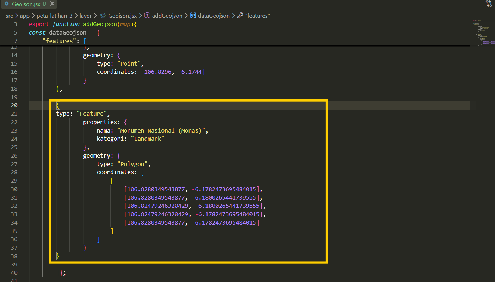
    
6. Tahapan keempat buat fungsi untuk menambahkan layer geojson kedalam peta dengan menambahkan fungsi **L.geoJSON.**

    ```jsx
    const geojsonLayer = L.geoJSON(dataGeojson, {
      pointToLayer: function (feature, latlng) {
        return L.marker(latlng, { icon: markerIcon });
      },
    
      onEachFeature: function (feature, layer) {
        layer.bindPopup(`
          <b>${feature.properties.nama}</b><br/>
          Kategori: ${feature.properties.kategori}
        `);
      }
    });
    ```
    
    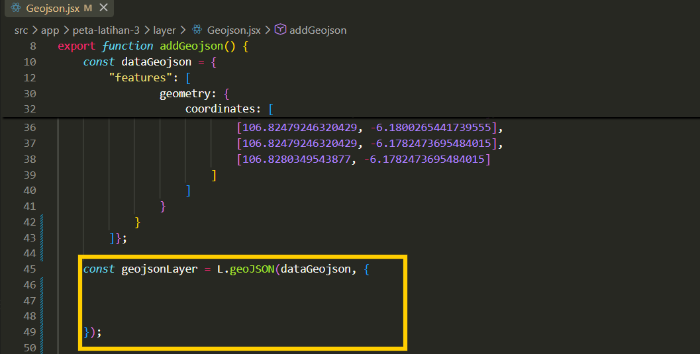
    
7. Kemudian didalam fungsi untuk mengatur tampilan jika layer geojson dalam bentuk titik serta tambahkan fungsi untuk menampilkan popup berdasarkan informasi yang telah dibuat dalam data geojson.
    
    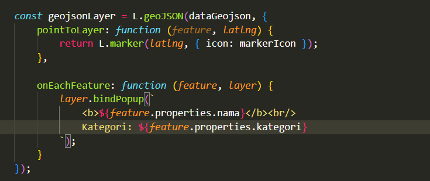
    
8. Kemudian ditahap terakhir tutup fungsi geojson dengan menggunakan **return geojsonLayer;** serta dibagian awal tambahkan styling untuk tampilan icon jika berbentuk tiitk. Hasil dari script keseluruhan untuk menampilkan layer dengan format geojson yaitu sebagai berikut ini.
    
    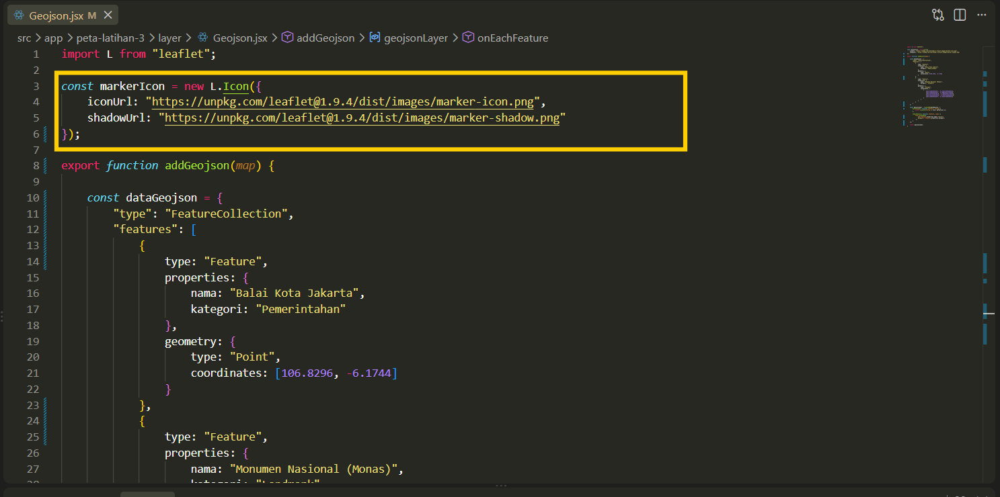
    
9. Tahap terakhir panggil data geojson tersebut pada halaman Map.jsx dengan menambahkan **addGeojson(map);** kemudian setelah terpanggil buat fungsi untuk menambahkan geojson kedalam peta. Kemudian tambahkan nama data akan menjadi tampilan dalam layer control dengan menginput pada variabel overlaymaps.
    
    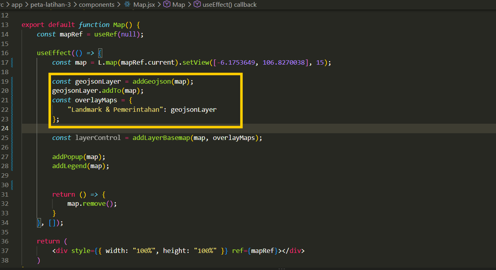
    
10. Hasil akhir layer geojson yang ditampilkan dalam peta dapat dilihat pada gambar berikut ini.
    
    
    

## **Menampilkan KML**

1. Tahap pertama buat file baru pada folder layer dengan nama **Kml.jsx** kemudian buat fungsi awal untuk menambahkan kml, serta tambahkan **parameter (urlKML)**.
    
    
    
2. Tahapan kedua buat folder baru pada **folder public** dengan nama folder yaitu **data**, kemudian masukan file kml yang dimiliki oleh peserta edalam folder tersebut.
    
    
    
3. Tahap ketiga pada terminal install library **npm install leaflet-kml** sebagai library untuk mendukung proses data dengan bentuk kml.

    ```bash
    npm install leaflet-kml
    ```
    
    
    
4. Tahapan berikutnya pada file **Kml.jsx** buat fungsi baru berupa **fetch** untuk mengambil data kml serta tambahkan parameter **urlKM,** kemudian ambil dengan promise berupa **return** untuk menampilkan layer dalam peta
    
    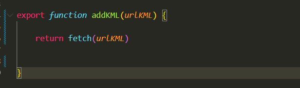
    
5. Selanjutnya pada tahap kelima buat fungsi untuk mengkonversi data kml menjadi berbentuk text, kemudian buat kondisi dengan **if** jika hasil response dalam mengambil file sudah ok.
    
    
    
6. Kemudian pada tahap keenam setelah mendapatkan hasil data kml dalam bentuk text xml, kemudian buat fungsi untuk merubah isi text dalam kml menggunakan **DOMParser** yang digunakan untuk mengubah teks XML menjadi struktur dokumen yang dapat diproses oleh browser.
    
    
    
7. Tahap ketujuh lakukan parsing text xml pada data kml sehingga dapat ditampilkan dalam browser.
    
    
    
8. Selanjutnya pada tahap kedelapan setelah daa berhasil dibaca dalam bentuk XML, buat variabel untuk membaca dokumen tersebut digunakan untuk membuat layer dengan library Leaflet. Kemudian tutup layer dengan mengembalikan layer kedalam addKml mengguakan return **kmlLayer.**
    
    
    
9. Kemudian tambahkan fungsi untuk menangan**i ketika error** sehingga pengguna dapat memeriksanya dengan menambahkan **console.log** dengan tambahan pesan jika gagal membuat file kml.
    
    
    
10. Hasil keseluruhan scirpt untuk menampilkan kml yaitu sebagai berikut ini.
    
    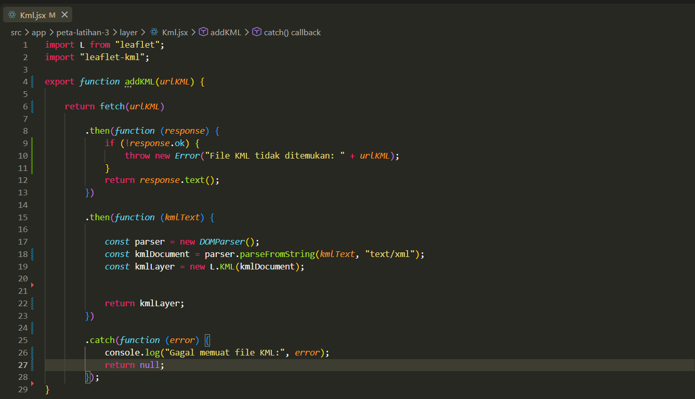
    
11. Kemudian panggil file KML pada halaman **Map.jsx** menggunakan fungsi **addKML()**, selanjutnya gunakan fungsi **.then** untuk menunggu proses hinggga menghasilkan kmlLayer, kemudian tambahkan kondisi jika kml layer berhasil diproses menggunakan kondisi **if** maka kmlLayer ke dalam layerControl.
    
    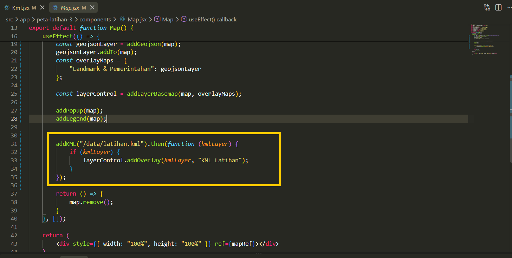
    
12. Berikut ini merupakan hasil layer dengan menggunakan data spasial format kml.
    
    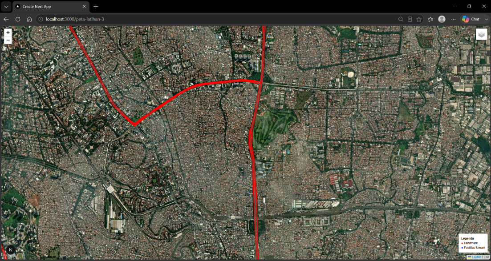
    

## **Menampilkan Layer WMS**

1. Tahap pertama buat file baru dengan nama **Wms.jsx** kemudian buat fungsi baru untuk menambahkan wms kedalam peta dengan **addWms.**
    
    
    
2. Kemudian tahap kedua buat fungsi **const wmsLayer = L.tileLayer.wms()** untuk menambahkan layer wms kemudian tambahkan service layer berikut sebagai contoh layer yang ditampilkan kedalam peta **"https://geoserver.bps.go.id/rw-kumuh-dki/wms".**

    ```jsx
    const wmsLayer = L.tileLayer.wms(
      "https://geoserver.bps.go.id/rw-kumuh-dki/wms",
      {
        layers: "rw-kumuh-dki:peta_kabupaten-kota",
        format: "image/png",
        transparent: true,
        attribution: "GeoServer WMS - BPS"
      }
    );
    ```
    
    
    
3. Kemudian dibawah url mapserver tambahkan informasi dibwah url geoserver untuk menambahkan informasi data meliputi **layers, format, tingkat transparansi** serta **atribut**.
    
    
    
4. Kemudian buat fungsi untuk menambahkan layer ini kedalam peta serta tutup untuk mengembalikan wms layer kedalam peta. Hasil keseluruhan scriptnya sebagai berikut.
    
    
    
5. Tahap terakhir panggil layer wms kedalam halam Map.jsx dengan **addWMS(map);** dan tambahkan kedalam fungsi control layer.
    
    
    
6. Hasil akhir tampilan layer wms pada peta dapat dilihat pada gambar berikut ini.
    
    