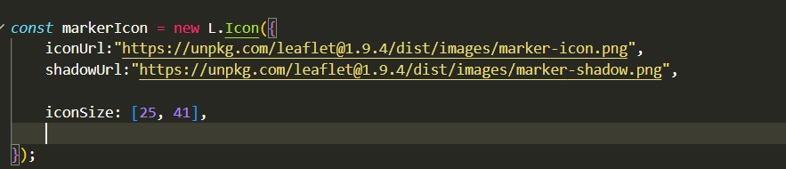
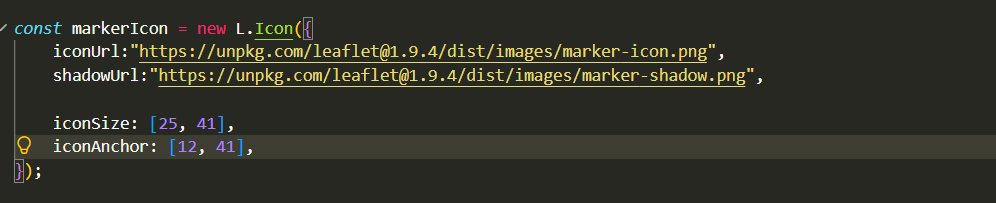
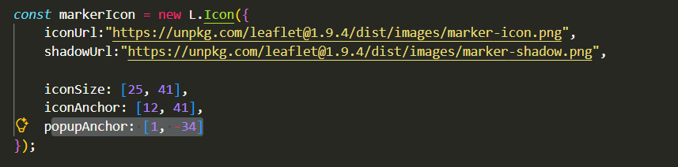
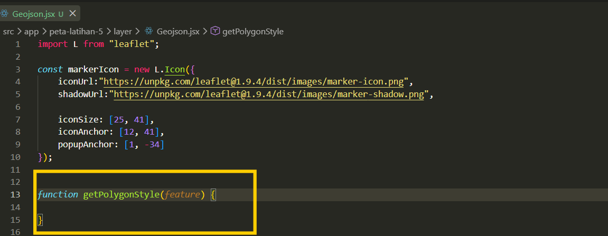
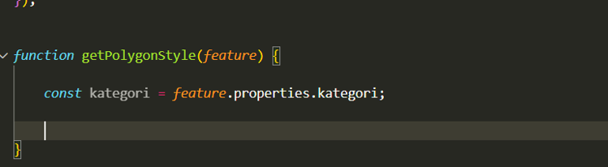
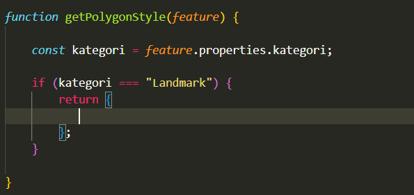
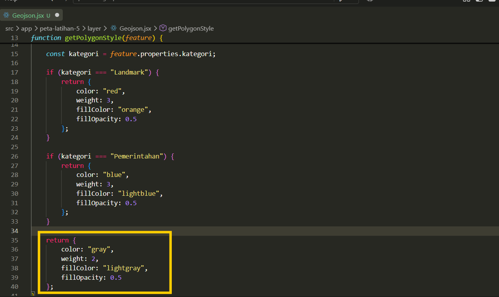
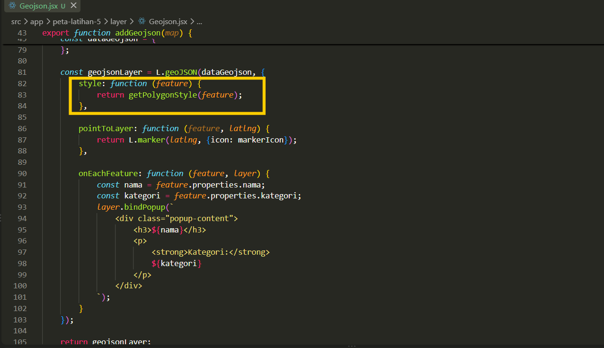
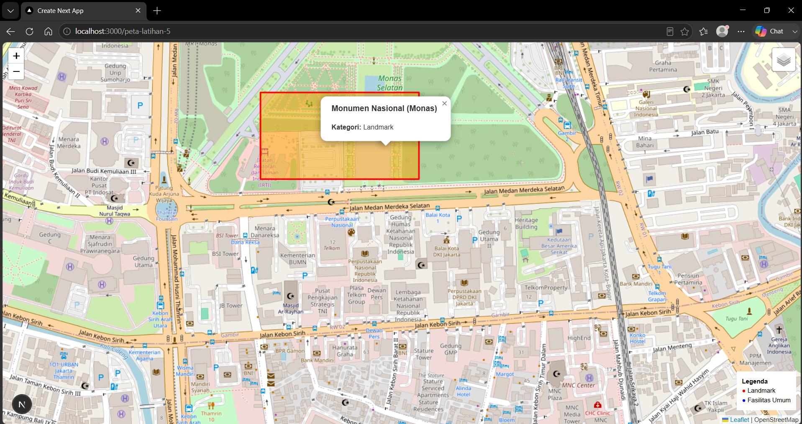

# Styling Layer Dengan Javascript

## **Styling Layer Geojson**

1. Pada tahap pertama, lakukan styling pada file **Geojson.jsx** untuk mengatur ukuran icon pada variabel **const markerIcon.** Pertama lakukan styling untuk mengatur ukuran icon dengan menggunakan variabel **iconSize** kemudian tentukan ukuran lebar dan tingginya dalam [ ].

    ```jsx
    const markerIcon = new L.Icon({
      iconUrl: "https://unpkg.com/leaflet@1.9.4/dist/images/marker-icon.png",
      shadowUrl: "https://unpkg.com/leaflet@1.9.4/dist/images/marker-shadow.png",
    
      iconSize: [25, 41],
      iconAnchor: [12, 41],
      popupAnchor: [1, -34]
    });
    ```



2. Selanjutnya tambahkan fungsi untuk mengatur mengatur ukuran titik sebenarnya pada peta sehingga titik sebenarnya berada pada posisi center marker. Gunakan fungsi i**conAnchor** kemudian tambahkan ukurannya.
    

    
3. Kemudian tambahkan fungsi berupa **popupAnchor** untuk menampilkan posisi popup terhadap marker.
    

    
4. Kemudian buat fungsi dibawah variabel markerIcon yang akan digunakan untuk mengatur styling jika data geojson dalam bentuk polygon dengan cara membuat **function getPolygonstyle** serta tambahkan parameter **feature** untuk mengambil tampilan layer.

    ```jsx
    function getPolygonStyle(feature) {
    
      const kategori = feature.properties.kategori;
    
      if (kategori === "Landmark") {
        return {
          color: "red",
          weight: 3,
          fillColor: "orange",
          fillOpacity: 0.5
        };
      }
    ```



5. Selanjutnya dalam fungsi tersebut, tambahkan variabel untuk mengambil informasi berupa kategori yang akan dijadikan parameter untuk melakukan styling.
    

    
6. Tahap berikutnya buat kondisi kategori menggunakan fungsi **if** kemudian tentukan parameter yang digunakan pada kategorinya, seperti pada script ini mengambil layer dengan kategori **landmark**.
    

    
7. Selanjutnya pada fungsi kondisional **if** tersebut buat fungsi **return** yang akan mengembalikan layer sesuai dengan styling yang akan dibuat nantinya.
    

    
8. Selanjutnya didalam **return** buat fungsi untuk warna dengan **color**, kemudian tambahkan fungsi untuk mengatur ketebalan garis dengan **weight**, kemudian tambahkan fungsi untuk mengatur warna bagian dalam dengan **fillColor** serta transparansi warna dengan **fillOpacity**.
    

    
9. Selanjutnya buat kondisi untuk layer jika memiliki kategori berupa pemerintahan dengan fungsi kondisional **if**.
    

    
10. Kemudian buat fungsi **return** jika layer tidak terdapat dalam dua kategori tersebut, styling layernya akan dibuat menjadi warna abu-abu.

    ```jsx
      return {
        color: "gray",
        weight: 2,
        fillColor: "lightgray",
        fillOpacity: 0.5
      };
    }
    ```



11. Selanjutnya pada fungsi c**onst geojsonLayer** yang sudah ada sebelumnya, tambahkan fungsi style dan buat return berupa **getPolygonsStyle** untuk mengambil styling yang telah dibuat.

    ```jsx
    const geojsonLayer = L.geoJSON(dataGeojson, {
      style: getPolygonStyle,
    ```



12. Hasil akhir dari styling geojson layer yaitu sebagai berikut ini.
    

    

## **Styling Layer KML**

1. Tahap pertama buka file **Kml.jsx** kemudian pada fungsi script yang digunakan untuk menerima dan mengolah Kml yaitu pada fungsi berupa **.then(function(kmlText)** buat fungsi untuk mengakses objek dalam kml melalui **kmlLayer.eachLayer(function(layer)**.

    ```jsx
    kmlLayer.eachLayer(function (layer) {
    
      if (layer.setStyle) {
    
        layer.setStyle({
          color: "blue",
          weight: 3,
          fillColor: "blue",
          fillOpacity: 0.5
        });
      }
    });
    ```


2. Selanjutnya buat kondisional **if** untuk menganalisis apakah layer bisa diberi style atau tidak.
    

    
3. Tahap berikutnya jika file dapat diberikan style, maka buat variabel fungsi untuk warna dengan **color**, kemudian tambahkan fungsi untuk mengatur ketebalan garis dengan **weight**, kemudian tambahkan fungsi untuk mengatur warna bagian dalam dengan **fillColor** serta transparansi warna dengan **fillOpacity**.
    

    
4. Hasil tampilan styling layer kml dengan menggunakan warna biru sebagai warna stylenya dapat dilihat pada gambar berikut ini.
    
