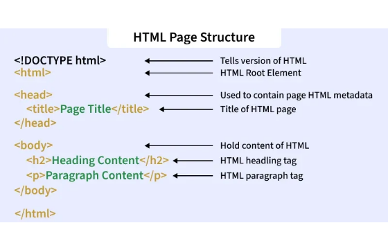
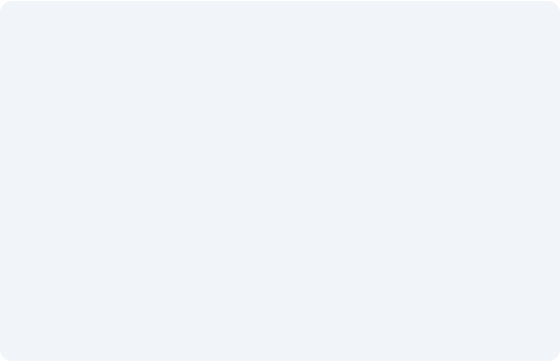
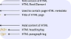

# Dasar HTML, CSS, dan JavaScript

Modul Fundamental IT 101 ini membahas tiga fondasi utama pemrograman web: HTML, CSS, dan JavaScript. Ketiganya dipelajari bersama karena satu halaman web memakai ketiganya sekaligus dengan peran yang berbeda.


## Analogi: bagaimana halaman web bekerja

Membangun website dapat dianalogikan seperti membangun sebuah rumah. HTML adalah pondasi dan struktur tembok, CSS adalah warna cat dan interior, sedangkan JavaScript adalah sistem listrik dan perangkat pintar yang interaktif.


## Pengembangan web sisi klien

1. **Kode client-side.** HTML, CSS, dan JavaScript dieksekusi langsung di perangkat pengguna melalui web browser, misalnya Google Chrome, Mozilla Firefox, atau Safari.
2. **Browser rendering engine.** Saat Anda mengakses URL, server mengirimkan berkas teks berisi kode. Browser membaca dan memproses baris kode tersebut dalam hitungan milidetik menjadi halaman web yang visual dan interaktif.


## HTML: struktur utama web

HTML adalah singkatan dari HyperText Markup Language. Perannya menentukan struktur dan konten dasar sebuah halaman web.

- Ditulis memakai elemen berupa tag, yaitu penanda untuk judul, paragraf, dan tombol.
- Memberi petunjuk kepada browser tentang apa yang harus ditampilkan.





### Contoh kode HTML

Berkas `index.html` berikut memuat satu kartu berisi judul, paragraf, dan tombol. Teks judul, paragraf, dan label tombol di dalamnya hanya contoh.

```html
<!DOCTYPE html>
<html lang="id">
  <head>
    <meta charset="UTF-8" />
    <title>Contoh HTML</title>
    <link rel="stylesheet" href="style.css" />
  </head>
  <body>
    <div class="card">
      <h1>Contoh Judul</h1>
      <p>Contoh paragraf di dalam kartu.</p>
      <button id="myBtn">Klik Saya</button>
    </div>

    <script src="script.js"></script>
  </body>
</html>
```

Penjelasan elemen pada kode di atas:

- **Tag pembuka dan penutup.** Sebagian besar elemen diawali dengan tag pembuka dan diakhiri dengan tag penutup.
- **Attributes.** Properti tambahan seperti `class="card"` atau `id="myBtn"` memberi identitas unik pada elemen.
- **Nested elements.** Elemen HTML dapat disusun di dalam elemen lain, membentuk hierarki parent-child.


## CSS: gaya dan tampilan visual

Cascading Style Sheets (CSS) mengatur tampilan dari elemen HTML di layar. Tanpa CSS, setiap halaman web hanya berupa teks polos hitam-putih. CSS memberi warna, tipografi, ukuran, tata letak, hingga penyesuaian tampilan di layar mobile.


### Contoh kode CSS

Berkas `style.css` berikut memberi gaya pada kartu dan tombol yang dipakai di `index.html`.

```css
/* Memberikan style pada class .card */
.card {
  background-color: #f8fafc;
  padding: 20px;
  border-radius: 8px;
}

/* Styling untuk tombol */
button {
  background-color: #2563eb;
  color: #ffffff;
  font-weight: bold;
}
```

Konsep penting pada CSS:

- **Selectors.** Menentukan target elemen HTML, baik berdasarkan nama tag, `.class`, maupun `#id`.
- **The Box Model.** Mengatur jarak elemen memakai `padding` (jarak dalam), `border` (garis tepi), dan `margin` (jarak luar).
- **Responsive design.** Menyesuaikan tata letak agar tetap rapi saat dibuka di HP maupun laptop.


## JavaScript: logika dan interaksi

JavaScript (JS) adalah bahasa pemrograman yang membuat halaman web menjadi dinamis dan interaktif.

- Memproses **events** dari pengguna, seperti klik tombol, pendaftaran form, hingga gerakan kursor.
- Mengubah konten web secara real-time tanpa perlu memuat ulang halaman.
- Menjadi mesin utama di balik web app modern seperti Google Maps, Netflix, dan e-commerce.





### Contoh kode JavaScript

Berkas `script.js` berikut mengambil tombol `myBtn` dari `index.html`, lalu menampilkan pesan saat tombol diklik.

```js
// Mengambil elemen tombol dari HTML
const btn = document.getElementById('myBtn');

// Menambahkan event listener saat diklik
btn.addEventListener('click', function () {
  alert('Halo! Tombol berhasil diklik!');
});
```

Istilah kunci pada JavaScript:

- **DOM (Document Object Model).** Struktur pohon elemen HTML yang dapat dibaca dan dimanipulasi oleh JS.
- **Event listener.** Fungsi yang menunggu tindakan pengguna, seperti `click`, `hover`, atau `keydown`.
- **Variables dan functions.** Tempat menyimpan data (`const`, `let`) dan kumpulan instruksi logika.


## Rangkuman: HTML, CSS, dan JavaScript

| Teknologi | Fungsi utama | Analogi rumah | Ringkasan code |
|---|---|---|---|
| HTML | Menentukan struktur dan isi konten web | Pondasi, dinding, dan kerangka kayu | Klik |
| CSS | Mengatur gaya tampilan dan estetika visual | Warna cat, dekorasi, dan tata letak ruangan | `button { color: blue; }` |
| JavaScript | Memberikan logika dan perilaku interaktif | Sistem listrik, saklar, dan smart home | `btn.onclick = doAction;` |


## Alur kerja proses rendering web

1. **HTTP request.** Browser meminta berkas web dari server melalui URL.
2. **Parsing HTML.** Browser membaca struktur HTML dan membentuk DOM tree.
3. **Styling CSS.** Aturan CSS diterapkan untuk menggambar tampilan visual.
4. **Eksekusi JS.** JavaScript dijalankan untuk menambahkan logika interaktif.


## Mulai belajar coding

Untuk mulai menulis kode HTML, CSS, dan JavaScript, Anda hanya membutuhkan code editor seperti VS Code dan web browser yang sudah ada di komputer Anda.


::: tip Developer Tools
Tekan tombol F12 di browser Anda saat ini untuk membuka Developer Tools.
:::


## Sumber gambar




- <https://media.geeksforgeeks.org/wp-content/uploads/20251108104320141647/html_page_structure.webp> (www.geeksforgeeks.org)
- <https://images.stockcake.com/public/9/3/1/9314599d-2986-499c-b2d2-46fd8c2c9693/creative-website-design-stockcake.jpg> (stockcake.com)
- <https://www.kitware.com/main/wp-content/uploads/2026/08/trame-revealjs-3.jpg> (www.kitware.com)
