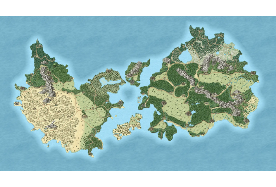

# Dasar Leaflet dan Layanan OGC

Halaman ini memuat dua bagian. Bagian pertama membahas konsep Leaflet.js dan standar layanan web GIS (WMS, WFS, WMTS, WCS). Bagian kedua memuat langkah praktik visualisasi peta interaktif memakai Leaflet.js.

Leaflet adalah library JavaScript open-source yang ringan dan banyak dipakai untuk membangun peta interaktif di web.


## Dasar-dasar Leaflet.js

Leaflet adalah library JavaScript open-source yang ringan untuk membangun peta interaktif di web.

### Ringan dan berperforma tinggi

- Ukuran library Leaflet hanya sekitar 42 KB (JS terkompresi gzip), menjadikannya salah satu pustaka pemetaan web paling ringan tanpa mengorbankan fitur inti.
- Leaflet dirancang untuk performa tinggi pada perangkat desktop maupun mobile, dengan dukungan touch dan gesture yang alami.

### Desain berbasis modul dan komponen

- Sistem objek berbasis kelas (OOP) yang bersih dan terstruktur, sehingga peta interaktif dapat dibangun dalam hitungan menit.
- Ekosistem plugin yang luas memungkinkan integrasi fitur tingkat lanjut seperti heatmap, routing, clustering, hingga pemrosesan spasial.

### Arsitektur dan keunggulan Leaflet

Ada dua modul utama yang wajib ada dalam setiap aplikasi Leaflet:

- Modul utama pengontrol peta. Bertanggung jawab atas inisialisasi kontainer HTML, pusat koordinat, tingkat perbesaran, serta manajemen event.
- Modul untuk memuat ubin peta gambar (raster tiles) dari penyedia basemap seperti OpenStreetMap, Stamen, atau TileServer OGC.


### Modul utama: L.map dan L.tileLayer

`L.map` menginisialisasi peta pada kontainer HTML dan mengatur pusat koordinat serta tingkat zoom. `L.tileLayer` memuat ubin peta dari penyedia basemap.



### L.marker dan L.popup

`L.marker` dan `L.popup` dipakai untuk menampilkan titik penanda pada posisi koordinat tertentu dan mengikat jendela informasi interaktif (popup HTML).


### L.geoJSON

`L.geoJSON` adalah modul untuk mengurai dan merender data vektor spasial GeoJSON (Point, LineString, Polygon) beserta styling dan event interaksi.

### L.control

`L.control` menyediakan elemen UI di atas peta, seperti tombol zoom, kontrol pemilih layer basemap/overlay, skala peta, dan atribusi lisensi.

### Komponen data dan kontrol Leaflet

Kontrol pemilih layer, skala peta, dan atribusi lisensi ditambahkan lewat `L.control`, sedangkan data vektor dirender lewat `L.geoJSON`.

## Layanan OGC Web Services

Standar internasional untuk pertukaran data spasial dan interoperabilitas sistem GIS.

### Apa itu standar layanan OGC?

- OGC (Open Geospatial Consortium) adalah konsorsium internasional yang menentukan standar terbuka untuk konten dan layanan spasial agar berbagai perangkat lunak dapat saling terhubung.
- Standar OGC memastikan peta dan data spasial dari GeoServer, QGIS, ArcGIS, maupun Leaflet dapat saling berkomunikasi tanpa batasan format vendor.


### Empat layanan spasial utama

Dalam infrastruktur data spasial (SDI) berbasis web, terdapat 4 spesifikasi layanan OGC yang paling umum digunakan:

1. WMS (Web Map Service)
2. WMTS (Web Map Tile Service)
3. WFS (Web Feature Service)
4. WCS (Web Coverage Service)

### Matriks perbandingan layanan OGC


| Layanan | Tipe Data | Format Output | Fungsi Utama | Tingkat Analisis |
|---|---|---|---|---|
| WMS | Raster Visual | PNG, JPEG, GIF | Tampilan visual peta cepat dari server | Sangat rendah (visual saja) |
| WMTS | Tile Cached | Ubin gambar (256x256) | Basemap cepat memakai cache ubin | Rendah (hanya perbesaran) |
| WFS | Vektor Mentah | GeoJSON, GML, KML | Akses geometri titik/garis/poligon dan edit | Sangat tinggi (query dan edit) |
| WCS | Raster Grid Mentah | GeoTIFF, NetCDF, HDF | Akses nilai piksel data spasial | Sangat tinggi (analisis spasial) |

### Perbedaan utama rendering: WMS dan WMTS

- **WMS (Web Map Service).** Server merender peta secara langsung (on-the-fly) menjadi satu gambar berdasarkan koordinat bounding box yang diminta. Cocok untuk data yang dinamis dan berkelas komposit tinggi.
- **WMTS (Web Map Tile Service).** Server menyediakan potongan ubin peta (tiles) berukuran standar 256x256 px yang telah dibuat sebelumnya (cached). Menghasilkan waktu muat yang cepat dan ideal untuk peta dasar (basemap).

| Layanan | Cara render |
|---|---|
| WMS | Dynamic render per request |
| WMTS | Pre-rendered cached tiles |


### WFS: data vektor mentah

WFS (Web Feature Service) mengirimkan objek geometri nyata (koordinat latitude/longitude) beserta tabel atributnya. Layanan ini mengizinkan klien untuk melakukan query, styling mandiri, hingga transaksi edit data spasial di server melalui WFS-T (Transactional WFS).


### WCS: data raster grid mentah

WCS (Web Coverage Service) mengirimkan nilai piksel aktual dari data raster, seperti DEM elevasi, suhu permukaan, indeks vegetasi NDVI, atau citra satelit multiband. Layanan ini memungkinkan analisis ilmiah dan evaluasi nilai piksel secara langsung di sisi klien.

### WFS dan WCS: akses data spasial mentah

WFS mengirimkan geometri vektor beserta atributnya, sedangkan WCS mengirimkan nilai piksel raster. Keduanya dipakai saat data mentah dibutuhkan untuk analisis, bukan sekadar untuk tampilan peta.

### Kelebihan dan kekurangan layanan OGC

Kelebihan:

- Interoperabilitas tinggi: mengintegrasikan berbagai sumber data GIS dari platform terpisah (OpenLayers, Leaflet, QGIS, ArcGIS) dalam satu aplikasi tanpa konversi manual.
- Efisiensi beban server: penggunaan WMS/WMTS mengurangi beban pemrosesan klien, sementara WFS memindahkan kemampuan query ke klien.

Kekurangan:

- Konsumsi bandwidth WFS: mengunduh dataset vektor berukuran besar lewat WFS dapat memperlambat browser jika tidak dibatasi pagination atau filter BBOX.
- Kompleksitas konfigurasi: memerlukan server spasial seperti GeoServer atau MapServer yang terkonfigurasi dengan benar beserta skema atribut standar.

## Praktik: visualisasi peta interaktif Leaflet.js

Modul praktikum ini adalah panduan langkah demi langkah untuk membuat aplikasi peta interaktif berbasis web memakai library JavaScript Leaflet.js. Berkas HTML starter menyediakan template yang berisi 6 tahapan (Step 1 hingga Step 6). Setiap tahap mempelajari fitur spesifik, mulai dari inisialisasi peta dasar hingga integrasi layanan GIS modern seperti GeoJSON, WMS, WFS, WMTS, dan WCS.

Aturan main praktikum: setiap langkah kode, kecuali setup awal, diset dalam keadaan komentar dengan tanda `//`. Untuk menjalankan suatu langkah, hilangkan tanda `//` (uncomment) pada blok kode yang bersangkutan, sesuai instruksi pada setiap langkah di bawah ini.

### Persiapan dan konsep kerja

Seluruh langkah di bawah ini dijalankan di laptop, memakai code editor dan browser.

1. Simpan kode HTML yang disediakan ke dalam sebuah berkas bernama `index.html`.
2. Buka berkas tersebut memakai code editor seperti VS Code, Sublime Text, atau Notepad++.
3. Gunakan Live Server atau web server lokal, misalnya HTTP Server, untuk membuka berkas `index.html` di browser. Penggunaan web server sangat disarankan terutama pada Step 5 dan Step 4 yang melakukan pemanggilan AJAX/Fetch API.
4. Buka browser Google Chrome atau Firefox, lalu tekan tombol F12 untuk membuka Developer Tools (Console) guna memantau error.

::: warning Jalankan lewat web server
Membuka `index.html` langsung dengan klik ganda membuat alamatnya berbentuk `file:///...`. Pada Step 4 dan Step 5, permintaan data ke GeoServer lewat Fetch API bisa diblokir pada kondisi ini. Jalankan berkas lewat Live Server atau web server lokal.
:::

### Penomoran blok kode pada template

Nomor langkah pada modul ini tidak selalu sama dengan nomor blok STEP pada template. Gunakan tabel berikut sebagai acuan.

| Langkah pada modul | Blok kode pada template |
|---|---|
| Langkah 1 | STEP 1 |
| Langkah 2 | STEP 2 |
| Langkah 3 | STEP 5 |
| Langkah 4 | STEP 3 |
| Langkah 5 | STEP 4 |
| Langkah 6 | STEP 6 |

### Langkah 1: membuat tampilan peta dasar (basemap kosong)

Langkah awal ini menginisialisasi objek peta Leaflet dan menampilkan tile server dasar (Esri World Street Map) dengan skala dan marker acuan koordinat (0,0).

Langkah praktikum:

- Buka berkas HTML pada bagian `<script>`.
- Hilangkan tanda komentar (`//`) pada blok kode berikut di bawah STEP 1.

```js
const map = L.map("map").setView([0, 0], 2);
L.tileLayer(
 "https://server.arcgisonline.com/ArcGIS/rest/services/World_Street_Map/MapServer/tile/{z}/{y}/{x}",
 {
 maxZoom: 19,
 attribution: "Tiles &copy; Esri",
 }
).addTo(map);
L.control.scale().addTo(map);
L.marker([0, 0]).addTo(map);
```

Hasil: simpan berkas dan muat ulang browser. Anda akan melihat peta dunia berpusat di koordinat `[0, 0]` dengan level zoom 2.

### Langkah 2: mengubah fokus peta (zoom ke wilayah Jakarta)

Langkah ini mengatur pusat koordinat dan tingkat kedalaman zoom agar peta langsung berfokus pada area spesifik, yaitu Kota Jakarta.

Langkah praktikum:

- Ubah baris inisialisasi pada Step 1 dengan mengisolasi pembentukan peta tanpa `setView`.
- Ubah `const map = L.map("map").setView([0, 0], 2);` menjadi `const map = L.map("map");`
- Aktifkan kode pada STEP 2 berikut.

```js
map.setView([-6.2088, 106.8456], 12); // [lat, lng], level zoom
```

Hasil: peta berpusat di Kota Jakarta pada level zoom 12.

::: warning setView dijalankan sekali
Jalankan `setView` hanya sekali agar tidak terjadi konflik tampilan koordinat.
:::

### Langkah 3: menambahkan control layer (widget layer)

Sebelum memuat layer spasial seperti GeoJSON atau WMS, kontrol layar (Layer Control) diinisialisasi terlebih dahulu. Hal ini memastikan data yang dimuat secara asinkron (async/fetch) dapat terdaftar tanpa menyebabkan error `undefined`.

Langkah praktikum:

- Buka komentar pada kode STEP 5. Blok ini diletakkan mendahului Step 3 dan Step 4 dalam alur kode.

```js
const layersControl = L.control
 .layers(null, {}, { collapsed: true })
 .addTo(map);
```

Hasil: widget kontrol layer muncul di sudut kanan atas peta dalam kondisi melayang (collapsed).

### Langkah 4: menampilkan data spasial lokal (GeoJSON)

Langkah ini memuat data vektor GeoJSON ke dalam peta interaktif. Terdapat dua alternatif opsi pada langkah ini.

- Opsi A (embedded): memuat data GeoJSON yang ditulis langsung di dalam skrip, yaitu Monas dan Kota Tua.
- Opsi B (external file): memuat data GeoJSON dari berkas eksternal `/data/file_sample.geojson` memakai Fetch API.

Langkah praktikum:

- Aktifkan kode STEP 3 berikut untuk Opsi A.

```js
// --- Kode Opsi A (Embedded GeoJSON) ---
const geojsonData = {
 type: "FeatureCollection",
 features: [
 {
 type: "Feature",
 properties: { nama: "Monas" },
 geometry: { type: "Point", coordinates: [106.8272, -6.1754] }
 },
 {
 type: "Feature",
 properties: { nama: "Kota Tua" },
 geometry: { type: "Point", coordinates: [106.8133, -6.1352] }
 }
 ]
};
const geojsonLayer = L.geoJSON(geojsonData, {
 onEachFeature: function (feature, layer) {
 if (feature.properties && feature.properties.nama) {
 layer.bindPopup(feature.properties.nama);
 }
 }
}).addTo(map);
layersControl.addOverlay(geojsonLayer, "Data GeoJSON (embedded)");
```

Hasil: klik pada marker Monas atau Kota Tua untuk melihat pop-up informasi.

### Langkah 5: integrasi layanan OGC Web Services (WMS, WFS, WMTS, WCS)

Langkah ini mengoneksikan peta dengan GIS Server (GeoServer) melalui standar OGC (Open Geospatial Consortium).

Langkah praktikum:

- Aktifkan jenis layanan spesifik pada STEP 4 sesuai kebutuhan latihan.

```js
// 1. WMS (Web Map Service - Raster Tile)
const wmsLayer = L.tileLayer.wms("https://matiur-geoportal.com/geoserver/wms", {
 layers: "geoportal:batas_rw_kelurahan_pancoran_98d957db",
 format: "image/png",
 transparent: true,
 version: "1.1.0"
}).addTo(map);
layersControl.addOverlay(wmsLayer, "Layer WMS");

// 2. WFS (Web Feature Service - Vector via Fetch)
const wfsUrl = "https://matiur-geoportal.com/geoserver/wfs?service=WFS&version=2.0.0&request=GetFeature&typeName=geoportal:pulo_gadung_12345&outputFormat=application/json";
fetch(wfsUrl)
 .then(res => res.json())
 .then(data => {
 const wfsLayer = L.geoJSON(data).addTo(map);
 layersControl.addOverlay(wfsLayer, "Layer WFS");
 });
```

Hasil: layer WMS tampil sebagai raster overlay, sedangkan layer WFS tampil sebagai vektor hasil fetch. Layanan WMTS dan WCS (GeoTIFF raster lewat georaster) dapat diaktifkan dengan cara serupa seperti pada template HTML.

### Langkah 6: mengatur pemilih peta dasar (basemap switcher widget)

Langkah ini menyediakan beberapa opsi pilihan basemap, yaitu satelit, topografi, dan jalan, memakai radio button pada control widget.

Langkah praktikum:

- Matikan (comment) `L.tileLayer` tunggal yang dipanggil pada Step 1 agar tidak terjadi pemuatan peta ganda.
- Aktifkan blok kode STEP 6 berikut.

```js
const esriStreet = L.tileLayer("https://server.arcgisonline.com/ArcGIS/rest/services/World_Street_Map/MapServer/tile/{z}/{y}/{x}", { maxZoom: 19, attribution: "Esri" });
const esriSatellite = L.tileLayer("https://server.arcgisonline.com/ArcGIS/rest/services/World_Imagery/MapServer/tile/{z}/{y}/{x}", { maxZoom: 19, attribution: "Esri" });
const esriTopo = L.tileLayer("https://server.arcgisonline.com/ArcGIS/rest/services/World_Topo_Map/MapServer/tile/{z}/{y}/{x}", { maxZoom: 19, attribution: "Esri" });
layersControl.addBaseLayer(esriStreet, "Esri Jalan");
layersControl.addBaseLayer(esriSatellite, "Esri Satelit");
layersControl.addBaseLayer(esriTopo, "Esri Topografi");
esriStreet.addTo(map); // Set basemap default
```

Hasil: pengguna dapat berganti-ganti tampilan peta dasar secara dinamis melalui kontrol widget di pojok kanan atas.

### Ringkasan matriks penggunaan layer Leaflet

| Jenis Layer / Service | Metode Leaflet | Format Data Output |
|---|---|---|
| Tile Layer (Basemap) | `L.tileLayer()` | Image Tile (PNG/JPG) |
| GeoJSON Lokal | `L.geoJSON()` | JSON (Vektor Point/Poly) |
| WMS (Web Map Service) | `L.tileLayer.wms()` | Raster Overlay (PNG) |
| WFS (Web Feature Service) | `fetch()` + `L.geoJSON()` | GeoJSON Vector |
| WMTS (Tile Service) | `L.tileLayer()` with WMTS URL | Tile Image (EPSG:900913) |
| WCS (Web Coverage Service) | `fetch()` + `parseGeoraster()` + `GeoRasterLayer()` | Coverage Raster (GeoTIFF / ArrayBuffer) |

## Penutup

Terima kasih telah menyimak presentasi Leaflet.js & Layanan OGC.

Referensi: Leaflet API Reference & Standard OGC Specifications.

Sumber gambar:

- <https://s3-eu-west-2.amazonaws.com/techtrail-s3/2023/11/Interactive-World-Map.webp> (techtrail.net)
