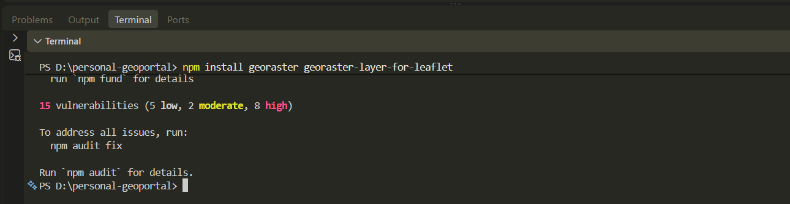
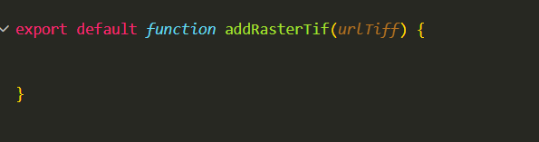
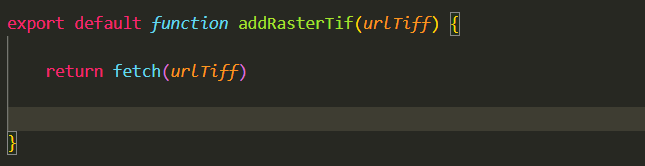
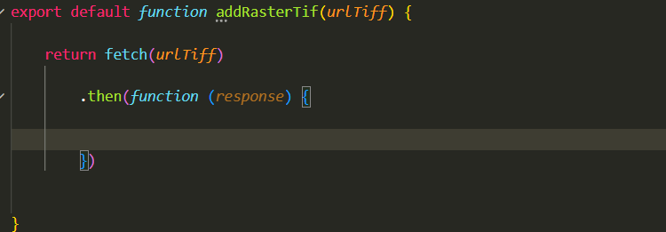
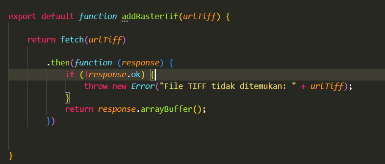
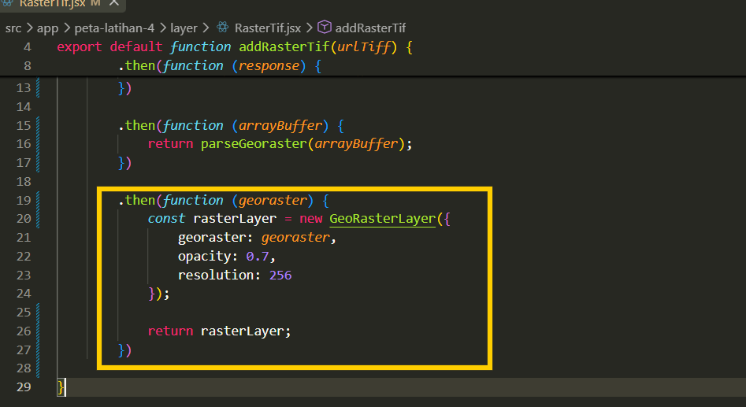
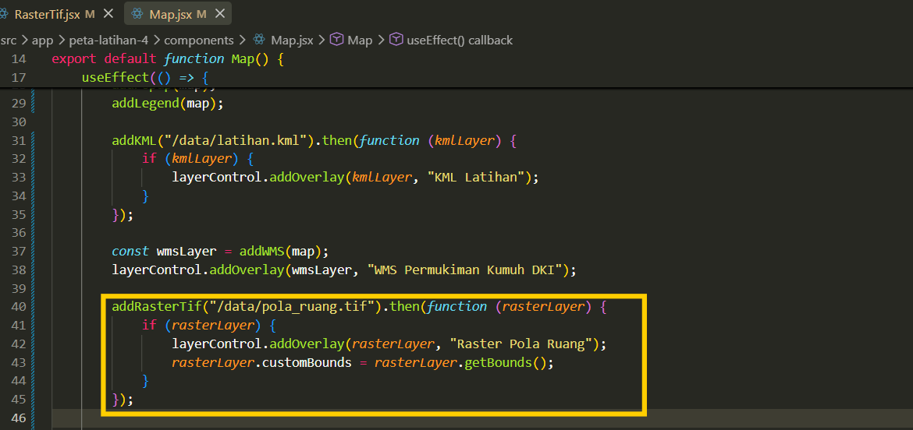
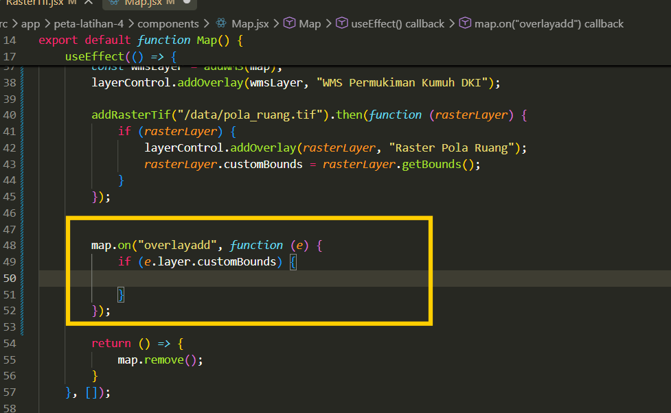
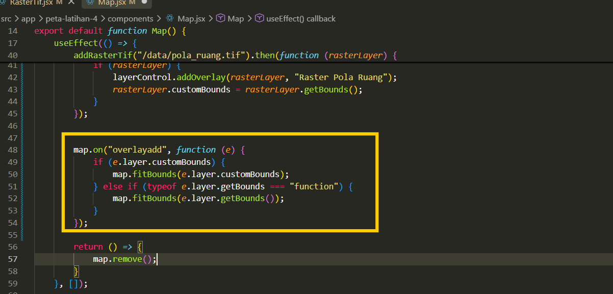

# Menampilkan Data Raster

## **Menampilkan data raster**

1. Tahap pertama install library untuk menampilkan raster menggunakan leaflet dengan menginput perintah pada terminal **npm install georaster georaster-layer-for-leaflet**.

    ```bash
    npm install georaster georaster-layer-for-leaflet
    ```



2. Pada tahap kedua buat file baru pada folder layer dengan nama Raster.jsx kemudian buat fungsi baru untuk menambahkan data raster kedalam peta serta tambahkan paramter urlTiff.

    ```jsx
    export default function addRasterTif(urlTiff) {
    
      return fetch(urlTiff)
    
        .then(function (response) {
          if (!response.ok) {
            throw new Error("File TIFF tidak ditemukan: " + urlTiff);
          }
          return response.arrayBuffer();
        })
    
        .then(function (arrayBuffer) {
          return parseGeoraster(arrayBuffer);
        })
    
        .then(function (georaster) {
          const rasterLayer = new GeoRasterLayer({
            georaster: georaster,
            opacity: 0.7,
            resolution: 256
          });
    
          return rasterLayer;
        })
    
        .catch(function (error) {
          console.log("Gagal memuat file TIFF:", error);
          return null;
        });
    }
    ```



3. Selanjutnya buat fungsi **return fetch** untuk mengambil data raster yang akan digunakan promise berupa return untuk menampilkan layer dalam peta.
    

    
4. Tahapan ketiga buat fungsi **.then(response)** untuk melanjutkan proses setelah file selesai diambil response yang berisi hasil dari proses pengambilan file TIFF.
    

    
5. Pada tahap keempat didalam fungsi sebelumnya, buat fungsi yang digunakan untuk melakukan pemeriksaan file apakah dapat ditemukan atau tidak dengan membuat fungsi kondisional **if.**
    

    
6. Pada tahap kelima buat fungsi untuk mengembalikan dan memproses data tiff jika berhasil diproses dengan menggunakan **return**.
    

    
7. Tahap keenam buat kembali fungsi **.then** yang akan digunakan untuk mengkonversi data tiff menjadi data raster yang dapat dibaca dan diproses oleh library leaflet.
    

    
8. Kemudian buat kembali **.then** untuk mengambil data raster yang sudah dibaca sehingga dapat ditampilkan dalam layer. Kemudian tambahkan opacity digunakan untuk mengatur transparansi raster, serta resolution digunakan untuk mengatur tingkat detail saat raster ditampilkan.
    

    
9. Kemudian tahapan berikutnya buat fungsi catch( ) yang digunakan untuk menangani jika terjadi kesalahan atau jika file gagal dimuat.
    

    
10. Berikut ini hasil keseluruhan script fungsi untuk menambahkan data raster pada file RasterTif.jsx
    

    
11. Berikutnya, masukan data raster yang dimiliki kedalam folder data yang terdapat dalam folder public.
    

    
12. Kemudian tahap terakhir panggil fungsi untuk menampilkan data raster dalam halaman Map.jsx dengan menggunakan addRasterTif, lalu tambahkan parameter berupa path dari folder tempat penyimpanan data raster, kemudian tambahkan fungsi untuk autozoom kearea layer tersebut dengan fungsi **getbound**
    

    
13. Selanjutnya tambahkan fungsi **map.on** untuk mengetahui layer yang sedang diaktifkan, kemudian tambahkan parameter overlayed sebagai parameter overlay yang ada pada layer control.
    

    
14. Kemudian didalam **map.on** buat fungsi berupa kondisi **if** untuk mengetahui apakah terdapat layer yang memiliki **custom bound**.
    

    
15. Selanjutnya tambahkan fungsi pada kondisi tersebut jika layer miliki custom bound maka tampilan peta akan menyesuaikan berdasarkan customBounds.
    

    
16. Kemudian buat kondisi kedua menggunakan **else** jika tidak memiliki customBounds, script mengecek apakah layer memiliki fungsi getBounds() untuk mendapatkan batas geografis layer.
    

    
17. Hasil tampilan data raster yang dimuat pada halaman webgis dapat dilihat pada gambar berikut ini.
    
