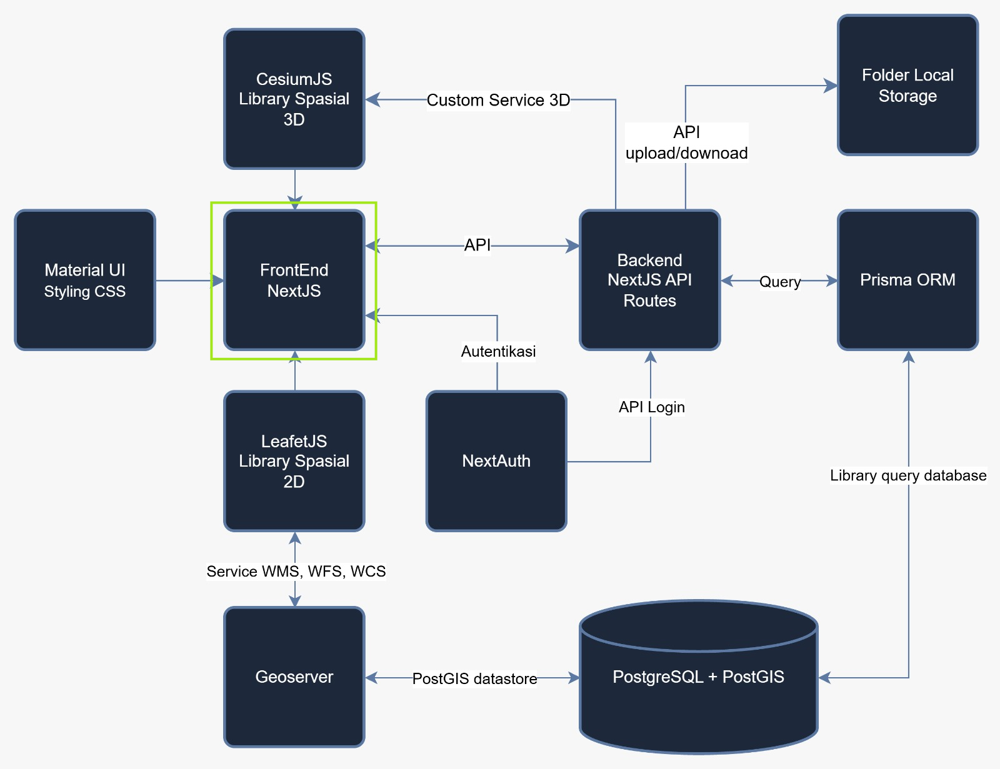

# Membuat Form Login

Front-End adalah bagian dari aplikasi web yang dilihat dan digunakan langsung oleh pengguna di browser, seperti halaman, tombol, form, dan peta. Bagian ini menampilkan data dan menerima aksi dari pengguna.

NextJS adalah framework berbasis React untuk membuat aplikasi web. NextJS sudah menyediakan banyak hal yang biasanya harus disiapkan sendiri, misalnya pengaturan alamat halaman (routing) berdasarkan struktur folder. Di proyek WebGIS ini, NextJS menjadi bagian FrontEnd yang menghubungkan tampilan, peta, dan login.



Proyek Next.js dan repositori GitHub sudah disiapkan pada halaman [Persiapan dan Konfigurasi Framework](/hari-1/praktik-3/konfigurasi-framework). Halaman ini melanjutkan pekerjaan tersebut ke halaman login.

## Yang Akan Dipraktikkan

Pada praktik ini peserta membangun halaman login. Fokusnya hanya pada front-end, sedangkan bagian backend diajarkan pada praktik selanjutnya.

Halaman login dikerjakan dalam 3 langkah:

| Langkah | Yang dikerjakan |
|---|---|
| Struktur | Menampilkan form polos berisi judul, input email dan password, serta tombol |
| Style | Memberi tampilan agar form lebih rapi |
| Logic | Membuat form dapat memberi tanggapan atas email dan password yang diisi |

Sambil praktik, peserta mengenal berkas `page.js`, yaitu isi halaman yang tampil di browser, dan konsep dasar React: satu halaman dapat dipecah menjadi komponen-komponen kecil di berkas terpisah (`LoginForm`), lalu dipasang kembali dengan `import`.

## Tujuan

Setelah praktik ini, peserta mampu:

- Menjelaskan apa itu Front-End dan NextJS.
- Membuat project NextJS dan menjalankannya di browser.
- Membuat halaman login sederhana dengan struktur, style, dan logic.

## Apa Itu Framework Web

Framework web adalah kerangka kerja berisi kumpulan tools, aturan, dan struktur baku yang membantu developer membangun aplikasi web tanpa harus menulis semua fungsi dasar dari nol.

### Struktur Baku


Framework menyediakan pola arsitektur (folder, routing, komponen) yang konsisten.

### Fitur Siap Pakai


Fitur yang sudah tersedia mempercepat proses development.

### Modular dan Dapat Dipakai Ulang


Kode dipecah menjadi bagian kecil yang dapat digunakan ulang.

### Contoh Framework Populer

| Framework | Bidang |
|---|---|
| Next.js | Framework berbasis React, dipakai pada pelatihan ini |
| Laravel | Framework backend berbasis PHP |
| Django | Framework backend berbasis Python |
| Angular / Vue | Framework frontend berbasis JavaScript |

## Mengapa Memakai Framework

Membangun web tanpa framework berarti menulis ulang banyak hal dasar secara manual.

### Tanpa Framework


- Menulis routing, state, dan struktur dari nol.
- Rawan inkonsisten antar bagian aplikasi.
- Waktu development jauh lebih lama.
- Sulit dipelihara saat aplikasi membesar.

### Dengan Framework


- Struktur dan konvensi sudah tersedia.
- Fitur siap pakai: routing, optimasi, dan sebagainya.
- Development lebih cepat dan efisien.
- Terpelihara dan dapat dikembangkan bersama tim.

## Apa Itu Next.js

Next.js adalah framework React untuk membangun aplikasi web modern secara full-stack: mencakup rendering di server, routing berbasis file, sampai optimasi performa bawaan.

### File-based Routing


Struktur folder otomatis menjadi rute aplikasi (App Router).

### Server dan Client Rendering


Mendukung SSR, SSG, ISR, dan Client-Side Rendering.

### Optimasi Otomatis


Optimasi gambar, font, dan kode bawaan untuk performa.

### Dibangun di Atas React


Next.js memakai React sebagai fondasi UI-nya, lalu menambahkan lapisan routing, rendering, dan tooling produksi di atasnya.

Dipakai oleh Netflix, TikTok, Nike, dan Hulu.

## Mode Rendering di Next.js

Next.js fleksibel: setiap halaman dapat memilih strategi rendering yang paling sesuai.

### SSR (Server-Side Rendering)


HTML dirender di server setiap ada permintaan, sehingga data selalu terbaru.

### SSG (Static Site Generation)


HTML dibuat sekali saat build, sehingga penyajiannya cepat.

### ISR (Incremental Static Regeneration)


Halaman statis yang diperbarui otomatis secara berkala.

### CSR (Client-Side Rendering)


Konten dirender di browser pengguna lewat JavaScript.

## React Components

Component adalah blok bangunan dasar UI di React: sebuah fungsi JavaScript yang mengembalikan tampilan (JSX) dan dapat digunakan berulang kali.

### Reusable


Satu komponen dapat dipakai di banyak tempat berbeda.

### Menerima Props


Data dikirim dari komponen induk ke komponen anak.

### Dapat Disusun (Composable)


Komponen kecil digabung menjadi tampilan yang kompleks.

Berkas `Card.jsx`:

```jsx
function Card({ title, desc }) {
  return (
    <div className="card">
      <h3>{title}</h3>
      <p>{desc}</p>
    </div>
  );
}
```

Pemakaian komponen tersebut:

```jsx
<Card
  title="Hello"
  desc="Komponen React"
/>
```

## App Router

Sistem routing Next.js berbasis struktur folder di dalam direktori `app/`. Setiap folder merepresentasikan sebuah segmen URL.

### page.js


Menentukan tampilan (UI) untuk suatu rute.

### layout.js


Tampilan bersama yang membungkus beberapa halaman.

### loading.js


UI otomatis saat konten sedang dimuat.

### route.js


Membuat API endpoint pada rute tersebut.

Struktur folder `app/`:

```text
app/
├─ layout.js
├─ page.js          → "/"
├─ about/
│  └─ page.js       → "/about"
├─ blog/
│  ├─ page.js       → "/blog"
│  └─ [slug]/
│     └─ page.js    → "/blog/:slug"
└─ api/
   └─ route.js      → "/api"
```

## React Hooks

Hooks adalah fungsi khusus yang memungkinkan komponen fungsi menggunakan state, siklus hidup, dan fitur React lainnya.

| Ikon | Hook dan kegunaan |
|---|---|
|  | **useState**: menyimpan dan memperbarui data (state) dalam komponen |
|  | **useEffect**: menjalankan efek samping, seperti fetch data dan subscription |
|  | **useContext**: mengakses data global tanpa meneruskan props berlapis |
|  | **useRef**: menyimpan nilai atau referensi tanpa memicu render ulang |
|  | **useMemo**: menyimpan hasil kalkulasi agar tidak dihitung berulang |
|  | **Custom Hook**: hook buatan sendiri untuk logika yang dapat dipakai ulang |

## Package dan Library

Package adalah kumpulan kode (library) siap pakai yang dapat diinstal ke proyek, biasanya melalui npm (Node Package Manager), untuk menghindari penulisan ulang fungsi umum.

### package.json


Berisi daftar dependensi dan konfigurasi proyek.

### node_modules/


Folder tempat semua package yang diinstal disimpan.

### npm install


Perintah untuk mengunduh dan memasang package.

### Pustaka Populer di Ekosistem Next.js

| Pustaka | Kegunaan |
|---|---|
| Tailwind CSS | Utility-first styling |
| Prisma | ORM untuk database |
| Axios | HTTP client untuk fetch data |
| Zustand / Redux | State management |
| Framer Motion | Animasi UI |

## Praktik: Membuat Halaman Login

Halaman login dibangun di dalam proyek yang sudah disiapkan pada halaman [Persiapan dan Konfigurasi Framework](/hari-1/praktik-3/konfigurasi-framework). Bila server pengembangan belum berjalan, jalankan `npm run dev` pada terminal di folder proyek.

### Berkas Halaman dan Komponen

Berkas `page.js` adalah isi halaman yang tampil di browser. Form login diletakkan pada komponen terpisah bernama `LoginForm`, lalu dipasang kembali ke halaman dengan `import`. Berikut kerangka `page.js` yang memasang komponen tersebut:

```jsx
import LoginForm from './LoginForm'

const Page = () => {
  return <LoginForm />
}

export default Page
```

### Langkah 1: Struktur

Form disusun lebih dulu tanpa gaya apa pun, supaya terlihat jelas bagian yang menyusun halaman.

1. Tulis judul halaman.
2. Tambahkan input email.
3. Tambahkan input password.
4. Tambahkan tombol.

### Langkah 2: Style

Setelah strukturnya selesai, form diberi tampilan agar lebih rapi. Gaya ditulis dengan CSS, sama seperti pada halaman login praktik sebelumnya.

### Langkah 3: Logic

Langkah terakhir membuat form dapat memberi tanggapan atas email dan password yang diisi. Pemeriksaan isian di sisi backend dikerjakan pada praktik selanjutnya, bukan di halaman ini.

## Rangkuman

| Ikon | Bagian |
|---|---|
|  | **Framework Web**: kerangka kerja untuk membangun aplikasi secara terstruktur |
|  | **Next.js**: framework React untuk aplikasi full-stack modern |
|  | **React Components**: blok UI reusable yang membentuk tampilan aplikasi |
|  | **App Router**: routing otomatis berbasis struktur folder `app/` |
|  | **React Hooks**: menghubungkan komponen dengan state dan fitur React |
|  | **Package & Library**: kode siap pakai yang dikelola lewat npm |

Langkah berikutnya ada pada halaman [Membuat Halaman Profil dengan Material UI](/hari-1/praktik-3/halaman-profil).
