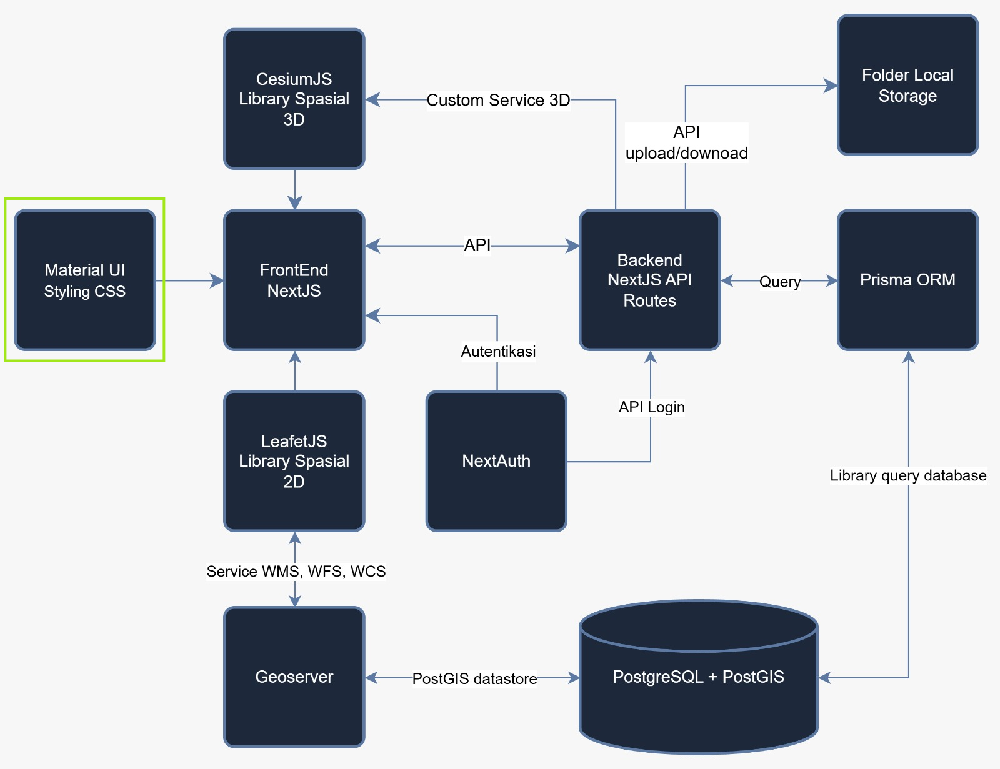

# Membuat Halaman Profil dengan Material UI

Pada [praktik sebelumnya](/hari-1/praktik-3/form-login) Anda sudah membuat halaman login dan memberi tampilan dengan menulis CSS sendiri. Cara itu berjalan baik, tetapi untuk halaman yang lebih kompleks kita harus menulis banyak CSS, dan hasilnya perlu disesuaikan lagi untuk layar HP.

Material UI (MUI) adalah kumpulan komponen tampilan siap pakai untuk React dan NextJS, seperti tombol, kartu, foto profil, dan label. Kita tinggal memasang komponen tersebut dan mengatur tampilannya lewat properti, tanpa menulis CSS dari awal. Pada diagram arsitektur, Material UI berperan sebagai styling yang mempercantik tampilan FrontEnd NextJS.



## Yang Akan Dipraktikkan

Pada praktik ini peserta membuat halaman profil yang berisi kartu dengan foto, nama, tombol, statistik, dan label keahlian. Halaman dibangun bertahap dalam 6 step:

- Step A: judul halaman dengan Container, Box, dan Typography.
- Step B: kartu profil dengan Card dan Avatar.
- Step C: tombol dengan Button dan IconButton.
- Step D: garis pemisah, statistik, dan label dengan Divider, Grid, dan Chip.
- Step E: tombol yang dapat diklik dengan useState.
- Step F: tampilan yang menyesuaikan ukuran layar HP dan laptop (responsive).

Setiap step memiliki return sendiri yang lengkap, sehingga peserta cukup berpindah ke blok berikutnya tanpa mencari bagian lain di dalam berkas.

## Tujuan

Setelah praktik ini, peserta mampu:

- Menjelaskan apa itu Material UI dan manfaatnya.
- Menyusun halaman dari komponen Material UI.
- Membuat tombol yang memberi respons ketika diklik.
- Membuat tampilan yang menyesuaikan ukuran layar.

## Apa Itu Material UI

Material UI (MUI) adalah library komponen React siap pakai yang mengimplementasikan prinsip desain Material Design dari Google.

### Komponen Siap Pakai


Ratusan komponen UI (Button, Card, Dialog, dan lainnya) tinggal diimpor.

### Desain Konsisten


Komponen mengikuti standar Material Design.

### Dapat Dikustomisasi


Tampilan dapat diubah lewat theme maupun prop `sx`.

## Mengapa Material UI Dipakai

| Alasan | Keterangan |
|---|---|
| Package resmi | `@mui/material` dikelola aktif dan didukung komunitas besar |
| Terintegrasi baik | Bekerja dengan React dan Next.js |
| Aksesibilitas | Komponen dibangun mengikuti standar aksesibilitas (a11y) |
| Dokumentasi lengkap | Contoh kode dan panduan tersedia untuk setiap komponen |

## Instalasi dan Pemakaian Dasar

MUI dipasang sebagai package npm, lalu komponennya diimpor langsung ke dalam berkas React.

### Memasang Package


Jalankan perintah berikut pada terminal di dalam folder proyek:

```bash
npm install @mui/material @emotion/react @emotion/styled
```

Paket ikon dipasang dengan perintah yang sama, karena halaman profil memakai ikon pada tombolnya:

```bash
npm install @mui/material @emotion/react @emotion/styled @mui/icons-material
```

### Mengimpor Komponen


Komponen diimpor dari paketnya masing-masing:

```js
import Button from '@mui/material/Button';
```

### Memakai di JSX


```jsx
<Button variant="contained">Klik</Button>
```

Berkas `App.jsx` berikut memakai dua komponen sekaligus:

```jsx
import Button from '@mui/material/Button';
import TextField from '@mui/material/TextField';

function App() {
  return (
    <>
      <TextField label="Nama" />
      <Button variant="contained">
        Kirim
      </Button>
    </>
  );
}
```

## Komponen yang Sering Dipakai

MUI menyediakan ratusan komponen. Berikut beberapa yang paling sering digunakan.

| Ikon | Komponen |
|---|---|
|  | **Button**: tombol aksi (contained, outlined, text) |
|  | **TextField**: input teks dengan label dan validasi |
|  | **Card**: wadah konten dengan bayangan dan padding |
|  | **AppBar**: bilah navigasi bagian atas halaman |
|  | **Dialog**: jendela modal untuk konfirmasi atau form |
|  | **Grid**: sistem tata letak kolom responsif |
|  | **Checkbox**: pilihan ya/tidak yang dapat dicentang |
|  | **Switch**: tombol on/off bergaya geser |
|  | **Avatar**: menampilkan foto atau inisial pengguna |
|  | **Table**: menyajikan data dalam bentuk tabel |
|  | **Snackbar**: notifikasi singkat di tepi layar |
|  | **Slider**: memilih nilai dalam rentang tertentu |

## Props pada Komponen

Setiap komponen menerima props untuk mengatur tampilan dan perilakunya.

### variant


Mengatur gaya visual, contoh: "contained", "outlined", "text".

### color


Mengatur warna tema, contoh: "primary", "secondary", "error".

### size & fullWidth


Mengatur ukuran komponen: "small", "medium", "large".

Berkas `Form.jsx`:

```jsx
<TextField
  label="Email"
  variant="outlined"
  fullWidth
/>

<Button
  variant="contained"
  color="primary"
  size="large"
>
  Daftar Sekarang
</Button>
```

## Prop sx untuk Styling

`sx` adalah prop khusus MUI untuk menulis style inline langsung pada komponen, dengan akses penuh ke nilai-nilai theme (warna, spacing, breakpoint).

### Ringkas dan Cepat


Tidak perlu berkas CSS terpisah untuk styling sederhana.

### Sadar Tema (Theme-aware)


Dapat memakai token tema, contoh: `color: 'primary.main'`.

### Mendukung Responsive


Nilai dapat diatur berbeda per breakpoint layar.

Berkas `Box.jsx`:

```jsx
<Box
  sx={{
    bgcolor: 'primary.main',
    color: 'white',
    p: 2,
    borderRadius: 2,
    boxShadow: 3,
  }}
>
  Kotak bergaya
</Box>
```

## Contoh Lanjutan Prop sx

`sx` juga mendukung shorthand spacing, pseudo-selector, dan nilai responsif per breakpoint.

### p: 2, m: 1


Shorthand spacing, dikalikan 8px oleh theme (p: 2 = 16px).

### '&:hover'


Mengatur gaya saat elemen di-hover, seperti pseudo-class CSS.

### { xs: 12, md: 6 }


Nilai berbeda untuk tiap breakpoint (responsive design).

Berkas `Responsive.jsx`:

```jsx
<Box
  sx={{
    width: { xs: '100%', md: 300 },
    p: 2,
    bgcolor: 'background.paper',
    '&:hover': {
      bgcolor: 'primary.light',
    },
  }}
>
  Responsif & interaktif
</Box>
```

## Material Icons

Material Icons adalah paket ikon resmi dari MUI (`@mui/icons-material`) berisi ribuan ikon siap pakai sebagai komponen React.

### Ribuan Pilihan Ikon


Mencakup ikon umum: home, search, cart, dan lainnya.

### Berupa Komponen React


Diimpor dan digunakan layaknya komponen biasa.

### Bisa Diberi Gaya


Ukuran dan warna diatur lewat props atau `sx`.

Berkas `Icon.jsx`:

```jsx
import HomeIcon from '@mui/icons-material/Home';

<HomeIcon
  color="primary"
  fontSize="large"
/>

<Button startIcon={
  <HomeIcon />
}>
  Beranda
</Button>
```

### Ragam Material Icons

Sebagian kecil dari ribuan ikon yang tersedia; impor sesuai nama komponennya.

| Ikon | Komponen |
|---|---|
|  | HomeIcon |
|  | SearchIcon |
|  | PersonIcon |
|  | SettingsIcon |
|  | FavoriteIcon |
|  | StarIcon |
|  | EmailIcon |
|  | ShoppingCartIcon |
|  | DownloadIcon |
|  | DeleteIcon |
|  | CheckIcon |
|  | BoltIcon |

## Praktik: Membuat Halaman Profil

Praktik ini memakai berkas `Profile.jsx` yang berisi 6 step (A sampai F). Halaman disimpan pada folder rute tersendiri di dalam proyek, sehingga dapat dibuka lewat browser.

### Persiapan

1. Buka project `webgis-latihan` di Visual Studio Code.

2. Pasang Material UI. Buka terminal, ketik perintah berikut, lalu tekan enter.

    ```bash
    npm install @mui/material @emotion/react @emotion/styled @mui/icons-material
    ```

3. Siapkan foto. Simpan satu foto dengan nama `avatar.jpg` di dalam folder `public`. Jika foto tidak ada, avatar tetap tampil dengan ikon bawaan.

### Menyimpan Berkas

1. Di dalam folder `src/app`, buat folder baru bernama `profile`.
2. Simpan berkas `Profile.jsx` ke dalam folder `profile` tersebut.
3. Di folder yang sama, buat berkas `page.js` dengan isi berikut.

    Berkas `src/app/profile/page.js`:

    ```jsx
    import Profile from './Profile'

    const Page = () => {
      return <Profile />
    }

    export default Page
    ```

4. Jalankan `npm run dev`, lalu buka `http://localhost:3000/profile`. Jika berhasil, halaman menampilkan tulisan Profile. Ini adalah STEP 0.

### Cara Memakai Step

`Profile.jsx` berisi 6 step (A sampai F). Setiap step punya return sendiri yang lengkap dan sudah mencakup hasil step sebelumnya. Import dan state sudah aktif dari awal, jadi peserta tidak perlu kembali ke bagian atas berkas. Untuk pindah ke step berikutnya:

1. Hapus return step sebelumnya (yang sedang aktif).
2. Di step berikutnya, hapus tanda `/*` di awal dan `*/` di akhir blok return-nya.
3. Simpan berkas (Ctrl + S) dan lihat hasilnya di browser. Halaman akan diperbarui otomatis.

| Step | Komponen yang dipakai | Hasil di browser |
|---|---|---|
| A | Container, Box, Typography | Judul dan keterangan halaman |
| B | Card, Avatar | Kartu berisi foto, nama, dan pekerjaan |
| C | Stack, Button, IconButton | Tombol Follow, Message, dan ikon edit |
| D | Divider, Grid, Chip | Garis pemisah, statistik, dan label keahlian |
| E | useState | Tombol Follow dapat berubah dan tombol edit menampilkan teks |
| F | Breakpoint { xs, sm, md } | Tampilan menyesuaikan ukuran layar HP dan laptop |

### Catatan

::: warning Baris 'use client' wajib ada
`'use client'` di baris paling atas berkas wajib ada karena `Profile.jsx` memakai `useState`, fitur interaktif.
:::

Kerjakan step secara berurutan dan jangan melompat.

::: tip Bila muncul galat "Module not found"
Periksa kembali apakah Material UI sudah terinstal pada langkah persiapan.
:::

Jika statistik (Post, Followers, Following) tampil menumpuk, kemungkinan versi Material UI berbeda dan penulisan `Grid` perlu disesuaikan.

## Rangkuman

Empat bagian Material UI yang dipakai pada halaman ini.

| Ikon | Bagian |
|---|---|
|  | **Library MUI**: komponen React siap pakai berbasis Material Design |
|  | **Komponen Umum**: Button, TextField, Card, Dialog, Grid, dan banyak lagi |
|  | **sx Prop**: styling inline yang ringkas dan sadar tema (theme-aware) |
|  | **Material Icons**: ribuan ikon resmi yang siap dipakai sebagai komponen |
