# Perancangan dan Pembangunan Awal Peta 2D

**Praktik 3 - Pengembangan Front-End : Peta 2D**

## **Library yang Perlu Dipasang**

Empat pustaka berikut dipasang sekaligus di awal, supaya halaman-halaman Praktik 3 sesudah ini tidak berhenti di tengah hanya karena satu pustaka belum ada. Jalankan di terminal Visual Studio Code, dari root folder proyek.

```bash
npm install leaflet
npm install leaflet-kml
npm install georaster
npm install georaster-layer-for-leaflet
```

Ketiganya dipakai bergantian sepanjang praktik ini:

| Pustaka | Dipakai pada |
|---|---|
| `leaflet` | Seluruh halaman peta 2D |
| `leaflet-kml` | [Menampilkan Layer GeoJSON, KML, dan WMS](/hari-1/praktik-3/layer-geojson-kml-wms) |
| `georaster` | [Menampilkan Data Raster](/hari-1/praktik-3/data-raster) |
| `georaster-layer-for-leaflet` | [Menampilkan Data Raster](/hari-1/praktik-3/data-raster) |

## **Persiapan Project dan Instalasi Library Leaflet**

1. Pada tahap pertama, peserta membuat folder baru untuk menyimpan komponen peta. Caranya dengan **klik kanan** pada **folder app**, pilih **New Folder**, lalu beri nama **peta-latihan-1**. Selanjutnya, buat **folder components** di dalam folder tersebut.
    
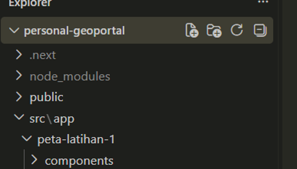
    
2. Selanjutnya, pada folder components, buat dua file baru yaitu **Map.jsx** dan **MapWrapper.jsx.** Kemudian, pada folder **peta-latihan-1,** buat file **page.js** sebagai halaman untuk menampilkan peta.
    
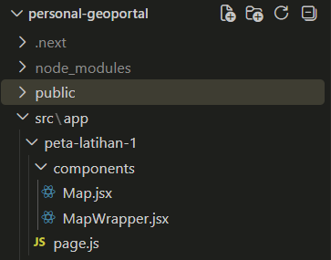
    
3. Selanjutnya pasang pustakanya di terminal dengan cara **klik kanan** pada tombol panah, lalu pada tampilan powershell jalankan keempat perintah `npm install` pada bagian [Library yang Perlu Dipasang](#library-yang-perlu-dipasang) di atas.
    

    

## **Membuat dan Menampilkan Peta Dasar 2D**

1. Pertama buat kerangka yang akan menjadi halaman peta dengan cara **ketik rfc** kemudian **enter**, maka akan muncul script seperti berikut ini.
    

    
2. Selanjutnya didalam **export default function map** buat variabel berfungsi sebagai referensi atau penghubung antara kode React dengan elemen yang akan digunakan sebagai tempat menampilkan peta dengan library Leaflet.

    ```jsx
    const mapRef = useRef(null);
    ```
    
    ```jsx
    const mapRef = useRef(null);
    ```
    
3. Tahapan berikutnya buat **container** menggunakan elemen `<div>` sebagai tempat untuk menampilkan peta. Container dibuat utuk mengatur lebar dan tinggi. Tahapan berikutnya hubungkan dengan mapRef sehingga ukuran peta sudah sesuai persentasenya.

    ```jsx
    <div style={{ width: "100%", height: "100%" }} ref={mapRef}></div>
    ```
    
    ```jsx
    <div style={{ width: "100%", height: "100%" }} ref={mapRef}></div>
    ```
    
4. Hasil scriptnya menjadi seperti berikut ini.
    
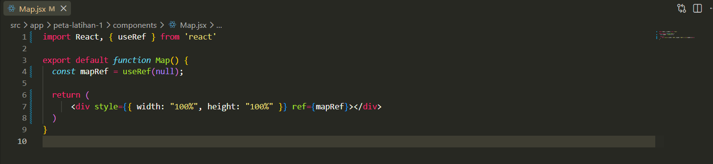
    
5. Selanjutnya, buat fungsi dengan nama useEffect dibawah **const mapRef** kemudian klik enter. Komponen ini akan berfungsi untuk menjalankan proses pembuatan peta setelah halaman ditampilkan.
    
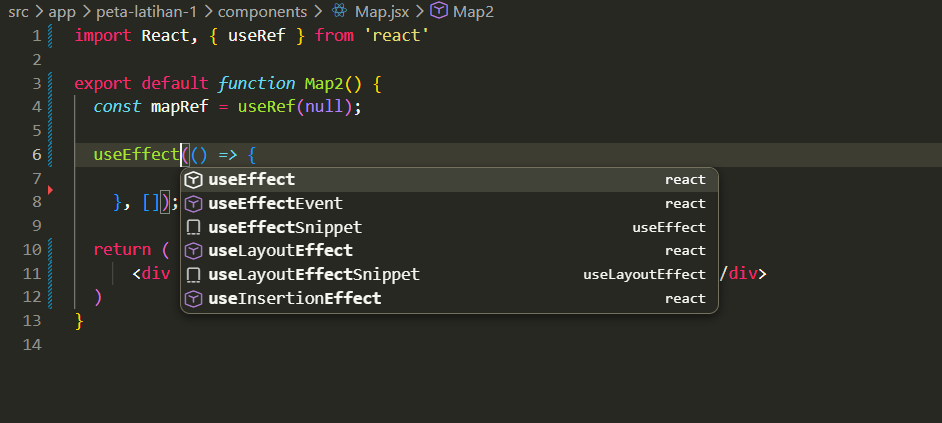
    
6. Tahapan berikutnya buat variabel didalam useEffect yang akan digunakan untuk membuat peta, serta tentukan posisi awal yang menjadi titik koordinat yang akan ditampilkan serta tambahkan level zoom menggunakan setView().

    ```jsx
    const map = L.map(mapRef.current).setView([-6.2088, 106.8456], 13);
    ```
    
    ```jsx
    const map = L.map(mapRef.current)
    			.setView([-6.2088, 106.8456], 13);
    ```
    
7. Kemudian buat variabel untuk menambahkan basemap menggunakan L.tileLayer() dibawah setView.

    ```jsx
    const basemap = L.tileLayer(
      "https://{s}.tile.openstreetmap.org/{z}/{x}/{y}.png"
    );
    ```
    
    ```jsx
    const basemap =
    L.tileLayer("https://{s}.tile.openstreetmap.org/{z}/{x}/{y}.png");
    ```
    
8. Selanjutnya tambahkan basemap kedalam peta dengan membuat variabel map.addLayer serta tambahkan fungsi return untuk menghapus peta saat halaman atau komponen sudah tidak digunakan. Tujuannya agar peta tidak menumpuk atau muncul berulang kali.
    
    ```jsx
    map.addLayer(basemap);
    
    return () => {
    map.remove();}
    ```
    
9. Pada bagian akhir useEffect tambahkan tanda [] yang disebut **dependency array**. Dalam script ini, array tersebut kosong sehingga proses pembuatan peta dijalankan ketika component pertama kali ditampilkan. Tambahkan “use client” dibagian baris pertama. Hasil keseluruhan scriptnya menjadi seperti berikut.
    
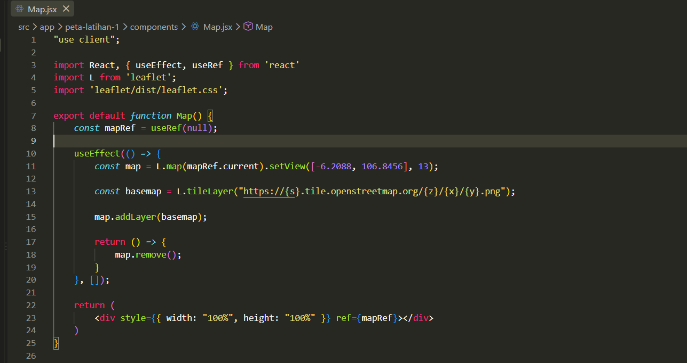
    
10. Tahapan selanjutnya buka file MapWrapper.jsx yang akan digunakan untuk memanggil komponen Map.jsx agar peta Leaflet dapat berjalan di browser. Pertama tambahkan “use client” dibaris pertama, kemudian buat variabel untuk memanggil file Map.jsx.
    
    ```jsx
    const MapWrapper = dynamic(() => import("./Map"), { ssr: false });
    ```
    
11. Kemudian tutup variabel tersebut agar file MapWrapper.jsx dengan **export default MapWrapper;** dapat dijalankan pada halaman file page.js. Hasil script pada file MapWrapper.jsx yaitu sebagai berikut.
    
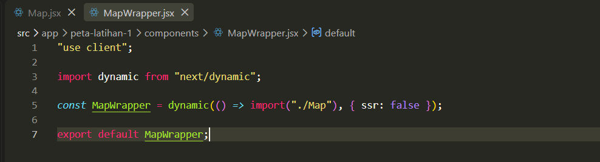
    
12. Setelah membuat halaman Map.jsx dan MapWrapper.jsx tahap selanjutnya adalah menampilkan peta pada halaman page.js. Tahapan pertama ketik rfc kemudian enter untuk menampilkan kerangka script pada halaman page.js.
    
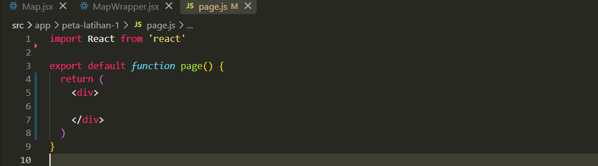
    
13. Selanjutnya pada container `<div>` tambahkan fungsi untuk mengatur ukuran peta yang akan ditampilkan, kemudian panggil file MapWrapper kedalam halaman page.js
    
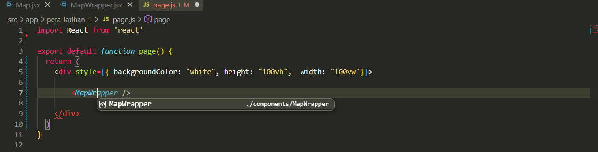
    
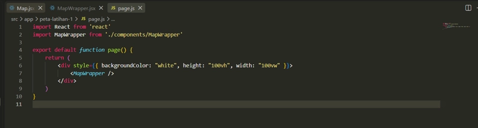
    
14. Untuk menjalankan peta yang telah dibuat, peserta dapat membuka localhost:3000 kemudian tambahkan **path** berupa nama folder yang telah peserta buat sebelumnya yaitu **peta-latihan-1**. Maka hasilnya dapat dijalankan pada url lokal **http://localhost:3000/peta-latihan-1** serta dapat dilihat sebagai berikut ini.
    
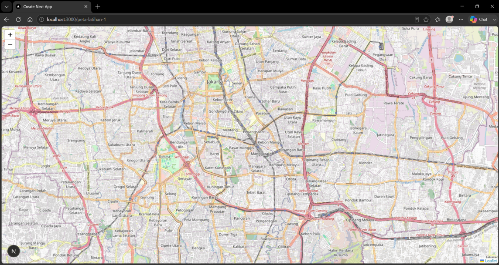
    

## **Merancang dan membangun fungsi untuk Kontrol Layer, Popup, Legenda, dan Interaksi Pengguna**

### **Menambahkan Kontrol Layer Basemap**

1. Tahap pertama buat **folder baru** dalam folder peta dengan nama **Widget** yang akan berfungsi untuk menyimpan file halaman widget. Kemudian buat file baru dengan nama **BaseMap.jsx**.
    
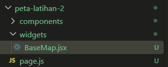
    
2. Tahapan kedua buat fungsi baru untuk menampilkan basemap serta tambahkan **parameter (map, overlaymaps)** untuk menambahkan hasil dari basemap dan menerima overlay layer didalam peta.
    

    
3. Selanjutnya pada tahapan ketiga pada fungsi tersebut buat variabel untuk menambahkan peta dasar dengan jenis osm serta citra satelit, kemudian tambahkan atribut yang akan digunakan sebagai label dari peta dasar. Apabila import L tidak berfungsi, peserta dapat menambahkan **import L from 'leaflet';** secara manual pada baris pertama.
    
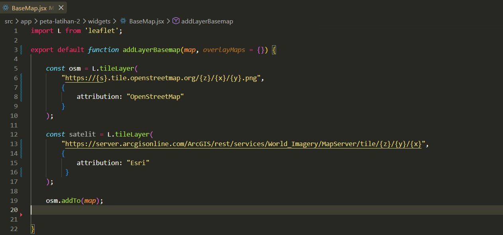
    
4. Pada tahap keempat buat script untuk menentukan peta mana yang akan menjadi peta utama dengan menambahkan
    
    > **osm.addTo(map);**
    > 
    
    kemudian tambahkan tampilan untuk pilihan basemap dengan menambahkan variabel
    
    > **const basemap = { };**.
    > 
    

    
5. Tahap kelima setelah baseMaps dan overlayMaps tersedia, buat kontrol sebagai fungsi untuk melakukan overlay maps kedalam peta, serta tutup dengan return untuk mengembalikan objek yang telah dibuat. Hasil keseluruhannya seperti berikut.
    

    
6. Pada tahap terakhir panggil widget basemap yang telah dibuat oleh peserta kedalam halaman **Map.jsx** dengan tambah script
    
    > **const layerControl = addLayerBasemap(map)**
    > 
    
    yang berfungsi untuk melakukan kontrol layer serta variabel yang akan berfungsi sebagai variabel untuk overlay layer.
    

    
7. Hasil tampilan kontrol layer untuk melakukan pemilihan basemap dapat dilihat pada tampilan gambar berikut ini.
    

    

### **Menambahkan Popup**

1. Buat file baru dengan nama **Popup.jsx** pada folder widget.
    

    
2. Tahap kedua buat buat fungsi baru untuk menampilkan popup serta tambahkan parameter (map).
    

    
3. Tahap ketiga buat sebuah titik lokasi yang akan ditampilkan didalam peta, sebagai contoh tiitk lokasi Monumen Nasional serta buat parameter untuk menambahkan pada peta dengan **addTo(map)**.
    

    
4. Tahap keempat buat tampilan popup yang akan menampilkan informasi ketika diklik.
    
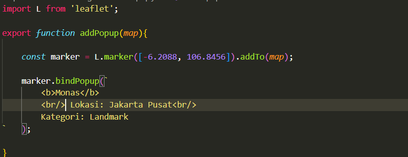
    
5. Tahap kelima tutup popup dengan **return marker**; untuk mengembalikan popup sehingga dapat digunakan kembali.
    

    
6. Tahapan keenam, buat **variabel** untuk menambahkan icon yang akan digunakan pada popup sertapanggil icon tersebut pada titik yang telah dibuat dengan menambahkan **icon:markerIcon**. Berikut ini keseluruhan script pada file popup.
    
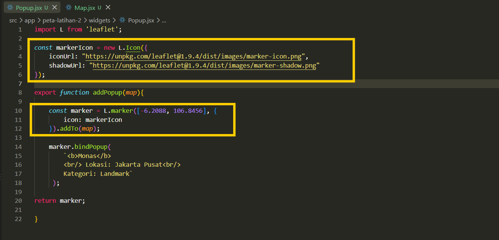
    
7. Tahap terakhir panggil popup kedalam halaman peta dengan menambahkan **addPopup(map);** pada fungsi peta dalam Map.jsx.
    
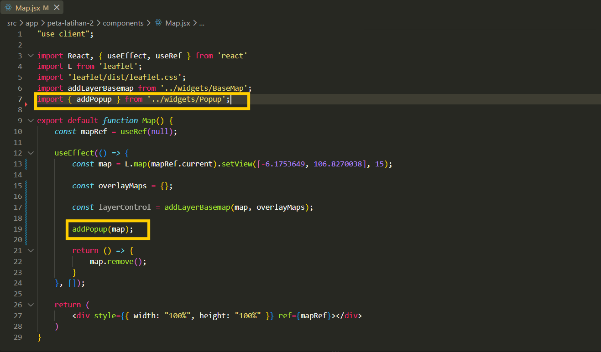
    
8. Hasil tampilan popup pada halaman peta dapat dilihat pada gambar berikut.
    
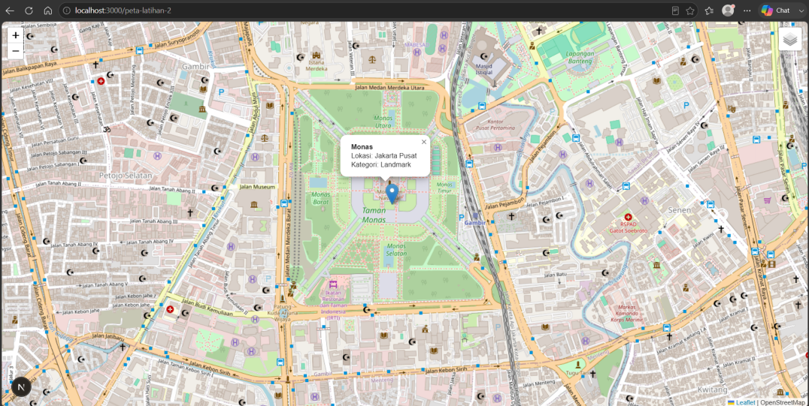
    

### **Menambahkan Legenda**

1. Tahap pertama buat **file baru** pada folder widget dengan nama **Legend.jsx** kemudian buat fungsi **addLegend** dengan parameter map untuk menambahkan legenda pada peta.
    
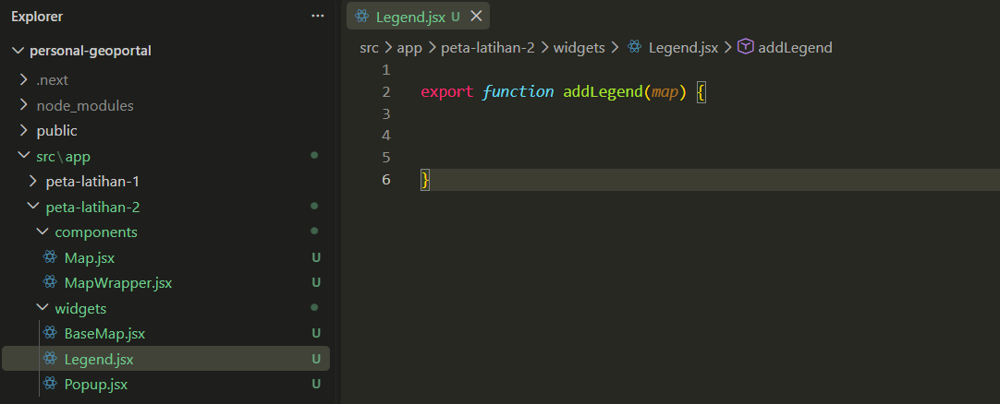
    
2. Tahap kedua buat variabel untuk menentukan posisi legenda pada peta. Pada contoh ini, legenda ditempatkan di pojok kanan bawah.
    
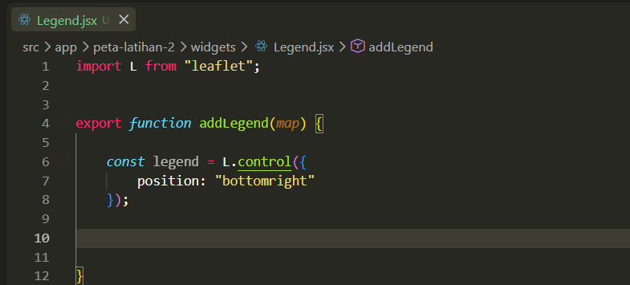
    
3. Pada tahap ketiga buat fungsi **onAdd** yang akan digunakan sebagai fungsi untuk menambahkan legenda dalam peta. Kemudian buat variabel **cons div** sebagai tempat untuk mengatur tampilan legenda.
    
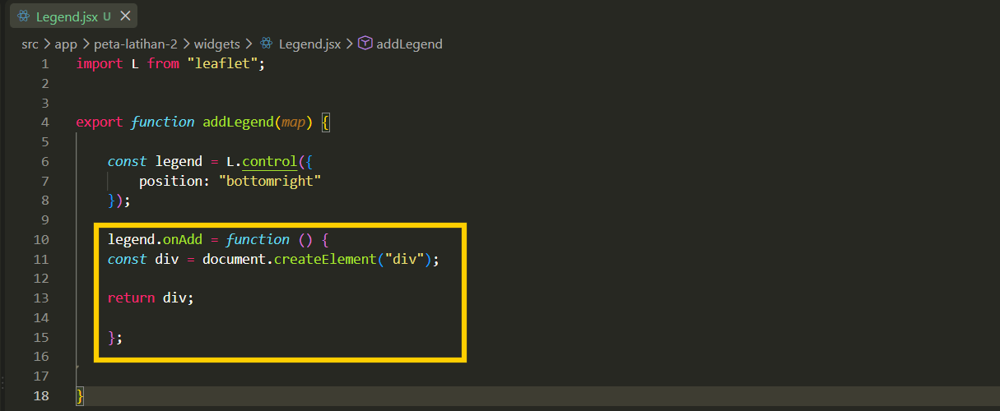
    
4. Selanjutnya pada tahap keempat buat pengaturan tampilan untuk warna dasar legenda, kemudian padding untuk mengatur jarak informasi, serta buat fungsi untuk mengatur warna tulisan.
    

    
5. Tahapan terakhir pada widget legenda yaitu buat contoh informasi yang akan ditampilkan pada legenda serta tutup fungsi legenda dengan **legend.addTo(map);** maka berikut ini hasil script legenda secara keseluruhan.
    
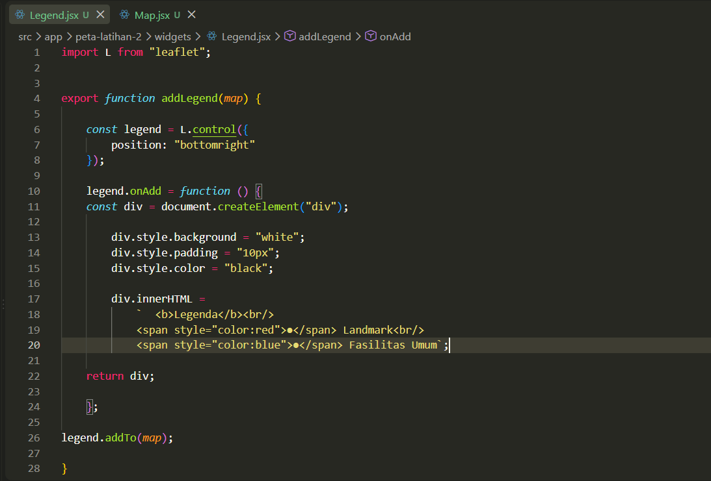
    
6. Tahap terakhir panggil legenda kedalam halaman peta dengan menambahkan **addLegend(map);** pada fungsi peta.
    
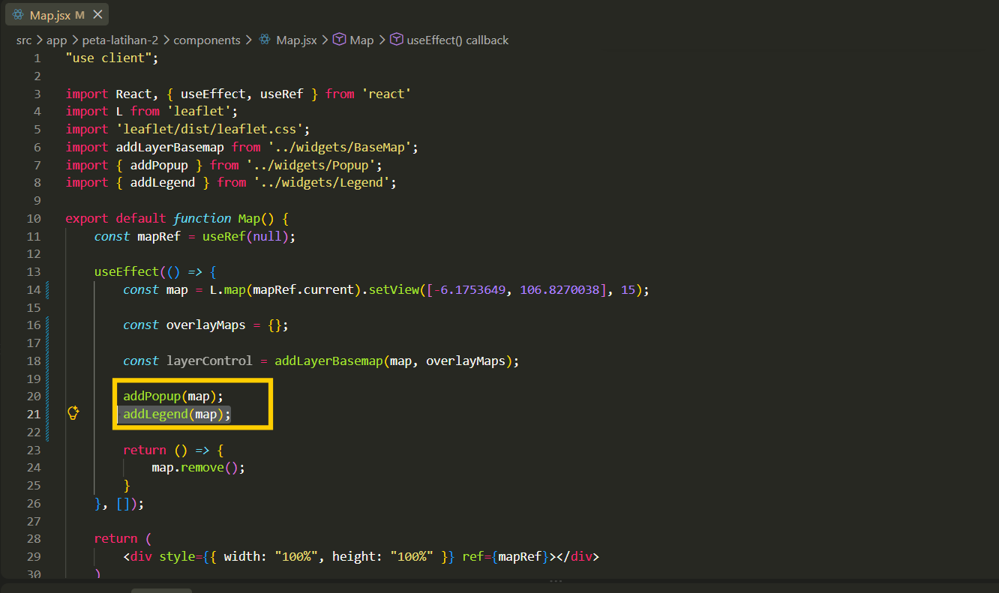
    
7. Hasil tampilan legenda pada peta dapat dilihat pada gambar berikut ini.
    

    
8. Tampilan Peta Secara Keseluruhan dengan Basemap, Popup dan Legenda.
    
