# Dasar-dasar GitHub

Halaman ini memuat konsep version control, Git, dan GitHub, lalu melanjutkan ke praktik: memasang aplikasi, membuat repositori, menyalinnya ke komputer, dan mengunggah project pengembangan web ke GitHub.

Bagian konsep menjelaskan istilah yang dipakai terus-menerus pada praktik berikutnya. Bagian praktik dikerjakan dengan aplikasi GitHub Desktop dan antarmuka web GitHub. Beberapa tahap di halaman ini juga memakai terminal, dan letaknya disebutkan pada tiap tahap.

## Apa itu Git dan GitHub

| | Penjelasan |
|---|---|
| **Git** | Sistem version control terdistribusi (Distributed Version Control System) yang berjalan lokal di komputer. Git melacak setiap perubahan pada kode/berkas dari waktu ke waktu |
| **GitHub** | Platform hosting online berbasis cloud untuk menyimpan repositori Git, sekaligus menambahkan fitur kolaborasi seperti Pull Request, Issues, dan Actions |

## Git dan GitHub Berbeda Peran

Keduanya sering disebut bersamaan, namun perannya berbeda.

| Aspek | Git | GitHub |
|---|---|---|
| Jenis | Perangkat lunak (software) version control | Layanan hosting online berbasis Git |
| Lokasi Kerja | Berjalan di komputer lokal (offline) | Berjalan di server/cloud (online) |
| Instalasi | Perlu diinstal di komputer | Diakses lewat browser atau aplikasi GitHub Desktop |
| Fitur Tambahan | Command line dasar untuk tracking perubahan | Pull Request, Issues, Actions, Project Board, Wiki |
| Alternatif Lain | Mercurial, SVN | GitLab, Bitbucket |

## Mengapa Version Control Penting

- Melacak riwayat dan perubahan setiap berkas dari waktu ke waktu
- Memungkinkan banyak orang bekerja pada proyek yang sama tanpa saling menimpa
- Memungkinkan kembali (rollback) ke versi sebelumnya jika terjadi kesalahan
- Mendukung eksperimen aman melalui branch terpisah dari kode utama

## Konsep Dasar dalam Git

| Istilah | Artinya |
|---|---|
| **Repository** | Folder proyek yang dilacak oleh Git, berisi seluruh berkas dan riwayat perubahannya |
| **Commit** | Snapshot atau catatan perubahan pada berkas, disertai pesan penjelasan |
| **Branch** | Cabang pengembangan terpisah dari kode utama untuk bereksperimen tanpa mengganggu |
| **Merge** | Proses menggabungkan perubahan dari satu branch ke branch lainnya |
| **Clone** | Menyalin repositori dari server (GitHub) ke komputer lokal |
| **Push / Pull** | Mengirim (push) perubahan lokal ke server, atau mengambil (pull) perubahan dari server |

## Tiga Area Kerja Git

Tiga area ini menggambarkan perjalanan berkas dari perubahan hingga tersimpan permanen.

| Area | Isi |
|---|---|
| **Working Directory** | Tempat berkas diedit langsung. Perubahan belum dilacak oleh Git |
| **Staging Area** | Berkas yang ditandai masuk ke commit berikutnya |
| **Repository (.git)** | Riwayat permanen setelah berkas di-commit. Tersimpan sebagai snapshot |

Perpindahan antar area terjadi lewat tiga perintah berikut.

| Perintah | Perpindahan |
|---|---|
| `git add` | Working Directory → Staging Area |
| `git commit` | Staging Area → Repository |
| `git push` | Repository lokal → Repository remote (GitHub) |

## Alur Kerja Git Dasar

Siklus umum saat bekerja dengan Git pada proyek sehari-hari.

1. **Inisialisasi / Clone.** Membuat repositori baru untuk proyek baru, atau menyalin repositori yang sudah ada.
2. **Edit & Simpan Berkas.** Melakukan perubahan pada berkas di working directory seperti biasa.
3. **Staging.** Menandai berkas yang siap dimasukkan ke commit.
4. **Commit.** Menyimpan snapshot perubahan secara permanen, disertai pesan.
5. **Push ke GitHub.** Mengirim commit dari lokal ke repositori remote.

Bentuk perintah baris dari alur tersebut ada pada tabel [Perintah Git yang Sering Digunakan](#perintah-git-yang-sering-digunakan). Pada pelatihan ini seluruh langkah itu dikerjakan lewat GitHub Desktop, sehingga perintahnya tidak perlu diketik.

## Branching dan Merging

Branch memungkinkan pengembangan fitur baru dilakukan secara terpisah dari kode utama (biasanya bernama `main` atau `master`), sehingga kode utama tetap stabil selama proses pengembangan berlangsung.

| Perintah | Kegunaan |
|---|---|
| `git branch <nama>` | Membuat branch baru |
| `git checkout -b <nama>` | Membuat sekaligus berpindah ke branch baru |
| `git checkout main` | Berpindah kembali ke branch `main` |
| `git merge <nama>` | Menggabungkan branch ke branch aktif saat ini |

## Kolaborasi di GitHub

| Fitur | Kegunaan |
|---|---|
| **Fork** | Menyalin repositori orang lain ke akun sendiri untuk dimodifikasi secara independen |
| **Clone** | Mengunduh salinan repositori (milik sendiri atau hasil fork) ke komputer lokal |
| **Pull Request (PR)** | Permintaan untuk menggabungkan perubahan dari branch/fork ke repositori asal, disertai proses review |
| **Issues** | Fitur untuk melaporkan bug, mengajukan fitur baru, atau mendiskusikan pekerjaan pada proyek |

### Alur Kolaborasi Tim via Pull Request

Pola umum kontribusi pada proyek open-source maupun tim internal.

1. **Fork/Clone Repo.** Salin repositori ke akun atau ke komputer lokal.
2. **Buat Branch Baru.** Kerjakan fitur di branch terpisah.
3. **Commit & Push.** Simpan lalu unggah perubahan.
4. **Buka Pull Request.** Ajukan penggabungan ke branch utama.
5. **Review & Merge.** Tim memeriksa lalu menggabungkan kode.

Pola ini menjaga branch utama (`main`) tetap stabil karena setiap perubahan diperiksa sebelum digabungkan.

## Perintah Git yang Sering Digunakan

Referensi cepat perintah dasar untuk aktivitas sehari-hari. Pada pelatihan ini perintah tersebut tidak perlu diketik, karena pekerjaan repositori dikerjakan lewat GitHub Desktop.

| Perintah | Kegunaan |
|---|---|
| `git init` | Membuat repositori Git baru di folder saat ini |
| `git clone <url>` | Menyalin repositori dari GitHub ke komputer lokal |
| `git status` | Melihat status perubahan berkas saat ini |
| `git add <file>` | Menambahkan berkas ke staging area |
| `git commit -m "pesan"` | Menyimpan perubahan sebagai snapshot baru |
| `git push` | Mengirim commit ke repositori remote |
| `git pull` | Mengambil dan menggabungkan perubahan dari remote |
| `git log` | Melihat riwayat commit |

## Praktik Baik Menggunakan Git

- **Commit Kecil & Sering.** Pisahkan perubahan besar menjadi beberapa commit kecil yang fokus pada satu perubahan.
- **Pesan Commit Jelas.** Tulis pesan commit yang menjelaskan "apa" dan "mengapa", bukan sekadar "update".
- **Gunakan `.gitignore`.** Kecualikan berkas yang tidak perlu dilacak, misalnya `node_modules` dan berkas konfigurasi lokal.
- **Pull Sebelum Push.** Selalu tarik perubahan terbaru sebelum mengirim perubahan sendiri untuk menghindari konflik.

## Praktik 4: Instalasi Git dan Node.js

Bagian ini dan bagian berikutnya adalah praktik. Langkah 1 sampai 3 dikerjakan di browser dan di Windows PowerShell.

### Langkah 1. Unduh dan pasang Git

Dikerjakan di: browser, lalu installer di komputer.

Unduh Git melalui tautan [https://git-scm.com/](https://git-scm.com/) untuk mengelola repositori project, kemudian lakukan proses instalasi Git tersebut.

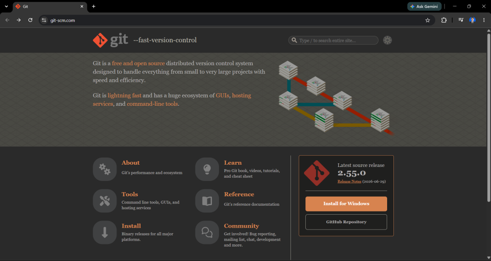

### Langkah 2. Unduh dan pasang Node.js

Dikerjakan di: browser, lalu installer di komputer.

Instal Node.js yang akan digunakan sebagai package manager untuk melakukan pemrograman menggunakan Javascript, Next.js, Angular, serta bahasa pemrograman Javascript lainnya. Node.js dapat diunduh pada tautan [https://nodejs.org/en/download](https://nodejs.org/en/download).

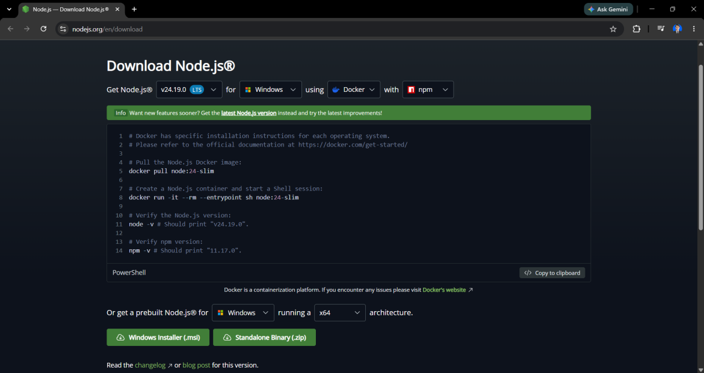

### Langkah 3. Periksa hasil instalasi

Dikerjakan di: Windows PowerShell.

Setelah proses instalasi Git dan Node.js selesai, periksa apakah keduanya sudah terpasang pada perangkat yang digunakan. Buka Windows PowerShell, lalu ketik dua perintah berikut.

```text
git version
node --version
```

Perintah `git version` menampilkan versi Git yang terpasang, sedangkan `node --version` menampilkan versi Node.js.

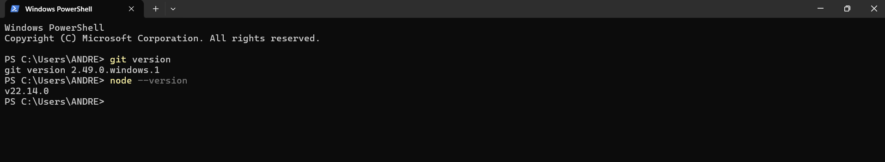

## Membuat Repositori GitHub

Dikerjakan di: browser.

### Langkah 4. Buka web GitHub

Buka web GitHub melalui tautan [https://github.com/](https://github.com/). Apabila belum memiliki akun, lakukan registrasi untuk membuat akun GitHub terlebih dahulu.

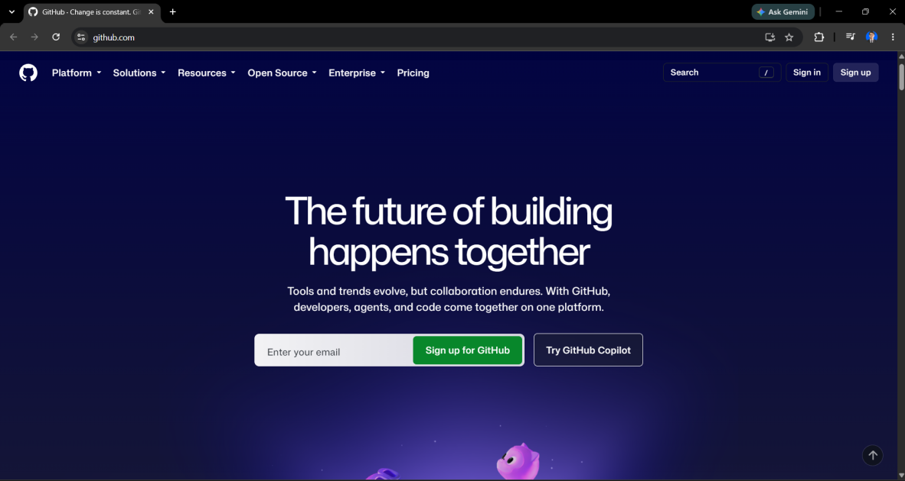

### Langkah 5. Klik tombol New

Setelah login pada GitHub, buat repositori baru sebagai tempat penyimpanan project dengan mengklik tombol **New**.

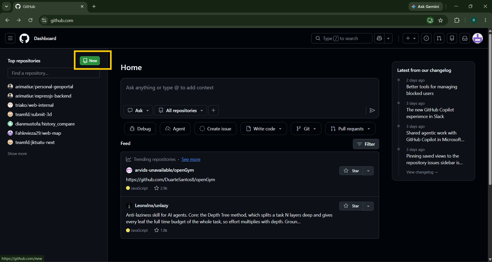

### Langkah 6. Isi halaman New

Pada halaman **New**, isi nama project yang akan dibuat, klik tombol **Add README**, kemudian klik **Create repository**.

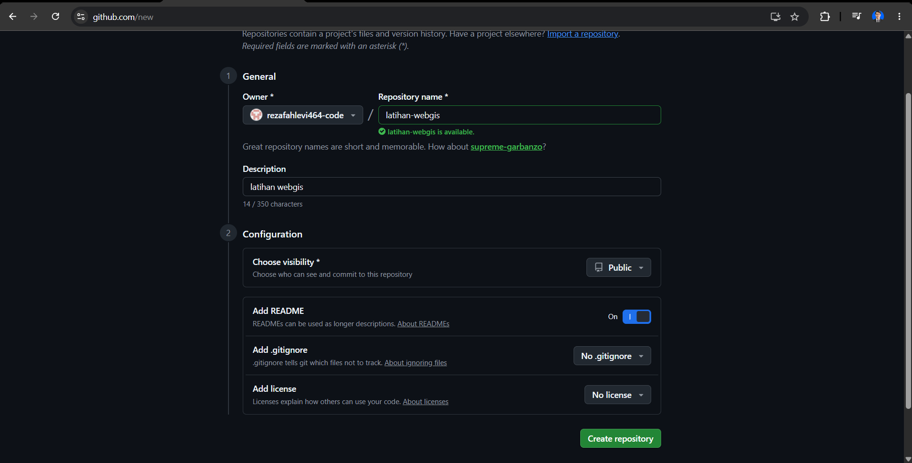

::: tip Add README memberi berkas awal
Bila **Add README** tidak diaktifkan, repositori terbentuk tanpa berkas sama sekali. Halaman repositori kosong menampilkan panduan pengunggahan, bukan daftar berkas.
:::

### Hasil. Tampilan awal repositori

Berikut tampilan awal project GitHub yang telah dibuat.

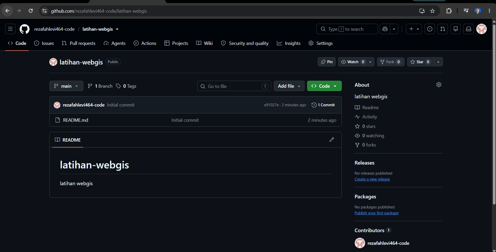

## Cloning Repositori GitHub

Dikerjakan di: browser, File Explorer, dan Git Bash.

### Langkah 7. Salin URL repositori

Pada halaman repositori, klik **Code**, kemudian salin URL yang terdapat dalam repositori GitHub tersebut.

### Langkah 8. Buka Git Bash pada folder tujuan

Pilih folder yang akan menjadi tempat penyimpanan repositori. Pada folder tersebut klik kanan, lalu pilih **gitbash**.

### Langkah 9. Jalankan git clone

Pada tampilan gitbash, ketik perintah `git clone`, kemudian klik kanan untuk paste URL repositori GitHub, lalu klik enter.

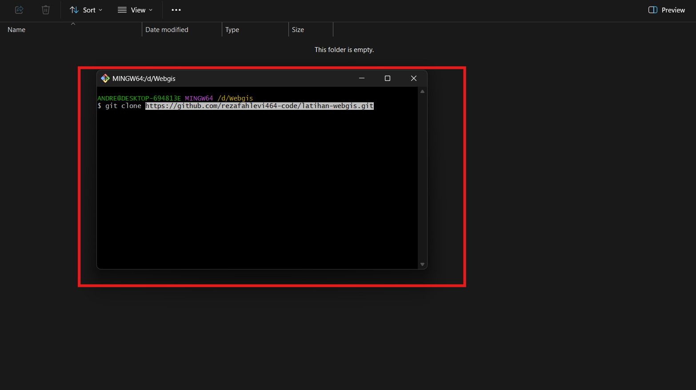

::: warning Jalankan dari folder yang benar
gitbash dibuka dari folder tujuan, dan folder itu menjadi lokasi salinan repositori. Bila gitbash dibuka dari lokasi lain, salinannya masuk ke lokasi tersebut.
:::

### Langkah 10. Periksa hasil clone

Hasilnya repositori GitHub dapat tersalin pada perangkat peserta seperti pada gambar berikut ini.

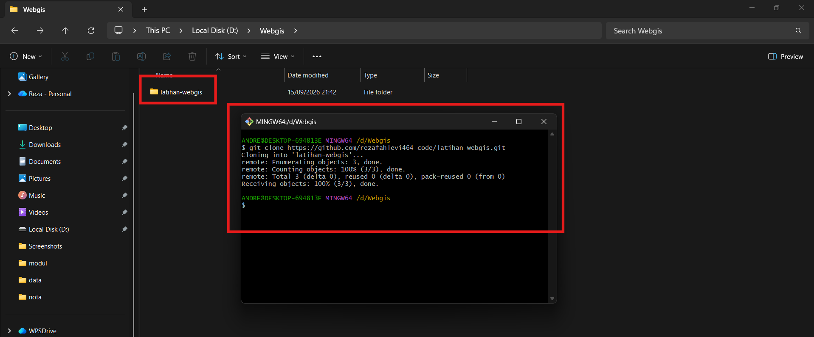

## Mengunggah Project Pengembangan Web ke GitHub

Dikerjakan di: File Explorer, Visual Studio Code, dan terminal di dalam Visual Studio Code.

Bagian ini memindahkan isi project framework Next.js yang sudah dibuat sebelumnya ke dalam folder repositori, lalu mengirimkannya ke GitHub.

### Langkah 11. Salin isi project ke folder repositori

Salin isi project framework Next.js yang telah dibuat sebelumnya ke dalam folder project GitHub.

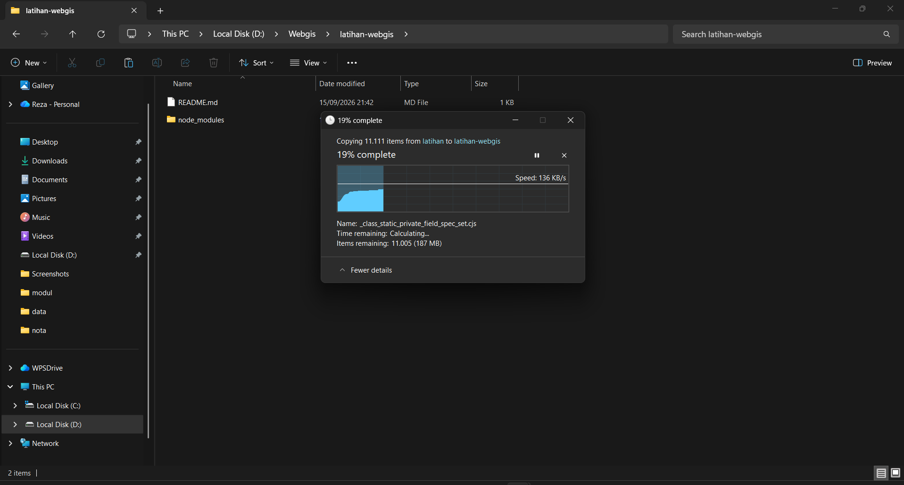

Berikut ini hasil salinan isi folder project dengan framework Next.js ke dalam folder repositori.

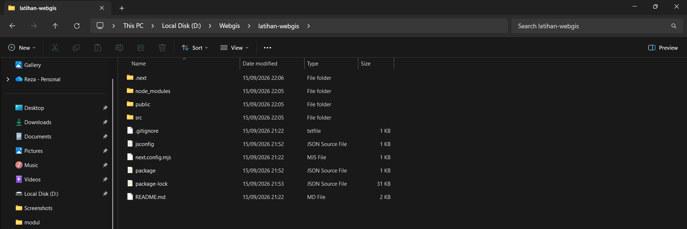

### Langkah 12. Buka folder di Visual Studio Code

Buka Visual Studio Code, kemudian buka folder repositori GitHub tersebut.

### Langkah 13. Periksa berkas baru pada Source Control

Pada **Source Control** dapat dilihat bahwa ada berkas baru yang belum diunggah ke GitHub, yang merupakan hasil menyalin berkas-berkas yang terdapat dalam folder framework.

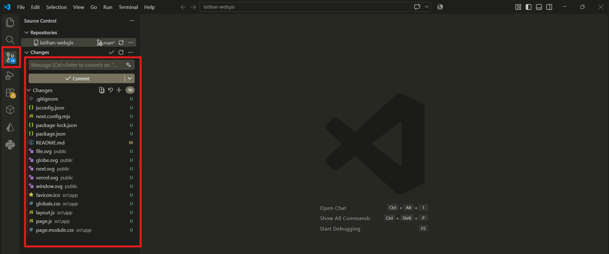

### Langkah 14. Tambahkan dan simpan perubahan

Buka terminal, kemudian masukkan perintah berikut satu per satu.

```text
git add .
git commit -m "push pertama"
git push
```

Klik enter setelah tiap perintah. Perintah `git commit -m "push pertama"` memakai pesan `push pertama` seperti pada modul. Gantilah pesan itu dengan keterangan singkat tentang isi perubahan bila perlu.

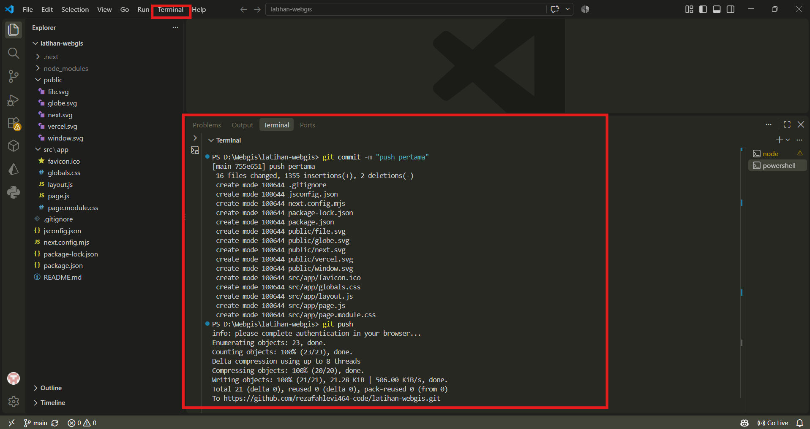

::: warning `git add .` menambahkan seluruh berkas
Titik pada `git add .` berarti seluruh berkas di folder itu ikut ditandai, termasuk `node_modules` bila tidak dikecualikan. Pastikan `.gitignore` sudah ada sebelum menjalankannya.
:::

### Langkah 15. Periksa hasil push di GitHub

Hasil project yang telah di-push ke GitHub dapat dilihat pada gambar berikut ini.

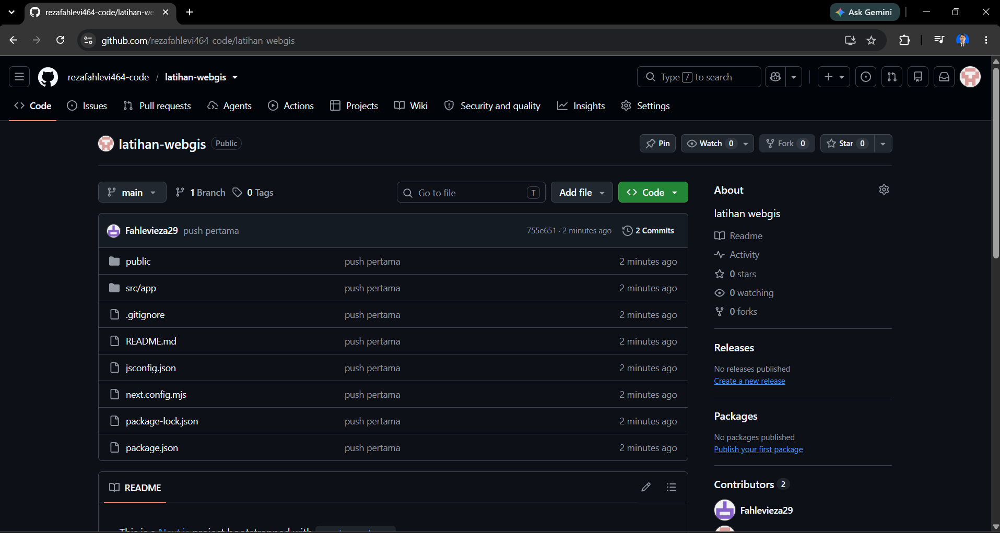

## Setelah Halaman Ini

Arus kerja pada halaman ini memakai gitbash dan terminal Visual Studio Code seperti pada modul. Pada praktik berikutnya, seluruh pekerjaan repositori dikerjakan lewat aplikasi **GitHub Desktop**, mulai dari clone, menyimpan perubahan, sampai mengirimkannya ke GitHub. Perintah `git` tidak perlu diketik.

Berkas yang dihasilkan halaman ini dipakai lagi pada halaman [Persiapan dan Konfigurasi Framework](/hari-1/praktik-3/konfigurasi-framework).
