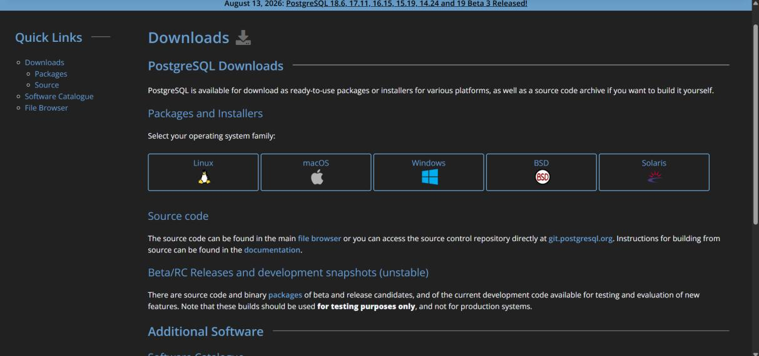
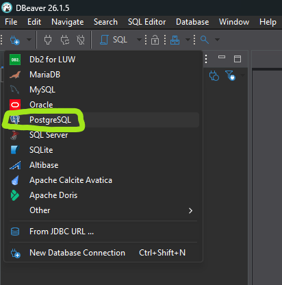
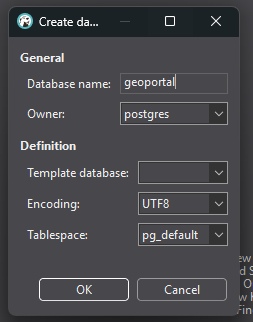
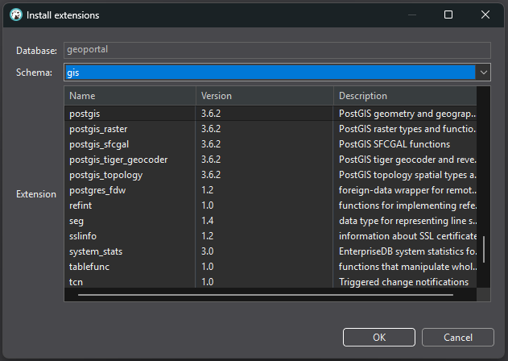
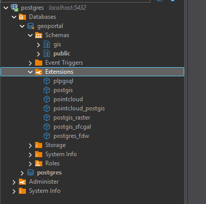
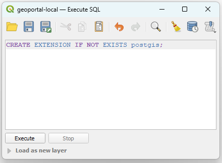
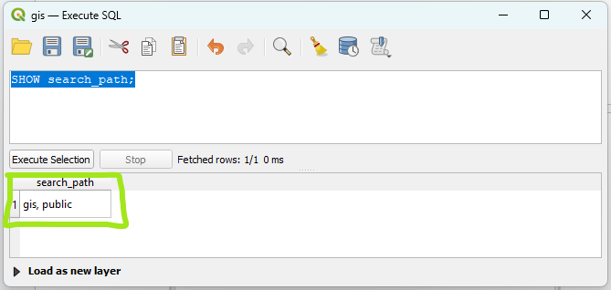

# Instalasi dan Konfigurasi Basis Data Local

## **Instalasi dan Konfigurasi Basis Data**

1. Buka tautan [https://www.postgresql.org/](https://www.postgresql.org/) kemudian klik menu download lalu pilih sesuai dengan sistem operasi yang digunakan oleh pengguna.
    

    
2. Tahapan berikutnya lakukan proses instalasi postgresql berdasarkan hasil yang telah diunduh pada perangkat.
    

    
3. Setelah tahapan instalasi selesai maka akan muncul tampilan untuk stackbuilder kemudian pilih Postgresql 18 (x64).
    

    
4. Selanjutnya pilih menu instalasi exstensi untuk mendukung penyimpanan data dalam bentuk spasial dengan memilih library postgis.
    

    
5. Setelah tahapan instalasi selesai,buka pgadmin untuk melihat tampilan dari Postgresql yang telah terpasang pada perangkat pengguna.
    

    
6. Buka tautan [https://dbeaver.io/](https://dbeaver.io/) download Dbeaver Community version.
    

    

    
7. Setelah download install dengan konfigurasi default, setelah itu buka aplikasi Dbeaver, buat koneksi baru ke database PostgreSQL yang baru diinstall
    

    

    
8. Jika sudah connect expand connection di list connections kemudian klik kanan di database lalu klik Create New Database beri nama database dengan nama aplikasi yang akan kita buat lalu OK

    ```sql
    CREATE DATABASE geoportal;
    ```
    

    

    
9. Setelah database dibuat expand Schemas akan ada schema bernama public buat schema baru bernama gis dengan cara klik kanan Create New Schema di Schemas

    ```sql
    CREATE SCHEMA IF NOT EXISTS gis;
    ```
    - Schema public => berfungsi untuk menyimpan data non spasial (tabel user, tabel katalog data, tabel role dll)
    - Schema gis => berfungsi untuk menyimpan data spasial (feature geometry, raster)
    

    

    
10. Setelah schema gis dibuat, install extension PostGIS di schema ini, di dalam database terdapat folder Extensions, folder ini berisi list Extension apa saja yang terinstall saat ini PostGIS belum ada di list tersebut oleh karena itu tambahkan PostGIS extension dan extension pendukung PostGIS lainnya

    ```sql
    CREATE EXTENSION IF NOT EXISTS postgis SCHEMA gis;
    ```
    

    

    

    
11. Jika sudah close Dbeaver kemudian buka QGIS. Pada panel browser klik kanan di PostgreSQL kemudian klik New Connection
    

    
12. Untuk connection details isikan seperti ini lalu test connection jika berhasil klik OK
    

    
13. Berikut adalah tampilan awal database kosong yang sudah terkoneksi di QGIS
    

    
14. Saat ini extension postgis sudah ada di database tetapi belum diaktifkan klik kanan pada geoportal-local lalu klik Execute SQL
    

    
15. Lalu masukan perintah SQL berikut lalu execute, pastikan perintah terakhir memberi response **gis, public**
    
    ```jsx
    CREATE EXTENSION IF NOT EXISTS postgis;
    
    ALTER DATABASE geoportal SET search_path TO gis, public;
    
    SHOW search_path;
    ```




    

    
::: warning `ALTER DATABASE` bekerja di PostgreSQL lokal, tidak di Supabase
Perintah `ALTER DATABASE ... SET search_path` di atas bekerja pada PostgreSQL yang Anda pasang sendiri, karena Anda memegang hak penuh atas servernya.

Di Supabase, perintah yang sama **tidak berpengaruh**. Penyebabnya, Supabase menyediakan koneksi lewat pooler, dan pooler menetapkan `search_path` pada tingkat koneksi sehingga menimpa nilai tingkat database. Karena itu pada [Google Cloud Platform](/hari-3/deployment-project/google-cloud-platform) tabel non spasial diletakkan di schema `public`, sedangkan tabel spasial di schema `gis` dan datastore GeoServer diarahkan ke schema itu.
:::

16. Setelah SQL expression di atas di execute QGIS masih menyimpan konfigurasi lama sebelum SQL expression dijalankan, oleh karena itu harus re-connect database nya, remove connection database kemudian connect lagi
    

    

    
17. Pada database gis klik kanan kemudian klik New Table untuk membuat Layer Baru
    

    
18. Konfigurasikan Layer sesuai kebutuhan lalu OK
    

    
19. Layer sudah terbuat, tambahkan layer ke project agar muncul di panel Layers, tambahkan juga basemap OSM supaya bisa zoom in ke tempat yang diinginkan
    

    

    
20. Aktifkan toggle editing dan isi layer dengan data secukupnya kemudian save
    

    
