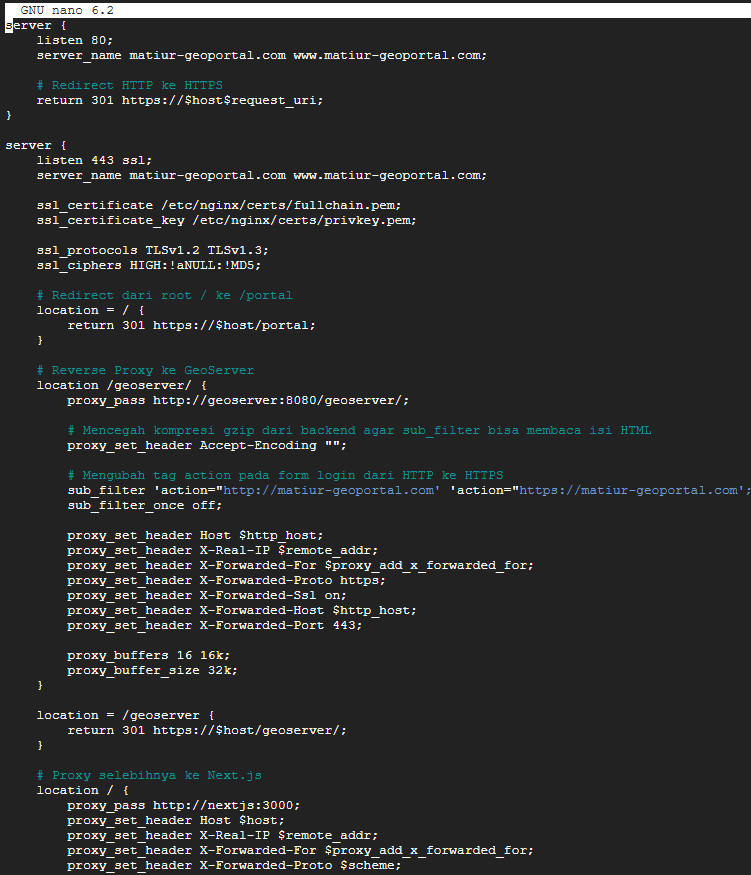
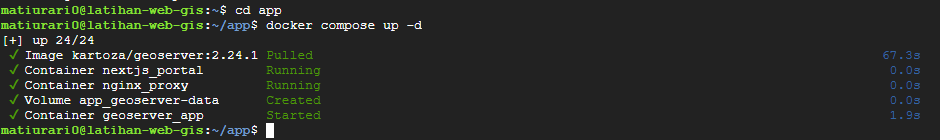

# Instalasi Geoserver di VM

## **Instalasi Geoserver di VM**

::: warning Halaman ini memerlukan VM dan repositori dari Hari 3
Halaman ini mengandaikan dua hal yang sudah siap:

1. **VM dari Deployment Project**, pada [Tahap 6 halaman Google Cloud Platform](/hari-3/deployment-project/google-cloud-platform).
2. **Repositori peserta sudah di-clone ke VM**, pada folder `/opt/webgis/app`. Folder itu memuat `docker-compose.yml` dan `nginx.conf` yang diperbarui di halaman ini.

Bila VM belum siap, GeoServer masih dapat dicoba di laptop dengan menjalankan container GeoServer saja. Namun langkah pada halaman ini menyebut `/opt/webgis/app`, sehingga perintahnya perlu disesuaikan.
:::

1. Koneksi VM lewat SSH lalu perbarui docker-compose.yml
    

    
2. Buka docker-compose.yml dengan cara
    
    ```bash
    cd /opt/webgis/app
    nano docker-compose.yml
    ```
    
    Perbarui docker-compose.yml menjadi seperti ini, kemudian Save
    

    
3. Selanjutnya perbarui juga nginx.conf menjadi seperti berikut
    
    ```bash
    nano nginx.conf
    ```




    
4. Kemudian jalankan perintah berikut ini dari dalam folder app
    
    ```bash
    docker compose up -d
    ```



5. Kemudian jalankan perintah berikut ini untuk melihat logs boot geoserver. Boot sudah selesai jika muncul Server startup in [44757] miliseconds
    
    ```bash
    docker logs -f geoserver_app
    ```


6. Buka web anda tambahkan /geoserver untuk basepath nya maka anda akan diarahkan ke halaman geoserver. Login dengan username (admin) dan password (geoserver) bawaan.
    

    
7. Ganti password bawaan supaya geoserver anda aman. Pergi ke menu Users, Groups, Roles
    

    
8. Pergi ke Users/Groups kemudian klik Username admin kemudian ganti password dan Save
    

    
