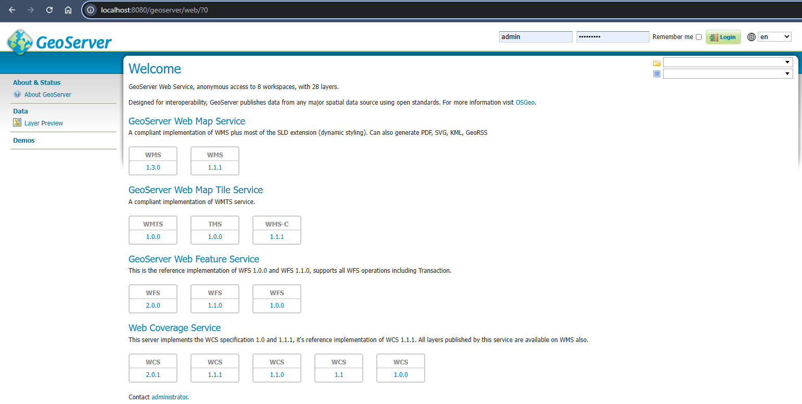
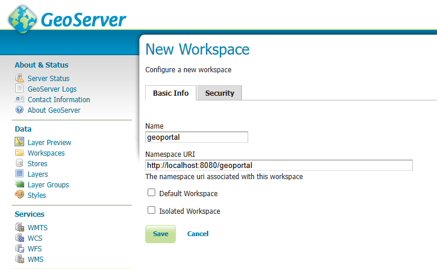
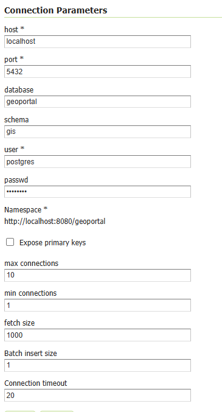
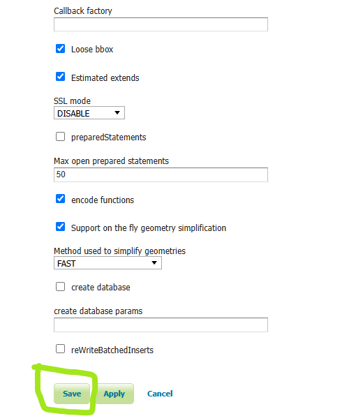
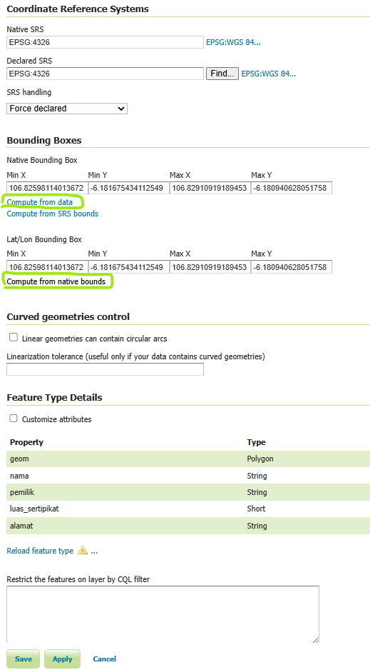
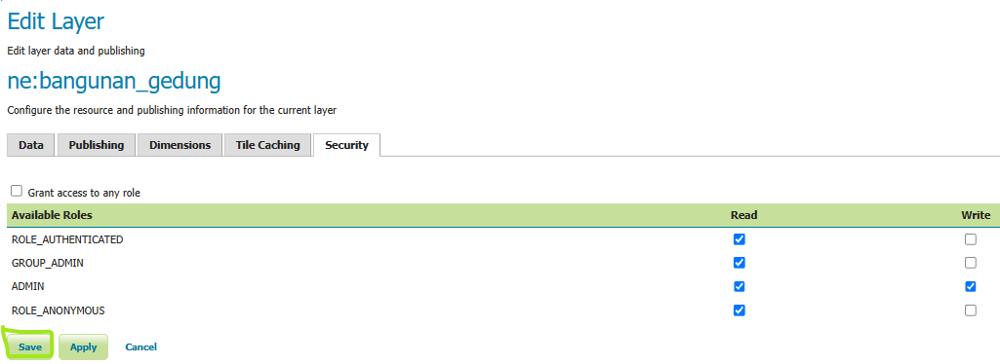
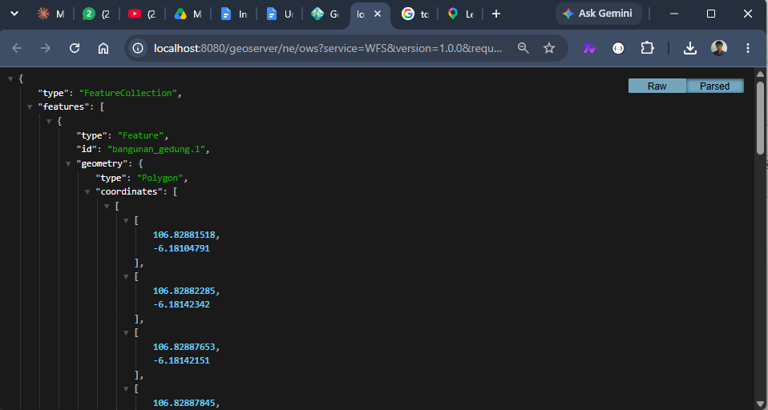

# Koneksi PostgreSQL ke Geoserver sebagai Data Store dan Publish Layer

## **Koneksi PostgreSQL ke Geoserver sebagai Data Store dan Publish Layer**

1. Jalankan Geoserver, setelah dijalankan buka browser dan jalankan [http://localhost:8080/geoserver/web/?0](http://localhost:8080/geoserver/web/?0)

    ```text
    http://localhost:8080/geoserver/web
    ```
    

    

    
2. Login sebagai admin dan masukan password yang dibuat saat instalasi, setelah itu klik Workspaces yang ada di menu sebelah kiri lalu buat workspace baru
    

    

    
3. Berikan nama workspace kemudian untuk Namespace URI ketik domain Geoserver saat ini diikuti dengan nama workspace.

    ```text
    Nama workspace : geoportal
    Namespace URI  : http://localhost:8080/geoserver/geoportal
    ```
    

    

    
4. Klik Stores dan buat Stores baru lalu pilih PostGIS untuk type of data source
    

    

    

    
5. Pilih workspace yang sudah dibuat kemudian masukan koneksi sesuai dengan koneksi PostgreSQL anda

    ```text
    host     : localhost
    port     : 5432
    database : geoportal
    schema   : gis
    user     : postgres
    password : kata sandi PostgreSQL Anda
    ```
    

    

    

    
6. Setelah save data store, geoserver akan mendeteksi layer apa saja yang ada di dalam PostgreSQL, klik Publish pada data yang ingin di Publish
    

    
7. Pada bagian edit layer gunakan saja semua opsi default tetapi untuk Bounding Boxes klik compute from data lalu Save
    

    

    
8. Halaman akan berpindah ke halaman Layers dan data kita sudah berada di layer list tersebut
    

    
9. Klik layer yang sudah kita buat lalu akan berpindah ke halaman edit layer, klik menu tab Security. Atur hak akses layer ini sesuai kebutuhan, berikut adalah contoh jika saya ingin data bisa dilihat publik tetapi edit hanya bisa dilakukan oleh admin, setelah itu Save
    

    
10. Buka menu Layers Preview, kemudian pilih layer yang sudah dipublish lalu buka format GeoJSON, maka akan terbuka tab baru di browser menunjukan data GeoJSON

    ```text
    http://localhost:8080/geoserver/geoportal/ows?service=WMS&version=1.1.0&request=GetMap&layers=geoportal:nama_layer&bbox=-180,-90,180,90&width=768&height=330&srs=EPSG:4326&format=application/openlayers
    ```
    

    

    

    
11. Buka browser dalam Incognito mode, copy url GeoJSON lalu buka di Incognito, layer akan terbuka tanpa muncul permintaan login karena layer sudah diberikan akses publik
    
