# Impor dan Pengelolaan Aset 3D dan 3D Tiles

## **Pembuatan Akun Cesium**

1. Buka tautan halaman cesium melalui [https://ion.cesium.com/signin/](https://ion.cesium.com/signin/) kemudian buat akun terlebih dahlu, jika sudah memiliki akun klik **sign in.**
    
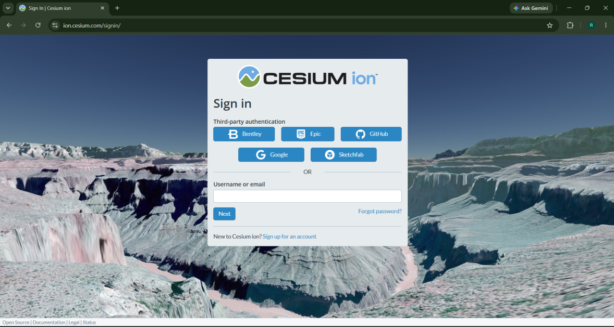
    
2. Berikut in merupakan tampilan awal halaman cesium. Tahap berikutnya buka menu **access token** yang akan digunakan untuk mendapatkan token cesium untuk proses pengembangan kedepannya.
    
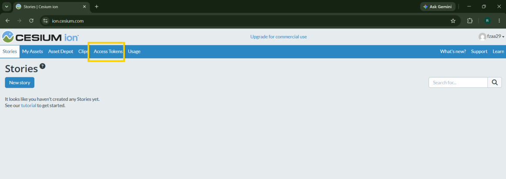
    
3. Tahap berikutnya klik C**reate token** lalu input **name** dan pilih **expiration** untuk menentukan berapa lama token ini dapat digunakan, lalu klik **create**.
    
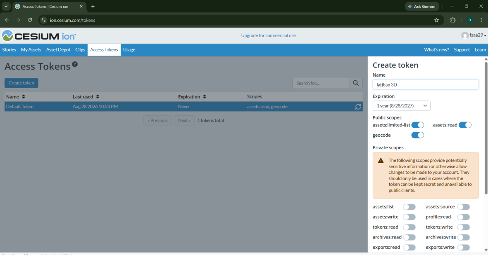
    
4. Berikut ini merupakan hasil token yang sudah dibuat, kemudian simpan token ini dan gunakan pada pengembangan web cesium ditahap berikutnya.
    

    

## **Menambahkan Model 3D ke Peta CesiumJS**

1. Pada tahap pertama buat file baru didalam folder **components** dengan nama **addModel3D.jsx**.
    
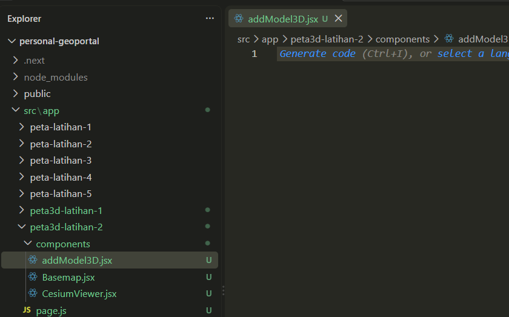
    
2. Tahap kedua buat fungsi addModel3D yang digunakan untuk menambahkan dan mengatur model 3D pada Cesium Viewer. Kemudian tambahkan parameter berupa **viewer** dan **opsi**.
    
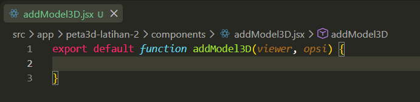
    
3. Tahap ketiga didalam fungsi tersebut, buat variabel **const Cesium = window.Cesium;** yang digunakan untuk mengambil library Cesium yang telah dimuat pada browser.
    

    
4. Kemudian pada tahap keempat buat fungsi untuk mengambil data konfigurasi model 3D dari parameter opsi, seperti lokasi file model, koordinat, ketinggian, skala, arah hadap, dan nama model, sekaligus menetapkan nilai bawaan apabila beberapa konfigurasi tidak diberikan.
    
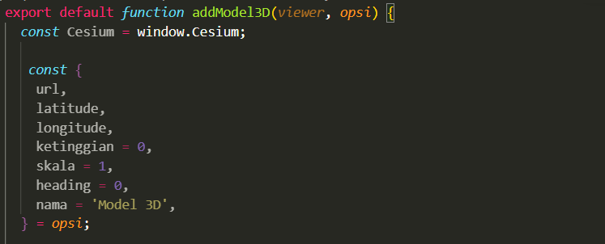
    
5. Selanjutnya pada tahap kelima, buat fungsi untuk posisi model berdasarkan koordinat geografis dengan merubah menjadi koordinat kartersian menggunakan fungsi **Cesium.Cartesian3.fromDegrees()** untuk mengubah koordinat longitude, latitude, dan ketinggian menjadi posisi yang dapat digunakan untuk menempatkan model pada peta 3D.
    
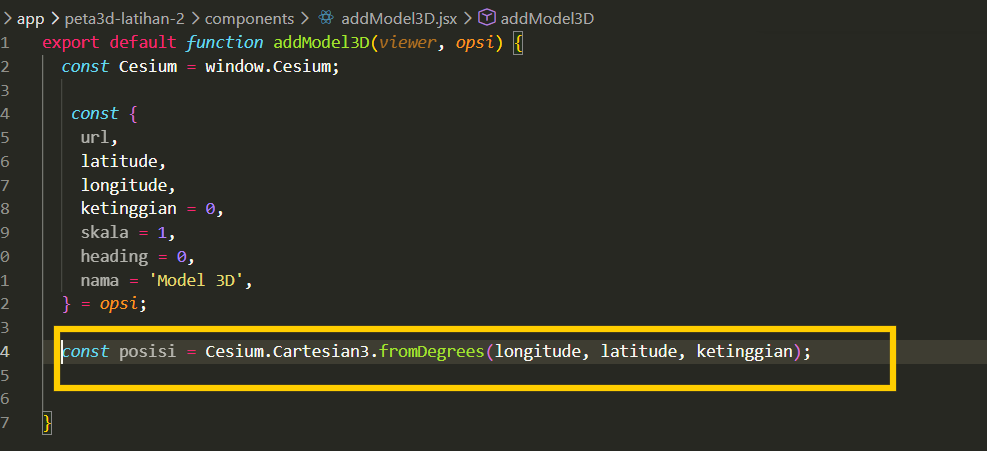
    
6. Pada tahap keenam buat fungsi untuk membuat pengaturan orientasi atau arah model 3D agar posisi hadap model dapat ditentukan pada peta.
    
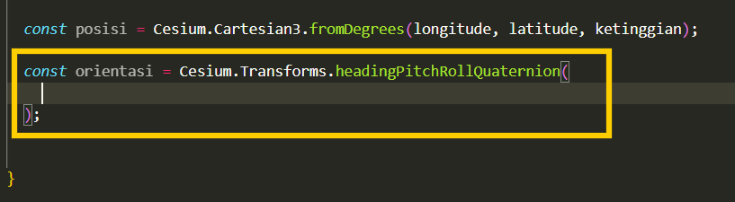
    
7. Selanjutnya pada tahap ketujuh didalam fungsi sebelumnya yaitu fungsi **Cesium.Transforms.headingPitchRollQuaternion** tambahkan parameter untuk menentukan posisi dan arah hadap model 3D berdasarkan lokasi model serta nilai heading yang telah diatur sebelumnya.
    

    
8. Pada tahap kedelapan buat fungsi berupa **return viewer.entities.add** untuk menambahkan objek atau model 3D ke dalam Cesium Viewer agar dapat ditampilkan pada peta 3D.
    
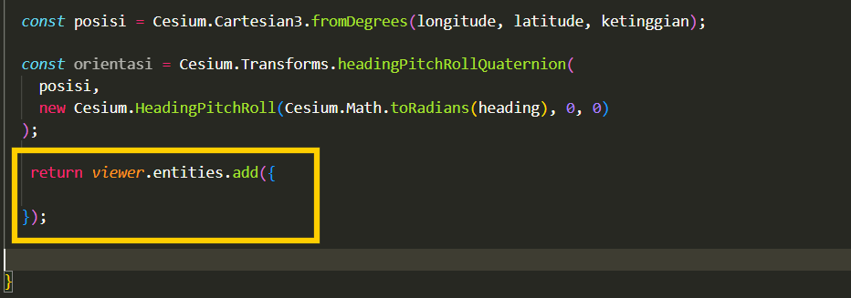
    
9. Tahap terakhir, pada fungsi kedelapan tambahkan parameter untuk melakukan konfigurasi properti model 3D yang digunakan untuk mengatur nama, posisi, arah hadap, tampilan, lokasi file, ukuran, dan ukuran minimum model saat ditampilkan pada Cesium Viewer.
    
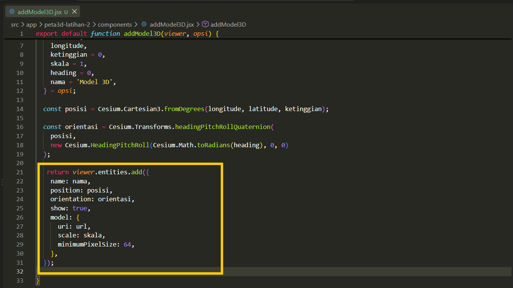
    

### addModel3D.jsx, kode lengkap

```jsx
export default function addModel3D(viewer, opsi) {
  const Cesium = window.Cesium;

   const {
    url,
    latitude,
    longitude,
    ketinggian = 0,
    skala = 1,
    heading = 0,
    nama = 'Model 3D',
  } = opsi;

  const posisi = Cesium.Cartesian3.fromDegrees(longitude, latitude, ketinggian);  

  const orientasi = Cesium.Transforms.headingPitchRollQuaternion(
    posisi,
    new Cesium.HeadingPitchRoll(Cesium.Math.toRadians(heading), 0, 0)
  );

   return viewer.entities.add({
    name: nama,
    position: posisi,
    orientation: orientasi,
    show: true,
    model: {
      uri: url,
      scale: skala,
      minimumPixelSize: 64,
    },
  });

}
```

## **Menambahkan Model 3D Tiles ke Peta CesiumJS**

1. Tahap pertama buat file baru pada folder **components** dengan nama **ad3DTileset.jsx** untuk menambahkan data 3D Tiles ke dalam Cesium Viewer. Selanjutnya tambahkan parameter **viewer, opsi** dan **selesai.**
    

    
2. Selanjutnya buat fungsi **const Cesium = window.Cesium;** yang digunakan untuk mengambil library Cesium yang telah dimuat pada browser.
    

    
3. Pada tahap ketiga buat fungsi untuk mengambil konfigurasi 3D tiles berupa URL, Asset ID, nama layer, dan pengaturan zoom otomatis dari parameter opsi.
    

    
4. Selanjutnya pada tahap kelima buat variabel **let proses;** yang digunakan untuk menyimpan proses pemuatan data 3D Tiles sebelum hasilnya ditampilkan.
    
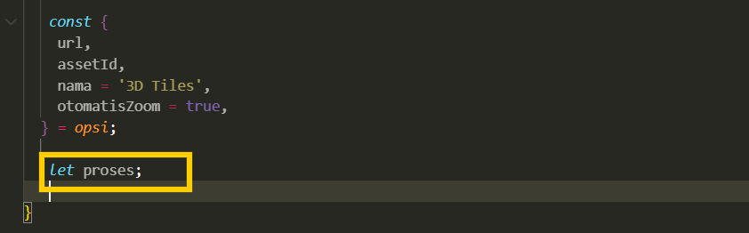
    
5. Pada tahap keenam buat kondisi menggunakan **if** untuk memeriksa apakah terdapat **assetId**, kemudian memuat data 3D Tiles dari Cesium ion menggunakan Asset ID yang telah diberikan.
    

    
6. Selanjutnya pada tahap ketujuh buat kondisi **else if** memeriksa apakah terdapat url, kemudian memuat data 3D Tiles dari alamat URL yang telah ditentukan menggunakan **Cesium.Cesium3DTileset.fromUrl()**.
    
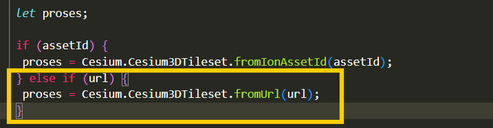
    
7. Kemudian pada tahap kedelapan buat kondisi **if (selesai)** untuk menghentikan proses pemuatan dan mengembalikan nilai null melalui fungsi selesai apabila sumber data 3D Tiles tidak tersedia.
    
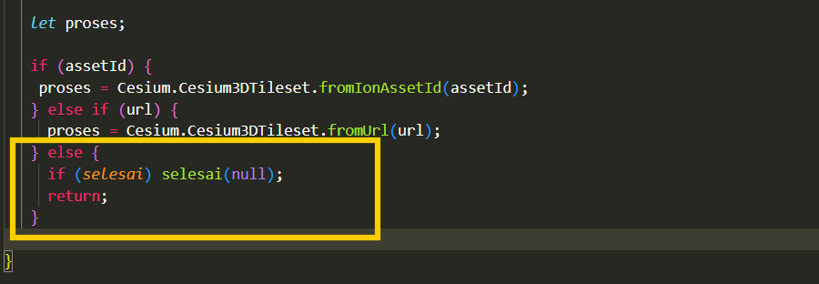
    
8. Tahap kesembilan buat fungsi untuk menjalankan proses berikutnya setelah data 3D Tiles berhasil dimuat, kemudian menerima hasil data dalam variabel tileset.
    

    
9. Selanjutnya didalam fungsi tersebut tambahkan variabel **tileset.show** untuk mengatur agar data 3D dapat diproses pada peta.
    

    
10. Selanjutnya buat fungsi untuk menambahkan data 3D Tiles ke dalam Cesium Viewer agar dapat ditampilkan pada peta.
    
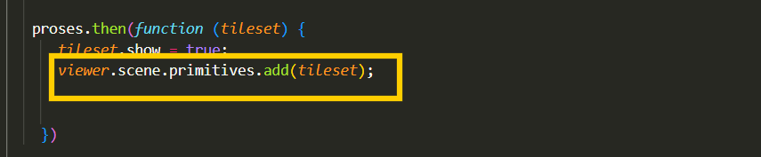
    
11. Tahap berikutnya lanjutkan dengan membuat kondisi **if (otomatisZoom)** untuk mengarahkan kamera secara otomatis ke lokasi 3D Tiles apabila fitur otomatis zoom diaktifkan.
    

    
12. Kemudian tahap terakhir buat kondisi **if (selesai)** untuk menjalankan fungsi selesai dan mengirimkan objek tileset setelah data 3D Tiles berhasil dimuat.
    

    

### add3DTileset.jsx, kode lengkap

```jsx
export default function add3DTileset(viewer, opsi, selesai) {
  const Cesium = window.Cesium;

   const {
    url,
    assetId,
    nama = '3D Tiles',
    otomatisZoom = true,
   } = opsi;
  
   let proses; 

   if (assetId) {
    proses = Cesium.Cesium3DTileset.fromIonAssetId(assetId);
   } else if (url) {
     proses = Cesium.Cesium3DTileset.fromUrl(url);
   } else {
     if (selesai) selesai(null);
     return;
   }

   proses.then(function (tileset) {
      tileset.show = true;
      viewer.scene.primitives.add(tileset);

      if (otomatisZoom) {
        viewer.zoomTo(tileset);
      }

      if (selesai) selesai(tileset); 
    })
    
}
```

## **Pembuatan Panel 3D Aset**

1. Tahap pertama buat fungsi untuk menampilkan panel layer dengan membuat fungsi **addPanelLayer3D** serta tambahkan parameter **viewer** dan **daftarLayer**.
    

    
2. Kemudian tahap kedua buat elemen **div** menggunakan JavaScript.
    

    
3. Selanjutnya pada tahap ketiga buat fungsi untuk mengatur posisi dan tampilan panel dengan menggunakan styling css meliputi **position: absolut** untuk membuat posisi panel bebas. Kemudian **top: 50px** merupakan jarak dari atas, **right: 50px** merupakan jarak dari kanan. Lalu **background: white** merupakan **Warna latar putih**, kemudian **padding** untuk memberikan jarak isi panel. Selanjutnya buat **border-radius** untuk membuat sudut panel melengkung serta **min-width** untuk menentukan lebar minimum panel.
    
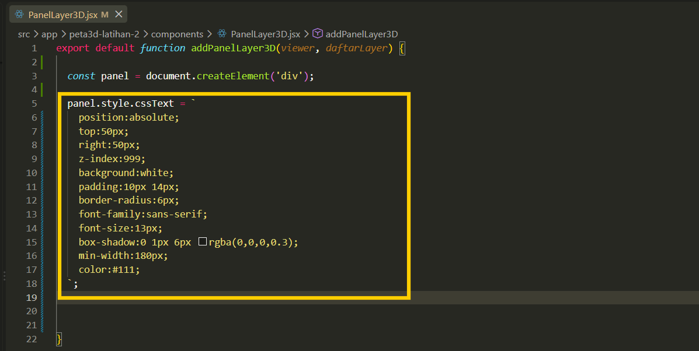
    
4. Tahap keempat buat panel menggunakan properti innerHTML. Pada tahap ini, elemen `<div>` digunakan untuk menampilkan teks "Layer 3D", kemudian diberikan styling agar judul terlihat lebih tegas dan memiliki jarak dengan daftar layer yang akan ditampilkan di bawahnya.
    

    
5. Pada tahap kelima buat fungsi untuk melakukan perulangan pada setiap data layer menggunakan Object.entries() dan forEach(), kemudian ambil nama serta objek dari masing-masing layer untuk digunakan dalam proses pembuatan kontrol layer secara otomatis.
    

    
6. Tahap ketujuh buat fungsi **if** untuk periksa terlebih dahulu apakah objek layer tersedia, kemudian jika layer tersedia buat elemen label sebagai wadah untuk menampilkan kontrol checkbox dan nama dari setiap layer.
    

    
7. Selanjutnya pada tahap kedelapan buat fungsi untuk mengatur tampilan elemen baris menggunakan css agar checkbox dan nama layer tersusun secara horizontal, sejajar, memiliki jarak antar elemen, serta memberikan tampilan yang lebih interaktif ketika pengguna mengarahkan kursor ke kontrol layer.
    

    
8. Pada tahap kesembilan buat fungsi menggunakan properti **innerHTML** untuk menambahkan isi HTML ke dalam elemen baris. Isi tersebut berupa checkbox yang digunakan untuk mengontrol visibilitas layer dan nama layer.
    

    
9. Selanjutnya tambahkan tambahkan fungsi pada checkbox untuk mengatur tampilan layer. Script **querySelector('input')** digunakan untuk memilih elemen checkbox, sedangkan **addEventListener('change')** digunakan untuk mendeteksi perubahan saat pengguna mencentang atau menghilangkan centang. Nilai **e.target.checked** kemudian digunakan untuk mengatur properti **objek.show,** sehingga layer akan ditampilkan ketika checkbox aktif dan disembunyikan ketika checkbox tidak aktif.
    
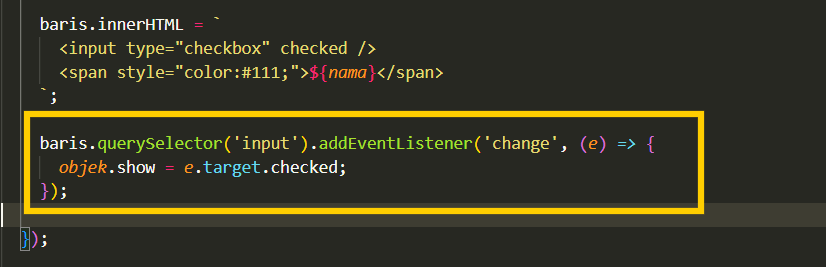
    
10. Tahap berikutnya buat fungsi untuk menambahkan kontrol layer kedalam panel dengan menggunakan **appendChild()** untuk menambahkan elemen baris yang berisi checkbox dan nama layer.
    

    
11. Pada tahap terakhir, tambahkan elemen panel ke dalam container Cesium Viewer menggunakan **appendChild().** Dengan cara ini, panel kontrol layer akan tampil di atas peta. Selanjutnya, return panel digunakan untuk mengembalikan elemen panel agar dapat digunakan kembali jika diperlukan.
    

    
12. Berikut ini keseluruhan script untuk panelLayer3D.
    

    

### PanelLayer3D.jsx, kode lengkap

```jsx
export default function addPanelLayer3D(viewer, daftarLayer) {

  const panel = document.createElement('div');

  panel.style.cssText = `
    position:absolute;
    top:50px;
    right:50px;
    z-index:999;
    background:white;
    padding:10px 14px;
    border-radius:6px;
    font-family:sans-serif;
    font-size:13px;
    box-shadow:0 1px 6px rgba(0,0,0,0.3);
    min-width:180px;
    color:#111;
  `;

  panel.innerHTML = `
    <div style="font-weight:bold;margin-bottom:8px;color:#111;">
      Layer 3D
    </div>
  `;

  Object.entries(daftarLayer).forEach(([nama, objek]) => {

    if (!objek) return;

    const baris = document.createElement('label');

    baris.style.cssText = `
      display:flex;
      align-items:center;
      gap:8px;
      margin-bottom:6px;
      cursor:pointer;
      color:#111;
    `;

    baris.innerHTML = `
      <input type="checkbox" checked />
      <span style="color:#111;">${nama}</span>
    `;

    baris.querySelector('input').addEventListener('change', (e) => {
      objek.show = e.target.checked;
    });

    panel.appendChild(baris);
  });

  viewer.container.appendChild(panel);

  return panel;
}
```

## **Pemanggilan Data 3D Dalam Peta**

1. Tahap pertama buka file **CesiumViewer.jsx** lalu tambahkan Cesium Ion Access Token dibawah **const CESIUM_STYLE_URL** dengan menggunakan token yang sebelumnya telah dibuat pada poin A.
    

    
2. Tahap kedua pada fungsi **function createViewerCesium(container) {** tambahkan Cesium Ion Access Token untuk menghubungkan aplikasi dengan layanan Cesium Ion.
    

    
3. Tahap beirkutnya dibawah fungsi **function createViewerCesium(container)** buat fungsi baru yaitu **function addContent3D(viewer)** yang digunakan sebagai wadah untuk mengatur seluruh proses penambahan data dan objek 3D ke dalam Cesium Viewer.
    
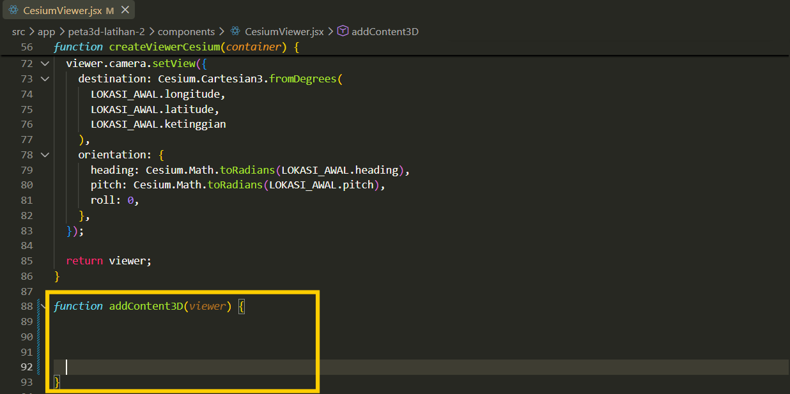
    
4. Selanjutnya tambahkan data 3D Tileset ke dalam Cesium Viewer menggunakan fungsi **add3DTileset()**, kemudian tentukan **assetId** sebagai sumber data 3D, berikan nama layer, dan atur opsi **otomatisZoom** agar kamera tidak berpindah secara otomatis saat layer dimuat.
    

    
5. Pada tahap berikutnya setelah data 3D Tileset berhasil dimuat, gunakan fungsi callback untuk menerima objek **gedung3D** sehingga objek tersebut dapat digunakan pada proses selanjutnya, seperti menambahkan model 3D atau membuat kontrol layer.
    

    
6. Selanjutnya pada **function (gedung3D)** buat fungsi untuk menambahkan model 3D berformat GLB menggunakan fungsi **addModel3D()** dengan menentukan sumber file, lokasi, ketinggian, ukuran, arah, dan nama model sebelum digunakan pada tahap berikutnya.
    

    
7. Tahap terakhir dalam **function (gedung3D)** buat fungsi **addPanelLayer3D()**, kemudian masukkan objek Gedung 3D dan model GLB ke dalam daftar layer melalui checkbox pada panel.
    

    
8. Selanjutnya pada tahap terakhir pada fungsi **useEffect(() => {if (status !== 'siap' || viewerRef.current) return;** panggil fungsi **addContent3D()** dengan mengirimkan objek **viewerRef.current** untuk menambahkan berbagai konten dan objek 3D ke dalam peta.
    

    
9. Hasil tampilan objek 3D dalam peta dengan format tileset.
    

    
10. Hasil tampilan objek 3D dengan menggunakan model data glb.
    


### CesiumViewer.jsx, kode lengkap

```jsx
'use client';

import { useEffect, useRef, useState } from 'react';
import addLayerBasemap from './Basemap';
import add3DTileset from './add3DTileset';
import addPanelLayer3D from './PanelLayer3D';
import addModel3D from './addModel3D';
import addTerrain from './addTerrain';
import addCameraNav from './addCameraNav';
import addDataVektor2D from './addDataVektor2D';
import addInteraksiPengguna from './addInteraksiPengguna';

const CESIUM_VERSION = '1.120';
const CESIUM_BASE_URL = `https://cesium.com/downloads/cesiumjs/releases/${CESIUM_VERSION}/Build/Cesium/`;
const CESIUM_SCRIPT_URL = `${CESIUM_BASE_URL}Cesium.js`;
const CESIUM_STYLE_URL = `${CESIUM_BASE_URL}Widgets/widgets.css`;

const CESIUM_ION_TOKEN = process.env.CESIUM_ION_TOKEN;

const LOKASI_AWAL = {
  latitude: -6.2432495,
  longitude: 106.7979208,
  ketinggian: 2000,
  heading: 20,
  pitch: -35,
};

const VIEWER_OPTIONS = {
  timeline: false,
  animation: false,
  baseLayerPicker: false,
  geocoder: false,
  homeButton: true,
  navigationHelpButton: false,
  sceneModePicker: false,
  infoBox: false,
  selectionIndicator: false,
  shadows: true,
};

function LoadCesium(onBerhasil, onGagal) {
  if (window.Cesium) {
    onBerhasil();
    return;
  }

  const cssTag = document.createElement('link');
  cssTag.rel = 'stylesheet';
  cssTag.href = CESIUM_STYLE_URL;
  document.head.appendChild(cssTag);

  const scriptTag = document.createElement('script');
  scriptTag.src = CESIUM_SCRIPT_URL;
  scriptTag.async = true;
  scriptTag.onload = onBerhasil;
  scriptTag.onerror = () => onGagal('Gagal memuat CesiumJS dari CDN. Cek koneksi internet.');
  document.body.appendChild(scriptTag);
}

function createViewerCesium(container) {
  const Cesium = window.Cesium;
  Cesium.buildModuleUrl.setBaseUrl(CESIUM_BASE_URL);
  Cesium.Ion.defaultAccessToken = CESIUM_ION_TOKEN;

  const viewer = new Cesium.Viewer(container, {
    ...VIEWER_OPTIONS,
    terrainProvider: new Cesium.EllipsoidTerrainProvider(),
    imageryProvider: false,
  });

  addLayerBasemap(viewer);
  viewer.scene.globe.depthTestAgainstTerrain = true;
  viewer.scene.globe.enableLighting = true;
  viewer.scene.light = new Cesium.SunLight();

  viewer.camera.setView({
    destination: Cesium.Cartesian3.fromDegrees(
      LOKASI_AWAL.longitude,
      LOKASI_AWAL.latitude,
      LOKASI_AWAL.ketinggian
    ),
    orientation: {
      heading: Cesium.Math.toRadians(LOKASI_AWAL.heading),
      pitch: Cesium.Math.toRadians(LOKASI_AWAL.pitch),
      roll: 0,
    },
  });

  return viewer;
}

function addContent3D(viewer) {
  const Cesium = window.Cesium;

  const kontrolTerrain = addTerrain(viewer, {
    aktifTerrainAwal: true,
  });

  const kontrolKamera = addCameraNav(viewer, {
    lokasiAwal: LOKASI_AWAL,
    tampilkanPanel: true,
  });

  add3DTileset(
    viewer,
    {
      assetId: 96188,
      nama: 'Gedung 3D (OSM Buildings)',
      otomatisZoom: false,
    },
    function (gedung3D) {
      const modelBox = addModel3D(viewer, {
        url: 'https://raw.githubusercontent.com/KhronosGroup/glTF-Sample-Models/main/2.0/Box/glTF-Binary/Box.glb',
        latitude: LOKASI_AWAL.latitude,
        longitude: LOKASI_AWAL.longitude,
        ketinggian: 30,
        skala: 20,
        heading: 0,
        nama: 'Bangunan Kotak (Contoh GLB)',
      });

    addDataVektor2D(
      viewer,
      {
        url: '/portal/data/jalan.geojson',
        nama: 'Jaringan Jalan',
        warnaGaris: Cesium.Color.YELLOW,
        lebarGaris: 4,
        otomatisZoom: false,
      },
      function (jaringanJalan) {
        addDataVektor2D(
          viewer,
          {
            url: '/portal/data/batas_admin.geojson',
            nama: 'Batas Administrasi',
            warnaArea: Cesium.Color.CYAN.withAlpha(0.4),
            otomatisZoom: false,
          },
      function (batasAdmin) {
        const kontrolInteraksi = addInteraksiPengguna(viewer);
        addPanelLayer3D(
            viewer,
            {
              'Gedung 3D (OSM Buildings)': gedung3D,
              'Bangunan Kotak (Contoh GLB)': modelBox,
              'Jaringan Jalan': jaringanJalan,
              'Batas Administrasi': batasAdmin,
            },
            kontrolTerrain,
            kontrolInteraksi
            );

            kontrolKamera.terbangKe(
              LOKASI_AWAL.latitude,
              LOKASI_AWAL.longitude,
              800,
              20,
              -40
            );
          }
        );

      }
    );
    }
  );

  return { kontrolTerrain, kontrolKamera };
}

export default function CesiumViewer() {
  const containerRef = useRef(null);
  const viewerRef = useRef(null);
  const [status, setStatus] = useState('memuat');

  useEffect(() => {
    LoadCesium(
      () => setStatus('siap'),
      (pesan) => {
        setPesanError(pesan);
        setStatus('error');
      }
    );
  }, []);

  useEffect(() => {
    if (status !== 'siap' || viewerRef.current) return;

    try {
      viewerRef.current = createViewerCesium(containerRef.current);

      addContent3D(viewerRef.current);

    } catch (err) {
      console.error('Cesium init error:', err);
      setPesanError('Gagal membuat peta. Cek console untuk detail.');
      setStatus('error');
    }

    return () => {
      viewerRef.current?.destroy();
      viewerRef.current = null;
    };
  }, [status]);
return <div ref={containerRef} style={{ width: '100%', height: '100vh' }} />;
}
```
