# Interaksi Pengguna

**Screen space event handler (klik, hover), pemilahan objek 3D (3D Object Picking) dan kustomisasi InfoBox untuk data semantik)**

## **Membuat Fungsi Interaksi Pengguna**

1. Tahap satu buat file baru pada folder **components** dengan nama file yaitu **addInteraksiPengguna.jsx**.
    
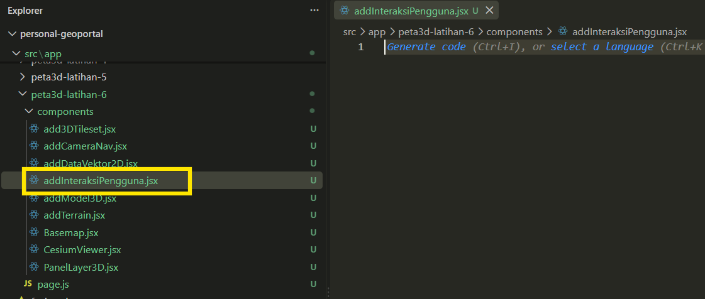
    
2. Tahap kedua buat fungsi **addInteraksiPengguna** yang digunakan untuk menambahkan kemampuan interaksi pengguna pada peta 3D. Kemudian tambahkan parameter **viewer**.
    
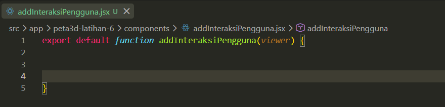
    
3. Tahap ketiga buat variabel **const cesium = windows.cesium** untuk mengambil library Cesium yang sebelumnya telah tersedia di halaman Cesium Viewer.
    
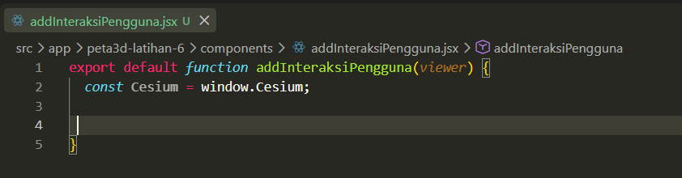
    
4. Tahap keempat buat variabel **infobox** yang akan digunakan untuk menampilkan informasi ketika pengguna mengklik layer pada peta.
    
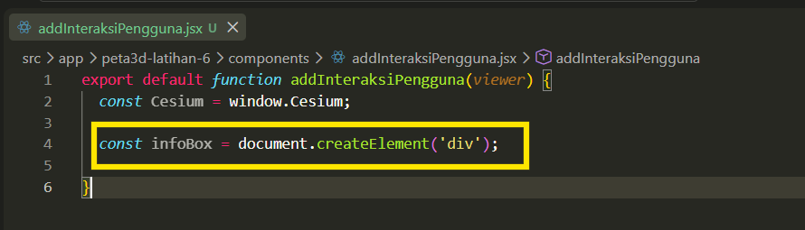
    
5. Selanjutnya buat elemen **infoBox.style.cssText** yang berfungsi untuk mengatur tampilan dan posisi kotak informasi **(infoBox)** pada halaman peta, meliputi posisi di bagian bawah kiri, warna latar putih, ukuran teks, jarak isi, bentuk sudut, bayangan, serta menyembunyikan kotak informasi pada saat awal sebelum pengguna memilih objek.
    
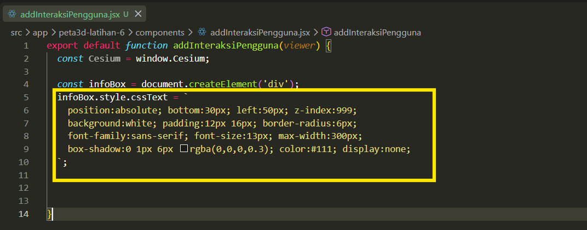
    
6. Kemudian buat **viewer.container.appendChild(infoBox);** yang digunakan untuk menambahkan kotak informasi kedalam tampilan peta.
    
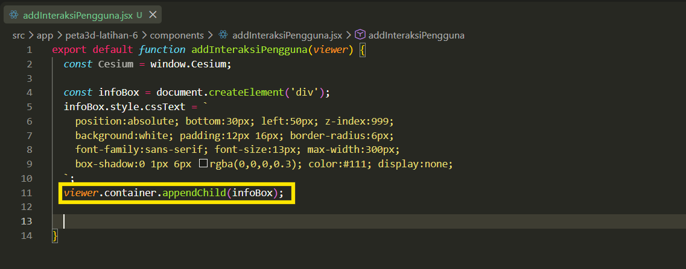
    
7. Tahap kelima buat variabel **handler** atau pendeteksi interaksi pengguna pada area tampilan peta (canvas), sehingga sistem dapat merespons aktivitas seperti klik atau pergerakan mouse pada peta.
    
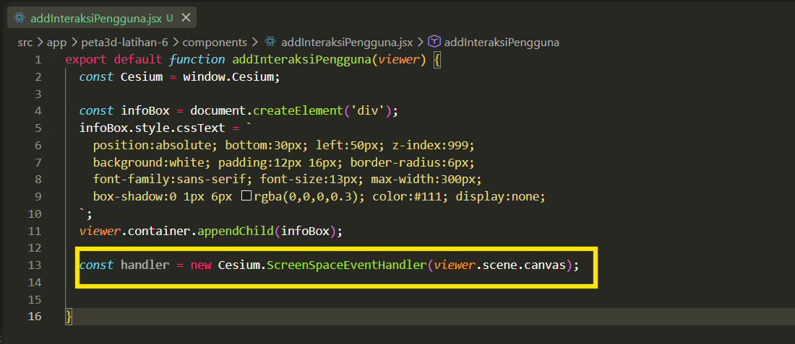
    
8. Tahap keenam buat fungsi untuk menambahkan aksi yang akan dijalankan ketika pengguna melakukan klik kiri **(LEFT_CLICK)** pada area peta 3D, sehingga sistem dapat merespons dan memproses objek yang dipilih.
    
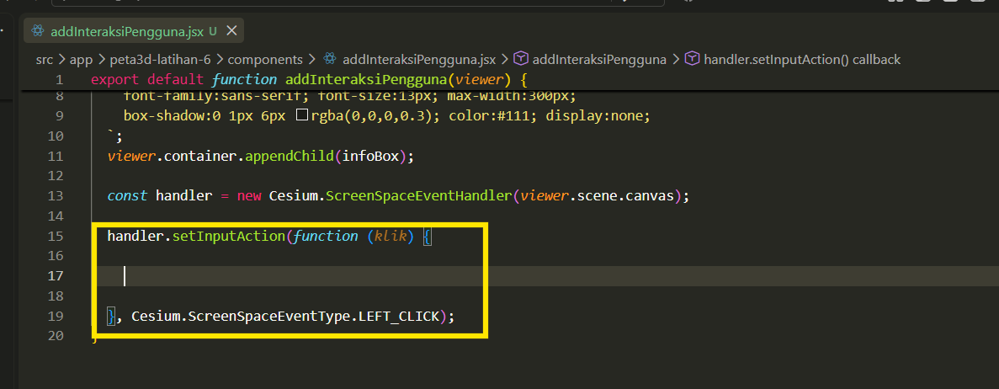
    
9. Selanjutnya didalam fungsi tersebut buat variabel **const objek** untuk mendeteksi dan mengambil objek pada peta 3D berdasarkan posisi yang diklik.
    
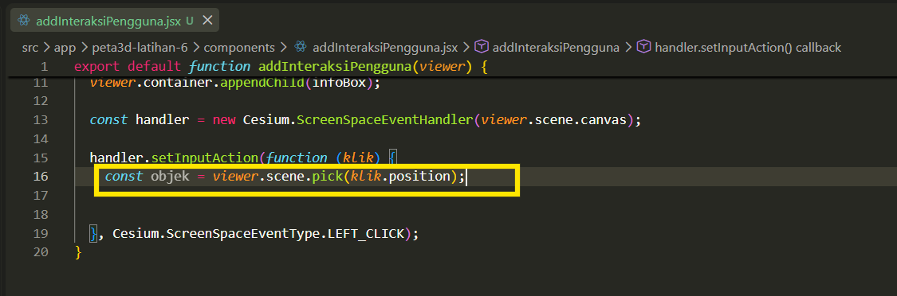
    
10. Kemudian buat kondisi **if** untuk memeriksa apakah terdapat objek yang berhasil dipilih oleh pengguna, dan jika tidak ada objek pada lokasi yang diklik maka kotak informasi tidak ditampilkan.
    
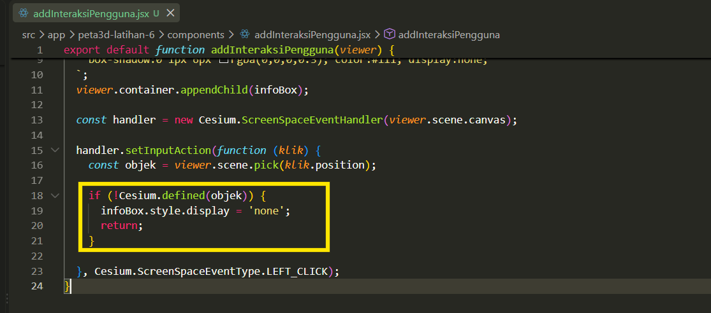
    
11. Tahap berikutnya tambahkan fungsi untuk menyiapkan variabel **namaProperti** sebagai tempat menyimpan daftar atribut objek serta variabel **judul** untuk menentukan judul informasi.
    
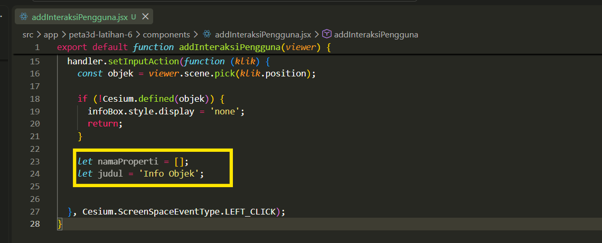
    
12. Selanjutnya buat kondisi **if** untuk memeriksa apakah objek yang dipilih pengguna merupakan objek bertipe 3D Tiles, sehingga dapat menentukan cara yang sesuai untuk mengambil informasi.
    
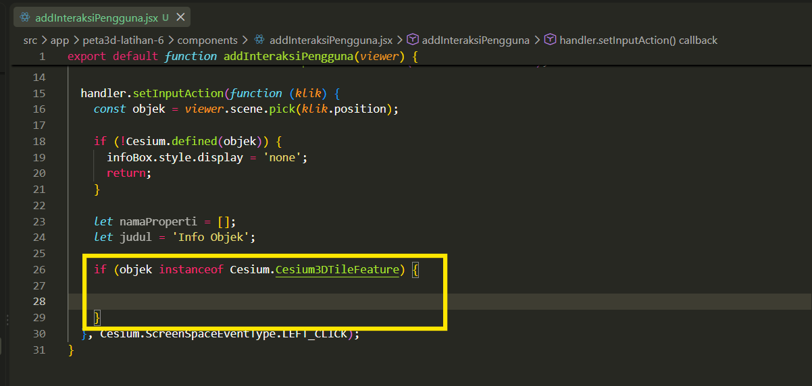
    
13. Pada fungsi **if** diatas, tambahkan fungsi untuk mengambil seluruh atribut dan nama dari objek 3D Tiles yang dipilih, kemudian menyusun serta menampilkan informasi tersebut ke dalam kotak informasi (infoBox).
    
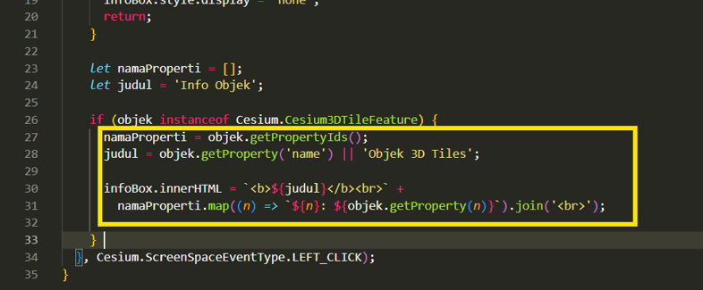
    
14. Tahap berikutnya tambahkan fungsi **else if** untuk memeriksa apakah objek yang dipilih memiliki data atribut, kemudian mengambil nama serta seluruh informasi yang tersedia pada objek tersebut untuk ditampilkan ke dalam kotak informasi (infoBox).
    
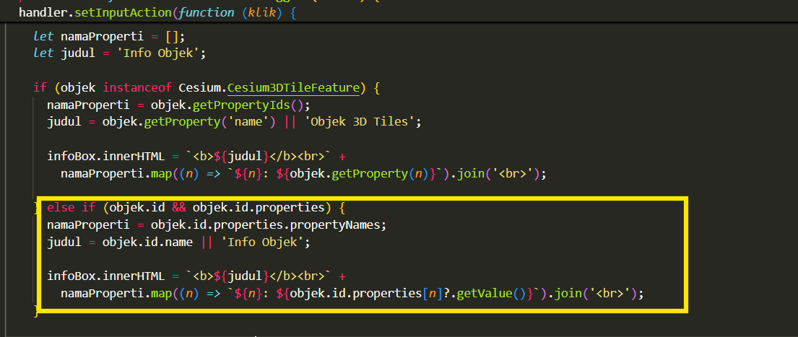
    
15. Tahap terakhir buat fungsi **else** untuk menampilkan pesan bahwa objek tidak memiliki data apabila informasi objek tidak ditemukan, kemudian menampilkan kotak informasi (infoBox).
    
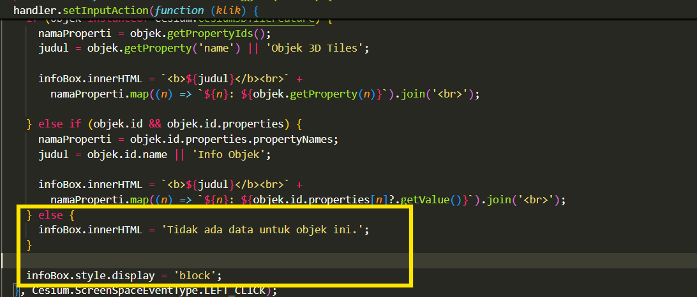
    
16. Berikut ini merupakan keseluruhan script untuk interaksi pengguna.
    
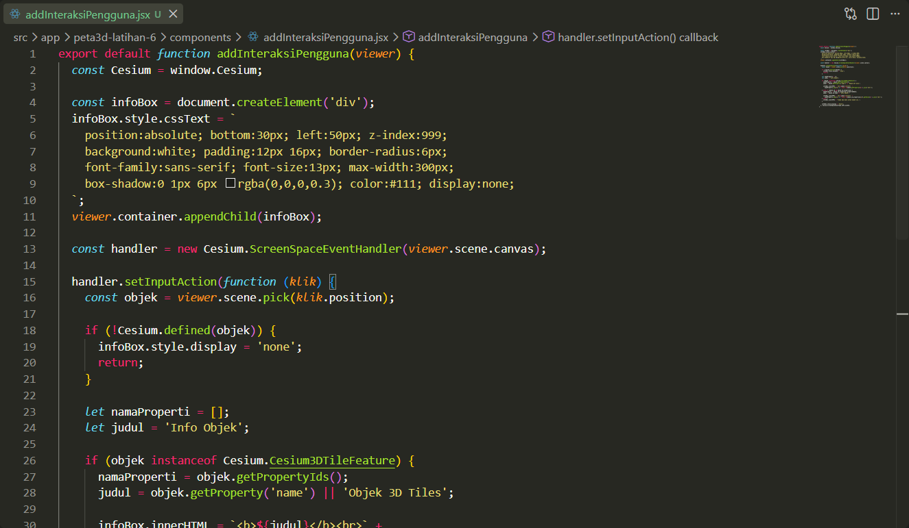
    

## **Integrasi Fungsi Interaksi Pengguna dengan Cesium Viewer**

1. Tahap pertama buat fungsi memanggil dan mengaktifkan fungsi interaksi pengguna pada peta 3D, kemudian hubungkan **kontrolInteraksi** dengan panel kontrol layer 3D, sehingga fitur interaksi dapat digunakan bersamaan dengan layer yang ditampilkan.
    
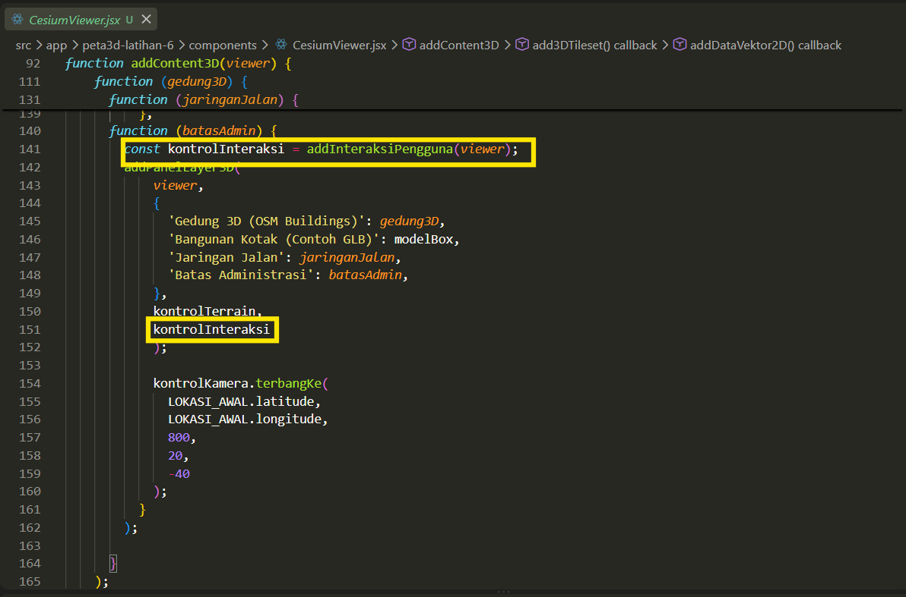
    
2. Tahap kedua pastikan fungsi addInteraksiPengguna telah terpanggil pada halaman **CesiumViewer.jsx**.
    
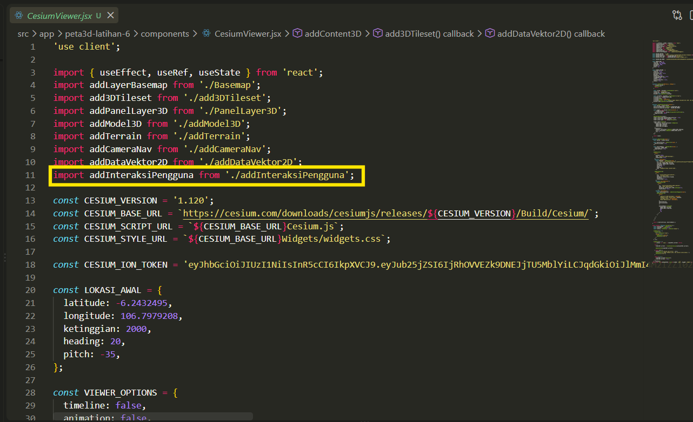
    
3. Berikut ini merupakan hasil tampilan interaksi pengguna ketika mengklik data 2d jaringan jalan.
    

    
4. Hasil interaksi pengguna ketika mengklik data polygon batas administrasi.
    

    
5. Hasil interaksi pengguna ketika mengklik pada bagian objek 3d bangunan.
    


### addInteraksiPengguna.jsx, kode lengkap

```jsx
export default function addInteraksiPengguna(viewer) {
  const Cesium = window.Cesium;

  const infoBox = document.createElement('div');
  infoBox.style.cssText = `
    position:absolute; bottom:30px; left:50px; z-index:999;
    background:white; padding:12px 16px; border-radius:6px;
    font-family:sans-serif; font-size:13px; max-width:300px;
    box-shadow:0 1px 6px rgba(0,0,0,0.3); color:#111; display:none;
  `;
  viewer.container.appendChild(infoBox);

  const handler = new Cesium.ScreenSpaceEventHandler(viewer.scene.canvas);

  handler.setInputAction(function (klik) {
    const objek = viewer.scene.pick(klik.position);

    if (!Cesium.defined(objek)) {
      infoBox.style.display = 'none';
      return;
    }

    let namaProperti = [];
    let judul = 'Info Objek';

    if (objek instanceof Cesium.Cesium3DTileFeature) {
      namaProperti = objek.getPropertyIds();
      judul = objek.getProperty('name') || 'Objek 3D Tiles';

      infoBox.innerHTML = `<b>${judul}</b><br>` +
        namaProperti.map((n) => `${n}: ${objek.getProperty(n)}`).join('<br>');

    } else if (objek.id && objek.id.properties) {
      namaProperti = objek.id.properties.propertyNames;
      judul = objek.id.name || 'Info Objek';

      infoBox.innerHTML = `<b>${judul}</b><br>` +
        namaProperti.map((n) => `${n}: ${objek.id.properties[n]?.getValue()}`).join('<br>');
    } else {
      infoBox.innerHTML = 'Tidak ada data untuk objek ini.';
    }

    infoBox.style.display = 'block';
  }, Cesium.ScreenSpaceEventType.LEFT_CLICK);
}
```
