# Konfigurasi Cesium Viewer

**Modul 3 - Pengembangan Front-End : Peta 3D**

## **Pembuatan Fungsi Basemap**

1. Tahap pertama buka terminal pada **Virtual Studio Code**, kemudian input perintah pada terminal untuk menginstall library cesium menggunakan perintah **npm install cesium.**
    
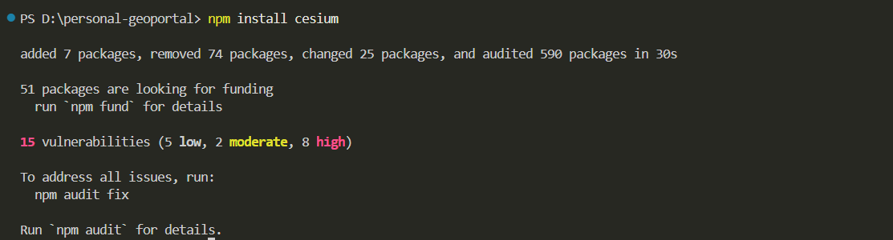
    
2. Selanjutnya pada tahap kedua buat folder baru dengan nama **peta 3d-latihan**, kemudian buat folder baru dengan nama **components**, kemudian buat file baru dengan nama **Basemap.jsx**.
    
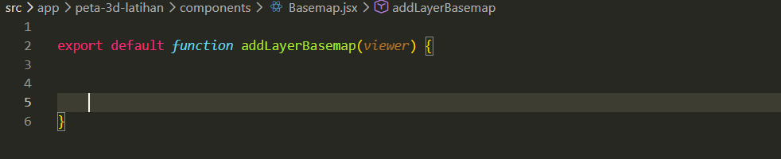
    
3. Selanjutnya pada tahap ketiga buat fungsi **addLayerBasemap()** kemudian tambahkan parameter **viewer** yang digunakan untuk menampilkan peta.
    
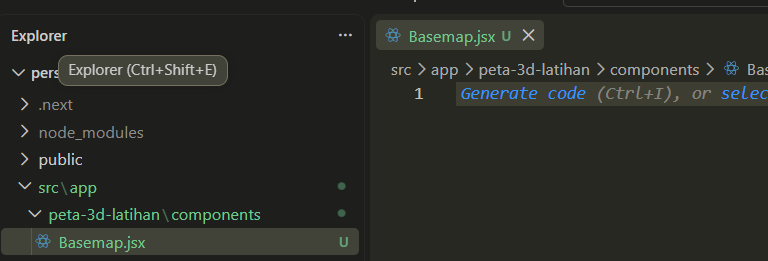
    
4. Tahap ketiga tambahkan variabel **const Cesium = window.Cesium;** untuk mengakses libarary cesium.
    
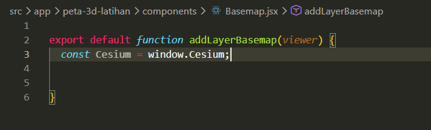
    
5. Pada tahap keempat buat fungsi yang akan digunakan untuk membuat tampilan basemap dengan variabel **const baseMaps = {}**.
    
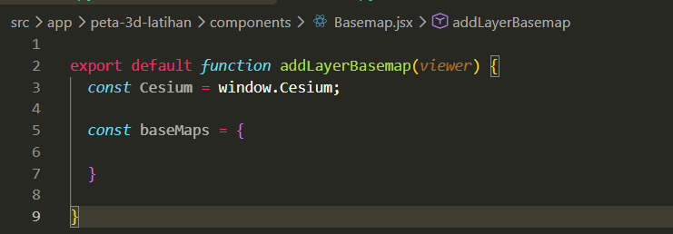
    
6. Tahap kelima pada fungsi basemap, tambahkan peta **openstreetmaps** serta **imagery** yang akan digunakan sebagai peta dasar.
    
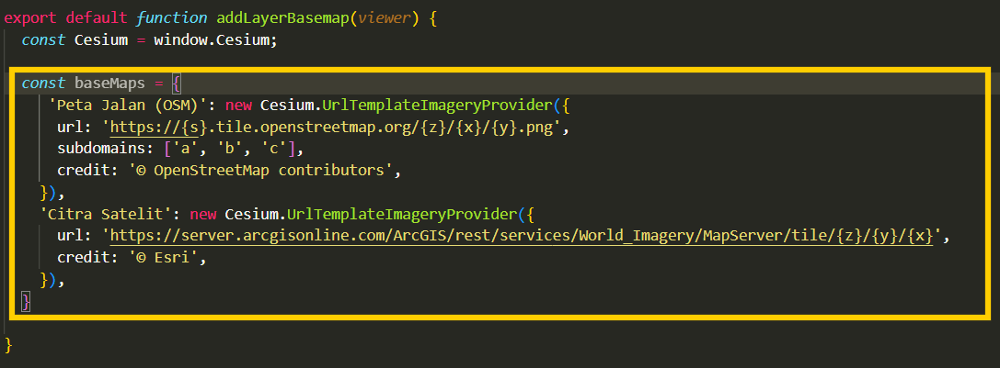
    
7. Selanjutnya buat variabel **const namaAwal** untuk mengambil peta dasar yang akan ditampilkan pertama kali, kemudian tambahkan **Object.keys(baseMaps)** digunakan untuk mengambil seluruh nama basemap.
    
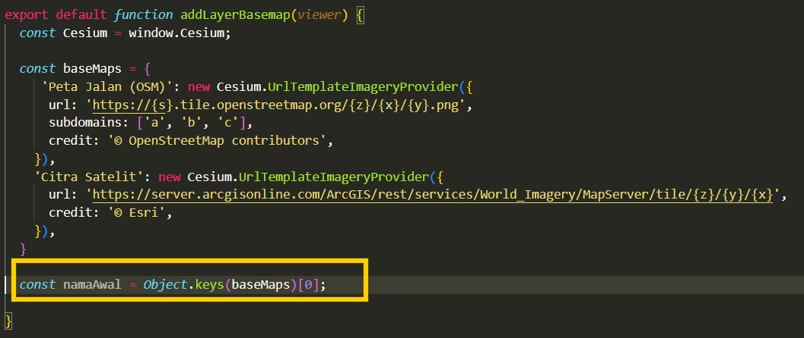
    
8. Pada tahap ketujuh buat fungsi **let activeLayer** untuk menambahkan basemap kedalam cesium viewer.
    
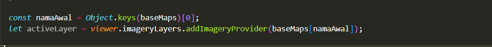
    
9. Tahap kedelapan buat fungsi **switchBasemap()** yang akan digunakan sebagai fungsi untuk merubah pilihan basemap, serta tambahkan parameter **nama** untuk mengambil nama yang ada dalam basemap.
    
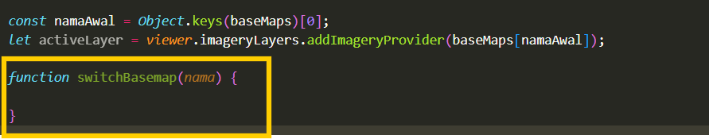
    
10. Selanjutnya pada tahap kesembilan buat fungsi **switchBasemap()** tambahkan kondisi untuk memastikan basemap telah tersedia menggunakan kondisi **if (!baseMaps[nama])**.
    
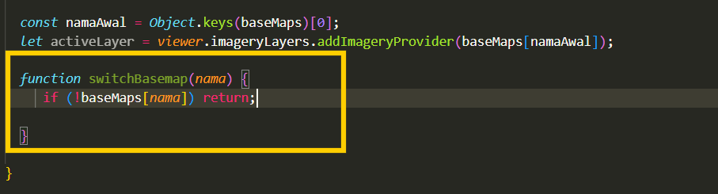
    
11. Kemudian setelah menentukan kondisi basemap tersedia buat fungsi **viewer.imageryLayers.remove(activeLayer,true);** yang digunakan untuk menghapus basemap sebelumnya dan mempersiapkan basemap baru.
    
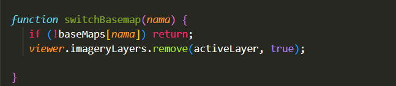
    
12. Pada tahap akhir untuk perubahan basemap, tambahkan fungsi **activeLayer** untuk menampilkan basemap yang telah dipilih oleh peserta.
    
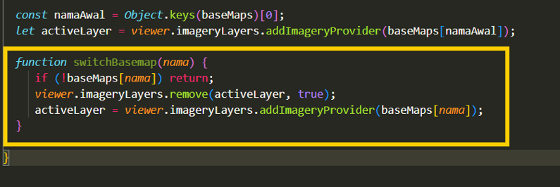
    
13. Selanjutnya buat fungsi untuk merubah pilihan basemap dengan membuat fungsi **document.createElement** serta tambahkan parameter **select didalamnya.**
    

    
14. Tahap berikutnya buat fungsi untuk mengatur tampilan dan posisi panel dropdown basemap agar berada di bagian kanan atas peta dengan jarak tertentu, memiliki padding, sudut membulat, serta tetap tampil di atas elemen peta.
    
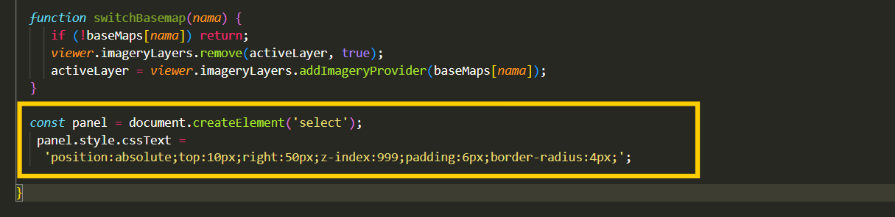
    
15. Selanjutnya buat fungsi untuk mengambil seluruh nama basemap dan tampilkan sebagai pilihan.
    
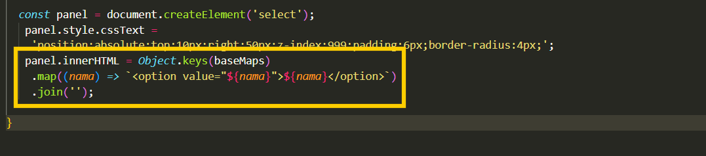
    
16. Tahap berikutnya buat fungsi untuk mendeteksi perubahan pilihan pada dropdown basemap, kemudian menjalankan fungsi **switchBasemap()** berdasarkan nama basemap yang dipilih oleh pengguna.
    
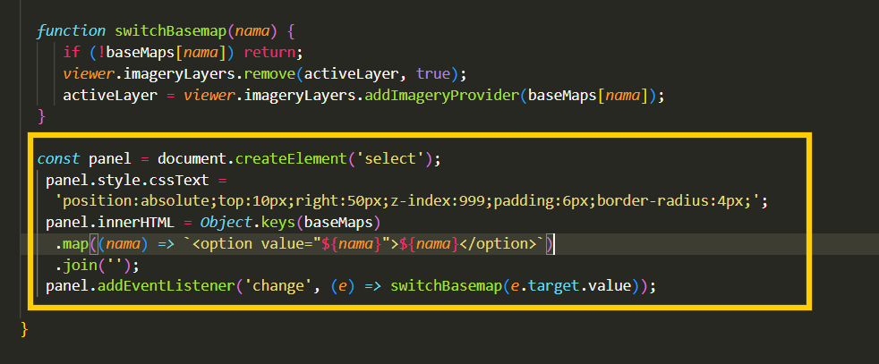
    
17. Selanjutnya buat elemen panel berupa kontrol dropdown pemilihan basemap ke dalam container Cesium Viewer agar dapat ditampilkan di atas peta.
    
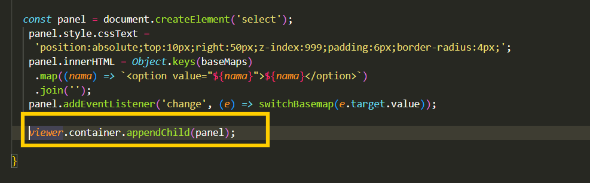
    
18. Pada tahap akhir mengembalikan fungsi **switchBasemap** dan data **baseMaps** agar dapat diakses serta digunakan kembali.
    
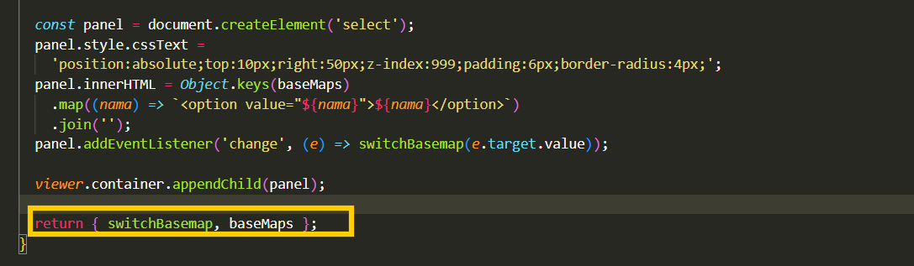
    
19. Hasil akhir keluruhan script untuk **basemap** adalah sebagai berikut.

**Kode lengkap Basemap.jsx**

```jsx

export default function addLayerBasemap(viewer) {
  const Cesium = window.Cesium;

  const baseMaps = {
    'Peta Jalan (OSM)': new Cesium.UrlTemplateImageryProvider({
      url: 'https://{s}.tile.openstreetmap.org/{z}/{x}/{y}.png',
      subdomains: ['a', 'b', 'c'],
      credit: '© OpenStreetMap contributors',
    }),
    'Citra Satelit': new Cesium.UrlTemplateImageryProvider({
      url: 'https://server.arcgisonline.com/ArcGIS/rest/services/World_Imagery/MapServer/tile/{z}/{y}/{x}',
      credit: '© Esri',
    }),
  };

  const namaAwal = Object.keys(baseMaps)[0];
  let activeLayer = viewer.imageryLayers.addImageryProvider(baseMaps[namaAwal]);

  function switchBasemap(nama) {
    if (!baseMaps[nama]) return;
    viewer.imageryLayers.remove(activeLayer, true);
    activeLayer = viewer.imageryLayers.addImageryProvider(baseMaps[nama]);
  }

  const panel = document.createElement('select');
  panel.style.cssText =
    'position:absolute;top:10px;right:50px;z-index:999;padding:6px;border-radius:4px;';
  panel.innerHTML = Object.keys(baseMaps)
    .map((nama) => `<option value="${nama}">${nama}</option>`)
    .join('');
  panel.addEventListener('change', (e) => switchBasemap(e.target.value));

  viewer.container.appendChild(panel);

  return { switchBasemap, baseMaps };
}
```

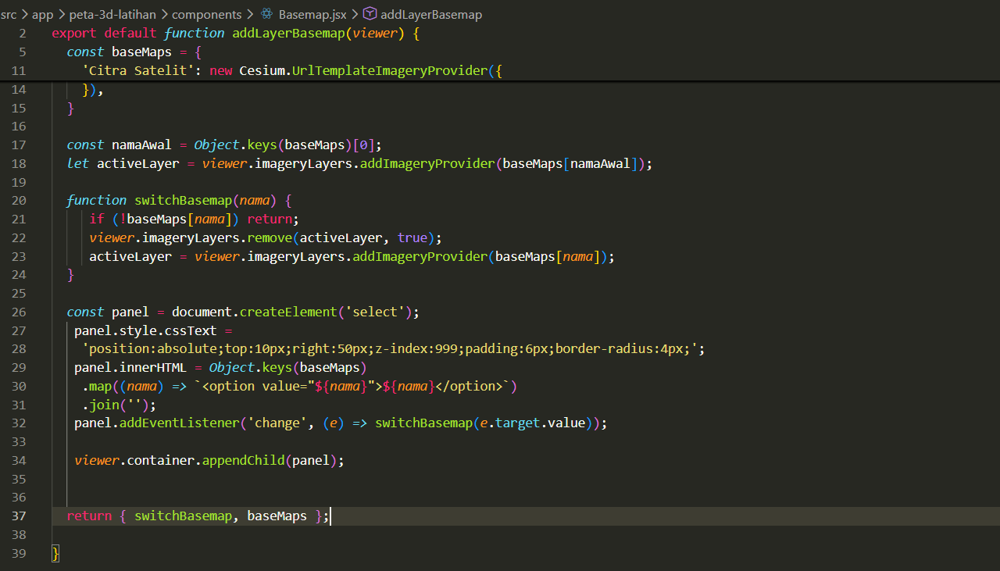

## **Pembuatan Cesium Viewer**

1. Tahap pertama buat halaman **CesiumViewer.jsx** lalu konfigurasi Library CesiumJS untuk menentukan versi CesiumJS serta membuat alamat URL dasar, file JavaScript, dan file CSS yang diperlukan untuk memuat library CesiumJS dari CDN. **CESIUM_VERSION** digunakan untuk menentukan versi CesiumJS yang digunakan. **CESIUM_BASE_URL** digunakan sebagai alamat dasar lokasi library CesiumJS. **CESIUM_SCRIPT_URL** digunakan untuk menentukan alamat file JavaScript CesiumJS. **CESIUM_STYLE_URL** digunakan untuk menentukan alamat file CSS widget CesiumJS.
    
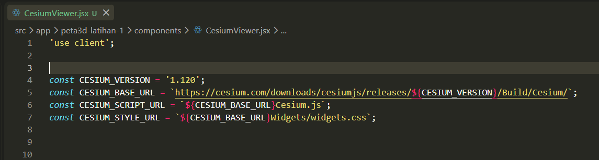
    
2. Tahap kedua buat fungsi untuk menentukan lokasi awal serta posisi kamera ketika peta 3D Cesium pertama kali ditampilkan, meliputi koordinat latitude, longitude, ketinggian, arah pandangan (heading), dan kemiringan kamera (pitch).
    
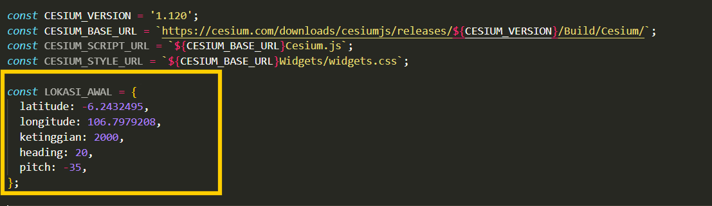
    
3. Tahap ketiga buat fungsi untuk mengatur komponen dan fitur bawaan yang ditampilkan pada Cesium Viewer, seperti menyembunyikan kontrol yang tidak diperlukan dan mengaktifkan fitur tertentu agar tampilan peta menjadi lebih sederhana dan sesuai kebutuhan aplikasi.
    
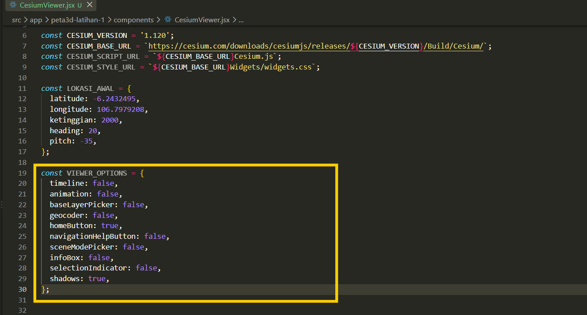
    
4. Tahap keempat buat fungsi **LoadCesium** yang bertugas memuat library CesiumJS, dengan parameter **onBerhasil** untuk menangani proses ketika pemuatan berhasil dan **onGagal** untuk menangani proses kesalahan.
    
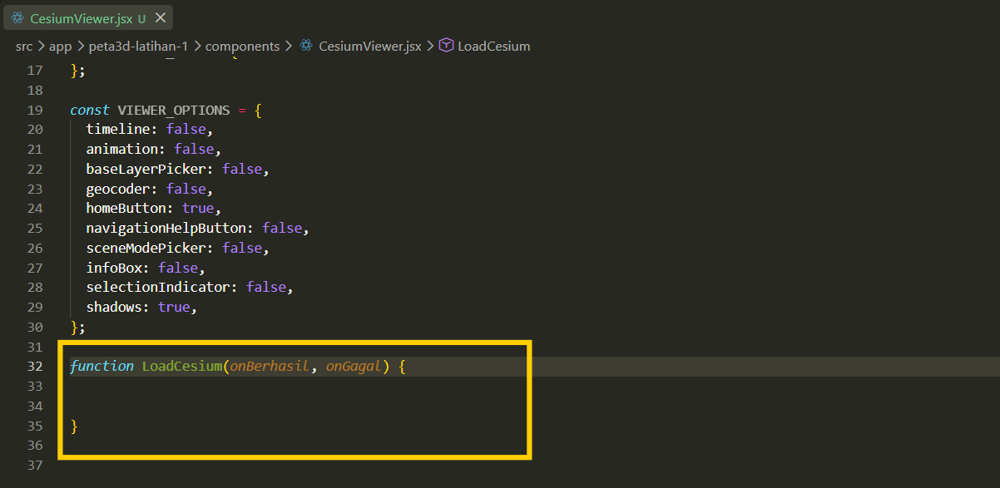
    
5. Pada tahap kelima buat fungsi memeriksa apakah library CesiumJS sudah tersedia di browser, kemudian menjalankan fungsi onBerhasil() dan menghentikan proses pemuatan jika Cesium sudah berhasil dimuat sebelumnya.
    
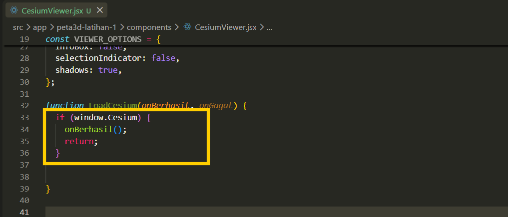
    
6. Tahap keenam buat fungsi untuk menambahkan elemen `<link>` secara dinamis ke bagian `<head>` halaman untuk memuat file CSS CesiumJS dari URL yang telah ditentukan, sehingga tampilan dan widget bawaan Cesium dapat ditampilkan dengan benar.
    
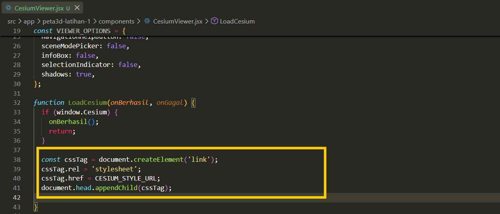
    
7. Pada tahap akhir untuk fungsi loadcesium buat fungsi untuk menambahkan elemen `<script>` secara dinamis ke halaman untuk memuat library CesiumJS dari CDN, menjalankan fungsi onBerhasil ketika pemuatan berhasil, serta menampilkan pesan kesalahan melalui fungsi onGagal apabila proses gagal.
    
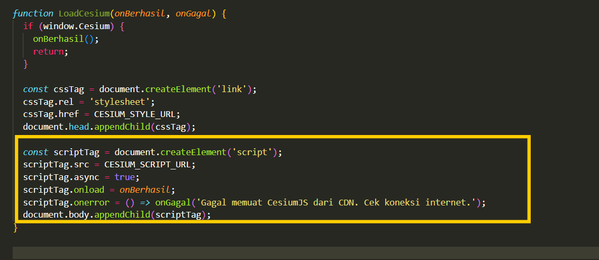
    
8. Selanjutnya buat fungsi **createViewerCesium** yang bertugas menginisialisasi dan mengatur Cesium Viewer pada elemen container sebagai tempat untuk menampilkan peta 3D.
    
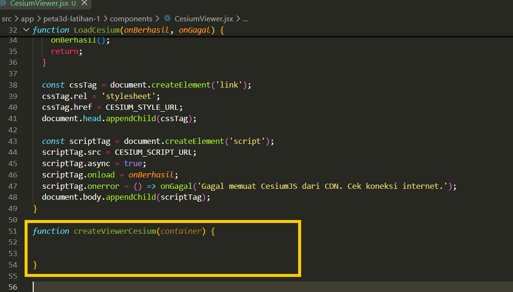
    
9. Tahapan berikutnya pada fungsi **createViewerCesium** buat fungsi yang akan digunakan mengakses library CesiumJS yang telah dimuat pada browser dan menentukan lokasi dasar (Base URL) file pendukung Cesium, seperti assets, workers, dan widgets, agar dapat dimuat dengan benar.
    
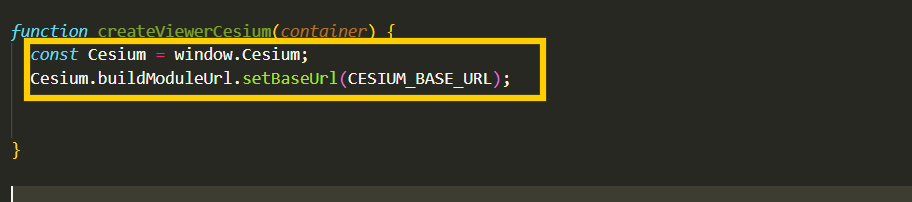
    
10. Kemudian buat fungsi yang akan digunakan untuk membuat objek Cesium Viewer pada elemen container dengan menerapkan konfigurasi **VIEWER_OPTIONS**, menggunakan bentuk permukaan bumi sederhana melalui EllipsoidTerrainProvider, serta menonaktifkan basemap bawaan agar dapat menggunakan basemap yang telah dikonfigurasi secara terpisah.
    

    
11. Tahap berikutnya buat fungsi menambahkan basemap ke dalam Cesium Viewer, mengaktifkan interaksi objek terhadap permukaan terrain, serta menambahkan efek pencahayaan matahari
    
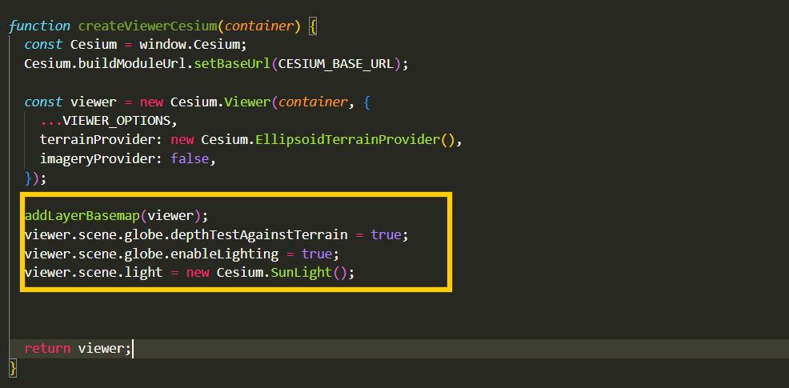
    
12. Pada tahap terakhir buat fungsi mengatur posisi dan arah awal kamera berdasarkan konfigurasi **LOKASI_AWAL**, kemudian mengembalikan objek viewer yang telah dikonfigurasi untuk menampilkan peta 3D Cesium.
    
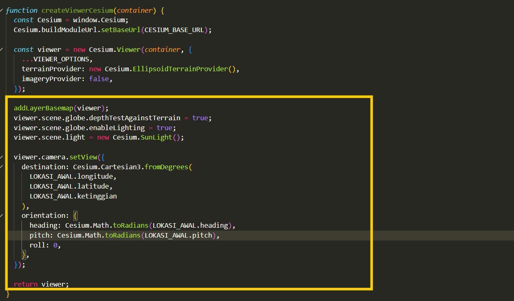
    
13. Tahap berikutnya buat fungsi **export default function cesiumViewer** yang digunakan sebagai komponen utama untuk mengatur proses pemuatan library CesiumJS, pembuatan Viewer, dan menampilkan peta 3D.
    

    
14. Selanjutnya didalam fungsi **CesiumViewer,** buat fungsi referensi **containerRef** sebagai tempat menampilkan peta, **viewerRef** untuk menyimpan objek Cesium Viewer, serta **state status** dan **pesanError** untuk mengatur kondisi proses pemuatan dan menampilkan informasi apabila terjadi kesalahan.
    
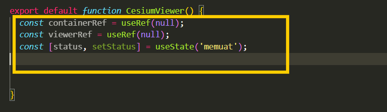
    
15. Tahap berikutnya buat fungs **UseEffect** yang diisi dengan fungsi untuk menjalankan **LoadCesium()** ketika komponen pertama kali dimuat, kemudian mengubah status menjadi siap apabila Cesium berhasil dimuat atau menyimpan pesan kesalahan dan mengubah status menjadi error apabila proses gagal.
    

    
16. Selanjtunya buat fungsi **UseEffect** untuk menjalankan library Cesium berhasil dimuat dan status berubah menjadi siap, menangani kesalahan apabila proses pembuatan peta gagal, serta membersihkan objek Viewer ketika komponen tidak lagi digunakan.
    
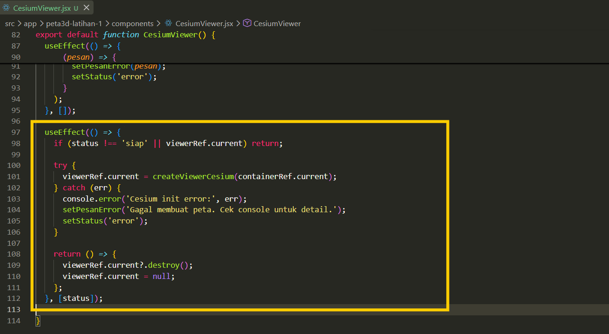
    
17. Tahap terakhir buat fungsi **return** dan tambahkan elemen **div** sebagai container tempat Cesium Viewer ditampilkan, dengan ukuran lebar penuh dan tinggi satu layar penuh (100vh).
    
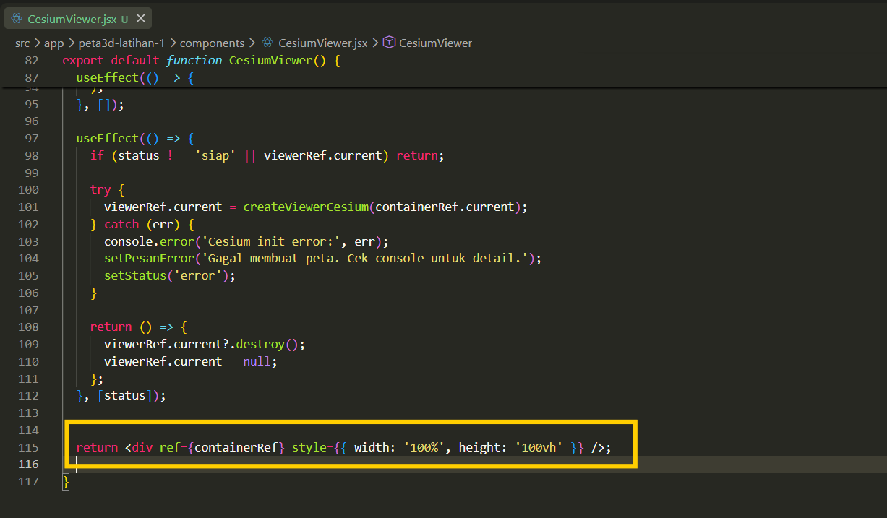
    

### page.js, kode lengkap

```jsx
'use client';

import dynamic from 'next/dynamic';

const CesiumViewer = dynamic(() => import('./components/CesiumViewer'), {
  ssr: false,
  loading: () => <p style={{ padding: 20 }}>Memuat peta 3D...</p>,
});

export default function Page() {
  return (
    <main>
      <CesiumViewer />
    </main>
  );
}
```

## **Pembuatan Halaman Utama**

1. Pada tahap pertama buat file baru didalam folder peta3d-latihan dengan nama **page.js** kemudian buat fungsi untuk memuat komponen CesiumViewer secara dinamis di browser, menonaktifkan Server-Side Rendering (ssr: false) serta menampilkan pesan loading selama komponen peta sedang dimuat.
    

    
2. Tahap kedua buat fungsi berupa export default function Page() {} yang digunakan untuk membuat komponen halaman utama yang akan menampilkan komponen Cesium Viewer pada aplikasi Next.js.
    

    
3. Tahap terakhir didalam fungsi **page,** buat fungsi untuk memanggil file **CesiumViewer** dalam elemen utama halaman sehingga peta 3D Cesium dapat ditampilkan.
    

    
4. Berikut ini hasil tampilan peta 3d pada tahap pertama dengan basemap osm serta basemap berupa citra satelit.
    

    

    
5. Hasil tampilan jika di klik tombol **Home** untuk masuk kedalam tampilan bola bumi.
    
