# Kontrol Kamera dan Navigasi: Penggunaaan flyto, setView, heading, pitch dan rol

## **Pembuatan Fungsi Kontrol dan Navigasi Kamera**

1. Tahap pertama buat file baru pada folder **components** dengan nama **addCameraNav.jsx**.
    
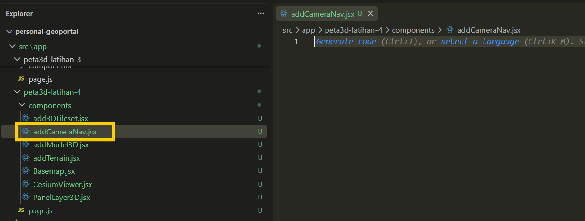
    
2. Selanjutnya pada tahap kedua buat struktur dasar modul **addCameraNav()** yang berfungsi sebagai wadah untuk seluruh fitur navigasi kamera, dengan parameter **viewer** sebagai instance Cesium Viewer dan **opsi** sebagai konfigurasi tambahan, serta mengambil library Cesium dari **window.Cesium** agar dapat digunakan.
    

    
3. Pada tahap ketiga buat variabel dengan parameter **lokasiAwal** untuk menentukan posisi awal kamera dan **tampilkanPanel** untuk menentukan apakah tombol navigasi akan ditampilkan.
    
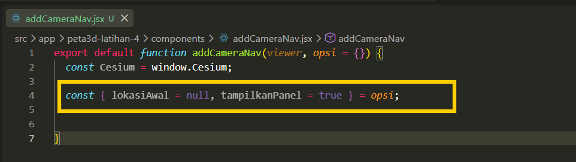
    
4. Tahap keempat buat fungsi **lihatLangsung()** yang digunakan untuk memindahkan tampilan kamera secara langsung ke lokasi tertentu berdasarkan koordinat, ketinggian, dan arah pandangan kamera.
    

    
5. Selanjutnya didalam fungsi **lihatLangsung,** buat fungsi untuk mengatur dan memindahkan posisi tampilan kamera secara langsung ke lokasi menggunakan **viewer.camera.setView**.
    

    
6. Tahap berikutnya dalam fungsi **viewer.camera.setView** buat fungsi berupa **destination** untuk menentukan lokasi tujuan kamera berdasarkan nilai longitude, latitude, dan ketinggian yang kemudian diubah ke format koordinat yang digunakan oleh Cesium.
    

    
7. Selanjutnya tambahkan fungsi **orientation** untuk mengatur arah dan sudut pandangan kamera, yang terdiri dari **heading** untuk menentukan arah, **pitch** untuk menentukan kemiringan pandangan, dan **roll** untuk menentukan kemiringan posisi kamera.
    

    
8. Pada tahap kelima buat fungsi **terbangKe()** sebagai wadah untuk mengatur perpindahan kamera menuju lokasi tertentu dengan animasi.
    
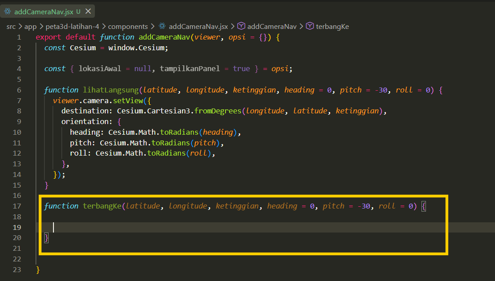
    
9. Selanjutnya pada fungsi tersebut tambahkan **viewer.camera.flyTo()** untuk membuat kamera bergerak atau terbang secara animasi menuju lokasi tujuan.
    

    
10. Kemudian tambahkan fungsi berupa **destination** untuk menentukan lokasi tujuan kamera serta tambahkan **orientation** untuk mengatur arah dan sudut pandangan kamera, yang terdiri dari **heading, pitch** dan **roll.**
    

    
11. Pada tahap keenam buat fungsi **resetKeAwal()** untuk mengembalikan posisi kamera ke lokasi awal yang telah ditentukan.
    

    
12. Selanjutnya didalam fungsi tersebut tambahkan kondisi **if** yang digunakan untuk memastikan data lokasiAwal tersedia sebelum kamera melakukan perpindahan.
    

    
13. Tahap berikutnya tambahkan fungsi **terbangKe()** untuk memindahkan kamera kembali menuju lokasi awal dengan animasi.
    

    
14. Didalam fungsi **terbangKe()** tambahkan parameter untuk mengambil nilai **latitude, longitude,** dan **ketinggian** dari data **lokasiAwal** sebagai tujuan kamera, serta tambahkan parameter untuk mengambil pengaturan arah dan sudut pandangan kamera dari **lokasiAwal**, seperti **heading, pitch,** dan **roll.**
    

    
15. Tahap ketujuh buat fungsi **putarKiri()** yang berfungsi untuk memutar arah pandangan kamera ke sebelah kiri.
    

    
16. Selanjutnya buat variabel untuk mengambil nilai arah atau posisi putaran kamera yang sedang digunakan.
    

    
17. Kemudian tambahkan fungsi **viewer.camera.setView()** untuk memperbarui arah pandangan kamera.
    
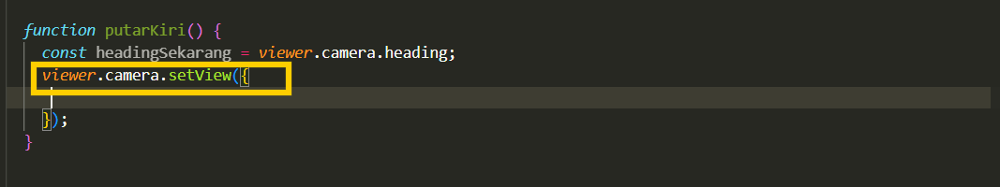
    
18. Tahapan berikutnya didalam **viewer.camera** tambahkan parameter **orientasi** kamera yang akan digunakan setelah kamera diputar.
    
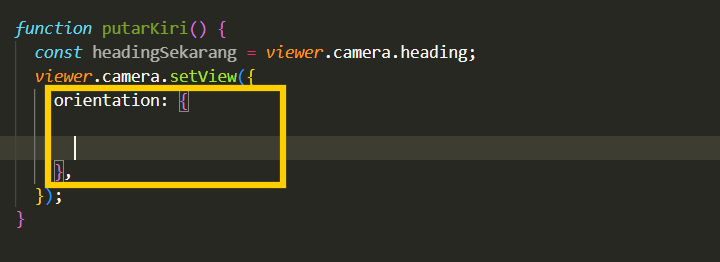
    
19. Selanjutnya dalam orientasi tambahkan parameter arah kamera yang dikurangi sebesar 15 derajat untuk memutar pandangan ke kiri, sementara nilai pitch dan roll tetap dipertahankan agar kemiringan dan posisi kamera tidak berubah.
    

    
20. Tahap kedelapan buat fungsi **putarKanan()** dengan parameter yang sama dengann putar kiri, tetapi pada parameter arah kamera dalam fungsi putarKanan ditambahkan dengan 15 untuk memutar pandangan kekanan.
    

    
21. Pada tahap kesembilan buat kondisi **if** untuk memeriksa apakah panel navigasi perlu ditampilkan atau tidak berdasarkan nilai **tampilkanPanel**.
    

    
22. Kemudian tambahkan variabel untuk membuat container dengan elemen div yang akan digunakan sebagai wadah untuk seluruh tombol navigasi kamera.
    
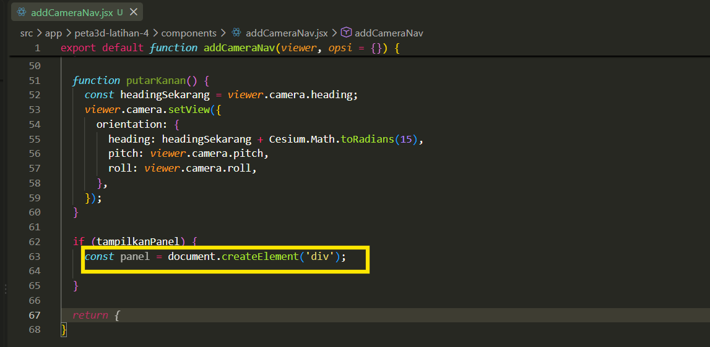
    
23. Selanjutnya buat **panel.style.cssText** yang akan digunakan untuk pengaturan tampilan pada panel seperti posisi, warna, ukuran, dan tata letak agar panel terlihat di atas peta.
    
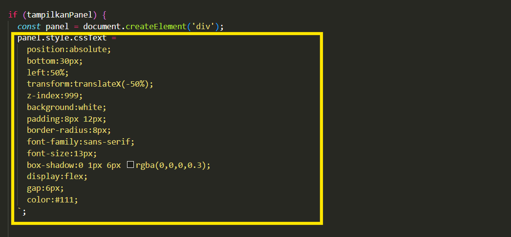
    
24. Kemudian tambahkan variabel **const tombolStyle** sebagai pengaturan tampilan yang akan digunakan bersama oleh seluruh tombol navigasi.
    
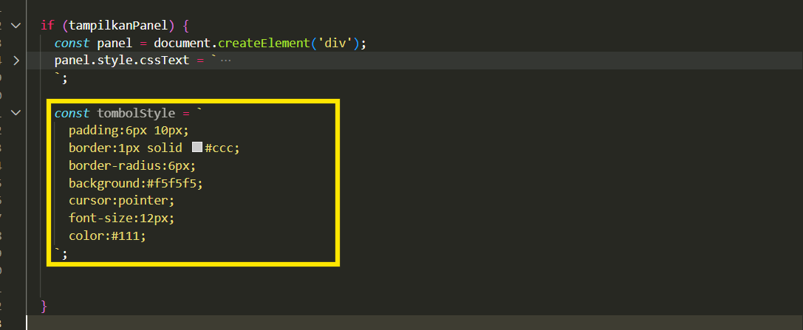
    
25. Tahap berikutnya buat variabel yang akan digunakan sebagai daftar tombol yang akan digunakan untuk mengontrol arah kamera.
    

    
26. Selanjutnya buat fungsi berupa **daftarTombol** untuk membuat tombol secara otomatis.
    
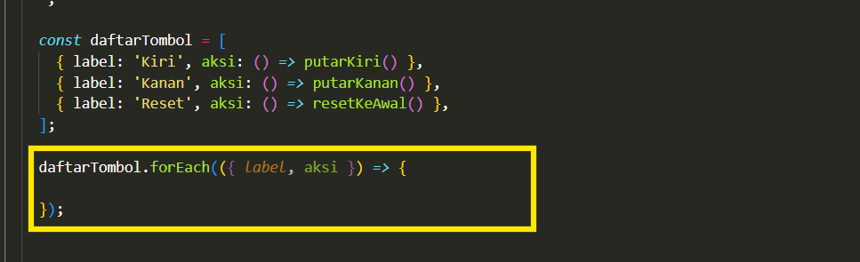
    
27. Pada fungsi **daftarTombol** buat elemen HTML button untuk setiap tombol navigasi.
    

    
28. Selanjutnya buat teks dan style diterapkan pada tombol yang telah dibuat, kemudian tambahkan aksi saat diklik sebelum dimasukkan ke dalam panel navigasi.
    
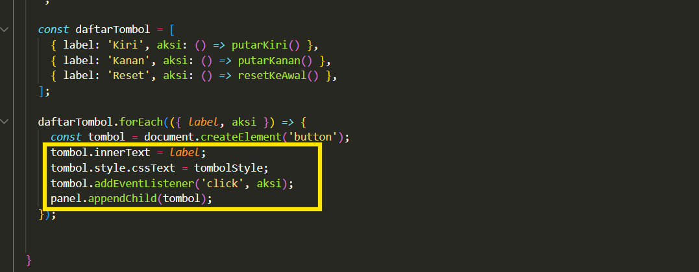
    
29. Tahap terakhir pada fungsi **if (tampilkanPanel)** tambahkan ke dalam container Cesium agar dapat ditampilkan di atas peta 3D.
    
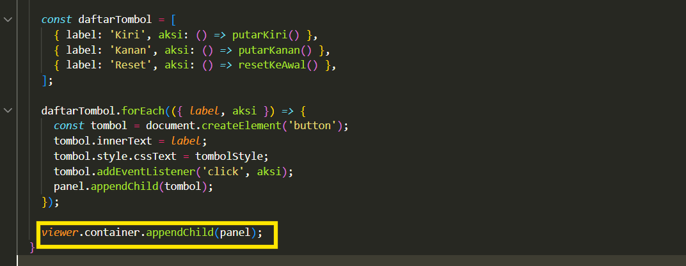
    
30. Pada tahap terakhir, seluruh fungsi navigasi kamera dikembalikan agar dapat digunakan kembali dari luar modul untuk mengatur pergerakan dan arah pandangan kamera.
    

    

## **Integrasi Fungsi Kontrol dan Navigasi Kamera dengan Cesium Viewer**

1. Tahap pertama, pada file **CesiumViewer.jsx** pada **function addContent3D** tambahkan variabel untuk kontrolKamera dan panggil **addCameraNav**.
    

    
2. Tahap kedua tambahkan **kontrolKamera** untuk memanggil fungsi **terbangKe()** sehingga kamera dapat bergerak secara animasi menuju lokasi awal dengan ketinggian, arah, dan sudut pandangan yang telah ditentukan.
    

    
3. Hasil tampilan untuk kontrol kamera ketika posisi dirotasi ke arah kiri ataupun kanan.
    

    
4. Hasil tampilan ketika posisi direset dan mengaktifkan fitur flyto.
    


### addCameraNav.jsx, kode lengkap

```jsx
export default function addCameraNav(viewer, opsi = {}) {
  const Cesium = window.Cesium;

  const { lokasiAwal = null, tampilkanPanel = true } = opsi;

  function lihatLangsung(latitude, longitude, ketinggian, heading = 0, pitch = -30, roll = 0) {
    viewer.camera.setView({
      destination: Cesium.Cartesian3.fromDegrees(longitude, latitude, ketinggian),
      orientation: {
        heading: Cesium.Math.toRadians(heading),
        pitch: Cesium.Math.toRadians(pitch),
        roll: Cesium.Math.toRadians(roll),
      },
    });
  }

  function terbangKe(latitude, longitude, ketinggian, heading = 0, pitch = -30, roll = 0) {
    viewer.camera.flyTo({
      destination: Cesium.Cartesian3.fromDegrees(longitude, latitude, ketinggian),
      orientation: {
        heading: Cesium.Math.toRadians(heading),
        pitch: Cesium.Math.toRadians(pitch),
        roll: Cesium.Math.toRadians(roll),
      },
    });
  }

  function resetKeAwal() {
    if (!lokasiAwal) return;
    terbangKe(
      lokasiAwal.latitude,
      lokasiAwal.longitude,
      lokasiAwal.ketinggian,
      lokasiAwal.heading ?? 0,
      lokasiAwal.pitch ?? -30,
      lokasiAwal.roll ?? 0
    );
  }

  function putarKiri() {
    const headingSekarang = viewer.camera.heading;
    viewer.camera.setView({
      orientation: {
        heading: headingSekarang - Cesium.Math.toRadians(15),
        pitch: viewer.camera.pitch,
        roll: viewer.camera.roll,
      },
    });
  }

  function putarKanan() {
    const headingSekarang = viewer.camera.heading;
    viewer.camera.setView({
      orientation: {
        heading: headingSekarang + Cesium.Math.toRadians(15),
        pitch: viewer.camera.pitch,
        roll: viewer.camera.roll,
      },
    });
  }

  if (tampilkanPanel) {
    const panel = document.createElement('div');
    panel.style.cssText = `
      position:absolute;
      bottom:30px;
      left:50%;
      transform:translateX(-50%);
      z-index:999;
      background:white;
      padding:8px 12px;
      border-radius:8px;
      font-family:sans-serif;
      font-size:13px;
      box-shadow:0 1px 6px rgba(0,0,0,0.3);
      display:flex;
      gap:6px;
      color:#111;
    `;

    const tombolStyle = `
      padding:6px 10px;
      border:1px solid #ccc;
      border-radius:6px;
      background:#f5f5f5;
      cursor:pointer;
      font-size:12px;
      color:#111;
    `;

    const daftarTombol = [
      { label: 'Kiri', aksi: () => putarKiri() },
      { label: 'Kanan', aksi: () => putarKanan() },
      { label: 'Reset', aksi: () => resetKeAwal() },
    ];

    daftarTombol.forEach(({ label, aksi }) => {
      const tombol = document.createElement('button');
      tombol.innerText = label;
      tombol.style.cssText = tombolStyle;
      tombol.addEventListener('click', aksi);
      panel.appendChild(tombol);
    });

    viewer.container.appendChild(panel);
  }

  return { lihatLangsung, terbangKe, resetKeAwal, putarKiri, putarKanan };
}
```
