# Terrain dan Citra: Integrasi Data Elevasi serta Drapping Citra Satelit

## **Pembuatan Fungsi Terrain**

1. Tahap pertama pada folder **components** buat file baru dengan nama **addTerrain.jsx** kemudian buat fungsi **addTerrain** serta tambahkan parameter **viewer** dan parameter **opsi**.
    
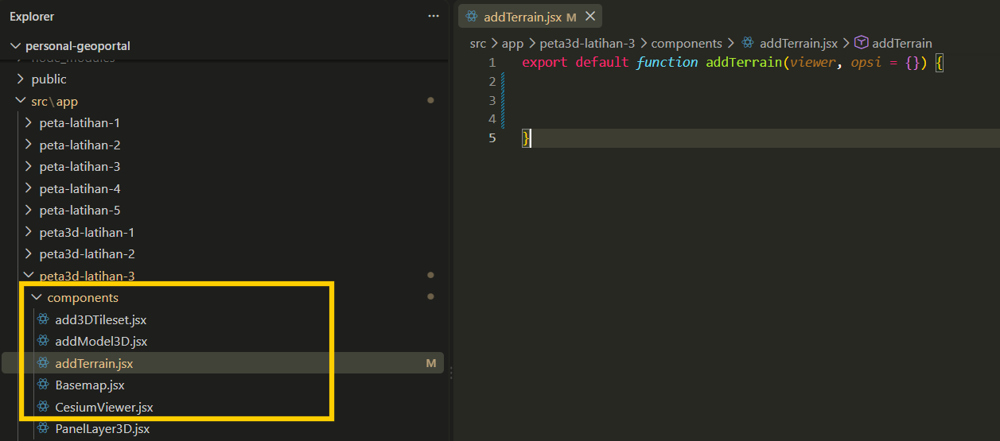
    
2. Selanjutnya buat fungsi **const Cesium = window.Cesium;** yang digunakan untuk mengambil library Cesium yang telah dimuat pada browser.
    
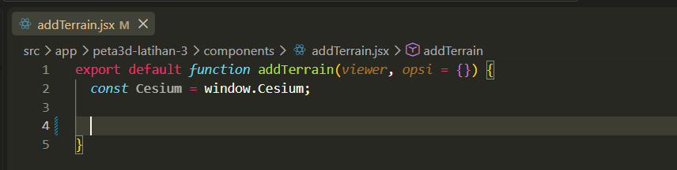
    
3. Pada tahap ketiga buat fungsi untuk untuk mengambil konfigurasi dari parameter opsi yaitu menentukan apakah terrain aktif saat awal aplikasi dijalankan dengan variabel **aktifTerrainAwal**, selanjutnya fungsi callback **onStatusBerubah** untuk mengetahui perubahan status terrain, serta **onLoadingBerubah** untuk mengetahui proses loading terrain.
    
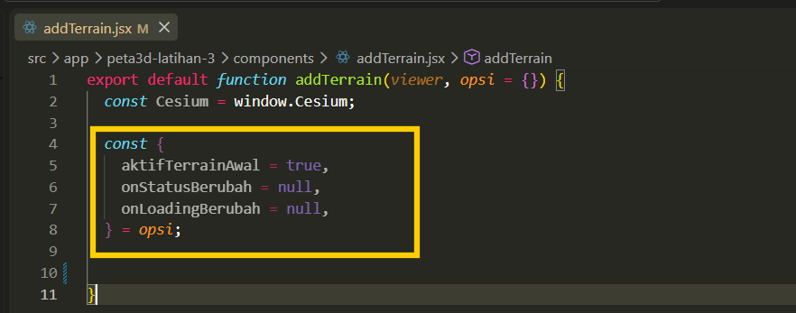
    
4. Pada tahap keempat buat fungsi untuk membuat **permukaanDatar** sebagai pengganti terrain 3D ketika terrain dinonaktifkan, membuat variabel **terrainAktif** untuk menyimpan status apakah terrain sedang aktif atau tidak, serta membuat **daftarListenerStatus** sebagai tempat menyimpan fungsi listener yang akan menerima informasi ketika status terrain berubah.
    
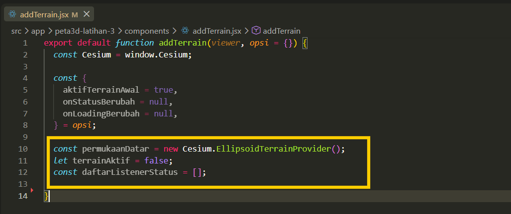
    
5. Tahap kelima buat fungsi **beritahuStatus()** sebagai wadah untuk mengelola dan menyampaikan informasi ketika terjadi perubahan status pada terrain, seperti saat terrain diaktifkan atau dinonaktifkan.
    

    
6. Tahap keenam didalam function **beritahuStatus**, buat fungsi dengan kondisi **if** untuk memeriksa apakah fungsi **onStatusBerubah** tersedia, kemudian mengirimkan informasi status terrain terbaru melalui fungsi tersebut.
    
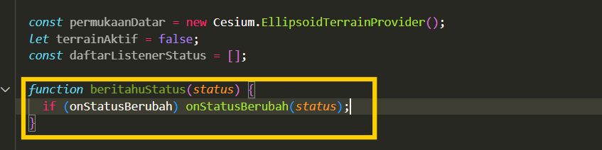
    
7. Selanjutnya tambahkan fungsi mengirimkan informasi status terrain terbaru kepada semua listener yang telah terdaftar di dalam **daftarListenerStatus**.
    

    
8. Tahap ketujuh buat fungsi **daftarkanListenerStatus()** yang digunakan untuk menerima dan mendaftarkan listener agar dapat memperoleh informasi ketika status terrain berubah serta tambahkan parameter **callback** atau **cb.**
    
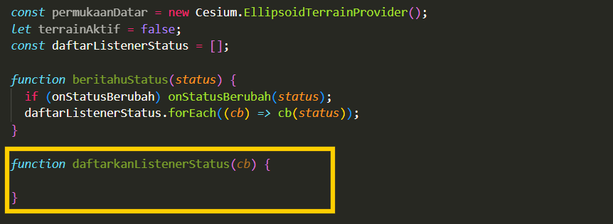
    
9. Kemudian didalam fungsi tersebut buat kondisi berupa **if** dahulu memastikan bahwa **cb** atau **callback** merupakan sebuah function, kemudian menyimpannya ke dalam **daftarListenerStatus**, lalu langsung mengirimkan status terrain saat ini kepada callback tersebut.
    
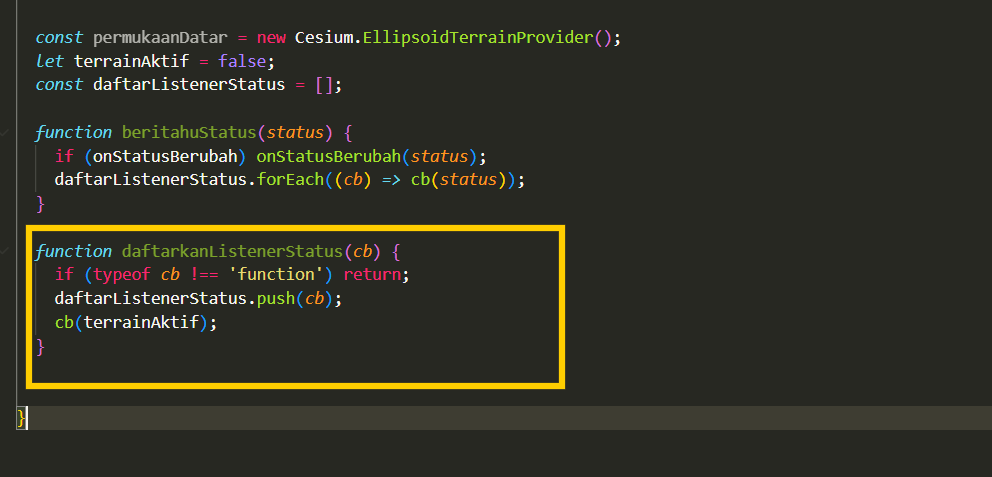
    
10. Selanjutnya pada tahap kedelapan, buat fungsi **aktifkanTerrain()** yang bertugas untuk memuat dan mengaktifkan terrain 3D pada Cesium Viewer.
    
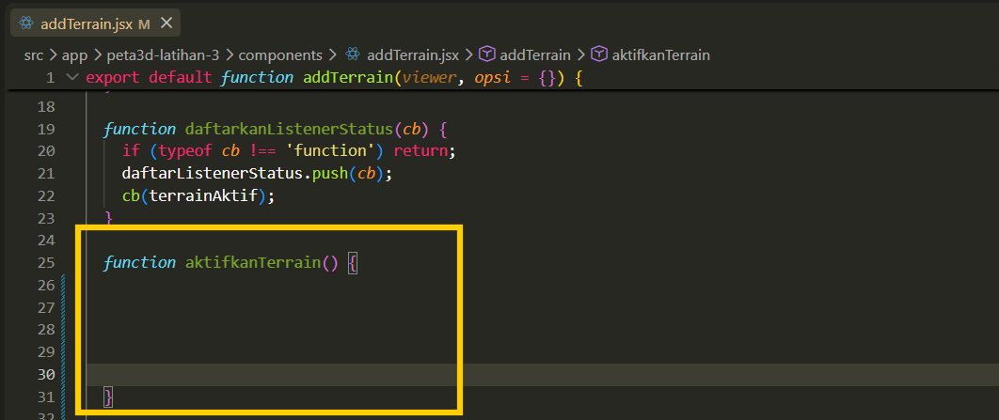
    
11. Tahap berikutnya didalam fungsi tersebut buat kondisi **if** untuk memeriksa apakah fungsi onLoadingBerubah tersedia, kemudian mengirimkan status **true** untuk menandakan bahwa proses pemuatan terrain sedang dimulai.
    
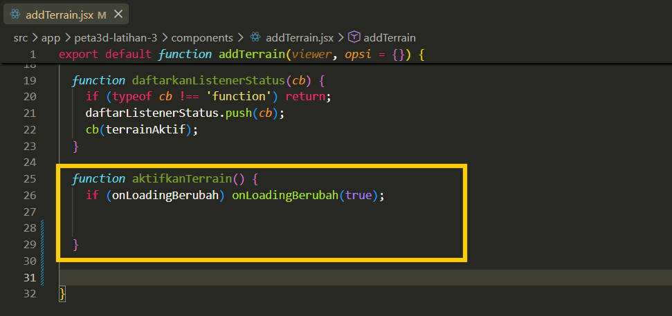
    
12. Selanjutnya buat fungsi **Cesium.createWorldTerrainAsync** melakukan proses pemuatan data World Terrain secara asynchronous agar terrain 3D dapat digunakan pada peta.
    
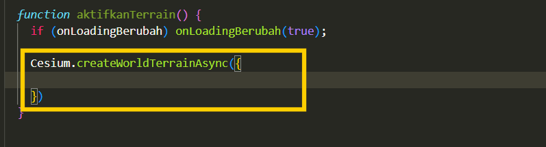
    
13. Kemudian pada fungsi **Cesium.createWorldTerrainAsync** tambahkan fungsi buat fungsi **requestVertexNormals: true,** yang digunakan untuk memuat data World Terrain, serta meminta data tambahan berupa vertex normals agar informasi bentuk permukaan terrain dapat digunakan.
    

    
14. Tahap selanjutnya buat fungsi **.then()** untuk menjalankan proses selanjutnya setelah data World Terrain berhasil dimuat, kemudian hasil terrain disimpan dalam variabel worldTerrain.
    
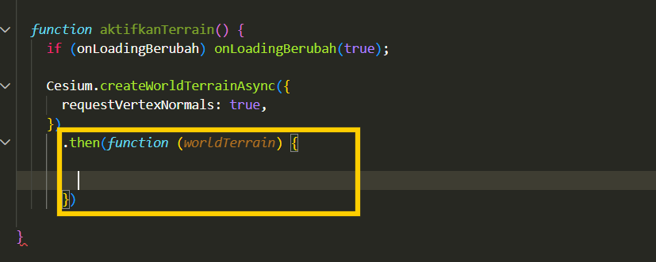
    
15. Selanjutnya dalam fungsi tersebut tambahkan data **worldTerrain** kemudian tambahkan pada **viewer** sehingga permukaan peta.
    
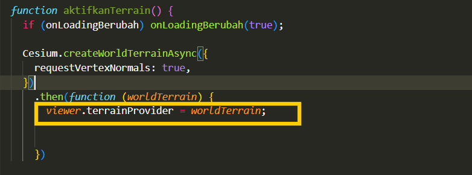
    
16. Tahap berikutnya tambahkan fungsi **terrainAktif= true** untuk menandakan bahwa terrain telah berhasil diaktifkan serta fungsi beritahuStatus() untuk memberitahu callback dan listener bahwa terrain sekarang dalam kondisi aktif.
    
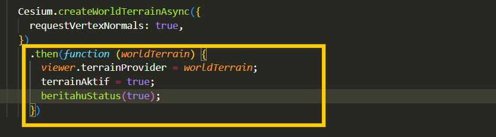
    
17. Tahap berikutnya buat fungsi **.finally()** untuk menjalankan proses akhir setelah proses pemuatan terrain selesai serta tambahkan kondisi **if** untuk memeriksa apakah fungsi **onLoadingBerubah** tersedia, kemudian mengirimkan status false untuk menandakan bahwa proses loading terrain telah selesai.
    
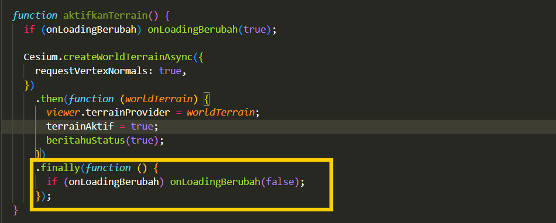
    
18. Kemudian pada tahap kesembilan buat **function** **matikanTerrain()** yang digunakan untuk menonaktifkan terrain 3D dan mengembalikan tampilan peta ke permukaan datar.
    

    
19. Selanjutnya dalam fungsi tersebut tambahkan v**iewer.terrainProvider = permukaanDatar;** yang digunakan untuk mengganti tampilan dengan terrain menjadi tampilan peta dengan permukaan datar. Kemudian tambahkan status **terrainAktif** **= false** untuk menandakan bahwa terrain telah dinonaktifkan serta tambahkan fungsi **beritahuStatus()** untuk memberitahu callback dan listener bahwa terrain sekarang dalam kondisi tidak aktif.
    
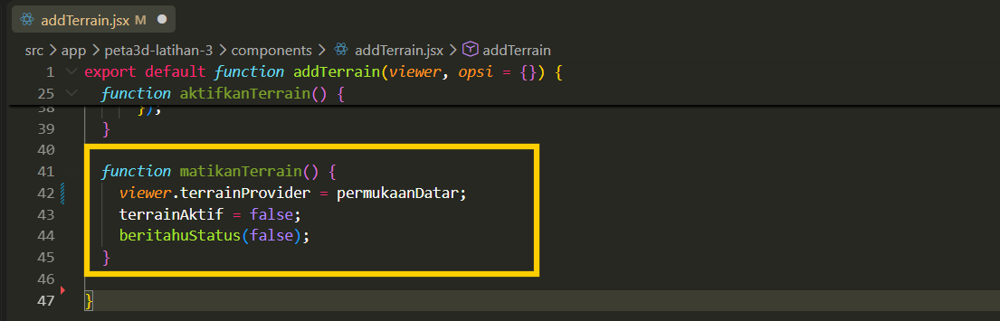
    
20. Selanjutnya pada tahap kesepuluh **function toggleTerrain()** untuk mengubah status terrain secara otomatis, yaitu mematikan terrain jika sedang aktif dan mengaktifkannya kembali jika sedang tidak aktif.
    
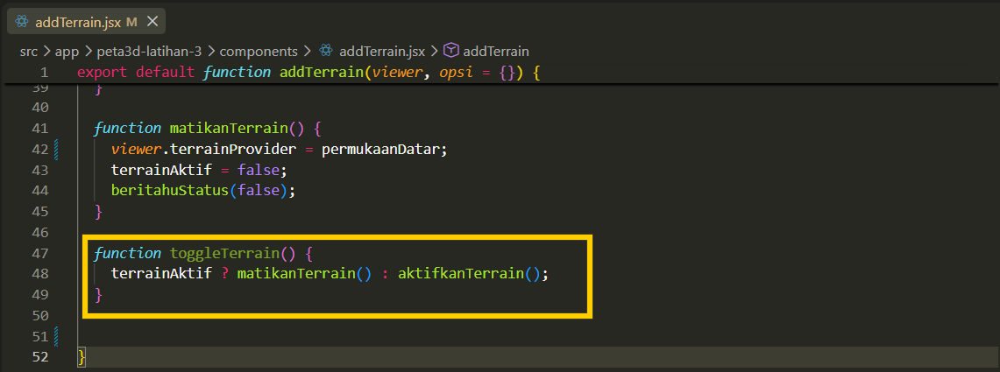
    
21. Pada tahap kesebelas buat **functionaturOpacityCitra()** yang digunakan untuk mengatur tingkat transparansi seluruh layer citra pada Cesium Viewer.
    
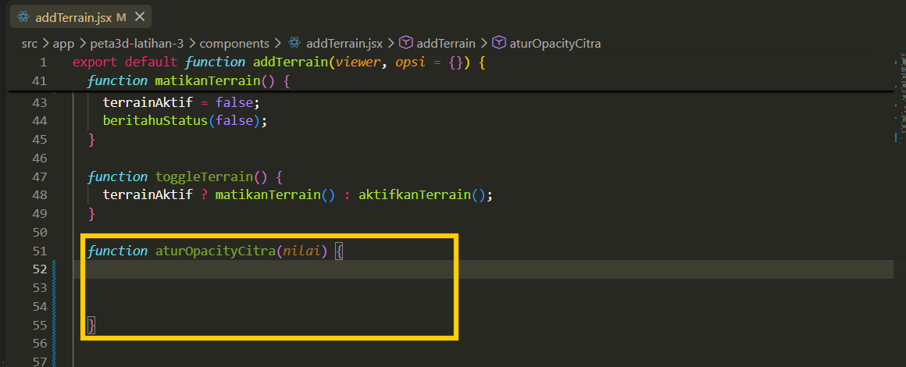
    
22. Selanjutnya dalam fungsi tersebut buat variabel untuk mengambil jumlah seluruh imagery layer yang terdapat pada Cesium Viewer.
    
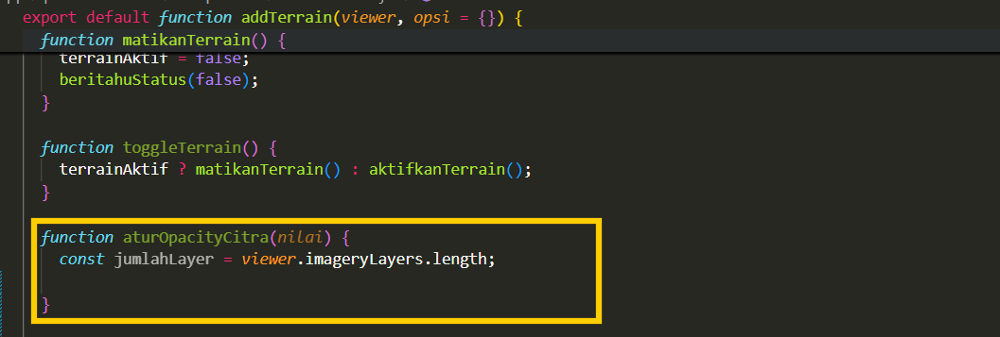
    
23. Selanjutnya tambahkan fungsi untuk mengakses setiap layer citra dengan melakukan perulangan untuk mengakses setiap layer citra yang terdapat di dalam viewer.imageryLayers.
    
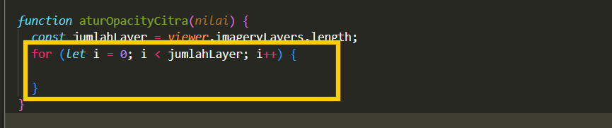
    
24. Kemudian pada fungsi perulangan tersebut tambahkan fungsi untuk nilai transparansi (alpha) setiap layer citra diubah sesuai dengan nilai yang diberikan.
    
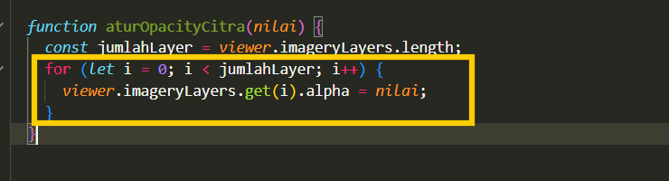
    
25. Selanjutnya pada tahap keduabelas buat fungsi **if aktifTerrainAwal;** dengan kondisi jika bernilai true maka terrain langsung diaktifkan, sedangkan jika bernilai false maka viewer menggunakan permukaan datar sebagai kondisi awal.
    
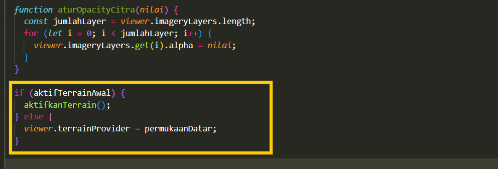
    
26. Pada tahap terakhir buat fungsi **return** yang digunakan untuk mengembalikan fungsi-fungsi yang telah dibuat di dalam **addTerrain()** agar dapat digunakan dari luar fungsi meliputi **aktifkanTerrain,** **toggleTerrain, aturOpacityCitra, daftarkanListenerStatus** serta **cekStatusAktif()** untuk memeriksa dan mengembalikan status terrain saat ini melalui nilai **terrainAktif**, yaitu true jika aktif dan false jika tidak aktif.
    
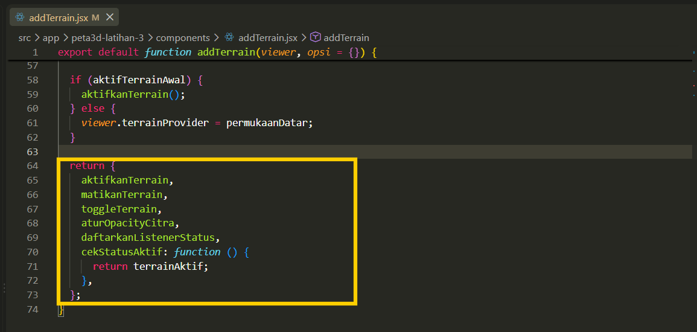
    
27. Script keseluruhan untuk addTerrain.jsx dapat dilihat pada gambar berikut ini.
    

    

## **Penambahan Panel Terrain pada Panel 3D Aset**

1. Pada tahap pertama dalam **export default function addPanelLayer3D** tambahkan parameter **kontrolTerrain** yang akan digunakan sebagai parameter untuk menambahkan tampilan pengaturan terrain dalam panel.
    
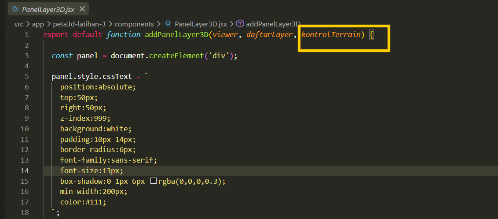
    
2. Kemudian pada tahap kedua, dibawah fungsi **Object.entries(daftarLayer)** buat fungsi **if** untuk memeriksa apakah **kontrolTerrain** tersedia sebelum membuat kontrol Terrain dan Citra pada panel.
    
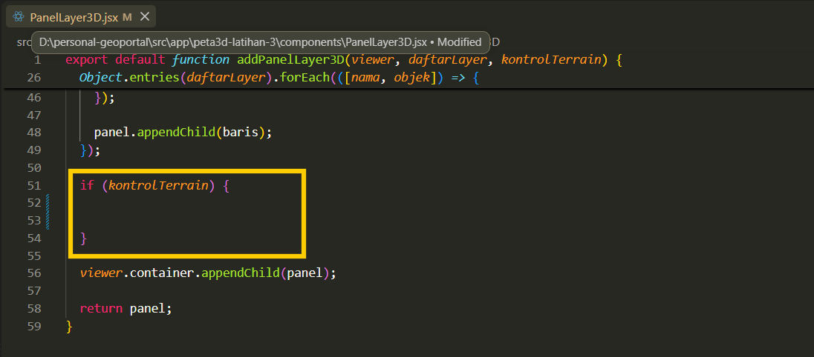
    
3. Pada tahap ketiga didalam buat variabel untuk membuat pemisah bagian panel yang akan digunakan sebagai pembatas antara kontrol sebelumnya dengan bagian Terrain dan Citra.
    
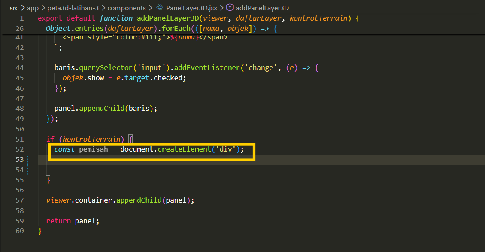
    
4. Selanjutnya buat elemen **pemisah.style.cssText** yang digunakan sebagai tampilan pemisah dengan garis horizontal, jarak, dan padding agar bagian Terrain dan Citra.
    
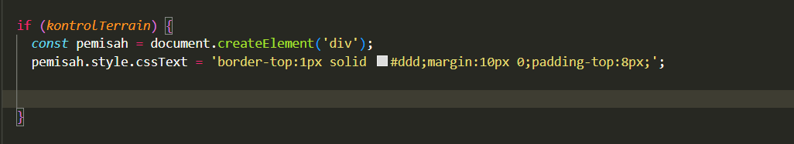
    
5. Kemudian tambahkan elemen **pemisah.innerHTML** untuk menambahkan judul Terrain & Citra.
    

    
6. Tahap berikutnya tambahkan elmen **panel.appendChild(pemisah);** pemisah yang telah dibuat dimasukkan ke dalam panel.
    
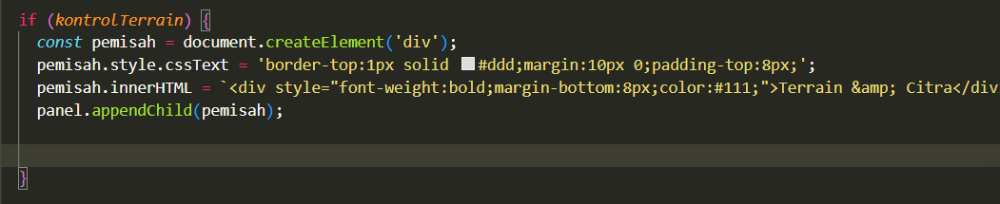
    
7. Pada tahap keempat buat variabel **const barisTerrain** yang akan digunakan sebagai wadah untuk checkbox dan teks kontrol terrain.
    
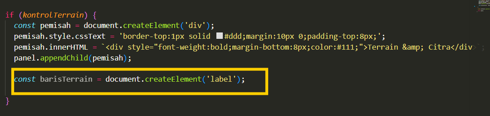
    
8. Selanjutnya buat elemen **barisTerrain.style.cssText** agar agar checkbox dan teks terrain tersusun secara horizontal.
    
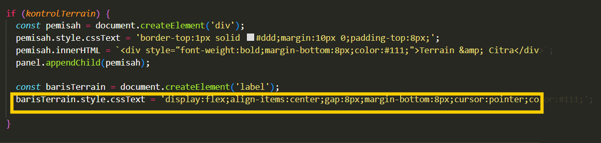
    
9. Tahap selanjutnya buat elemen **barisTerrain.innerHTML** yang digunakan untuk membuat checkbox mengaktifkan atau menonaktifkan Terrain (DEM).
    
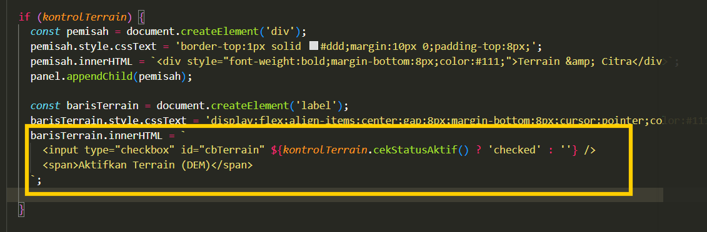
    
10. Pada tahap kelima buat variabel **const cbTerrain** yang digunakan untuk mengambil element input checkbox dari **barisTerrain** dan menyimpannya ke dalam variabel **cbTerrain**.
    
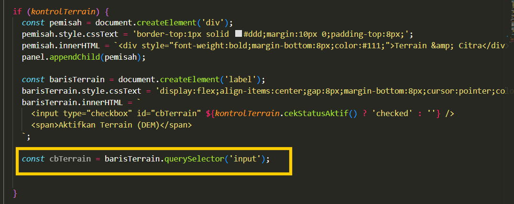
    
11. Tahap keenam buat fungsi berupa **cbTerrain.addEventListener('change', (e)** yang digunakan untuk mendeteksi ketika pengguna mengubah kondisi checkbox terrain.
    
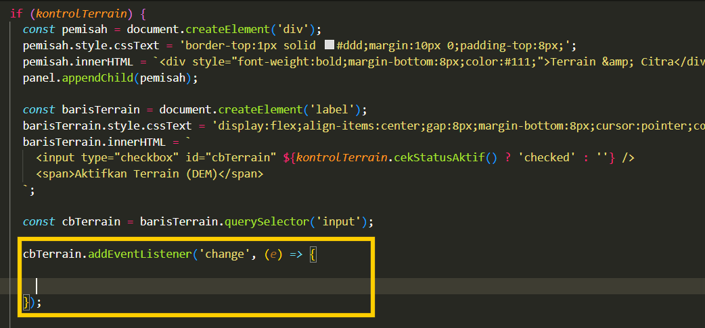
    
12. Selanjutnya pada fungsi tersebut buat kondisi **if** untuk memeriksa apakah checkbox dalam kondisi tercentang; jika tercentang terrain akan diaktifkan, sedangkan jika tidak tercentang terrain akan dinonaktifkan.
    
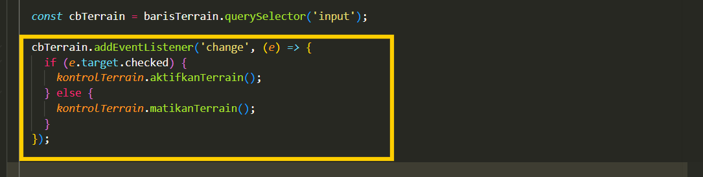
    
13. Tahap ketujuh buat fungsi dan kondisi **if** untuk memeriksa apakah **kontrolTerrain** memiliki fungsi **daftarkanListenerStatus()** yang dapat digunakan untuk menerima perubahan status terrain.
    
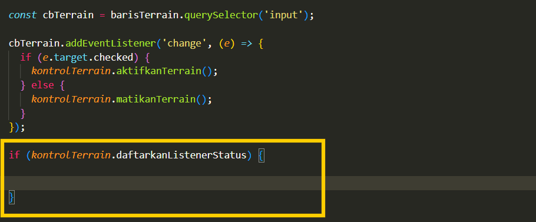
    
14. Pada tahap berikutnya dalam fungsi tersebut tambahkan fungsi untuk menerima informasi perubahan status terrain, sehingga ketika status terrain berubah menjadi aktif atau tidak aktif, kondisi checkbox akan otomatis diperbarui sesuai nilai **statusAktif**.
    
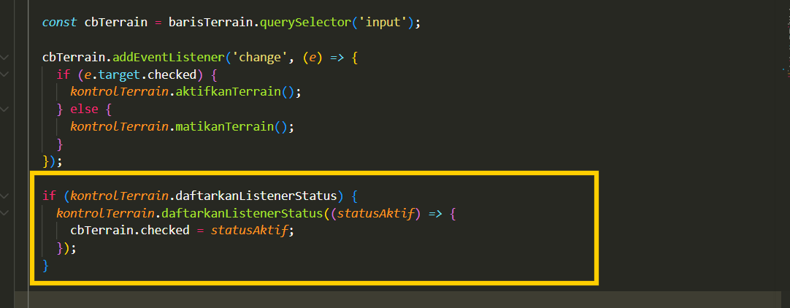
    
15. Tahap kedelapan buat elemen **barisTerrain** yang berisi checkbox dan teks kontrol Terrain ditambahkan ke dalam panel agar dapat ditampilkan pada antarmuka pengguna.
    
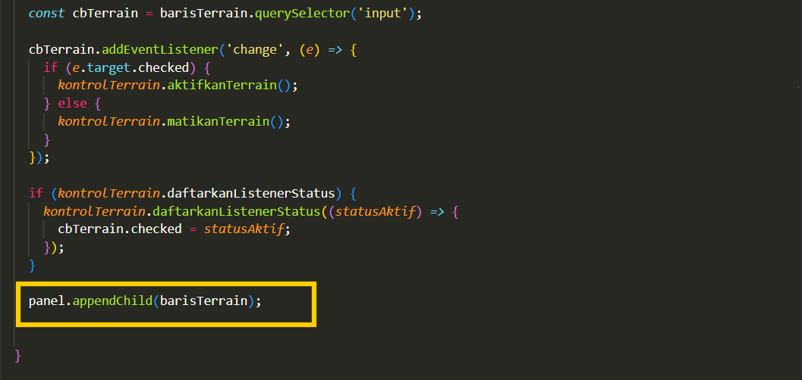
    
16. Tahap kesembilan buat variabel **const wrapOpacity** yang digunakan sebagai wadah untuk menempatkan kontrol transparansi citra.
    
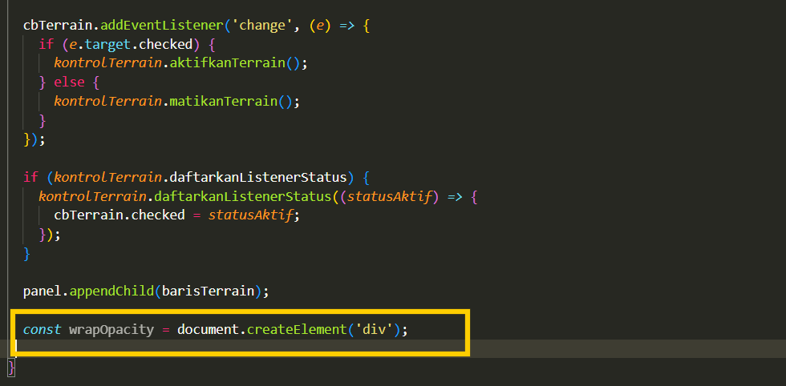
    
17. Selanjutnya buat elemen **wrapOpacity.style.cssText** untuk mengatur jarak dan warna teks agar kontrol transparansi terlihat lebih rapi di dalam panel.
    
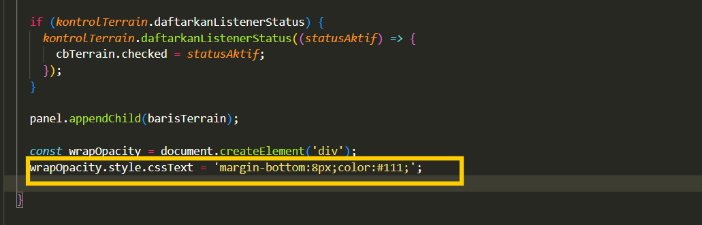
    
18. Tahap berikutnya buat elemen **wrapOpacity.innerHTML** untuk mengatur tingkat transparansi citra.
    
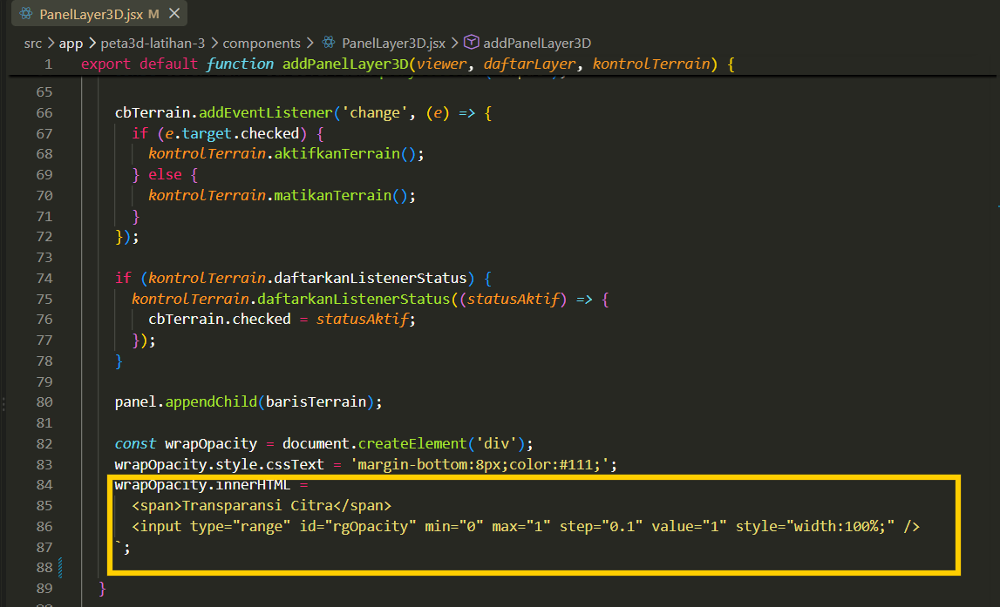
    
19. Selanjutnya buat elemen **wrapOpacity.querySelector** yang akan digunakan mendeteksi perubahan nilai slider, kemudian mengirimkan nilai tersebut ke fungsi aturOpacityCitra() untuk mengubah tingkat transparansi citra.
    
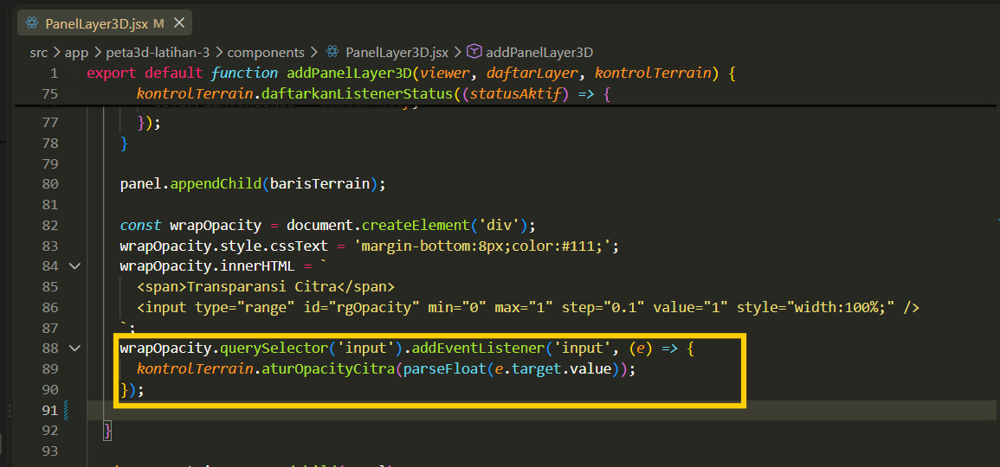
    
20. Tahap terakhir buat elemen kontrol transparansi citra yang telah dibuat ditambahkan ke dalam panel agar dapat ditampilkan pada antarmuka pengguna.
    
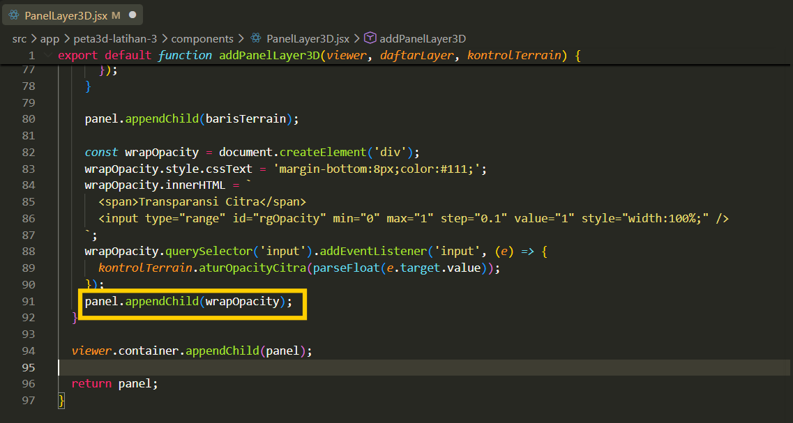
    

## **Integrasi Fungsi Terrain dengan Cesium Viewer**

1. Tahap pertama pada file **CesiumViewer.jsx** dalam fungsi berupa **function addContent3D(viewer)** buat fungsi **addTerrain()** dengan parameter viewer untuk membuat kontrol terrain, kemudian konfigurasi **aktifTerrainAwal: true** digunakan agar terrain langsung diaktifkan serta **variabel kontrolTerrain** untuk digunakan mengatur terrain.
    

    
2. Tahap kedua tambahkan **kontrolTerrain** bagai parameter ketiga ke fungsi **addPanelLayer3D()** agar panel layer dapat menggunakan fungsi-fungsi terrain.
    

    
3. Tahap terakhir pastikan addTerrain telah terpanggil dan terintegrasi pada halaman **CesiumViewer.jsx**.
    
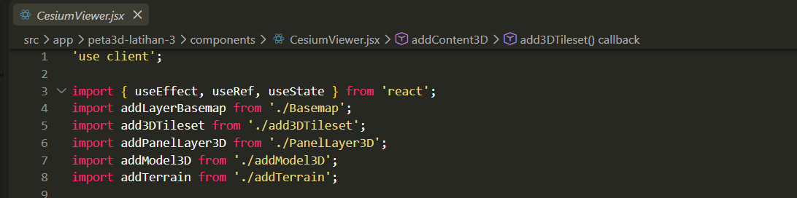
    
4. Hasil tampilan peta 3d dengan basemap citra satelit sebelum mengaktifkan tampilan terrain.
    

    
5. Hasil tampilan peta 3d dengan mengaktifkan tampilan terrain.
    

    

    
6. Hasil tampilan ketika mengatur transparansi citra.
    


### addTerrain.jsx, kode lengkap

```jsx
export default function addTerrain(viewer, opsi = {}) {
  const Cesium = window.Cesium;

  const {
    aktifTerrainAwal = true,
    onStatusBerubah = null,     
    onLoadingBerubah = null,    
  } = opsi;

  const permukaanDatar = new Cesium.EllipsoidTerrainProvider();
  let terrainAktif = false;
  const daftarListenerStatus = [];

  function beritahuStatus(status) {
    if (onStatusBerubah) onStatusBerubah(status);
    daftarListenerStatus.forEach((cb) => cb(status));
  }

  function daftarkanListenerStatus(cb) {
    if (typeof cb !== 'function') return;
    daftarListenerStatus.push(cb);
    cb(terrainAktif); 
  }

  function aktifkanTerrain() {
    if (onLoadingBerubah) onLoadingBerubah(true);

    Cesium.createWorldTerrainAsync({
      requestVertexNormals: true,
    })
      .then(function (worldTerrain) {
        viewer.terrainProvider = worldTerrain;
        terrainAktif = true;
        beritahuStatus(true);
        console.log('Terrain (DEM) berhasil diaktifkan.');
      })
      .finally(function () {
        if (onLoadingBerubah) onLoadingBerubah(false);
      });
  }

  function matikanTerrain() {
    viewer.terrainProvider = permukaanDatar; 
    terrainAktif = false;
    beritahuStatus(false);
  }

  function toggleTerrain() {
    terrainAktif ? matikanTerrain() : aktifkanTerrain();
  }

  function aturOpacityCitra(nilai) {
    const jumlahLayer = viewer.imageryLayers.length;
    for (let i = 0; i < jumlahLayer; i++) {
      viewer.imageryLayers.get(i).alpha = nilai;
    }
  }

  if (aktifTerrainAwal) {
    aktifkanTerrain();
  } else {
    viewer.terrainProvider = permukaanDatar;
  }

  return {
    aktifkanTerrain,
    matikanTerrain,
    toggleTerrain,
    aturOpacityCitra,
    daftarkanListenerStatus,
    cekStatusAktif: function () {
      return terrainAktif;
    },
  };
}
```
