# Management Database Spasial

Halaman ini melanjutkan [Instalasi dan Konfigurasi Basis Data Lokal](/hari-2/praktik-6/basis-data-lokal) dan [Membuat Tabel, Primary Key, dan Foreign Key](/hari-2/praktik-6/tabel-dan-relasi). Ada dua pekerjaan di sini: menyiapkan schema `gis` beserta extension PostGIS-nya, lalu memuat data vektor dari shapefile ke dalam schema tersebut.

## Peran schema public dan gis

| Schema | Isinya |
|---|---|
| `public` | Data non spasial: tabel user, tabel katalog data, tabel role, dan sejenisnya |
| `gis` | Data spasial: feature geometry |

Pemisahan itu menjaga layer spasial tidak tercampur dengan tabel aplikasi. QGIS diarahkan ke schema `gis`, dan GeoServer membaca layer dari schema yang sama.

::: tip Nama database pada tangkapan layar
Tangkapan layar di halaman ini diambil dari beberapa sesi, sehingga nama database dapat terbaca `geoportal`, `geoportal2`, atau `geoportal4`. Langkah-langkah berikut memakai nama database Anda sendiri.
:::

## Menyiapkan koneksi dan schema spasial

Urutan berikut mengulang langkah persiapan yang sudah dikerjakan pada halaman [Instalasi dan Konfigurasi Basis Data Lokal](/hari-2/praktik-6/basis-data-lokal). Bila database, schema `gis`, dan extension PostGIS sudah ada, bagian ini dapat dipakai sebagai pemeriksaan.

1. Buka DBeaver, lalu buat koneksi baru ke PostgreSQL dengan memilih **PostgreSQL** pada daftar tipe database.

 

2. Isi **Connection Settings**: **Host** `localhost`, **Port** `5432`, **Database** `postgres`, dan **Username** `postgres` beserta kata sandinya. Klik **Test Connection** untuk memastikan koneksi berhasil, lalu klik **Finish**.

 

3. Expand **Databases**, klik kanan di dalamnya, lalu pilih **Create New Database**.

 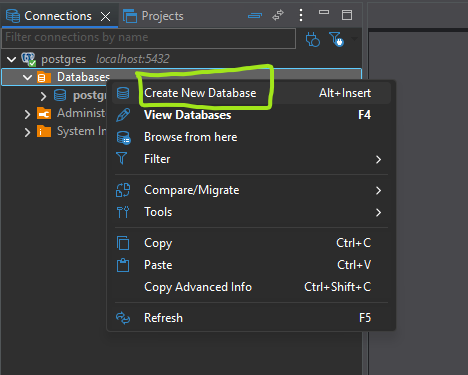

4. Isi **Database name** dengan `geoportal`, lalu klik **OK**.

 

5. Expand **Schemas** di dalam database tersebut, klik kanan, lalu pilih **Create New Schema**.

 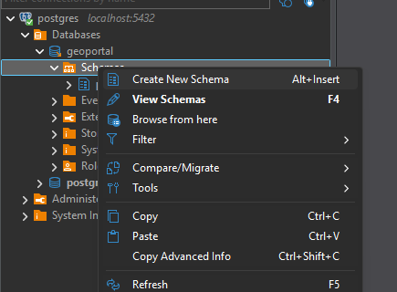

6. Isi **Schema name** dengan `gis`, lalu klik **OK**.

7. Aktifkan extension PostGIS pada schema itu. Klik kanan node **Extensions** dan pilih **Create New Extension**.

 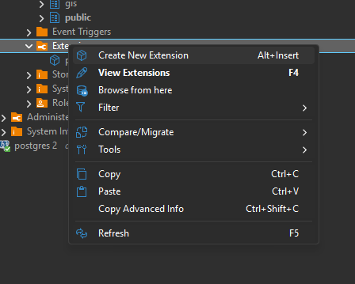

8. Pada dialog **Install extensions**, pilih **Database** dan **Schema** `gis`, kemudian pilih `postgis` dari daftar.

 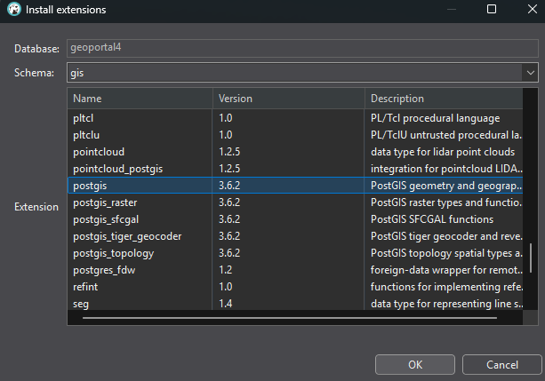

9. Buka QGIS. Pada panel **Browser**, klik kanan **PostgreSQL** lalu pilih **New Connection**. Isi **Name**, **Host** `localhost`, **Port** `5432`, **Database**, **User name**, dan **Password**, kemudian klik **Test Connection** sebelum menutup dialog dengan **OK**. Pada bagian **Database Details**, isi **Schema** dengan `gis` supaya layer spasial langsung terbaca dari schema itu.

 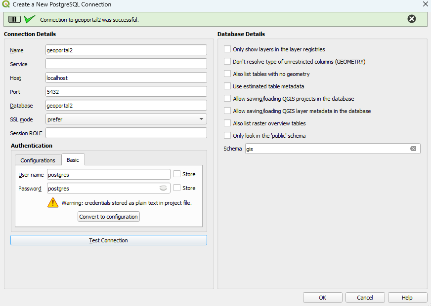

10. Arahkan `search_path` database ke schema `gis` lewat **Execute SQL** pada koneksi di panel Browser.

 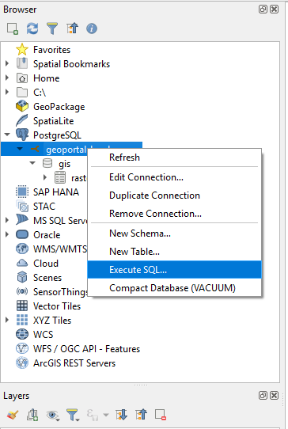

 ```sql
 ALTER DATABASE namadatabase SET search_path TO gis, public;
 SHOW search_path;
 ```

 Ganti `namadatabase` dengan nama database Anda. `search_path` menentukan schema yang dicari lebih dulu ketika nama tabel ditulis tanpa awalan schema, sehingga tabel di schema `gis` dapat dipanggil tanpa menuliskan nama schema-nya. Perintah terakhir harus menghasilkan `gis, public`.

 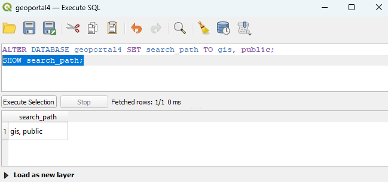

 QGIS menyimpan konfigurasi koneksi dari sebelum perintah itu dijalankan. Bila hasilnya belum berubah, tutup lalu buka lagi koneksinya.

## Membuat layer baru di schema gis

Layer baru dibuat dari QGIS, dan konfigurasinya diisi sesuai kebutuhan. Nilai berikut dipakai sebagai contoh pada halaman ini.

| Isian | Nilai contoh |
|---|---|
| Name | `Bangunan_Gedung` |
| Kolom | `nama`, `pemilik`, `luas_sertipikat`, `alamat` |
| Geometry type | Polygon |
| Geometry column name | `geom` |
| CRS | EPSG:4326 - WGS 84 |
| Create spatial index | Dicentang |

11. Pada panel **Browser**, klik kanan schema `gis` lalu pilih **New Table**.

 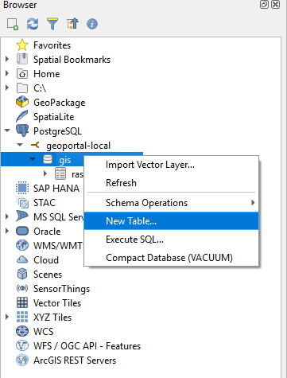

12. Isi konfigurasi layer seperti tabel di atas, lalu klik **OK**.

 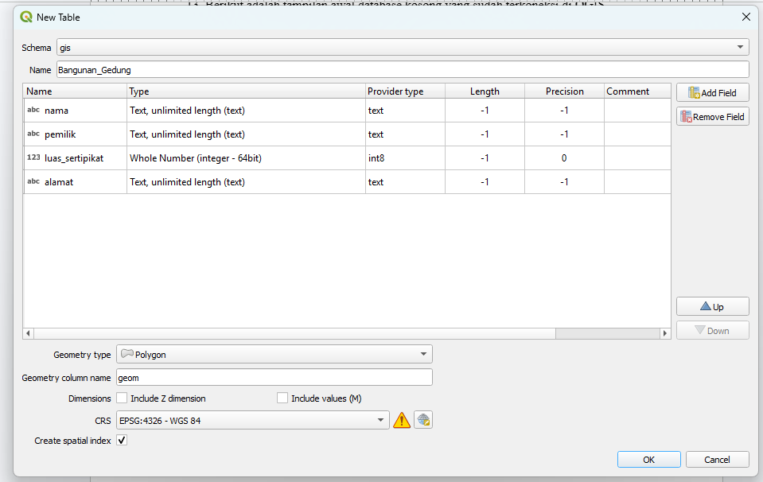

13. Tambahkan layer ke project lewat **Add Layer to Project** supaya muncul di panel **Layers**.

 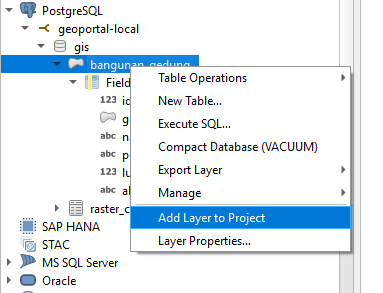

14. Tambahkan basemap OSM dari node **XYZ Tiles** → **OpenStreetMap**, juga lewat **Add Layer to Project**, supaya dapat zoom in ke tempat yang diinginkan.

 

15. Aktifkan **Toggle Editing** pada layer, digitasi layer dengan data secukupnya, lalu simpan hasilnya.

 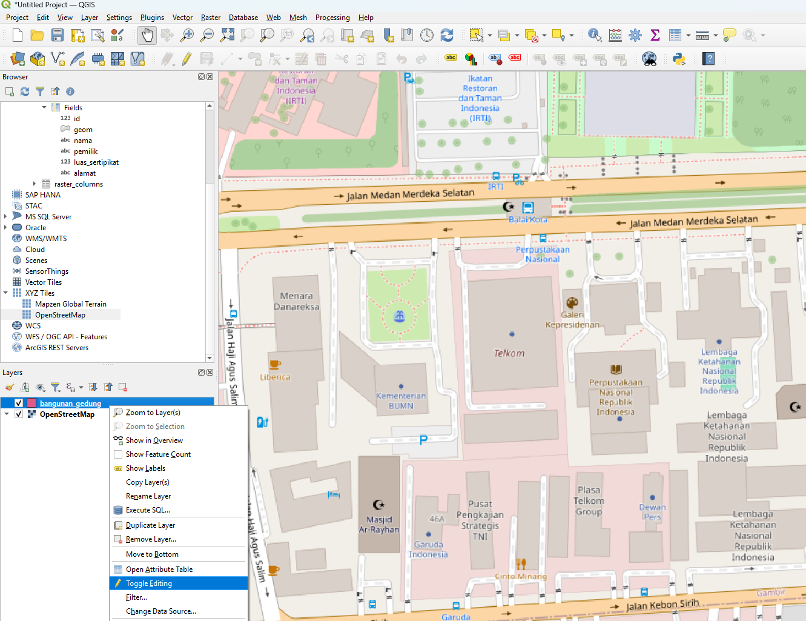

 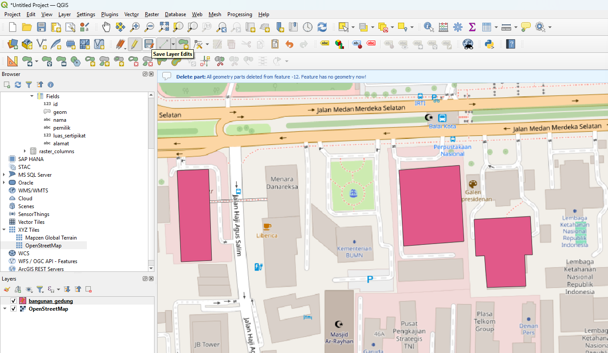

## Import Shapefile ke dalam Database

### Menyiapkan koneksi

16. Buka aplikasi **PostgreSQL Shapefile Loader Exporter**. Pada Windows, aplikasi ini terpasang bersama PostGIS Bundle dan terdaftar dengan nama Shapefile and DBF Loader Exporter.

 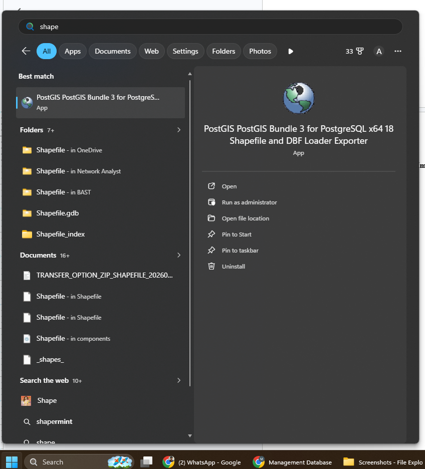

17. Buat koneksi ke database lewat tombol **View connection details…**, lalu isi kolom berikut.

 ```text
 Username : postgres
 Password : kata sandi PostgreSQL Anda
 Server Host : localhost
 Port : 5432
 Database : geoportal
 ```

 Klik **OK**. Log Window menampilkan `Connection succeeded` bila koneksi berhasil.

 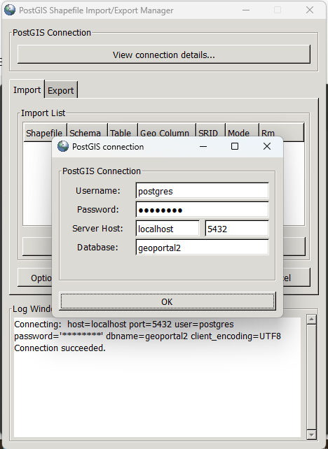

### Memuat shapefile

18. Klik **Add File**, lalu pilih berkas `.shp` yang akan dimuat ke database.

 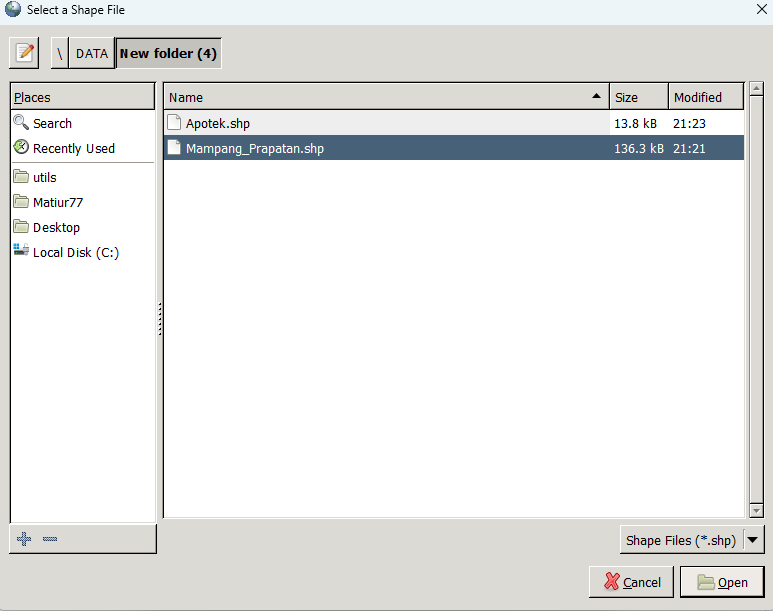

19. Atur **Schema** tujuan dan **SRID** data pada baris import, kemudian klik **Import**.

 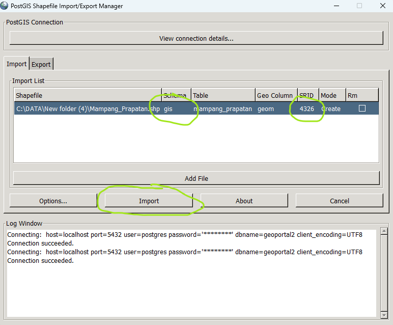

::: warning SRID harus sesuai data
Nilai SRID dipakai PostGIS untuk menafsirkan koordinat pada berkas. Bila nilainya tidak sama dengan SRID data aslinya, fitur akan tergambar di lokasi yang salah saat layer ditambahkan ke project. Pada contoh ini dipakai `4326`.
:::

20. Kembali ke QGIS, klik kanan schema `gis` lalu pilih **Refresh** agar daftar layer di dalamnya diperbarui.

 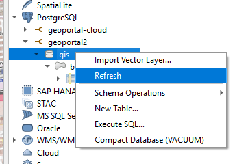

21. Tambahkan layer hasil import ke project lewat **Add Layer to Project** untuk memastikan SRID-nya benar. Bila posisinya tepat di atas basemap, SRID yang dipilih sudah sesuai.

 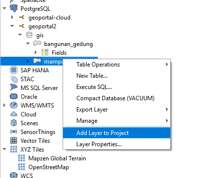

## Hasil akhir

Setelah seluruh langkah selesai, project QGIS memuat layer hasil digitasi dan layer hasil import bersama basemap OSM.

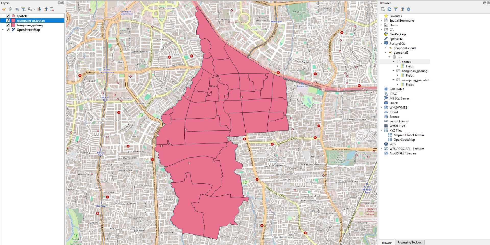

Langkah berikutnya, layer di schema `gis` dipublikasikan lewat GeoServer pada halaman [Koneksi PostgreSQL ke GeoServer dan Publish Layer](/hari-2/praktik-7/koneksi-postgis).
