# Membuat Tabel, Primary Key, dan Foreign Key

Halaman ini melanjutkan [Instalasi dan Konfigurasi Basis Data Lokal](/hari-2/praktik-6/basis-data-lokal). Database `geoportal`, schema `public` dan `gis`, serta koneksi DBeaver sudah dibuat di halaman itu. Yang dikerjakan di sini adalah mengisi schema `public` dengan dua tabel non spasial, yaitu `users` dan `katalog_data_2d`.

Tabel layer spasial dibuat terpisah di schema `gis` pada halaman [Management Database Spasial](/hari-2/praktik-6/database-spasial).

## Kolom tabel users

Tabel `users` menyimpan akun pengguna. Satu kolom ditetapkan sebagai primary key, yaitu kolom yang nilainya membedakan tiap baris dan tidak boleh sama.

| Kolom | Tipe | Keterangan |
|---|---|---|
| `user_id` | varchar | Primary key, tidak boleh kosong |
| `email` | varchar | Tidak boleh kosong, nilainya unik |
| `password` | varchar | Boleh kosong |
| `is_active` | bool | Boleh kosong |
| `role` | varchar | Boleh kosong |
| `nama` | varchar | Boleh kosong |

## Membuat tabel users

1. Buka DBeaver, expand koneksi PostgreSQL sampai node **Tables** di dalam schema `public`, klik kanan node tersebut, lalu pilih **Create New Table**.

    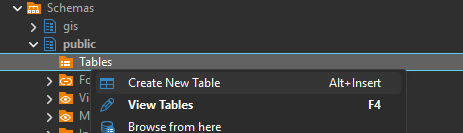

2. Isi **Table Name** dengan `users`, kemudian tambahkan kolom pada tab **Columns** sesuai daftar di atas.

3. Untuk kolom `user_id`, buka dialog **Edit attribute** kolom tersebut. Isi **Name** dengan `user_id`, **Data type** dengan `varchar`, centang **Not Null**, lalu pada bagian **Keys** centang **Unique** dan pilih **Type** `Primary Key`. Isi pula **Name** pada bagian itu dengan `users_pk`.

    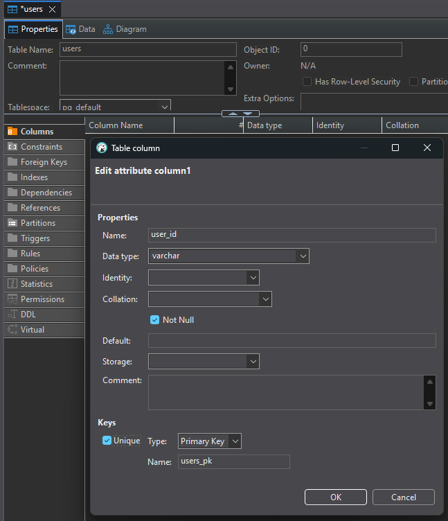

4. Periksa daftar kolom pada tab **Columns**. Kolom `user_id` dan `email` bertanda **Not Null**, dan kolom `user_id` bertipe `varchar`.

    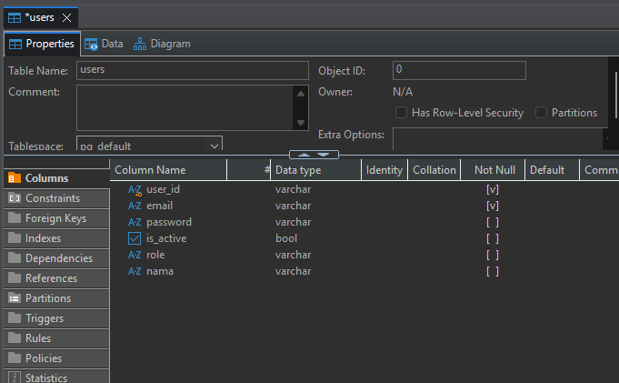

5. Sebelum tabel dibuat, DBeaver menampilkan perintah yang akan dijalankan pada dialog **users - Persist Changes**. Periksa isinya, lalu klik **Execute**.

    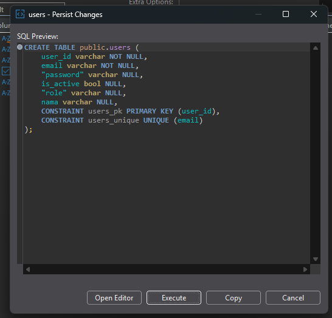

Perintah yang dijalankan DBeaver sama dengan blok berikut, sehingga dapat disalin bila Anda memakai SQL Editor:

```sql
CREATE TABLE public.users (
    user_id     varchar NOT NULL,
    email       varchar NOT NULL,
    "password"  varchar NULL,
    is_active   bool    NULL,
    "role"      varchar NULL,
    nama        varchar NULL,
    CONSTRAINT users_pk PRIMARY KEY (user_id),
    CONSTRAINT users_unique UNIQUE (email)
);
```

`CONSTRAINT users_pk PRIMARY KEY (user_id)` menjadikan `user_id` kunci utama tabel, sedangkan `CONSTRAINT users_unique UNIQUE (email)` mencegah dua akun memakai email yang sama.

## Membuat tabel katalog_data_2d dengan Import Data

Tabel `katalog_data_2d` menyimpan metadata layer peta 2D. Isinya dimuat dari berkas CSV yang sudah disiapkan, sehingga kolomnya mengikuti berkas itu.

1. Klik kanan node **Tables** di schema `public`, lalu pilih **Import Data**.

    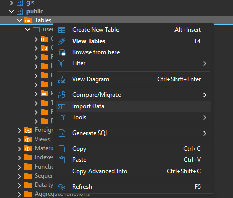

2. Pada wizard **Data Transfer**, tahap **Import source**, pilih **Target** schema `public` dan **Source format** `CSV`, lalu klik **Next**.

    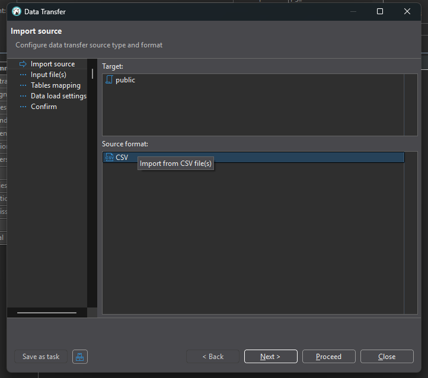

3. Pada tahap **Input file(s)**, klik **Browse** dan pilih berkas CSV yang akan dimuat.

    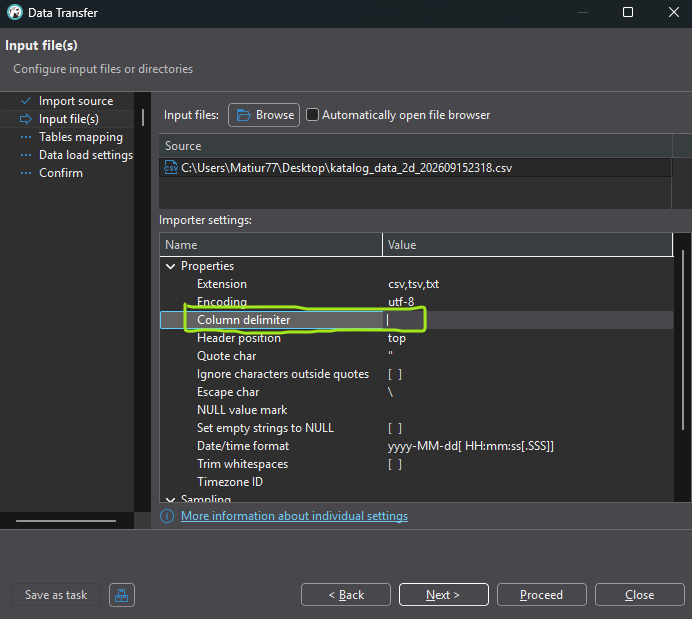

4. Pada tahap **Tables mapping**, periksa pasangan tabel sumber dan tabel tujuan. Tombol **Preview data** menampilkan beberapa baris pertama sebelum data dimasukkan.

    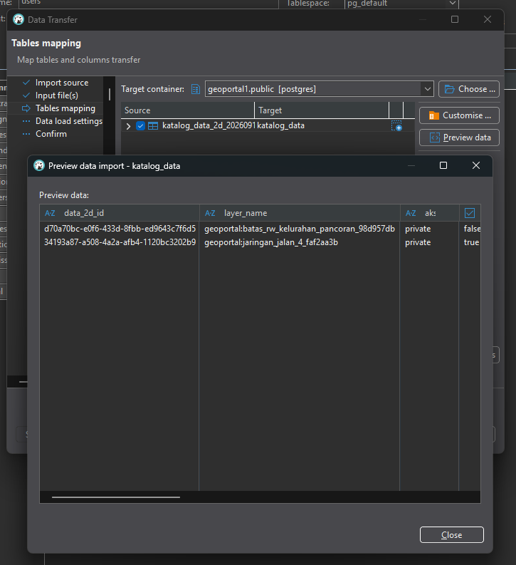

5. Lanjutkan tahap **Data load settings** dan **Confirm**, lalu klik **Proceed**.

6. Buka tabel hasil import pada tab **Data**. Kolomnya adalah `data_2d_id`, `layer_name`, `akses`, `is_editable`, `wms_url`, dan `wfs_url`.

    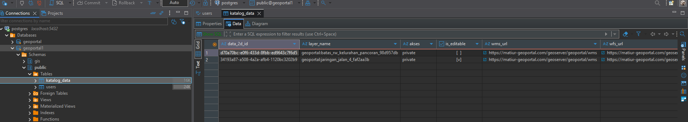

::: tip Nama tabel pada tangkapan layar
Sebagian tangkapan layar memakai nama tabel `katalog_data`. Halaman ini memakai nama `katalog_data_2d` agar sama dengan tabel yang dipakai [Konfigurasi Prisma dan Membuat API Login](/hari-3/praktik-8/prisma-api-login). Sesuaikan penamaan dengan tabel yang Anda buat sendiri.
:::

## Mengosongkan tabel hasil import

Foreign key pada bagian berikutnya menghubungkan kolom `author` ke tabel `users`. PostgreSQL memeriksa seluruh baris yang sudah ada saat constraint ditambahkan, dan menolak perintahnya bila ada nilai `author` yang tidak punya pasangan di `users`. Karena itu, kosongkan dulu tabel hasil import.

Jalankan perintah berikut pada jendela SQL di DBeaver:

```sql
DELETE FROM public.katalog_data_2d;
```

Setelah perintah itu dijalankan, tab **Data** tabel `katalog_data_2d` menampilkan kolom tanpa satu pun baris.

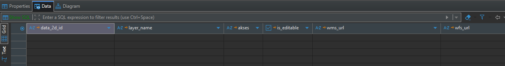

::: warning Perintah DELETE menghapus seluruh baris
`DELETE FROM public.katalog_data_2d;` tanpa klausa `WHERE` menghapus semua baris pada tabel tersebut. Berkas CSV sumbernya tidak ikut terhapus, jadi isinya masih dapat dimuat ulang.
:::

## Menambahkan foreign key pada kolom author

Foreign key membuat nilai pada kolom `author` harus cocok dengan salah satu nilai `user_id` di tabel `users`. Relasinya satu ke banyak: satu pengguna boleh memiliki banyak katalog, sedangkan satu baris katalog hanya menunjuk satu pengguna.

```sql
ALTER TABLE public.katalog_data_2d
    ADD FOREIGN KEY (author) REFERENCES public.users (user_id);
```

- `ALTER TABLE public.katalog_data_2d` menentukan tabel yang diubah, yaitu tabel katalog di schema `public`.
- `ADD FOREIGN KEY (author)` menentukan kolom yang menunjuk ke tabel lain, yaitu kolom `author`.
- `REFERENCES public.users (user_id)` menentukan tabel dan kolom tujuan acuannya, yaitu kolom `user_id` di tabel `users`. Kolom tujuan harus berupa primary key atau kolom unik, dan `user_id` sudah memenuhi syarat itu.

Di DBeaver, constraint yang sama dapat dibuat lewat dialog **Edit foreign key** pada tabel: isi **Reference table** dengan `users`, **Unique Key** dengan `users_pk (Primary Key)`, lalu pasangkan kolom `author` dengan kolom `user_id`. **On Delete** dan **On Update** dibiarkan **No Action**.

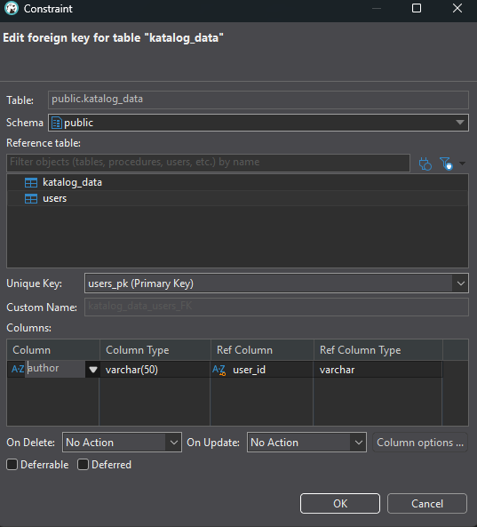

## Menetapkan primary key pada kolom data_2d_id

Tabel hasil import belum memiliki primary key. Tambahkan pada kolom `data_2d_id`, karena kolom itu yang membedakan tiap baris katalog.

```sql
ALTER TABLE public.katalog_data_2d
    ADD PRIMARY KEY (data_2d_id);
```

Primary key menuntut nilai yang unik dan tidak kosong. Karena baris hasil import sudah dikosongkan lebih dulu, perintah itu berjalan tanpa galat.

Di DBeaver, dialog **Add constraint for table** dipakai untuk hal yang sama: isi **Name** untuk constraint, pilih **Type** `PRIMARY KEY`, centang kolom `data_2d_id`, lalu klik **OK**.

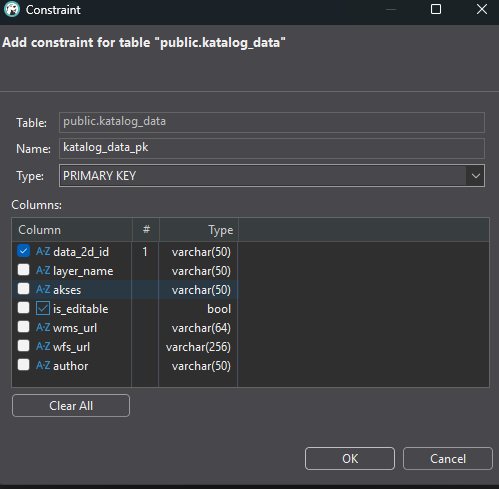

## Memeriksa hasil

Expand tabel `users` dan `katalog_data_2d` di DBeaver, lalu periksa node **Constraints**. Pada tabel `users` harus ada `users_pk` dan `users_unique`, sedangkan pada tabel `katalog_data_2d` harus ada primary key untuk `data_2d_id` dan foreign key untuk `author`.

Dengan keduanya ada, tabel non spasial sudah siap. Halaman berikutnya, [Management Database Spasial](/hari-2/praktik-6/database-spasial), membuat layer di schema `gis`.
