# Konfigurasi Prisma dan Membuat API Login

## **Konfigurasi Prisma**

1. Buka [supabase.com](http://supabase.com/) kemudian klik Dashboard, kemudian klik organization yang sudah dibuat
    
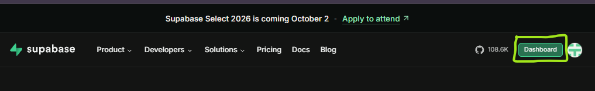
    
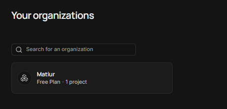
    
2. Setelah di dalam project klik menu Connect yang ada di sebelah atas
    
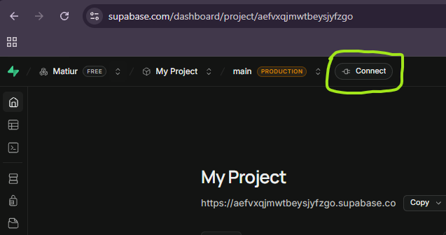
    
3. Dibagian Connect to your project pilih ORM lalu pilih Prisma, di bagian bawah akan ada cara koneksi Prisma ke PostgreSQL supabase
    
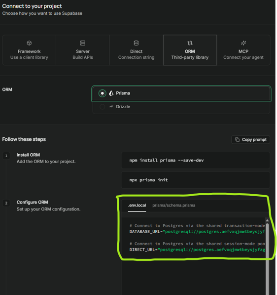
    
4. Buka project folder NextJS di VS Code, jalankan perintah dibawah ini untuk install prisma dan prisma client
    
    ```jsx
    npm install @prisma/client@6
    npm install prisma@6 --save-dev 
    npx prisma init
    ```


    
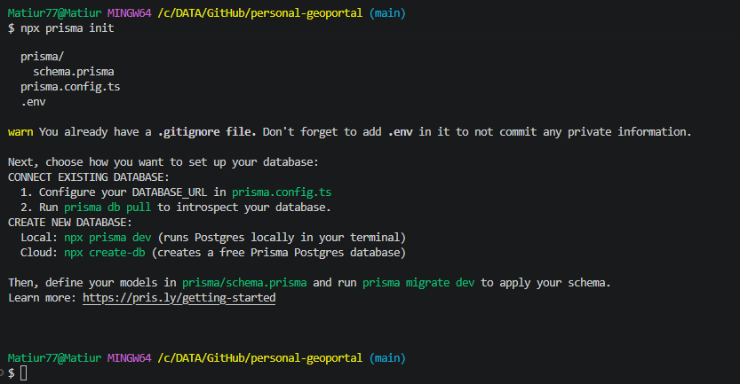
    
5. Setelah itu prisma akan membuat tiga file baru di project NextJS yaitu schema.prisma, .env dan prisma.config.ts. Hapus prisma.config.ts.
    

    
6. Setelah itu buka file schema.prisma. File ini adalah konfigurasi database kita, pada file ini terdapat bagian datasource db, bagian ini lah yang menentukan database apa yang digunakan dan bagaimana cara koneksinya.
    
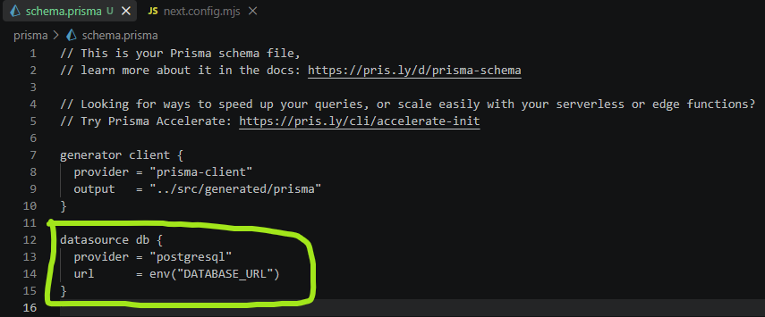
    
7. Perhatikan bagian url = env(“DATABASE_URL”), tambahkan directUrl juga, lalu hapus output, dan juga ubah provider dari prisma-client jadi prisma-client-js sehingga menjadi seperti ini kemudian Save
    
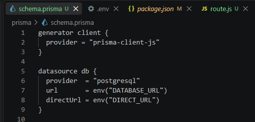
    
8. Buka file .env, file ini otomatis terbuat saat menjalankan perintah npx prisma init. Hapus semua isinya kemudian copy .env.local dari Supabase dan paste ke .env di NextJS kita
    
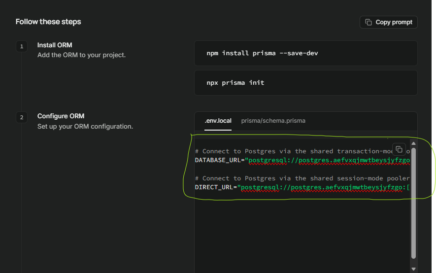
    
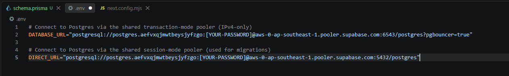
    
9. Hasil yang kita paste ke .env terdapat [YOUR_PASSWORD] ini adalah placeholder untuk mengisikan password database kita yang dibuat saat membuat database di Supabase. Setelah menggunakan password yang benar Save .env file. Kemudian jalankan command npx prisma db pull
    
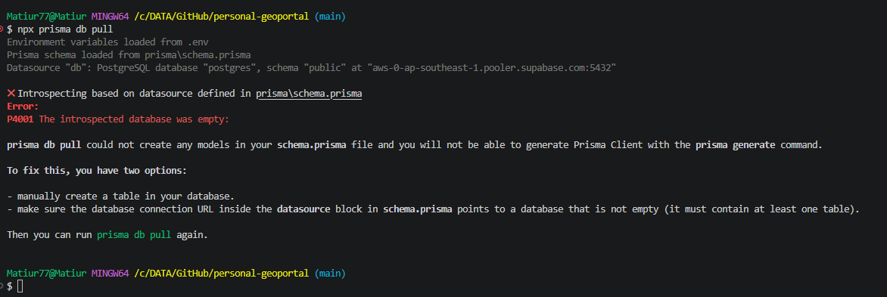
    
10. Saat menjalankan npx prisma db pull akan error karena database kita masih kosong jadi tidak ada tabel yang bisa ditarik ke schema.prisma kita. Oleh karena itu kita harus membuat tabel di database kita. Cara paling mudah adalah dengan menggunakan DBeaver. Buka DBeaver lalu buka koneksi database Supabase kita.
    
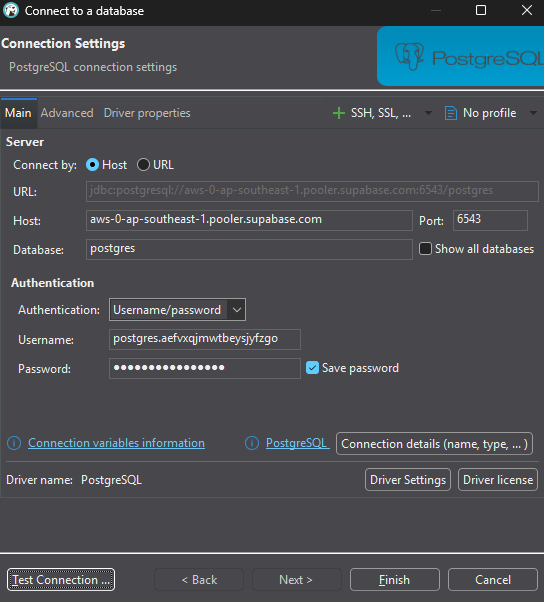
    
11. Buat table baru di schema public. Beri nama table “Users” kemudian buatkan kolom user_id, email, dan password semuanya dalam format varchar
    
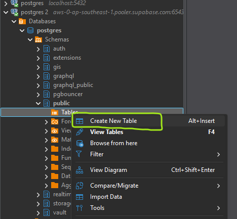
    
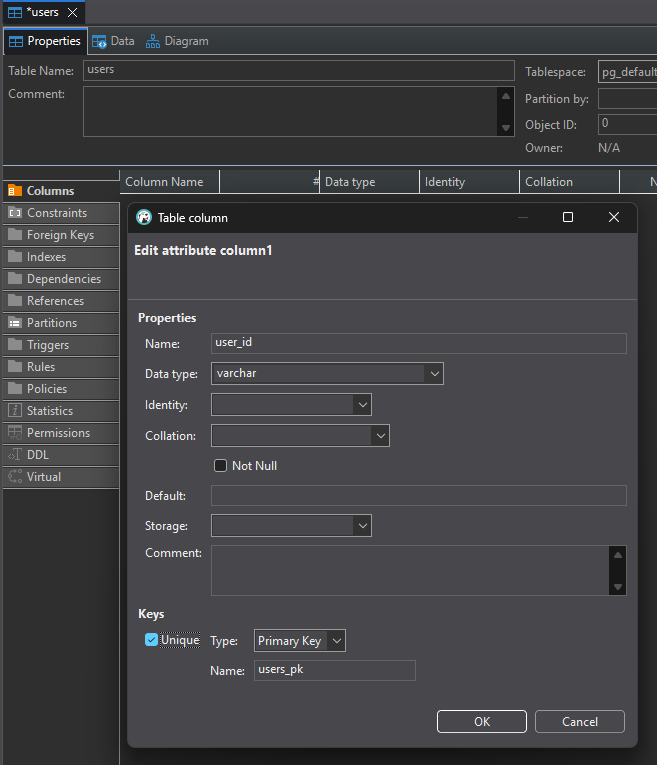
    
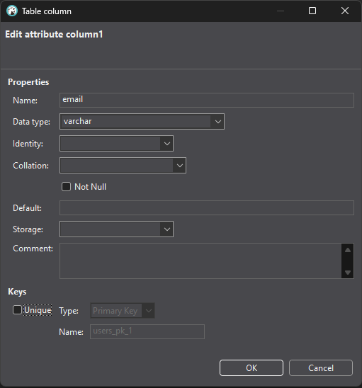
    
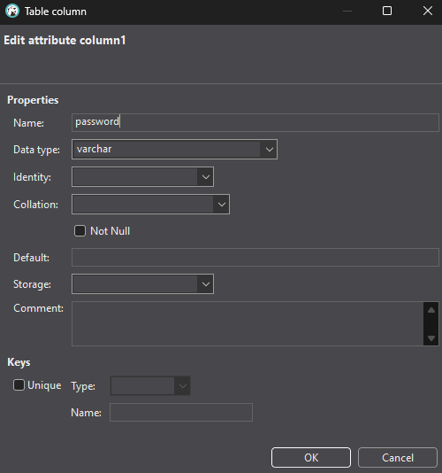
    
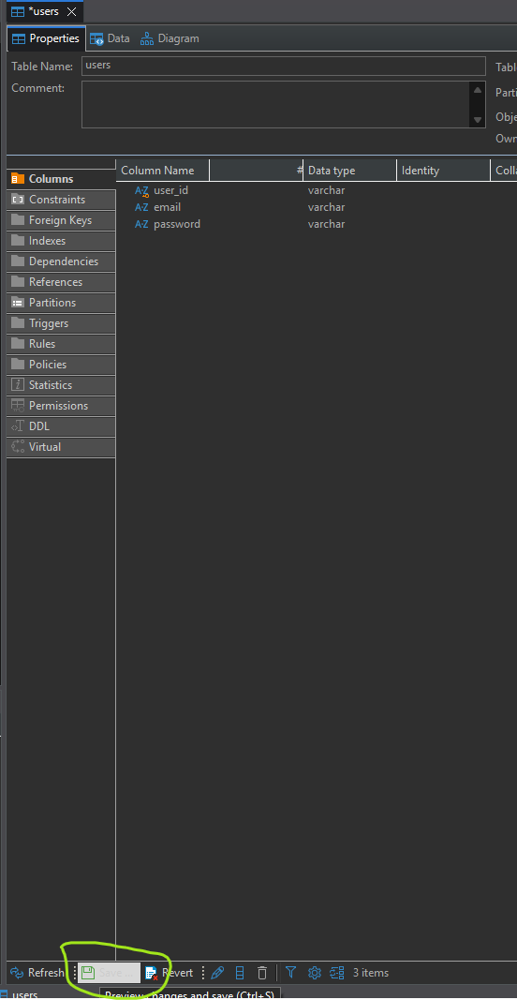
    
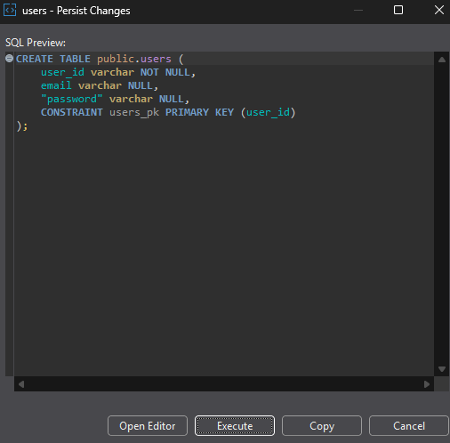
    
12. Sekarang database sudah memiliki satu table yaitu table users, lakukan kembali npx prisma db pull, setelah berhasil cek schema.prisma sekarang ada model table users
    
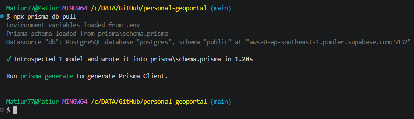
    
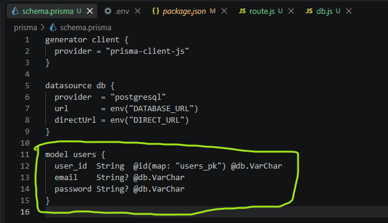
    
13. Jalankan npx prisma generate supaya prisma client membaca schema.prisma yang baru
    
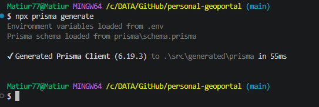
    
14. Selanjutnya adalah konfigurasi prisma client supaya client bisa digunakan di nextjs, buat folder bernama lib di root project folder, kemudian buat file bernama db.js
    
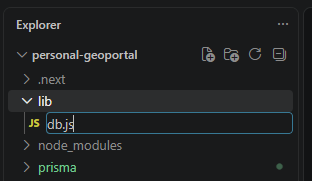
    
15. Isikan file tersebut dengan code berikut
    
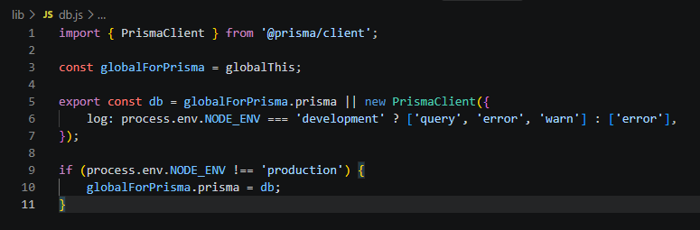
    

### prisma/schema.prisma, kode lengkap

```prisma
generator client {
  provider = "prisma-client-js"
}

datasource db {
  provider = "postgresql"
  url      = env("DATABASE_URL")
}

model users {
  user_id         String            @id(map: "users_pk") @db.VarChar
  email           String            @unique(map: "users_unique") @db.VarChar
  password        String?           @db.VarChar
  role            String?           @db.VarChar
  is_active       Boolean           @default(false)
  nama            String?           @db.VarChar
  katalog_data_2d katalog_data_2d[]
  katalog_data_3d katalog_data_3d[]
}

model katalog_data_2d {
  data_2d_id  String   @id(map: "katalog_data_2d_pk") @db.VarChar
  layer_name  String?  @db.VarChar
  akses       String?  @db.VarChar
  is_editable Boolean?
  wms_url     String?  @db.VarChar
  wfs_url     String?  @db.VarChar
  author      String?  @db.VarChar
  users       users?   @relation(fields: [author], references: [user_id], onDelete: NoAction, onUpdate: NoAction, map: "katalog_data_2d_users_fk")
}

model katalog_data_3d {
  data_3d_id String  @id(map: "katalog_data_3d_pk") @db.VarChar
  author     String? @db.VarChar
  nama       String? @db.VarChar
  akses      String? @db.VarChar
  url        String? @db.VarChar
  latitude   Float?
  longitude  Float?
  heading    Int?
  pitch      Int?
  roll       Int?
  scale      Int?
  tipe_file  String? @db.VarChar
  users      users?  @relation(fields: [author], references: [user_id], onDelete: NoAction, onUpdate: NoAction, map: "katalog_data_3d_users_fk")
}
```

## **Membuat API Login**

1. Buat folder baru di dalam folder app bernama api/users dua folder akan otomatis terbuat api => users
    
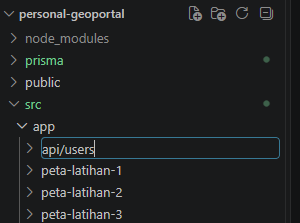
    
2. Di dalam users buat folder bernama login, setelah folder login dibuat, buat file baru bernama route.js
    
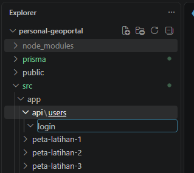
    
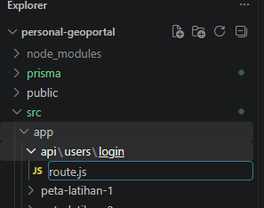
    
3. Code API login akan dibuat di dalam file route.js ini. Buat kode seperti dibawah ini, kemudian buka postman buat request POST ke url localhost:3000/api/users/login maka hasilnya akan seperti berikut
    
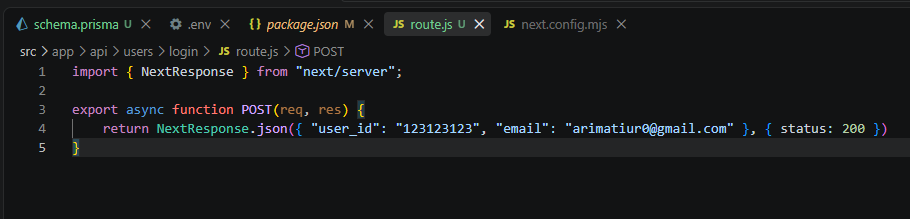
    
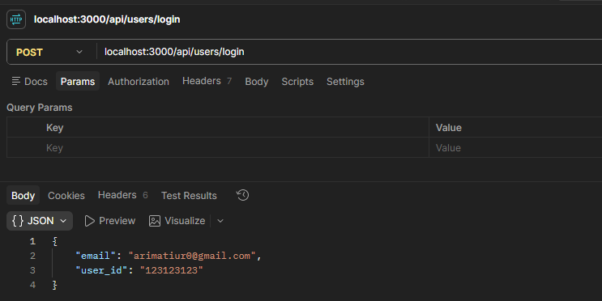
    
4. Saat ini API sudah berjalan terbukti dengan memberikan response seperti apa yang kita inginkan tetapi API belum menggunakan data dari database kita. Buka DBeaver kemudian buat row baru di tabel users. Isikan user_id email dan password
    
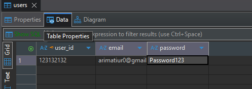
    
5. Setelah itu kembali ke route.js API login kita, ubah kode menjadi seperti berikut
    
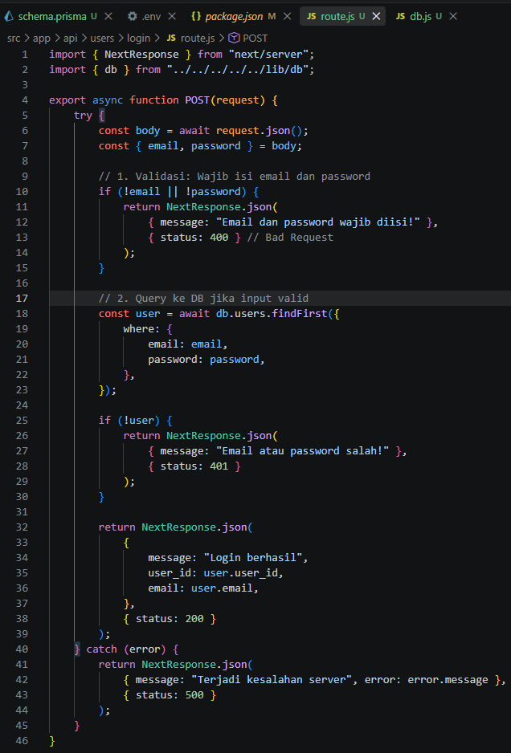
    
6. Buka postman lalu test API dengan memasukan email dan password benar, email atau password salah, password tidak diisi berikut hasilnya sesuai dengan logika API kita
    
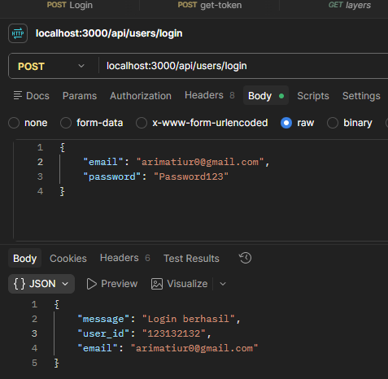
    
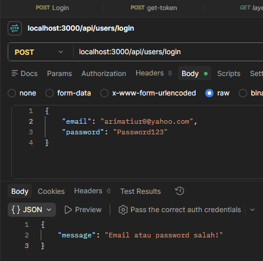
    
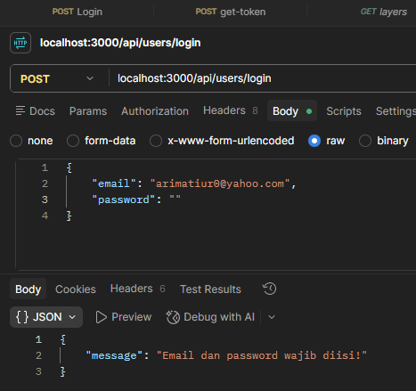
    
7. Saat ini di database kita bisa melihat password user dan kita bisa login menggunakan user manapun, agar secure dan memastikan yang bisa mengakses akun user adalah user itu sendiri bukan orang lain kita harus merahasiakan password user sehingga hanya pemiliknya yang tau. Install bcryptjs dengan command npm install bcryptjs
    
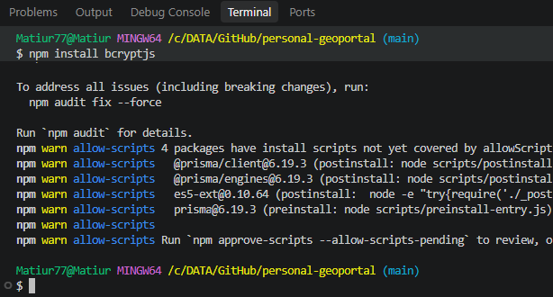
    
8. Pada terminal jalankan perintah node lalu anda akan masuk ke terminal node masukan kode berikut dan lihat hasilnya
    
    ```jsx
    const bcrypt = require('bcryptjs');
    const hash = bcrypt.hashSync('Password123', 10);
    console.log(hash);
    ```

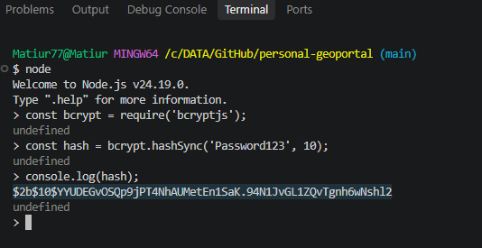

9. Bisa dilihat setelah console.log di execute muncul string hasil hashing copy hasilnya kemudian paste ke database. Sekarang password di database isinya masih sama “Password123” hanya saja sekarang sudah di hashing jadi yang tau value aslinya hanya orang yang mengeksekusi hashing nya yang mana itu adalah pemilik akun itu sendiri
    
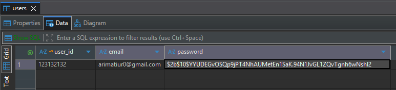
    
10. Selanjutnya ubah kodingan login menjadi seperti dibawah ini, jika sebelumnya kita hanya membandingkan dua value secara langsung dengan ‘where’ sekarang kita membandingkannya dengan fungsi compare yang ada di library bcryptjs
    
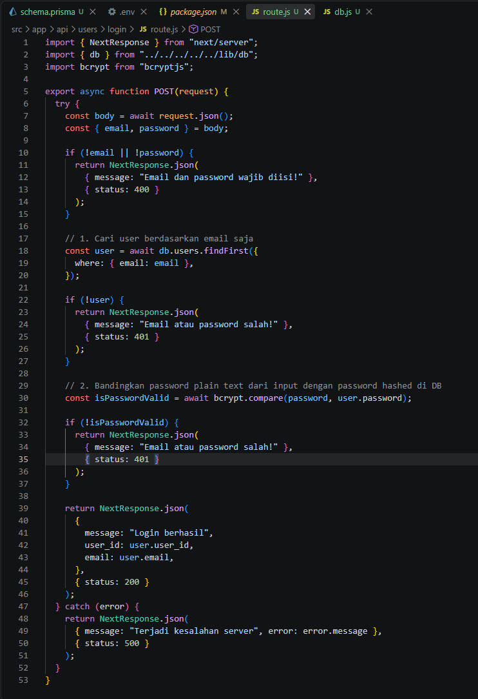
    
11. Login tetap berhasil walaupun password yang kita masukan adalah value asli sebelum hashing
    
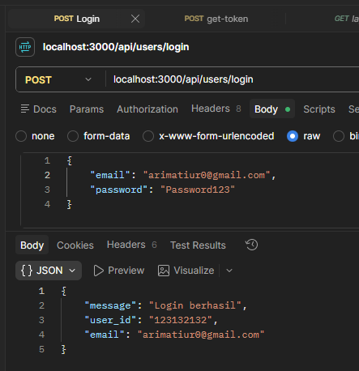
    

### src/app/api/users/login/route.js, kode lengkap

```js
import { NextResponse } from "next/server";
import { verifyCredentials } from "../../../../../lib/auth/verifyCredentials";
import { signAccessToken } from "../../../../../lib/auth/jwt";

export async function POST(request) {
  try {
    const { email, password } = await request.json();

    if (!email || !password) {
      return NextResponse.json(
        { message: "Email dan password wajib diisi!" },
        { status: 400 }
      );
    }

    const user = await verifyCredentials(email, password);
    const accessToken = signAccessToken(user);

    return NextResponse.json(
      {
        message: "Login berhasil",
        access_token: accessToken,
        user: { id: user.user_id, email: user.email, role: user.role },
      },
      { status: 200 }
    );
  } catch (error) {
    const status = error.message.includes("aktivasi") ? 403 : 401;
    return NextResponse.json({ message: error.message }, { status });
  }
}
```

## **Konfigurasi File-File CICD Setelah Koneksi Database Menggunakan Prisma**

1. Saat melakukan setup di atas ada beberapa file baru di project NextJS yang akan di push ke GitHub dan juga ada beberapa perintah di terminal yang dijalankan seperti npx prisma generate. Semua prosedur ini harus dimasukan ke proses CICD agar web production kita bisa berjalan sama persis seperti web local. Buka Dockerfile, ubah menjadi seperti ini
    
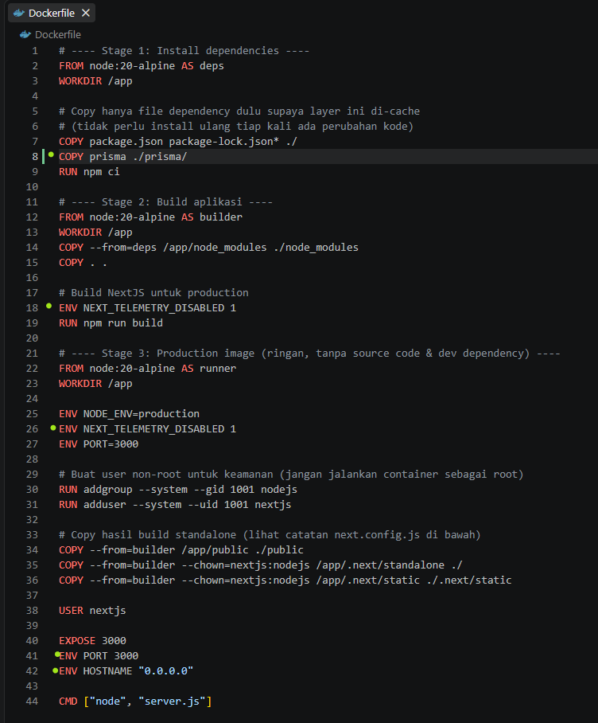
    
2. Selanjutnya perbaiki cloudbuild.yaml menjadi seperti ini
    
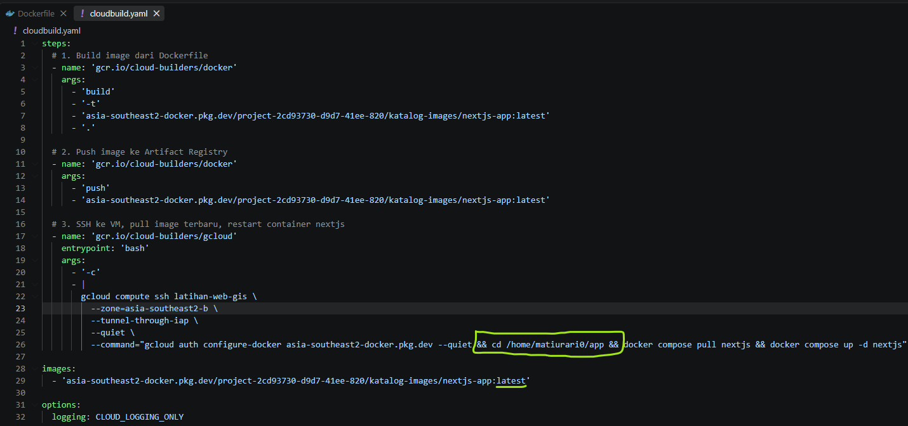
    
3. Selanjutnya ubah docker-compose.yml di VM menggunakan SSH, ubah menjadi seperti dibawah lalu Ctrl + O Enter Ctrl+X
    
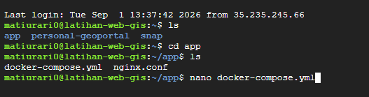
    
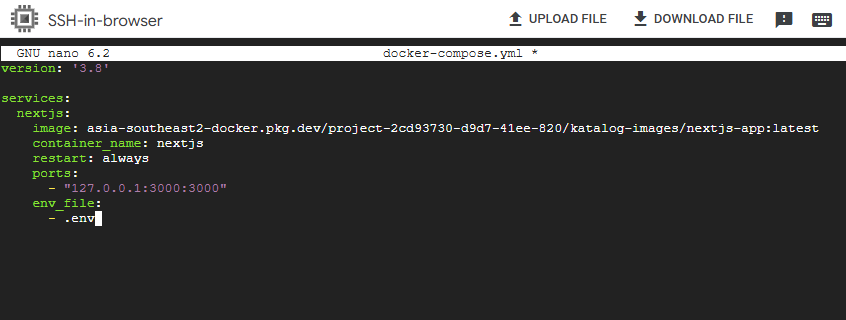
    
4. Selanjutnya ubah next.config.mjs menjadi seperti berikut, tambahkan basepath supaya semua web kita harus diawali portal setelah .com
    
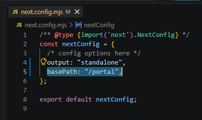
    
5. Tambahkan di script prisma generate pada file package.json supaya npx prisma generate dikenali
    
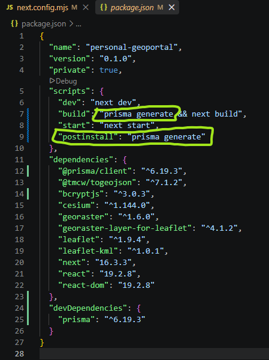
    
6. Selanjutnya ubah nginx.conf menjadi seperti berikut, dengan begini semua akses ke website kita tanpa basepath ([matiur-geoportal.com](http://matiur-geoportal.com/)) akan di redirect ke /portal (matiur-geportal.com/portal)
    
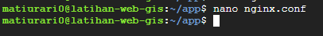
    
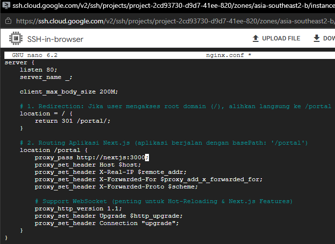
    
7. Setelah itu upload .env ke VM menggunakan upload file SSH Browser
    
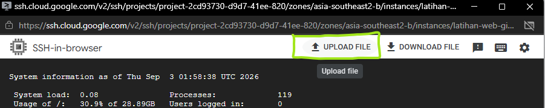
    
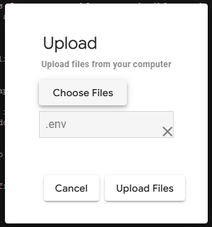
    
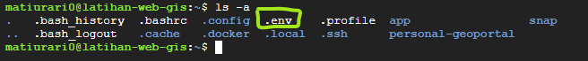
    
8. Pindahkan file .env ke dalam folder app dengan perintah berikut maka di dalam folder repo github sudah ada file .env
    
    ```jsx
    mv ~/.env ./app/
    ```

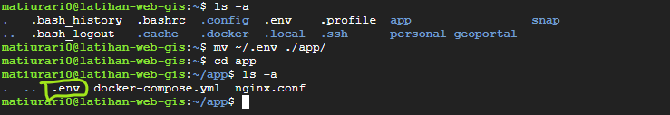

9. Git push semua perubahan ke github dan pantau proses CICD nya
    
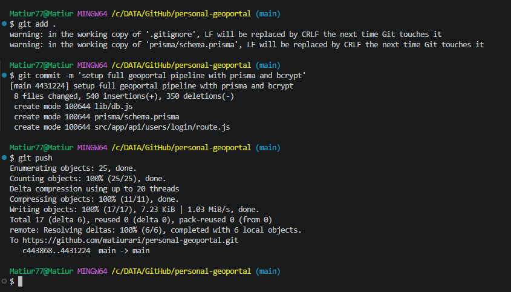
    
10. Pergi ke GCP untuk melihat proses CICD
    
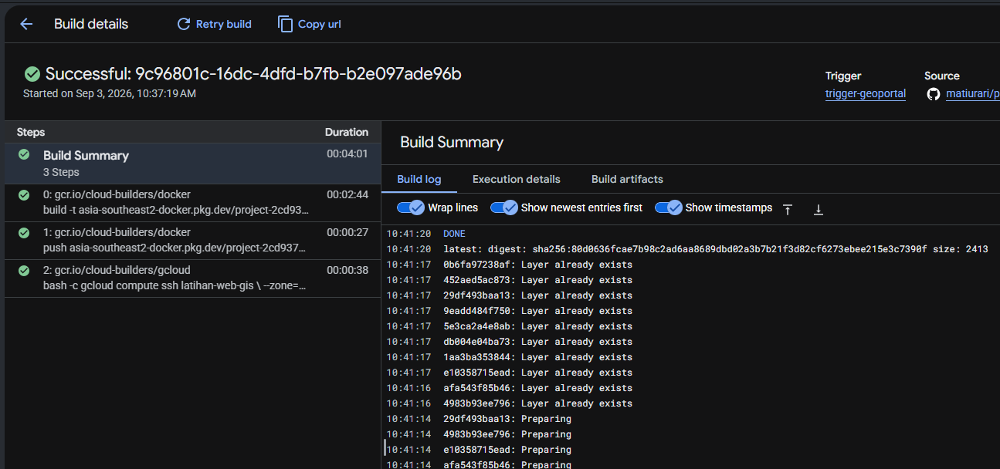
    
11. Setelah selesai pergi ke domain anda dengan /portal dibelakangnya [https://matiur-geoportal.com/portal](https://matiur-geoportal.com/portal)
    
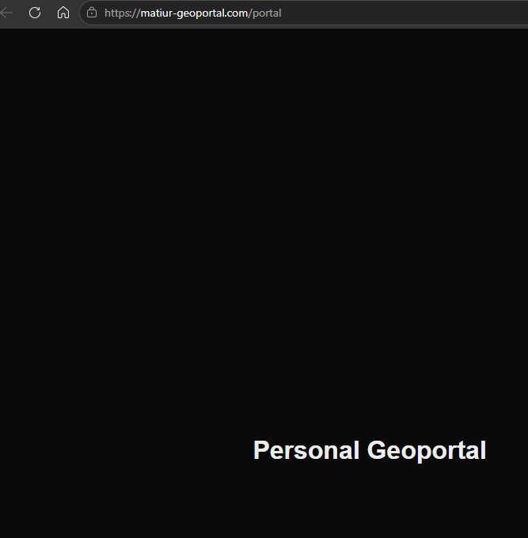

## Berkas Pendukung Autentikasi

Berikut berkas yang dipakai oleh API login. Salin isinya apa adanya.

### lib/auth/verifyCredentials.js

```js
import bcrypt from "bcryptjs";
import { db } from "../db";

export async function verifyCredentials(email, password) {
    const user = await db.users.findFirst({ where: { email } });

    if (!user) {
        throw new Error("Email atau password salah!");
    }

    const isPasswordValid = await bcrypt.compare(password, user.password);
    if (!isPasswordValid) {
        throw new Error("Email atau password salah!");
    }

    if (!user.is_active) {
        throw new Error(
            "Akun anda belum di aktivasi. Silahkan request aktivasi ke email arimatiur@gmail.com"
        );
    }

    return {
        user_id: user.user_id,
        email: user.email,
        role: user.role
    };
}
```

### lib/auth/jwt.js

```js
import jwt from "jsonwebtoken";

const JWT_SECRET = process.env.JWT_SECRET;
const JWT_EXPIRES_IN = process.env.JWT_EXPIRES_IN;

export function signAccessToken(user) {
  return jwt.sign(
    {
      id: user.user_id || user.id,
      user_id: user.user_id || user.id,
      email: user.email,
      role: user.role,
    },
    JWT_SECRET,
    { expiresIn: JWT_EXPIRES_IN },
  );
}

export function verifyAccessToken(token) {
  return jwt.verify(token, JWT_SECRET);
}
```

### lib/auth/roles.js

```js
// Semakin besar angka semakin banyak priviledge yang didapat.
// Super admin bisa melakukan semuanya tanpa batasan,
// Admin tidak bisa melakukan hal dikususkan super_admin
// Viewer tidak bisa melakukan hal yang dikususkan admin dan super_admin
export const ROLE_LEVELS = {
    viewer: 1,
    admin: 2,
    super_admin: 3,
};

export function hasRequiredRole(userRole, requiredRole) { // userRole = role yang dimiliki user, requiredRole = role yang harus dimiliki user
    const userLevel = ROLE_LEVELS[userRole]; // ubah user role string menjadi angka (user level) contoh jika user maka jadi 1 
    const requiredLevel = ROLE_LEVELS[requiredRole]; // ubah required role string menjadi angka (user level) contoh jika user maka jadi 1
    return userLevel >= requiredLevel; // user level harus lebih dari sama dengan required level
}
```
