# Google Cloud Platform

Halaman ini memindahkan aplikasi dari laptop ke server. Tahapannya berurutan: menyiapkan project, membuat VM, memasang Docker, menyiapkan berkas aplikasi, membangun image, menjalankan GeoServer dan Nginx, lalu menyambungkan Cloud Build supaya setiap push ke GitHub otomatis men-deploy ulang.

Seluruh tahapan memakai satu project kelompok yang dipakai bersama **empat peserta**. Karena itu ada dua jenis nama resource: yang dibuat koordinator sekali untuk dipakai berempat, dan yang dibuat tiap peserta sendiri sehingga wajib berbeda. Tahap 2 menetapkan pembagian itu sebelum Anda membuat apa pun.

## Prasyarat

Halaman ini melanjutkan pekerjaan dari halaman [Konfigurasi Project](/hari-3/deployment-project/konfigurasi-project). Tahap 1 sampai 10 di sana harus sudah selesai, karena halaman ini memindahkan aplikasi yang sudah terbukti berjalan di laptop.

Ringkasnya, empat hal berikut harus sudah benar.

### 1. Repositori sudah di-fork dan di-clone

Fork `https://github.com/dhanyyudi/personal-geoportal-peserta` di akun GitHub Anda, lalu clone fork itu ke laptop. Dikerjakan pada Tahap 1 halaman Konfigurasi Project.

### 2. Database Supabase sudah siap, dan login sudah terbukti

- Project Supabase sudah dibuat.
- Skrip `sql/01-schema.sql` sampai `sql/03-periksa.sql` sudah dijalankan lewat SQL Editor.
- Akun super admin sudah dibuat lewat `sql/02-seed-super-admin.sql`.
- `node scripts/uji-database.mjs` melaporkan `13 lulus, 0 gagal`.
- Portal sudah berjalan di laptop dengan `npm run dev`, dan Anda berhasil login.

Kelima butir itu dikerjakan pada Tahap 2 dan Tahap 8 sampai 9 halaman Konfigurasi Project.

### 3. Berkas .env sudah terisi

`.env` di laptop sudah diisi pada Tahap 5. Yang perlu Anda siapkan di sini adalah nilai untuk `.env` di VM, yang merupakan berkas terpisah.

Enam variabel berikut wajib ada. Tanpa salah satunya, login di VM tidak bekerja.

| Variabel | Isi |
|---|---|
| `DATABASE_URL` | Connection string Supabase, sama seperti di laptop |
| `JWT_SECRET` | Hasil perintah acak, boleh sama dengan di laptop |
| `NEXTAUTH_SECRET` | Hasil perintah acak, boleh sama dengan di laptop |
| `NEXTAUTH_URL` | Untuk VM: `http://IP_EKSTERNAL_VM/portal` |
| `ADMIN_CONTACT_EMAIL` | Email Anda sendiri |
| `JWT_EXPIRES_IN` | `1h`, sudah terisi di `.env.example` |

Dua nilai yang berbeda antara laptop dan VM hanya `NEXTAUTH_URL`, `BASE_URL`, dan `NEXT_PUBLIC_URL_BASE_PATH`, karena ketiganya memuat alamat aplikasi. Nilainya diisi pada Tahap 18.

Berkas `.env` di laptop tidak ikut ter-commit, dan tidak ikut tersalin ke VM. Berkas di VM dibuat langsung di sana.

### 4. Akses Google Cloud dari koordinator

- Akses ke Google Cloud project, dengan Project ID berbentuk `geoportal-kelompok-a-xxxxx`.
- Email peserta yang sudah terdaftar di project tersebut. Email ini dipakai menurunkan identitas peserta.

## Repositori yang Dipakai

Deployment Project bekerja pada fork repositori peserta di akun GitHub Anda sendiri.

| | Repositori |
|---|---|
| Sumber, yang di-fork | `https://github.com/dhanyyudi/personal-geoportal-peserta` |
| Fork Anda | `https://github.com/<username-anda>/personal-geoportal-peserta` |

Fork dan clone repositori itu dikerjakan pada halaman [Konfigurasi Project](/hari-3/deployment-project/konfigurasi-project), Tahap 1 sampai 8. Pastikan tahap itu sudah selesai sebelum melanjutkan, karena halaman ini mengandaikan proyek sudah ada di laptop dan seluruh berkasnya sudah diperiksa.

### Mengirim perubahan ke fork Anda

Cloud Build mengambil kode dari fork Anda, bukan dari laptop. Jadi setiap perubahan harus di-push lebih dahulu:

```bash
git add -A
git commit -m "pesan perubahan"
git push origin main
```

Bila push ditolak, penyebabnya hampir selalu akun yang salah. Bagian berikut menjelaskannya.

### Bila Anda punya lebih dari satu akun GitHub

SSH memilih kunci berdasarkan alamat host. Bila laptop Anda memakai lebih dari satu akun GitHub, akun yang dipakai adalah akun yang kuncinya terpasang pada host `github.com`, dan itu belum tentu akun pemilik fork Anda.

Gejalanya, push ditolak dengan pesan:

```text
! [remote rejected] main -> main (permission denied)
```

Periksa kunci Anda sedang menjadi akun siapa:

```bash
ssh -T git@github.com
```

Bila jawabannya bukan nama pemilik fork, buat alias pada `~/.ssh/config`:

```text
Host github.com-namaakun
    HostName github.com
    User git
    IdentityFile ~/.ssh/id_github_namaakun
    IdentitiesOnly yes
```

Lalu arahkan remote fork Anda ke alias itu:

```bash
git remote set-url origin git@github.com-namaakun:namaakun/personal-geoportal-peserta.git
```

Uji dengan `ssh -T git@github.com-namaakun`. Bila menyapa nama akun yang benar, push akan berhasil.

Anda dapat memeriksa akses tanpa mengubah apa pun:

```bash
git ls-remote origin
```

Perintah itu menampilkan daftar branch pada remote. Bila kosong atau gagal, akun Anda belum punya izin ke repositori itu.

### Bila repositori sumber diperbarui

Sumber dapat diperbarui selama pelatihan, misalnya karena ada perbaikan. Fork Anda tidak ikut berubah dengan sendirinya.

Tambahkan sumber sebagai remote, lalu tarik perubahannya:

```bash
git remote add upstream https://github.com/dhanyyudi/personal-geoportal-peserta.git
git fetch upstream
git merge upstream/main
git push origin main
```

`git remote add` hanya perlu sekali. Untuk pembaruan berikutnya, cukup `git fetch upstream` dan seterusnya.

Bila muncul konflik, artinya Anda mengubah berkas yang sama dengan yang diubah di sumber. Selesaikan konfliknya, lalu `git add` dan `git commit`.

::: tip Bila ragu, fork ulang saja
Cara paling sederhana dan paling kecil risikonya: hapus folder di laptop, lalu fork dan clone ulang dari awal. Selama Anda belum membuat perubahan sendiri yang perlu disimpan, cara ini lebih cepat daripada menyelesaikan konflik.

Yang **tidak** boleh hilang adalah berkas `.env`, karena berisi kredensial Anda. Salin berkas itu lebih dahulu, baru hapus foldernya:

```bash
cp .env ~/env-simpanan
# hapus folder, fork dan clone ulang
cp ~/env-simpanan .env
```
:::

## Nilai yang Harus Unik per Peserta

Empat peserta memakai satu project Google Cloud bersama. Karena itu sebagian nilai harus berbeda antar peserta, dan sebagian justru harus sama.

Nilai unik itu **tidak ada di berkas repositori Anda**. Seluruhnya diatur pada trigger Cloud Build sebagai substitution variable, sehingga tidak ada berkas yang perlu diedit di laptop.

| Nilai | Unik per peserta? | Diatur di mana |
|---|---|---|
| `_VM_NAME` | Ya | Substitution variable pada trigger, Tahap 28 |
| `_IMAGE_NAME` | Ya | Substitution variable pada trigger, Tahap 28 |
| `_VM_ZONE` | Tidak, sama untuk semua | Sudah punya nilai bawaan pada `cloudbuild.yaml` |
| `_VM_APP_DIR` | Tidak, sama untuk semua | Substitution variable pada trigger |
| Nama Project ID | Tidak, milik kelompok | Dari koordinator |
| `katalog-images` | Tidak, milik kelompok | Dibuat koordinator, peserta hanya memakai |
| `nextjs_portal`, `geoserver_app`, `nginx_proxy` | Tidak | Nama container di dalam VM Anda sendiri. Tidak bertabrakan dengan peserta lain karena VM-nya terpisah |
| Alamat `geoserver` dan `nextjs` pada `nginx.conf` | Tidak | Nama service di dalam jaringan Docker VM Anda sendiri |

Baris terakhir sering menimbulkan kekhawatiran. Nama kontainer dan nama service memang sama untuk semua peserta, tetapi tidak bertabrakan, karena keempat peserta memakai VM yang berbeda. Yang bertabrakan hanya resource yang berada di project bersama, dan itulah yang ditangani pada tabel di bawah.

## Pembagian Resource

Tabel ini perlu dibaca sebelum Tahap 2. Salah menebak pemilik resource adalah penyebab kegagalan paling sering di halaman ini.

| Resource | Dibuat oleh | Nama | Bila Anda membuatnya sendiri |
|---|---|---|---|
| Project kelompok | Koordinator | `geoportal-kelompok-a-xxxxx` | Tidak punya izin, dan tidak perlu |
| Artifact Registry | Koordinator | `katalog-images` | Gagal dengan `ALREADY_EXISTS` |
| Firewall rule port 80 dan 443 | Koordinator | `allow-webgis-http` | Gagal dengan `ALREADY_EXISTS` |
| Firewall rule SSH lewat IAP | Koordinator | `allow-webgis-iap-ssh` | Gagal dengan `ALREADY_EXISTS` |
| Network tag | Koordinator | `webgis-http`, `webgis-iap-ssh` | Gagal dengan `ALREADY_EXISTS` |
| VM, IP statis, Service Account Cloud Build, trigger, GitHub connection, image | Peserta | Mengandung identitas peserta | Bertabrakan dengan peserta lain |

Nama pada baris terakhir diturunkan seluruhnya dari satu nilai, yaitu identitas peserta. Nilai itulah yang ditetapkan pada Tahap 2.

## Bagian A. Menyiapkan Project dan VM

### Tahap 1. Buka project

Dijalankan di: Google Cloud Console

Masuk memakai email yang diberikan koordinator, lalu pilih project kelompok yang sudah disiapkan. Pastikan Project ID yang tampil di bagian atas sudah benar sebelum melanjutkan.

### Tahap 2. Tetapkan identitas peserta

Dijalankan di: Cloud Shell

::: tip Ambil dua nilai ini dari tabel peserta
Sebelum menempel blok di bawah, cari nama atau email Anda pada halaman [Peserta dan Project](/hari-3/deployment-project/peserta-project). Halaman itu memuat **Nama Peserta**, **Project ID**, dan kelompok Anda.

Isi `PROJECT_ID` dan `NAMA_PESERTA` dengan nilai dari tabel itu. Keduanya harus sama persis.
:::

**Gunakan Nama Peserta dari tabel, jangan mengarang sendiri.** Nama itu sudah disusun pendek, 3 sampai 8 karakter, satu kata, dan dipastikan tidak sama dengan peserta lain.

Bila Anda tidak tercantum di tabel dan memilih nama sendiri, panjangnya boleh sampai 12 karakter. Gunakan huruf kecil dan angka saja, tanpa spasi dan tanpa tanda hubung.

Nama Peserta menjadi dasar penamaan seluruh resource Anda: nama VM, nama Service Account, nama trigger, dan subdomain. Karena itu nama yang sudah dipakai peserta lain akan menggagalkan pekerjaan Anda di tengah jalan, dan pada saat itu sebagian resource mungkin sudah terlanjur dibuat.

Tempel seluruh blok berikut di Cloud Shell. Ubah hanya dua baris pertama.

```bash
# ---------------------------------------------------------------------
# ISI INI. Hanya dua baris ini yang diubah.
# ---------------------------------------------------------------------
PROJECT_ID="geoportal-kelompok-a-xxxxx"     # dari koordinator
NAMA_PESERTA="nama01"                       # dari kolom Nama Peserta pada tabel
# ---------------------------------------------------------------------

set -euo pipefail

# Nilai bersama. Sama untuk semua peserta dalam satu project, jangan diubah.
REGION="asia-southeast2"
ZONE="asia-southeast2-b"
REPOSITORY="katalog-images"                 # milik koordinator, jangan dibuat ulang
APP_DIR="/opt/webgis/app"

merah()  { printf '\033[31m%s\033[0m\n' "$1"; }
hijau()  { printf '\033[32m%s\033[0m\n' "$1"; }
kuning() { printf '\033[33m%s\033[0m\n' "$1"; }

if [ "$PROJECT_ID" = "geoportal-kelompok-a-xxxxx" ]; then
  merah "PROJECT_ID masih bernilai contoh."
  echo "  Ambil Project ID yang benar dari koordinator."
  echo "  Untuk melihat project yang boleh diakses: gcloud projects list"
  exit 1
fi

# Tetapkan project aktif. Ini WAJIB, dan sebelumnya terlewat.
#
# Banyak perintah pada tahap berikutnya tidak menyebut --project, misalnya
# gcloud compute instances create dan gcloud iam service-accounts create.
# Tanpa baris ini, perintah tersebut memakai project yang sedang aktif di
# Cloud Shell, yang belum tentu project Anda.
#
# Akibatnya resource dibuat di project KELOMPOK LAIN, dan karena perintahnya
# berhasil, tidak ada pesan galat yang memberitahu. VM baru ditemukan pada
# tahap berikutnya ketika alamatnya tidak muncul di project yang benar.
gcloud config set project "$PROJECT_ID" >/dev/null

AKTIF="$(gcloud config get-value project 2>/dev/null)"
if [ "$AKTIF" != "$PROJECT_ID" ]; then
  merah "Project aktif '$AKTIF' tidak sama dengan PROJECT_ID '$PROJECT_ID'."
  echo "  Jalankan: gcloud config set project $PROJECT_ID"
  exit 1
fi
hijau "Project aktif: $AKTIF"

# Identitas peserta memakai NAMA_PESERTA apa adanya, tanpa diturunkan.
# Nilainya sudah pendek dan satu kata, diambil dari kolom Nama Peserta pada
# tabel peserta.
PARTICIPANT_ID="$NAMA_PESERTA"

if [ -z "$PARTICIPANT_ID" ]; then
  merah "NAMA_PESERTA masih kosong."
  echo "  Ambil nilainya dari kolom Nama Peserta pada halaman Peserta dan Project."
  exit 1
fi

# Huruf kecil dan angka saja, tanpa spasi, tanpa tanda hubung, tanpa titik.
# Nama VM, Service Account, dan subdomain menolak karakter di luar itu, dan
# pesan errornya menyebut nama resource, bukan nama variabel, sehingga sulit
# dilacak bila lolos sampai ke perintah gcloud.
if printf '%s' "$PARTICIPANT_ID" | grep -qE '[^a-z0-9]'; then
  merah "Nama Peserta '$PARTICIPANT_ID' mengandung karakter yang tidak sah."
  echo "  Hanya huruf kecil dan angka, tanpa spasi dan tanpa tanda hubung."
  echo "  Contoh yang benar: amelliak, dhanypedia, d21utomo"
  exit 1
fi

if [ "${#PARTICIPANT_ID}" -lt 3 ]; then
  merah "Nama Peserta '$PARTICIPANT_ID' hanya ${#PARTICIPANT_ID} karakter, minimal 3."
  exit 1
fi

# Batas 12 karakter adalah pilihan, bukan batas teknis.
#
# Batas teknis berasal dari Service Account, yang paling ketat:
#
#   cb-<nama>              30 karakter, sehingga nama masih muat sampai 27
#   webgis-<nama>          63 karakter, sehingga nama masih muat sampai 56
#   <nama>.webgisbig.com   63 karakter, sehingga nama masih muat sampai 45
#
# Diuji langsung pada Google Cloud: nama Service Account 30 karakter diterima,
# 31 karakter ditolak dengan pesan "between 6 and 30".
#
# Angka 12 diambil jauh di bawah 27 supaya nama tetap pendek dan mudah dibaca
# pada daftar resource, sementara nama seperti dhanypedia atau arkabumihd1
# tetap dapat dipakai.
if [ "${#PARTICIPANT_ID}" -gt 12 ]; then
  merah "Nama Peserta '$PARTICIPANT_ID' ${#PARTICIPANT_ID} karakter, melebihi batas 12."
  echo "  Batas 12 dipilih supaya nama resource tetap pendek dan mudah dibaca."
  echo "  Batas teknisnya sendiri 27, berasal dari Service Account."
  exit 1
fi

VM_NAME="webgis-${PARTICIPANT_ID}"
STATIC_IP_NAME="webgis-ip-${PARTICIPANT_ID}"
BUILD_SA_NAME="cb-${PARTICIPANT_ID}"
CONNECTION_NAME="github-${PARTICIPANT_ID}"
LINKED_REPO_NAME="repo-${PARTICIPANT_ID}"
TRIGGER_NAME="deploy-${PARTICIPANT_ID}"
IMAGE_NAME="nextjs-${PARTICIPANT_ID}"
SUBDOMAIN="${PARTICIPANT_ID}.webgisbig.com"
BUILD_SA="${BUILD_SA_NAME}@${PROJECT_ID}.iam.gserviceaccount.com"
VM_REGION="${ZONE%-*}"

# ---------------------------------------------------------------------
# Penjagaan tabrakan. Peserta pertama tidak menemukan apa pun dan lolos.
# Peserta kedua menemukan Service Account milik peserta pertama, dan
# dihentikan SEBELUM membuat apa pun.
# ---------------------------------------------------------------------
echo "Memeriksa project $PROJECT_ID ..."

if ! gcloud projects describe "$PROJECT_ID" >/dev/null 2>&1; then
  merah "Project '$PROJECT_ID' tidak bisa diakses."
  echo "  Periksa: gcloud projects list"
  echo "  Kalau project tidak muncul, hubungi koordinator. Akses IAM belum terpasang."
  exit 1
fi

PEMILIK=""
if gcloud compute instances describe "$VM_NAME" --zone="$ZONE" --project="$PROJECT_ID" >/dev/null 2>&1; then
  PEMILIK="$(
    gcloud compute instances describe "$VM_NAME" --zone="$ZONE" --project="$PROJECT_ID" \
      --format='value(metadata.items[?key==`created-by`].value)' 2>/dev/null | head -1 || true
  )"
fi

if gcloud iam service-accounts describe "$BUILD_SA" --project="$PROJECT_ID" >/dev/null 2>&1; then
  merah "Service Account '$BUILD_SA_NAME' sudah ada di project ini."
  echo ""
  echo "  Artinya identitas '$PARTICIPANT_ID' sudah dipakai peserta lain di project yang sama."
  [ -n "$PEMILIK" ] && echo "  VM '$VM_NAME' dibuat oleh: $PEMILIK"
  echo ""
  echo "  JANGAN melanjutkan. Kalau Anda memakai Service Account milik orang lain,"
  echo "  Cloud Build Anda akan men-deploy ke VM orang itu, dan sebaliknya."
  echo ""
  echo "  Pastikan NAMA_PESERTA diisi dengan nilai dari kolom Nama Peserta pada"
  echo "  halaman Peserta dan Project, bukan nama pilihan sendiri."
  echo ""
  echo "  Langkah yang benar:"
  echo "    1. Periksa kembali tabel peserta, mungkin nilai Anda salah ketik."
  echo "    2. Bila memang bentrok, laporkan ke koordinator."
  echo "    3. Minta identitas pengganti, lalu jalankan blok ini lagi."
  exit 1
fi

if gcloud compute instances describe "$VM_NAME" --zone="$ZONE" --project="$PROJECT_ID" >/dev/null 2>&1; then
  merah "VM '$VM_NAME' sudah ada di project ini."
  echo "  Identitas '$PARTICIPANT_ID' sudah dipakai. Lapor ke koordinator."
  exit 1
fi

hijau "Lolos. Tidak ada resource dengan nama ini di project $PROJECT_ID."
echo ""
echo "PROJECT_ID     = $PROJECT_ID"
echo "NAMA_PESERTA   = $NAMA_PESERTA"
echo ""
echo "Nama resource Anda:"
printf '  %-18s %s\n' \
  VM_NAME "$VM_NAME" \
  STATIC_IP_NAME "$STATIC_IP_NAME" \
  BUILD_SA_NAME "$BUILD_SA_NAME" \
  CONNECTION_NAME "$CONNECTION_NAME" \
  LINKED_REPO_NAME "$LINKED_REPO_NAME" \
  TRIGGER_NAME "$TRIGGER_NAME" \
  IMAGE_NAME "$IMAGE_NAME" \
  SUBDOMAIN "$SUBDOMAIN"
echo ""
kuning "Resource yang JUSTRU TIDAK boleh Anda buat (milik koordinator):"
echo "  katalog-images          Artifact Registry bersama"
echo "  allow-webgis-http       Firewall rule port 80 dan 443"
echo "  allow-webgis-iap-ssh    Firewall rule port 22 lewat IAP"
echo ""
echo "Kalau resource di atas ternyata BELUM ada, lapor ke koordinator."
echo "Jangan dibuat sendiri, karena nama yang sama dipakai seluruh peserta project ini."
echo ""
hijau "Lanjutkan ke Tahap 3."
```

Jika blok itu berhenti dengan pesan bahwa Service Account sudah ada, **jangan mencari jalan lain**. Laporkan ke koordinator dan minta identitas pengganti. Melanjutkan dengan Service Account milik peserta lain membuat Cloud Build Anda men-deploy ke VM orang lain.

::: tip Bila Cloud Shell tertutup
Variabel pada blok di atas hanya bertahan selama sesi Cloud Shell terbuka. Bila sesi berakhir atau Cloud Shell berpindah, jalankan kembali seluruh blok Tahap 2 sebelum melanjutkan.
:::

### Tahap 3. Periksa API yang dibutuhkan

Dijalankan di: Cloud Shell

```bash
gcloud services list --enabled \
  --filter="config.name:(compute.googleapis.com OR cloudbuild.googleapis.com OR artifactregistry.googleapis.com OR iap.googleapis.com OR dns.googleapis.com OR domains.googleapis.com OR secretmanager.googleapis.com)" \
  --format="value(config.name)"
```

Bila ada layanan yang belum muncul, hentikan tahap ini dan lapor ke koordinator. Peserta tidak punya izin mengaktifkan API pada project kelompok.

### Tahap 4. Buat Service Account deployment

Dijalankan di: Cloud Shell

Service Account ini milik peserta, sehingga namanya memuat identitas Anda.

```bash
gcloud iam service-accounts create "$BUILD_SA_NAME" \
  --display-name="Cloud Build Deployer"

for ROLE in \
  roles/cloudbuild.builds.builder \
  roles/artifactregistry.writer \
  roles/compute.instanceAdmin.v1 \
  roles/compute.osAdminLogin \
  roles/iap.tunnelResourceAccessor \
  roles/logging.logWriter
do
  gcloud projects add-iam-policy-binding "$PROJECT_ID" \
    --member="serviceAccount:$BUILD_SA" \
    --role="$ROLE" \
    --condition=None
done
```

### Tahap 5. Periksa Artifact Registry


Dijalankan di: Cloud Shell menuju Google Cloud Console

Buka halaman Artifact Registry dan pastikan repository `katalog-images` sudah ada pada region `asia-southeast2`.


Repository ini dibuat koordinator dan dipakai seluruh peserta. Peserta hanya memeriksa, bukan membuat. Bila hasilnya kosong atau `NOT_FOUND`, lapor ke koordinator dan jangan membuat repository sendiri.


### Tahap 6. Siapkan identitas VM


Dijalankan di: Cloud Shell

VM peserta memakai Service Account default project. Alamatnya berbentuk `<nomor-project>-compute@developer.gserviceaccount.com`, dan **nilainya sama untuk semua peserta** karena hanya bergantung pada nomor project. Itu memang begitu, dan bukan tanda ada yang salah.

```bash
PROJECT_NUMBER="$(gcloud projects describe "$PROJECT_ID" \
  --format='value(projectNumber)')"

VM_SA="${PROJECT_NUMBER}-compute@developer.gserviceaccount.com"

gcloud projects add-iam-policy-binding "$PROJECT_ID" \
  --member="serviceAccount:$VM_SA" \
  --role="roles/artifactregistry.reader" \
  --condition=None

gcloud iam service-accounts add-iam-policy-binding "$VM_SA" \
  --member="serviceAccount:$BUILD_SA" \
  --role="roles/iam.serviceAccountUser" \
  --condition=None
```

Rantai izinnya: Service Account Cloud Build peserta mendapat `roles/iam.serviceAccountUser` pada Service Account VM, sehingga trigger boleh melakukan SSH ke VM. Yang membedakan antar peserta bukan Service Account VM, melainkan nama VM dan Service Account Cloud Build-nya.

### Tahap 7. Buat VM

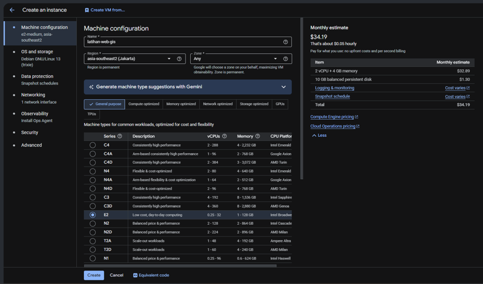

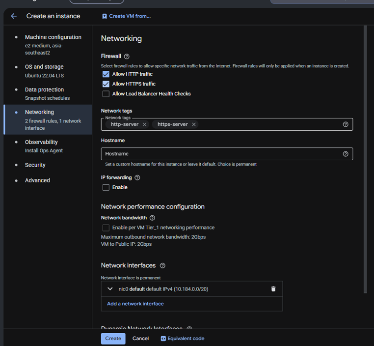


Dijalankan di: Cloud Shell menuju Google Cloud Console

VM dibuat dari Cloud Shell dengan spesifikasi berikut. Pastikan Compute Engine API sudah aktif sebelum perintah ini dijalankan.


```bash
gcloud compute instances create "$VM_NAME" \
  --zone="$ZONE" \
  --machine-type="e2-medium" \
  --image-family="ubuntu-2204-lts" \
  --image-project="ubuntu-os-cloud" \
  --boot-disk-size="30GB" \
  --boot-disk-type="pd-balanced" \
  --service-account="$VM_SA" \
  --scopes="https://www.googleapis.com/auth/cloud-platform" \
  --tags="webgis-http,webgis-iap-ssh" \
  --metadata="enable-oslogin=TRUE"
```

### Tahap 8. Periksa VM dan firewall
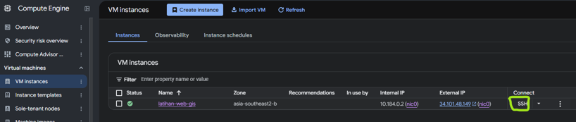


Dijalankan di: Cloud Shell

```bash
gcloud compute firewall-rules list \
  --filter="name:(allow-webgis-http OR allow-webgis-iap-ssh)"

gcloud compute instances describe "$VM_NAME" \
  --zone="$ZONE" \
  --format="table(name,status,machineType.basename(),networkInterfaces[0].accessConfigs[0].natIP)"
```


Kedua firewall rule dibuat koordinator dan hasil perintah di atas seharusnya menampilkan keduanya.

**Bila daftar firewall kosong, berhenti dan lapor ke koordinator.** Jangan membuat rule sendiri. Nama yang sama dipakai seluruh peserta project ini, sehingga pembuatan ulang akan gagal dengan `ALREADY_EXISTS`, atau berhasil dan menambah satu rule yang bertabrakan dengan aturan koordinator.

### Tahap 9. Buat IP statis

Dijalankan di: Cloud Shell

Alamat IP perlu dikunci supaya tidak berubah saat VM dimatikan dan dinyalakan kembali. Ini penting karena record DNS pada halaman [Penambahan Subdomain](/hari-3/deployment-project/subdomain) menunjuk ke alamat tersebut.

```bash
EXTERNAL_IP="$(gcloud compute instances describe "$VM_NAME" \
  --zone="$ZONE" \
  --format='get(networkInterfaces[0].accessConfigs[0].natIP)')"

gcloud compute addresses create "$STATIC_IP_NAME" \
  --region="$VM_REGION" \
  --addresses="$EXTERNAL_IP"

gcloud compute addresses describe "$STATIC_IP_NAME" \
  --region="$VM_REGION" \
  --format="table(name,address,status)"
```

::: warning Kuota empat IP publik per region
Setiap project hanya mendapat empat alamat IP publik eksternal per region. Angka empat peserta per project bukan pilihan bebas, melainkan batas teknis itu. Karena alasan yang sama, jangan berpindah ke project kelompok lain tanpa sepengetahuan koordinator.
:::

## Bagian B. Menyiapkan Aplikasi di Dalam VM

### Tahap 10. Masuk ke VM


Dijalankan di: Cloud Shell menuju VM

```bash
gcloud compute ssh "$VM_NAME" \
  --zone="$ZONE" \
  --tunnel-through-iap
```


Setelah perintah ini berhasil, terminal yang Anda gunakan adalah terminal VM, bukan Cloud Shell. Semua perintah pada Bagian B dijalankan di sana.

### Tahap 11. Pasang Docker, Git, dan Google Cloud CLI


Dijalankan di: Terminal VM

```bash
sudo apt-get update
sudo apt-get install -y ca-certificates curl git gnupg

sudo install -m 0755 -d /etc/apt/keyrings
sudo curl -fsSL https://download.docker.com/linux/ubuntu/gpg \
  -o /etc/apt/keyrings/docker.asc
sudo chmod a+r /etc/apt/keyrings/docker.asc

sudo tee /etc/apt/sources.list.d/docker.sources > /dev/null <<EOF
Types: deb
URIs: https://download.docker.com/linux/ubuntu
Suites: $(. /etc/os-release && echo "${UBUNTU_CODENAME:-$VERSION_CODENAME}")
Components: stable
Architectures: $(dpkg --print-architecture)
Signed-By: /etc/apt/keyrings/docker.asc
EOF

sudo apt-get update
sudo apt-get install -y docker-ce docker-ce-cli containerd.io \
  docker-buildx-plugin docker-compose-plugin

curl -fsSL https://packages.cloud.google.com/apt/doc/apt-key.gpg | \
  sudo gpg --dearmor -o /usr/share/keyrings/cloud.google.gpg

echo "deb [signed-by=/usr/share/keyrings/cloud.google.gpg] \
https://packages.cloud.google.com/apt cloud-sdk main" | \
sudo tee /etc/apt/sources.list.d/google-cloud-sdk.list > /dev/null

sudo apt-get update
sudo apt-get install -y google-cloud-cli
```


### Tahap 12. Uji Docker dan gcloud


Dijalankan di: Terminal VM

```bash
sudo docker compose version
sudo docker run --rm hello-world
gcloud --version
```


### Tahap 13. Tambahkan user ke grup docker

Dijalankan di: Terminal VM

```bash
sudo usermod -aG docker "$USER"
exit
```

Perintah `exit` menutup sesi SSH dan mengembalikan terminal ke Cloud Shell. Ini perlu dilakukan supaya keanggotaan grup docker berlaku pada sesi berikutnya.

### Tahap 14. Masuk kembali ke VM

Dijalankan di: Cloud Shell menuju VM

```bash
gcloud compute ssh "$VM_NAME" \
  --zone="$ZONE" \
  --tunnel-through-iap
```

### Tahap 15. Siapkan folder aplikasi


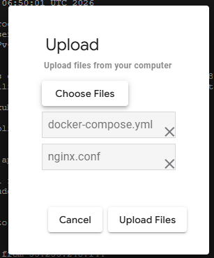

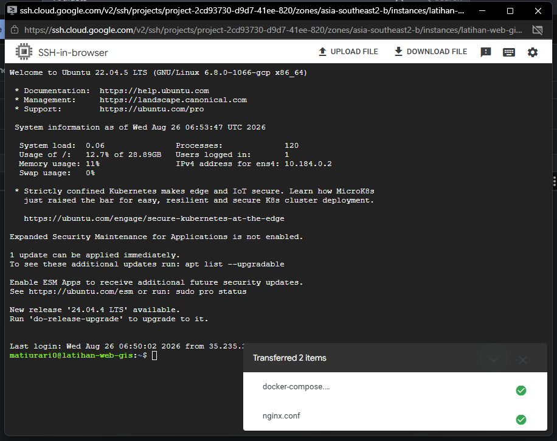


Dijalankan di: Terminal VM

```bash
sudo mkdir -p /opt/webgis
sudo chown "$USER:$USER" /opt/webgis
ls -ld /opt/webgis
```


### Tahap 16. Pindahkan berkas konfigurasi ke VM


Dijalankan di: Terminal Laptop, lalu Terminal VM

Tiga berkas dari halaman [Konfigurasi Project](/hari-3/deployment-project/konfigurasi-project) ada di laptop. Salin ketiganya ke VM.

```bash
gcloud compute scp docker-compose.yml nginx.conf .env.example \
  "$VM_NAME:/opt/webgis/" \
  --zone="$ZONE" \
  --tunnel-through-iap
```

Selanjutnya di terminal VM, pindahkan ketiganya ke folder aplikasi:


```bash
sudo mkdir -p /opt/webgis/app
sudo chown "$USER:$USER" /opt/webgis/app
mv /opt/webgis/docker-compose.yml /opt/webgis/nginx.conf /opt/webgis/.env.example /opt/webgis/app/
ls -la /opt/webgis/app
```


### Tahap 17. Clone repositori


Dijalankan di: Terminal VM

Ganti `USERNAME_GITHUB_PESERTA` dengan username GitHub Anda.

```bash
GITHUB_USERNAME="USERNAME_GITHUB_PESERTA"
GITHUB_REPOSITORY="https://github.com/${GITHUB_USERNAME}/personal-geoportal-peserta.git"

git clone "$GITHUB_REPOSITORY" /opt/webgis/app
cd /opt/webgis/app
cp .env.example .env

ls -ld /opt/webgis/app
git remote -v
git log --oneline -1
```


Bila fork Anda memakai nama bawaan `personal-geoportal`, ganti nilai `GITHUB_REPOSITORY` menjadi `https://github.com/${GITHUB_USERNAME}/personal-geoportal.git`.

Bila GitHub meminta kata sandi, isi dengan Personal Access Token, bukan kata sandi akun.


### Tahap 18. Isi berkas .env

Dijalankan di: Terminal VM

Buka berkas `.env` yang tadi disalin dari `.env.example`.

```bash
nano /opt/webgis/app/.env
```

#### Nilai yang sudah Anda siapkan di laptop

Empat nilai berikut sudah Anda buat pada [Prasyarat bagian 3](#_3-berkas-env-sudah-terisi). Pakai nilai yang sama, jangan membuat yang baru.

| Variabel | Nilai |
|---|---|
| `DATABASE_URL` | Connection string Supabase, Session pooler port 5432. **Jangan dikosongkan.** |
| `JWT_SECRET` | Hasil perintah acak yang pertama |
| `NEXTAUTH_SECRET` | Hasil perintah acak yang kedua |
| `ADMIN_CONTACT_EMAIL` | Email Anda sendiri |

#### Nilai yang berubah karena sekarang di VM

Empat nilai berikut berbeda dari yang di laptop, karena alamat aplikasinya dan alamat GeoServer sudah berganti.

| Variabel | Nilai |
|---|---|
| `NEXTAUTH_URL` | `http://IP_EKSTERNAL_VM/portal`, tanpa slash di akhir |
| `BASE_URL` | `http://IP_EKSTERNAL_VM/portal` |
| `NEXT_PUBLIC_URL_BASE_PATH` | `http://IP_EKSTERNAL_VM/portal` |
| `GEOSERVER_PUBLIC_URL` | `http://IP_EKSTERNAL_VM/geoserver`, tanpa slash di akhir |

`GEOSERVER_PUBLIC_URL` adalah alamat GeoServer yang dapat dijangkau dari browser Anda. Nilai itu disimpan ke kolom `wms_url` dan `wfs_url` pada katalog, dan dipakai Anda untuk membuka layer di QGIS atau aplikasi lain. Nginx sudah mem-proxy `/geoserver/`, sehingga port 8080 tidak perlu dibuka.

`GEOSERVER_URL` **tidak diubah**, tetap `http://geoserver:8080/geoserver`, karena variabel itu dipakai aplikasi untuk memanggil GeoServer dari dalam jaringan Docker.

Ketiganya memakai bentuk yang sama, yaitu alamat IP eksternal VM diikuti `/portal`, tanpa slash di akhir. Ganti `IP_EKSTERNAL_VM` dengan alamat dari Tahap 9.

Slash di akhir membuat alamat tidak cocok dengan `basePath` pada `next.config.mjs`, dan gejalanya adalah login yang berhasil di API tetapi gagal di browser.

#### Kata sandi untuk GeoServer

Buat kata sandi GeoServer di sini, karena GeoServer baru berjalan di VM.

```bash
GEOSERVER_PASSWORD="$(node -e "console.log(require('crypto').randomBytes(16).toString('hex'))")"
echo "$GEOSERVER_PASSWORD"
```

Simpan hasilnya, lalu isi dua baris berikut dengan nilai yang sama:

| Variabel | Nilai |
|---|---|
| `GEOSERVER_ADMIN_PASSWORD` | Hasil perintah di atas |
| `GEOSERVER_PASSWORD` | Nilai yang sama persis |

Keduanya harus sama, karena satu dipakai container GeoServer untuk membuat akun admin, dan satu lagi dipakai aplikasi untuk login ke REST API GeoServer. Bila berbeda, unggahan layer gagal dengan pesan kosong.

Perintah di atas memakai Node.js, bukan openssl, supaya dapat dijalankan di Windows juga. Hasilnya hanya berisi huruf dan angka, sehingga aman dari masalah tanda dolar yang dibaca compose sebagai awal nama variabel.

#### Nilai yang dibiarkan apa adanya

`NEXTJS_IMAGE` dibiarkan `nginx:1.27-alpine`. Cloud Build mengisinya otomatis pada deploy pertama.

Saat login ke antarmuka GeoServer nanti, gunakan username `admin` dan kata sandi hasil `GEOSERVER_PASSWORD`.

### Tahap 19. Bangun image aplikasi


Dijalankan di: Terminal VM

Sebelum Cloud Build dipakai, image dibangun sekali secara manual supaya masalah pada `Dockerfile` ketahuan lebih awal di terminal yang bisa dibaca langsung.

```bash
cd /opt/webgis/app
sudo docker build -t "asia-southeast2-docker.pkg.dev/${PROJECT_ID}/${REPOSITORY}/${IMAGE_NAME}:latest" .
```


### Tahap 20. Beri izin Artifact Registry pada Service Account VM


Dijalankan di: Google Cloud Console

VM perlu izin menulis image ke Artifact Registry. Buka IAM & Admin, lalu IAM, lalu Grant Access, dan tambahkan Service Account VM sebagai principal dengan dua role berikut.

| Role | Kegunaan |
|---|---|
| Artifact Registry Administrator | Mendorong image ke repository |
| Logs Writer | Menulis log dari VM |

Gunakan alamat `VM_SA` yang tercetak pada Tahap 6.


### Tahap 21. Dorong image ke Artifact Registry


Dijalankan di: Terminal VM

```bash
gcloud auth configure-docker asia-southeast2-docker.pkg.dev --quiet
sudo docker push "asia-southeast2-docker.pkg.dev/${PROJECT_ID}/${REPOSITORY}/${IMAGE_NAME}:latest"
```


### Tahap 22. Jalankan GeoServer dan Nginx


Dijalankan di: Terminal VM

Jalankan kedua container itu lebih dahulu, tanpa `nextjs`, memakai `--no-deps`. Image `nextjs` belum dibangun pada tahap ini, dan tanpa `--no-deps` compose akan mencoba menariknya.

```bash
cd /opt/webgis/app
sudo docker compose up -d --no-deps geoserver nginx
sudo docker compose ps
```


### Tahap 23. Keluar dari VM

Dijalankan di: Terminal VM

```bash
exit
```

## Bagian C. Otomatisasi dengan Cloud Build

### Tahap 24. Tambahkan Dockerfile dan cloudbuild.yaml


Dijalankan di: Terminal Laptop

Berkas `Dockerfile` dan `.dockerignore` ada di fork Anda, di root repositori, karena keduanya ikut ketika Anda mem-fork repositori instruktur. Bila ternyata belum ada, salin keduanya dari repositori pembanding pada bagian [Repositori yang Dipakai](#repositori-yang-dipakai).

Selanjutnya periksa `next.config.mjs`. Dua baris berikut wajib ada, dan keduanya bukan tambahan yang opsional:

```javascript
/** @type {import('next').NextConfig} */
const nextConfig = {
  output: "standalone",
  basePath: "/portal",
  reactStrictMode: false
};

export default nextConfig;
```

- `output: "standalone"` diperlukan karena `Dockerfile` menyalin folder `.next/standalone`. Tanpa itu, build image gagal pada tahap penyalinan.
- `basePath: "/portal"` diperlukan karena `nginx.conf` mengalihkan `/` ke `/portal`, dan seluruh alamat pada modul ini memakai bentuk `http://IP_VM/portal`. Tanpa `basePath`, Nginx tetap mengalihkan ke `/portal` tetapi Next.js tidak menyajikan halaman di sana, sehingga yang muncul adalah 404.


Selanjutnya buat berkas `cloudbuild.yaml`. Berkas ini menjalankan tiga hal setiap kali ada push ke branch `main`: membangun image dari `Dockerfile`, mendorongnya ke Artifact Registry, lalu masuk ke VM untuk menarik image terbaru dan menyalakan container.

```yaml
steps:
  # 1. Build image dari Dockerfile
  - name: "gcr.io/cloud-builders/docker"
    args:
      - "build"
      - "-t"
      - "asia-southeast2-docker.pkg.dev/$PROJECT_ID/katalog-images/${_IMAGE_NAME}:latest"
      - "."

  # 2. Push image ke Artifact Registry
  - name: "gcr.io/cloud-builders/docker"
    args:
      - "push"
      - "asia-southeast2-docker.pkg.dev/$PROJECT_ID/katalog-images/${_IMAGE_NAME}:latest"

  # 3. SSH ke VM, isi NEXTJS_IMAGE, tarik image, jalankan container
  - name: "gcr.io/cloud-builders/gcloud"
    entrypoint: "bash"
    args:
      - "-c"
      - |
        gcloud compute ssh ${_VM_NAME} \
          --zone=${_VM_ZONE} \
          --tunnel-through-iap \
          --quiet \
          --command="set -e && \
            cd ${_VM_APP_DIR} && \
            sudo gcloud auth configure-docker asia-southeast2-docker.pkg.dev --quiet && \
            sudo sed -i 's|^NEXTJS_IMAGE=.*|NEXTJS_IMAGE=asia-southeast2-docker.pkg.dev/$PROJECT_ID/katalog-images/${_IMAGE_NAME}:latest|' .env && \
            sudo -H docker compose pull nextjs && \
            sudo -H docker compose up -d && \
            sudo -H docker compose ps"

images:
  - "asia-southeast2-docker.pkg.dev/$PROJECT_ID/katalog-images/${_IMAGE_NAME}:latest"

options:
  logging: CLOUD_LOGGING_ONLY
```

Periksa kembali pemeriksa YAML pada Tahap 6 halaman [Konfigurasi Project](/hari-3/deployment-project/konfigurasi-project). Sekarang kedua berkas sudah ada, sehingga keluaran yang diharapkan adalah:

```
OK   docker-compose.yml -> services, networks
     service: nextjs, geoserver, nginx
OK   cloudbuild.yaml -> substitutions, steps, images, options
```

### Tahap 25. Commit dan push

Dijalankan di: Terminal Laptop

Periksa `git status --short` lebih dahulu, dan pastikan `.env` tidak ada di daftar itu.

```bash
git status --short
git add cloudbuild.yaml Dockerfile .dockerignore next.config.mjs
git commit -m "feat: tambah Cloud Build dan Dockerfile"
git push origin main
```


### Tahap 26. Hubungkan repositori GitHub


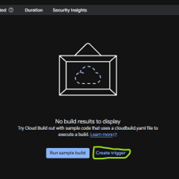

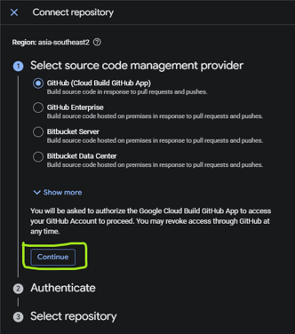


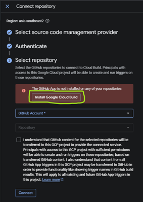


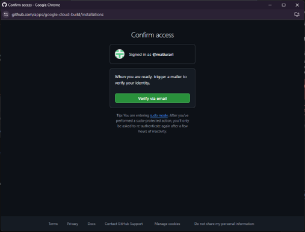

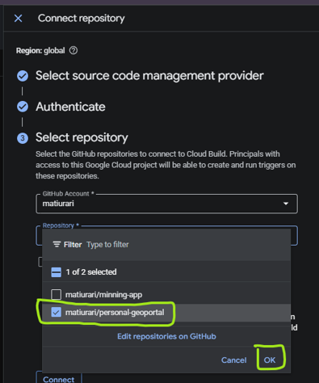


Dijalankan di: Google Cloud Console

Buka Cloud Build, lalu Repositories, lalu Connect repository. Buat connection dengan nama sesuai `CONNECTION_NAME` yang tercetak pada Tahap 2, pilih GitHub, masuk memakai akun pemilik fork, pilih repositori peserta, isi linked repository sesuai `LINKED_REPO_NAME`, lalu pastikan status connection berubah menjadi COMPLETE.


### Tahap 27. Buat trigger Cloud Build


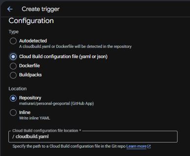


Dijalankan di: Google Cloud Console

Buat trigger dengan pengaturan berikut.

| Kolom | Nilai |
|---|---|
| Event | Push to a branch |
| Source | Fork repositori peserta |
| Branch | `^main$` |
| Configuration | Cloud Build configuration file |
| Location | `cloudbuild.yaml` |
| Name | Sesuai `TRIGGER_NAME` |
| Service account | Sesuai `BUILD_SA` |


### Tahap 28. Isi substitution variable

Dijalankan di: Google Cloud Console

Tambahkan empat variabel berikut pada trigger. Ganti `PARTICIPANT_ID` dengan identitas Anda.

| Variabel | Nilai |
|---|---|
| `_VM_NAME` | `webgis-PARTICIPANT_ID` |
| `_VM_ZONE` | `asia-southeast2-b` |
| `_VM_APP_DIR` | `/opt/webgis/app` |
| `_IMAGE_NAME` | `nextjs-PARTICIPANT_ID` |


Bagian `PARTICIPANT_ID` pada dua nilai pertama dan terakhir itulah yang membuat trigger peserta A tidak pernah menyentuh VM peserta B.


### Tahap 29. Jalankan trigger dan pantau hasilnya

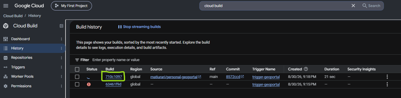


Dijalankan di: Google Cloud Console

Buka halaman History, lalu jalankan trigger dan pantau build yang sedang berjalan.


## Bagian D. Verifikasi

### Tahap 30. Periksa container

Dijalankan di: Cloud Shell

```bash
gcloud compute ssh "$VM_NAME" \
  --zone="$ZONE" \
  --tunnel-through-iap \
  --command='cd /opt/webgis/app && sudo docker compose ps'
```

Tiga container harus berstatus running: `nextjs_portal`, `geoserver_app`, dan `nginx_proxy`.

### Tahap 31. Periksa GeoServer

Dijalankan di: Cloud Shell

```bash
EXTERNAL_IP="$(gcloud compute instances describe "$VM_NAME" \
  --zone="$ZONE" \
  --format='get(networkInterfaces[0].accessConfigs[0].natIP)')"

echo "http://${EXTERNAL_IP}/geoserver/web"
curl -sSIL --max-redirs 3 "http://${EXTERNAL_IP}/geoserver/web"
```

### Tahap 32. Buka Geoportal

Dijalankan di: Cloud Shell menuju browser

```bash
EXTERNAL_IP="$(gcloud compute instances describe "$VM_NAME" \
  --zone="$ZONE" \
  --format='get(networkInterfaces[0].accessConfigs[0].natIP)')"

echo "http://${EXTERNAL_IP}/portal"
curl -sSIL --max-redirs 3 "http://${EXTERNAL_IP}/portal"
```

Buka alamat `http://IP_EKSTERNAL_VM/portal` di browser. Tulis `http://` secara eksplisit, karena sebagian browser mengubahnya menjadi `https://` lebih dahulu dan sertifikatnya belum ada pada tahap ini.

## Bila Ada yang Gagal

| Gejala | Penyebab yang paling sering |
|---|---|
| `ALREADY_EXISTS` saat membuat Service Account | Identitas peserta sama dengan peserta lain. Jalankan kembali blok Tahap 2 dan laporkan ke koordinator. |
| `host not found in upstream "nextjs"` | `nginx.conf` belum memakai pola `resolver` dengan `proxy_pass` variabel. Ambil berkas dari halaman Konfigurasi Project. |
| Container `nextjs` tidak muncul | Trigger belum pernah berjalan, atau `cloudbuild.yaml` belum ada di branch `main`. |
| Geoportal terbuka tetapi login gagal | `DATABASE_URL` masih kosong di `.env`. Isi, lalu jalankan `sudo docker compose up -d` lagi. |
| `pull access denied` untuk image nextjs | `NEXTJS_IMAGE` masih berisi nama karangan. Nilai sementara yang aman adalah `nginx:1.27-alpine`. |
| Build gagal pada langkah SSH ke VM | Service Account trigger belum diberi `roles/iam.serviceAccountUser` pada Service Account VM. Ulangi Tahap 6. |

## Hasil Tahap Ini

Geoportal berjalan di `http://IP_EKSTERNAL_VM/portal`, GeoServer dapat diakses dari halaman yang sama, dan setiap push ke branch `main` otomatis membangun ulang image serta menyalakan container di VM. Alamat itu belum memakai HTTPS, dan itu yang dikerjakan pada halaman berikutnya.

## Lampiran. Bila Memakai Akun Google Cloud Sendiri

Halaman ini mengasumsikan Anda memakai project kelompok yang disiapkan koordinator. Bila Anda menjalankan seluruh praktik dengan akun Google Cloud sendiri, projectnya dibuat lebih dahulu melalui pendaftaran akun gratis. Sebagian tahapan pada halaman ini tetap sama, tetapi nama resource tidak perlu memuat identitas peserta karena projectnya hanya dipakai satu orang.

| Bagian | Perbedaan pada akun sendiri |
|---|---|
| Tahap 2 | `PARTICIPANT_ID` boleh diisi nama sendiri. Penjagaan tabrakan tetap berguna bila Anda memakai lebih dari satu identitas. |
| Tahap 4 | Service Account dibuat di project sendiri, bukan project kelompok. |
| Tahap 5 | Repository `katalog-images` perlu dibuat sendiri di Artifact Registry. |
| Tahap 8 | Firewall rule perlu dibuat sendiri, karena tidak ada koordinator yang menyiapkannya. |
| Tahap 26 | Connection GitHub dibuat di project sendiri. |

### Pendaftaran akun

1. Buka [https://cloud.google.com/gcp](https://cloud.google.com/gcp).

   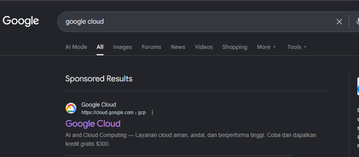

2. Pilih **Get started for free**.

   

3. Pilih akun dan negara yang digunakan, lalu klik **Agree & continue**.

   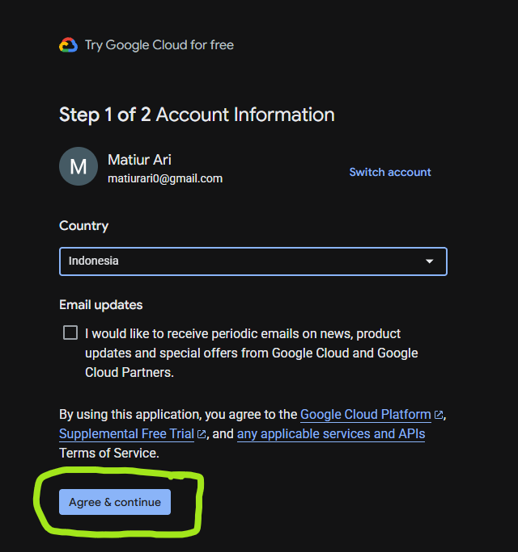

4. Isi **Contact Information**, lalu simpan.

   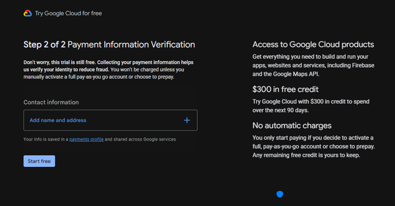

   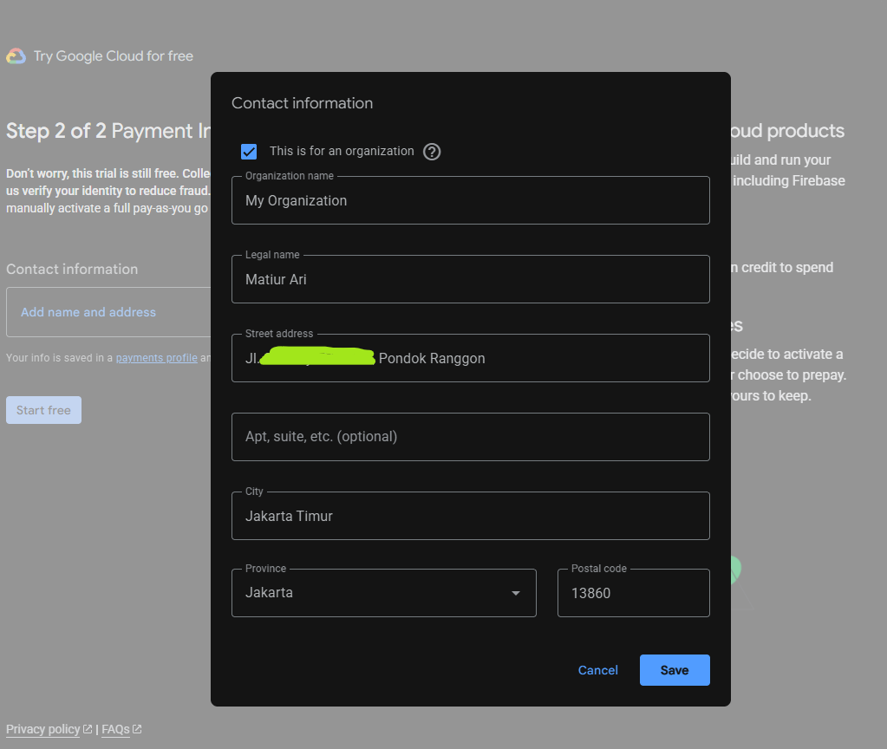

5. Setelah organization dibuat, isi **Tax Information**. Pilih **Head Office**, masukkan NIK pada kolom NPWP, lalu simpan.

   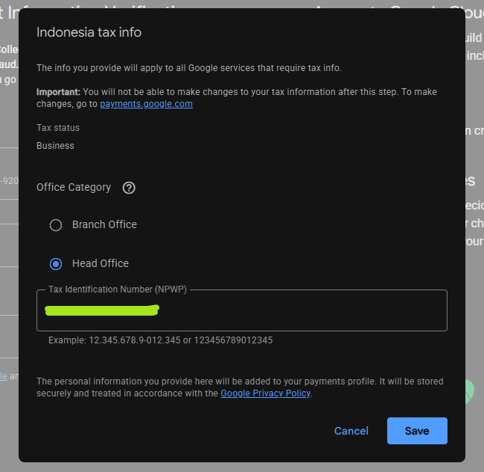

6. Isi **Add Payment Method** dengan detail kartu kredit.

   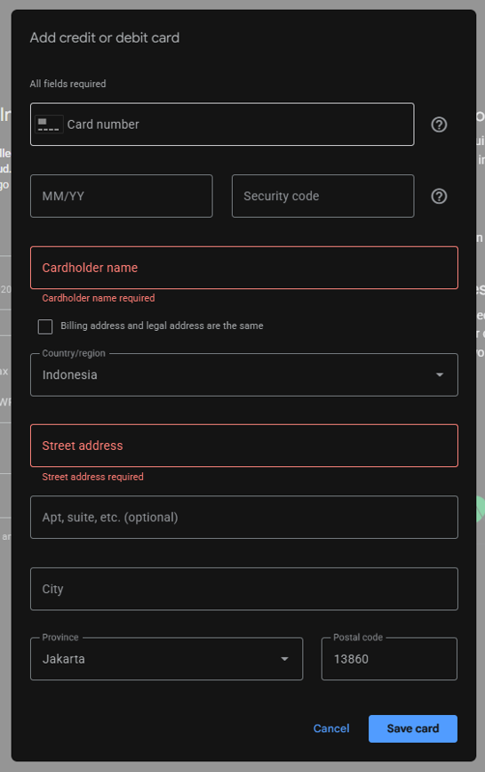

7. Konfirmasi metode pembayaran, lalu klik **Start free**.

   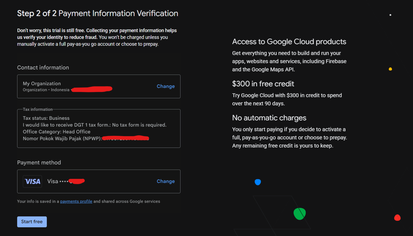

   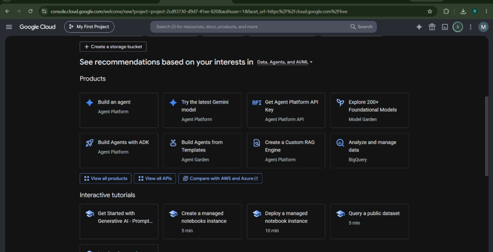

8. Buka kembali [https://cloud.google.com/gcp](https://cloud.google.com/gcp). Karena akun sudah terdaftar, tombol **Go to my console** akan muncul. Klik tombol itu untuk masuk ke dashboard project.

   

   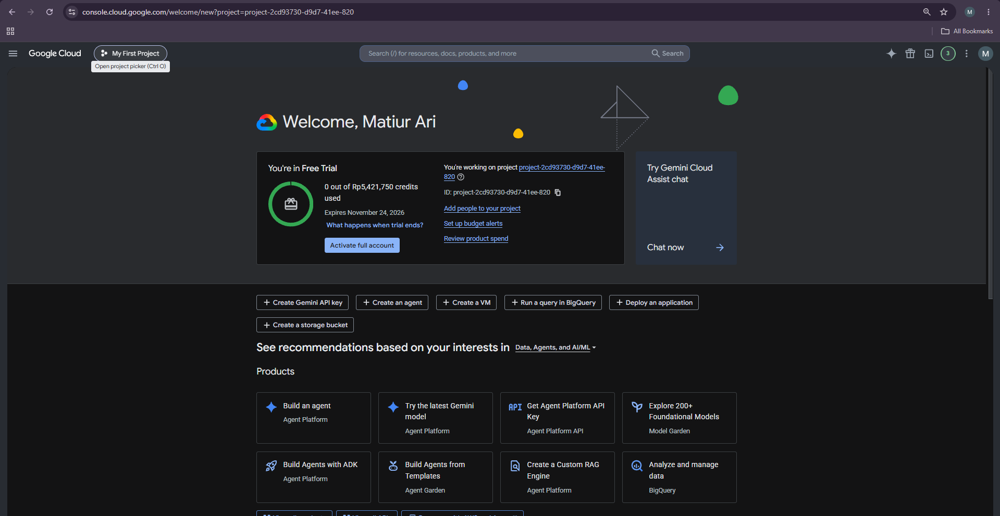

Setelah project tersedia, kembali ke Tahap 2 dan isi `PROJECT_ID` dengan Project ID milik Anda sendiri.
