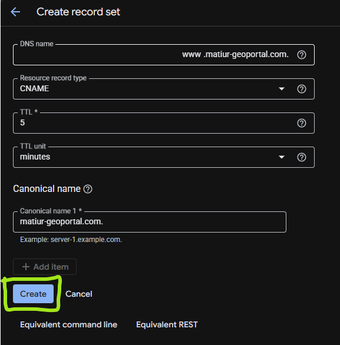
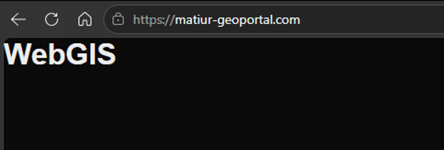

# Penambahan Subdomain

Halaman ini melanjutkan [Google Cloud Platform](/hari-3/deployment-project/google-cloud-platform). Setelah tahap ini selesai, Geoportal dapat dibuka melalui `https://nama01.gisbigtrainer.com/portal` dengan sertifikat yang dipercaya browser, bukan lagi melalui alamat IP.

Urutannya penting: record DNS harus sudah mengarah ke VM sebelum Certbot dijalankan. Let's Encrypt memverifikasi kepemilikan domain dengan mengakses alamat tersebut dari internet, sehingga sertifikat tidak akan terbit selama alamatnya belum bisa dijangkau.

## Prasyarat

- Bagian A sampai D pada halaman [Google Cloud Platform](/hari-3/deployment-project/google-cloud-platform) sudah selesai, dan variabel `PROJECT_ID`, `ZONE`, `VM_NAME`, serta `SUBDOMAIN` masih tersedia di Cloud Shell.
- Bila sesi Cloud Shell sudah berganti, jalankan kembali blok Tahap 2 halaman sebelumnya lebih dahulu.
- Subdomain sudah ditetapkan penyelenggara. Pola yang dipakai adalah `<identitas-peserta>.gisbigtrainer.com`.
- Akses ke pengelola DNS domain, atau koordinator yang bersedia menambahkan record untuk Anda.

## Bagian A. Mengarahkan Subdomain ke VM

### Tahap 1. Pastikan IP statis VM sudah terkunci

Dijalankan di: Cloud Shell

```bash
gcloud compute addresses describe "$STATIC_IP_NAME" \
  --region="$VM_REGION" \
  --format="table(name,address,status)"
```

Status harus `RESERVED`, dan alamat yang tampil harus sama dengan IP eksternal VM. Record A yang menunjuk ke IP dinamis akan rusak begitu VM dimatikan dan dinyalakan kembali.

### Tahap 2. Tentukan nama subdomain

Dijalankan di: Cloud Shell

```bash
SUBDOMAIN="${PARTICIPANT_ID}.gisbigtrainer.com"
echo "$SUBDOMAIN"
```

### Tahap 3. Buat record A pada pengelola DNS

Dijalankan di: Pengelola DNS

Tambahkan satu record baru.

| Kolom | Nilai |
|---|---|
| Nama | `PARTICIPANT_ID` saja, tanpa `.gisbigtrainer.com` |
| Jenis | `A` |
| TTL | `300` |
| Isi | Alamat IP statis VM dari Tahap 1 |



### Tahap 4. Periksa resolusi DNS

Dijalankan di: Cloud Shell

```bash
dig +short "$SUBDOMAIN"
dig +short "$SUBDOMAIN" @1.1.1.1
```

Keduanya harus mengembalikan alamat IP statis VM. Bila resolver publik (`@1.1.1.1`) sudah benar tetapi resolver lokal belum, tunggu propagasi DNS beberapa menit. Bila keduanya masih kosong, record belum tersimpan atau nama subdomainnya salah ketik.

### Tahap 5. Uji akses melalui subdomain

Dijalankan di: Cloud Shell

Lakukan sebelum memasang HTTPS, supaya bila ada masalah DNS atau Nginx, penyebabnya masih mudah dipisahkan.

```bash
curl -sSIL --max-redirs 3 "http://${SUBDOMAIN}/portal"
```

## Bagian B. Menerbitkan Sertifikat

### Tahap 6. Pasang Certbot dan siapkan direktori

Dijalankan di: Cloud Shell

Kedua direktori ini dibuat sekarang karena keduanya di-mount oleh container Nginx pada `docker-compose.yml`.

```bash
gcloud compute ssh "$VM_NAME" \
  --zone="$ZONE" \
  --tunnel-through-iap \
  --command='sudo apt-get update && sudo apt-get install -y certbot && cd /opt/webgis/app && mkdir -p certbot-webroot tls'
```

### Tahap 7. Sinkronkan konfigurasi dan nyalakan container

Dijalankan di: Cloud Shell

```bash
gcloud compute ssh "$VM_NAME" \
  --zone="$ZONE" \
  --tunnel-through-iap \
  --command='cd /opt/webgis/app && git pull --ff-only && sudo docker compose up -d && sudo docker compose ps'
```

Pastikan `nginx_proxy` berstatus running dan port 443 sudah terpublikasikan. Pada tahap ini layanan masih memakai HTTP, dan direktori `tls/` masih kosong sehingga server block HTTPS belum dimuat.

### Tahap 8. Periksa jalur ACME

Dijalankan di: Cloud Shell

```bash
curl -sS -o /dev/null -w "acme %{http_code}\n" "http://${SUBDOMAIN}/.well-known/acme-challenge/uji"
```

Balasan `404` adalah hasil yang diharapkan, karena berkas `uji` memang belum ada. Yang sedang diuji adalah apakah permintaan itu sampai ke direktori `certbot-webroot`, bukan diteruskan ke aplikasi Next.js.

Bila balasan yang muncul `502` atau `200`, hentikan tahap ini. Periksa kembali `nginx.conf`: blok `location ^~ /.well-known/acme-challenge/` harus ada di atas blok `location /`, dan volume `./certbot-webroot:/var/www/certbot:ro` harus ada pada service `nginx`.

### Tahap 9. Terbitkan sertifikat Let's Encrypt

Dijalankan di: Cloud Shell

Ganti `EMAIL` dengan alamat email yang aktif, karena Let's Encrypt mengirim pemberitahuan ke alamat itu bila sertifikat mendekati kedaluwarsa.

```bash
EMAIL="nama01@example.com"

gcloud compute ssh "$VM_NAME" \
  --zone="$ZONE" \
  --tunnel-through-iap \
  --command="cd /opt/webgis/app && sudo certbot certonly --webroot -w /opt/webgis/app/certbot-webroot -d $SUBDOMAIN --non-interactive --agree-tos -m $EMAIL"
```

Sertifikat tersimpan di `/etc/letsencrypt/live/$SUBDOMAIN/`.

### Tahap 10. Aktifkan HTTPS pada Nginx

Dijalankan di: Cloud Shell

Tulis berkas `tls/aktifkan.conf`. Isinya adalah server block lengkap untuk port 443, bukan sekadar dua baris `listen` dan `ssl_certificate`. Berkas inilah yang dimuat oleh baris `include /etc/nginx/tls/*.conf;` pada `nginx.conf`.

Masuk ke VM lebih dahulu, karena berkas ini lebih mudah ditulis lewat editor daripada lewat perintah satu baris.

```bash
gcloud compute ssh "$VM_NAME" \
  --zone="$ZONE" \
  --tunnel-through-iap
```

Buat berkasnya:

```bash
cd /opt/webgis/app
nano tls/aktifkan.conf
```

Isi dengan konfigurasi berikut. Ganti `nama01.gisbigtrainer.com` dengan subdomain Anda.

```nginx
server {
    listen 443 ssl;
    http2 on;
    server_name nama01.gisbigtrainer.com;

    ssl_certificate     /etc/letsencrypt/live/nama01.gisbigtrainer.com/fullchain.pem;
    ssl_certificate_key /etc/letsencrypt/live/nama01.gisbigtrainer.com/privkey.pem;
    ssl_protocols       TLSv1.2 TLSv1.3;
    ssl_prefer_server_ciphers off;

    location ^~ /.well-known/acme-challenge/ {
        root /var/www/certbot;
    }

    location = / {
        return 302 /portal;
    }

    location = /geoserver {
        return 302 /geoserver/web;
    }

    location /geoserver/ {
        resolver 127.0.0.11 valid=10s ipv6=off;

        set $geoserver_upstream http://geoserver:8080;
        rewrite ^/geoserver/(.*)$ /geoserver/$1 break;
        proxy_pass $geoserver_upstream;

        proxy_set_header Host $http_host;
        proxy_set_header X-Real-IP $remote_addr;
        proxy_set_header X-Forwarded-For $proxy_add_x_forwarded_for;
        proxy_set_header X-Forwarded-Proto https;
    }

    location / {
        resolver 127.0.0.11 valid=10s ipv6=off;

        set $nextjs_upstream http://nextjs:3000;
        proxy_pass $nextjs_upstream;

        proxy_http_version 1.1;
        proxy_set_header Host $host;
        proxy_set_header X-Real-IP $remote_addr;
        proxy_set_header X-Forwarded-For $proxy_add_x_forwarded_for;
        proxy_set_header X-Forwarded-Proto https;
    }
}
```

Uji konfigurasi sebelum memuat ulang. Bila ada yang salah, Nginx menolak dan layanan yang sedang berjalan tidak terganggu.

```bash
sudo docker compose exec -T nginx nginx -t
```

Bila hasilnya `syntax is ok` dan `test is successful`, muat ulang:

```bash
sudo docker compose exec -T nginx nginx -s reload
```

Dua hal yang paling sering terlewat pada tahap ini:

- Berkas ini adalah **server block terpisah**, bukan tambahan baris di dalam blok port 80. Menulis `listen 443 ssl;` di dalam blok yang sama akan membuat Nginx melayani port 443 dengan konfigurasi yang sama tetapi tanpa parameter SSL yang benar.
- Header `X-Forwarded-Proto https` pada jalur HTTPS berbeda dari `$scheme` pada jalur HTTP. Nilainya memang ditulis tetap, karena berkas ini hanya dipakai oleh port 443.

### Tahap 11. Verifikasi HTTPS

Dijalankan di: Cloud Shell

```bash
curl -sSIL --max-redirs 3 "https://${SUBDOMAIN}/portal"
```

Balasan yang diharapkan adalah `HTTP/2 200`. Bila muncul peringatan sertifikat, periksa bahwa `ssl_certificate` menunjuk ke direktori `/etc/letsencrypt/live/$SUBDOMAIN/`, bukan ke direktori lain.

### Tahap 12. Atur perpanjangan sertifikat otomatis

Dijalankan di: Cloud Shell

Sertifikat Let's Encrypt berlaku 90 hari. Hook berikut memuat ulang Nginx setiap kali sertifikat diperbarui, sehingga container membaca berkas sertifikat yang baru.

```bash
gcloud compute ssh "$VM_NAME" \
  --zone="$ZONE" \
  --tunnel-through-iap \
  --command='sudo mkdir -p /etc/letsencrypt/renewal-hooks/deploy && printf "%s\n" "#!/bin/sh" "cd /opt/webgis/app && docker compose exec -T nginx nginx -s reload" | sudo tee /etc/letsencrypt/renewal-hooks/deploy/reload-nginx.sh >/dev/null && sudo chmod +x /etc/letsencrypt/renewal-hooks/deploy/reload-nginx.sh && sudo certbot renew --dry-run'
```

Opsi `--dry-run` menguji seluruh proses perpanjangan tanpa memakai kuota penerbitan sertifikat yang sebenarnya. Pastikan hasilnya menyatakan keberhasilan, bukan sekadar tidak ada pesan galat.

### Tahap 13. Ubah alamat aplikasi di .env

Dijalankan di: Terminal VM

Setelah HTTPS aktif, alamat aplikasi pada `.env` harus ikut berubah. Tanpa perubahan ini, login dan callback NextAuth akan mengarah ke alamat HTTP.

```bash
gcloud compute ssh "$VM_NAME" --zone="$ZONE" --tunnel-through-iap
nano /opt/webgis/app/.env
```

Ubah dua baris berikut:

```bash
NEXTAUTH_URL=https://nama01.gisbigtrainer.com/portal/
BASE_URL=https://nama01.gisbigtrainer.com/portal
```

Setelah tersimpan, nyalakan ulang container aplikasi supaya nilai barunya terbaca:

```bash
cd /opt/webgis/app && sudo docker compose up -d nextjs
```

### Tahap 14. Verifikasi akhir

Dijalankan di: Browser

Buka `https://SUBDOMAIN/portal`, lalu periksa satu per satu:



- Halaman Geoportal tampil tanpa peringatan sertifikat.
- Login berhasil memakai akun dari materi autentikasi.
- Layer GeoServer dapat dimuat dari dalam Geoportal.
- Alamat `http://SUBDOMAIN/portal` dialihkan ke versi HTTPS.
- `certbot renew --dry-run` pada Tahap 12 selesai tanpa galat.

## Bila Ada yang Gagal

| Gejala | Penyebab yang paling sering |
|---|---|
| Certbot gagal dengan `Invalid response ... 404` | Blok `location ^~ /.well-known/acme-challenge/` belum ada di `nginx.conf`, atau volume `certbot-webroot` belum terpasang. |
| `nginx: [emerg] cannot load certificate` | Volume `/etc/letsencrypt:/etc/letsencrypt:ro` belum ada pada service `nginx`. |
| HTTPS tidak terjangkau, HTTP normal | Port `443:443` belum dipublikasikan pada service `nginx`. |
| `dig` mengembalikan alamat berbeda | Record A masih menunjuk ke IP lama, atau ada record lain dengan nama sama. |
| Login berhasil di HTTP tetapi gagal di HTTPS | `NEXTAUTH_URL` dan `BASE_URL` belum diubah ke alamat HTTPS, atau container belum dinyalakan ulang. |

## Hasil Akhir Deployment Project

Geoportal berjalan di alamat HTTPS dengan subdomain sendiri, sertifikatnya dipercaya browser dan diperbarui otomatis, GeoServer dapat diakses dari halaman yang sama, dan setiap push ke branch `main` membangun ulang aplikasi tanpa perlu masuk ke VM.
