# Konfigurasi Access Token dan Next Auth

## **Pembuatan Access Token di Response API Login dan Function Helper Role Akses**

1. Buka project NextJS di VS code, install Next Auth dengan cara jalankan command
    
    ```jsx
    npm install next-auth
    npm install jsonwebtoken 
    ```
    
    jika sudah akan ada next-auth di package.json
    
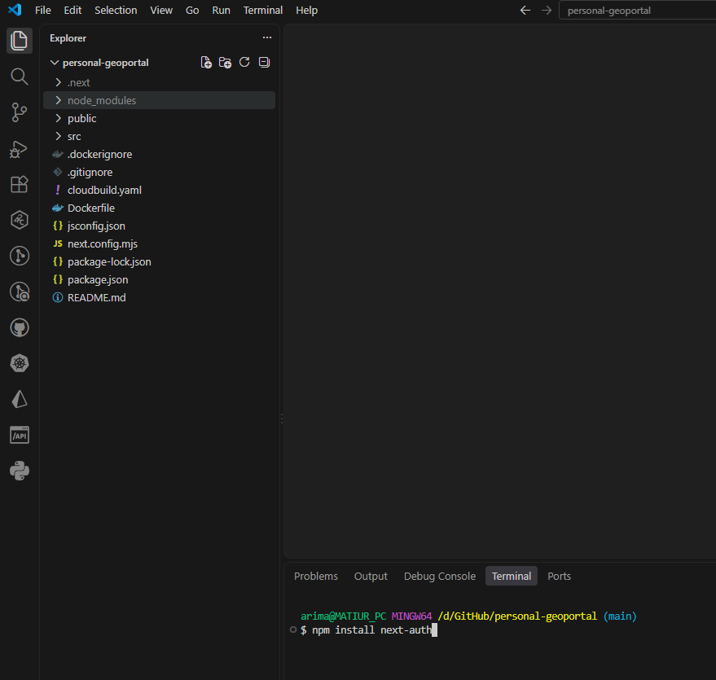
    
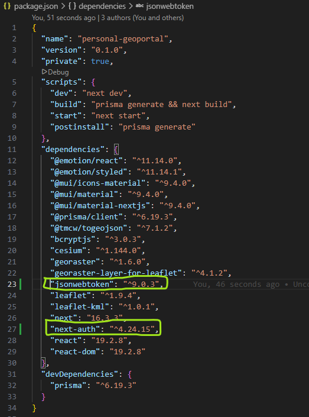
    
2. Tambahkan variabel berikut ini di file .env
    
    ```jsx
    NEXTAUTH_SECRET=some-long-random-string
    JWT_SECRET=some-long-random-string-different-from-nextauth-secret 
    JWT_EXPIRES_IN=1h 
    ```

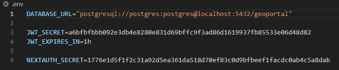

3. Buat kolom baru di table users bernama role kemudian isi kolom tersebut, kemudian npx prisma db pull dan npx prisma generate.
    
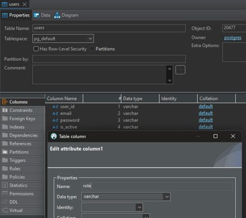
    
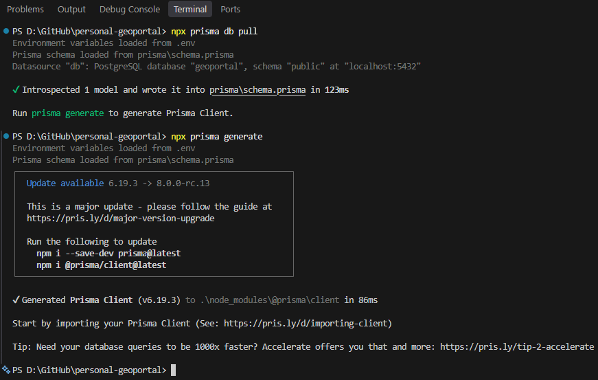
    
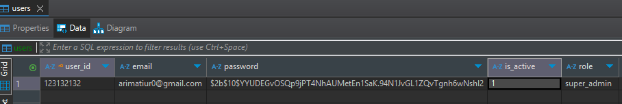
    
4. Buat function untuk verifikasi credential, buat file verifyCredentials.js di folder lib/auth, kemudian masukan kode berikut ini lalu save
    

    
5. Selanjutnya buat function signAccessToken dan verifyAccessToken di dalam file jwt.js yang dibuat di dalam folder lib/auth. Function signAccessToken berfungsi untuk membuat access token, sedangkan function verifyAccessToken berfungsi untuk verifikasi apakah token valid
    

    
6. Sekarang ubah API Login supaya responsenya memberikan access token
    

    
7. Jalankan project dengan npm run dev, kemudian test API login dengan postman, pastikan sekarang API anda memberikan access_token di responnya
    

    
8. Buat function untuk hirarki roles. Buat file role.js di folder lib/auth/ lalu masukan kode berikut
    

    
9. Buat function untuk verifikasi bearer token. Buat file verifyBearerToken.js di dalam folder lib/auth/. Berikut kode verifyBearerToken.js
    

    
10. Sekarang jika ada pengecekan hak akses role cukup memanggil function requireAuth yang ada di file verifyBearerToken.js. Berikut contoh penggunaannya di API list user yang mana list user hanya bisa diakses oleh role super_admin.
    

    
11. Pergi ke postman kemudian lakukan login super admin untuk mendapatkan access_token lalu gunakan token itu di authorization bearer token dan akses localhost:3000/portal/api/users/list
    

    
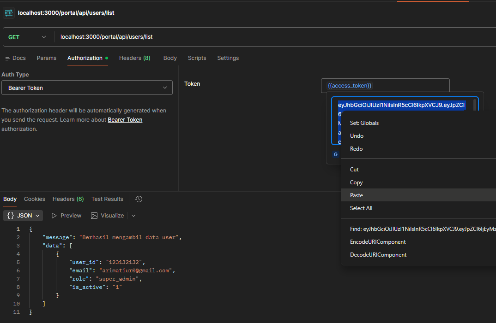
    

## **Konfigurasi NextAuth**

1. Tambahkan variable berikut ini di file .env
    

    
2. Buat folder src/app/api/auth/[...nextauth], lalu di dalamnya buat file route.js. Masukan kode berikut di dalam file tersebut
    

    
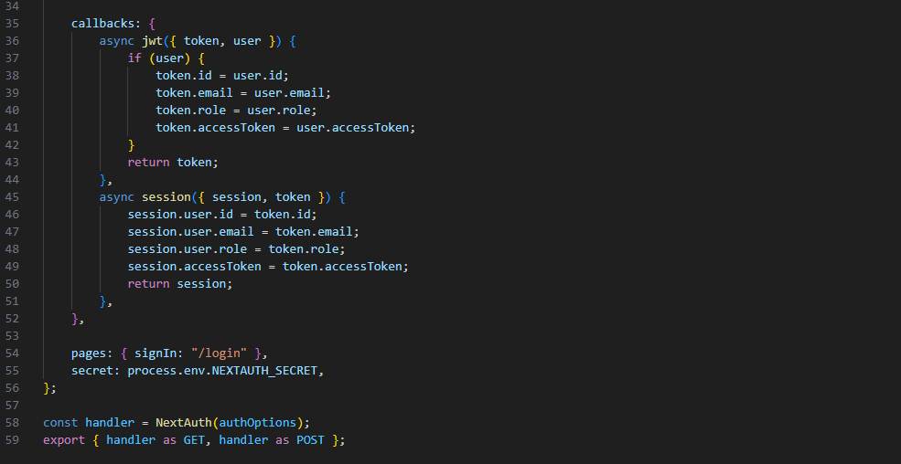
    
3. Selanjutnya buat file providers.js di folder src/app dan isikan kode berikut, kode ini memberikan kita component session yang mana component ini memberi aplikasi kita informasi jika ingin mengakses semua fungsi Autentikasi ada di dalam API portal/api/auth
    

    
4. Lalu setelah session providers dibuat bungkus seluruh aplikasi kita dengan session providers. Dengan membungkus seluruh aplikasi kita dengan session provider maka session akan bisa dikenali di seluruh halaman web kita.
    

    
5. Karena session sudah dibuat di web kita, maka di form login tidak perlu lagi mengakses API login, kita cukup menggunakan fungsi singIn dari NextAuth. Pergi ke halaman LoginForm.jsx, kemudian perbarui function handle submit menjadi seperti ini. Jangan lupa import signIn function dari next-auth/react
    

    
6. Coba lagi login dari halaman login setelah login anda akan menemukan data session anda di network browser
    

    
7. Buat halaman internal. Di halaman internal buat button logout agar kita bisa logout. Saat button logout di klik kita bisa cek di network tab session kita sudah dihapus
    

    
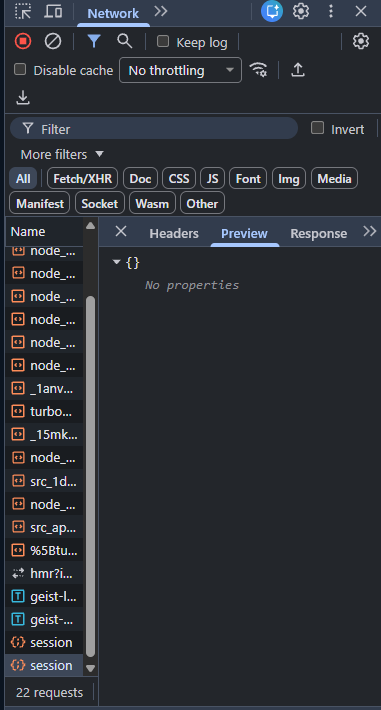
    
8. Di form login kita melakukan route.push ke halaman /internal. Halaman ini tidak akan bisa diakses jika user belum login, tapi nyatanya saat ini halaman bisa langsung diakses tanpa login. Oleh karena itu kita harus melakukan proteksi halaman private dengan middleware. Buat file proxy.js di dalam folder src/
    

    
9. Saat anda sudah logout, akses kembali halaman /internal maka anda akan redirect ke halaman login karena untuk bisa ke halaman ini harus login terlebih dahulu.
    

    
10. Pergi ke VM buka folder app kemudian nano .env. Ubah file .env di VM anda menjadi seperti yang ada di local. Sesuaikan isi isi variabelnya menjadi variabel production.
    

    
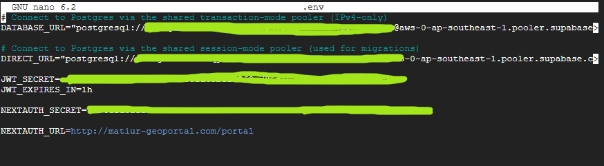
    
11. Sesuaikan juga table users yang ada di Supabase karena ada perubahan di schema.prisma yaitu penambahan kolom role di table users
    

    
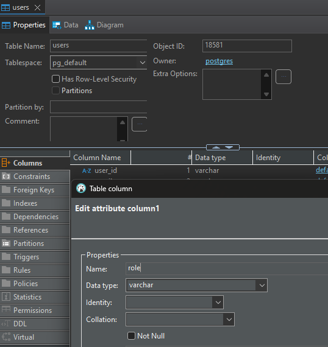
    
12. Setelah memastikan komponen production kita siap menerima update lakukan git push
    

    
13. Tunggu proses CICD nya selesai lalu kunjungi halaman /internal maka anda akan di redirect ke halaman login
    

    
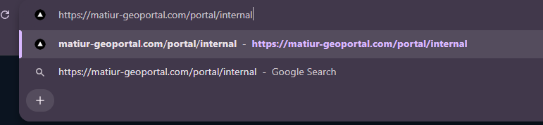
    
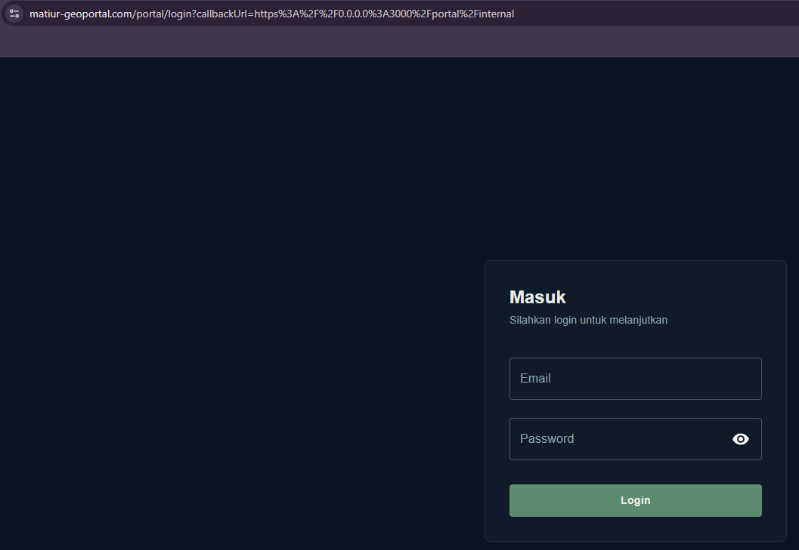

## Berkas Konfigurasi NextAuth

Berikut berkas yang dipakai NextAuth. Salin isinya apa adanya.

### lib/auth/verifyBearerToken.js

```js
import { verifyAccessToken } from "./jwt";
import { hasRequiredRole } from "./roles";

// Extract token dari header "Authorization: Bearer <token>"
export function getBearerToken(request) {
    const authHeader = request.headers.get("authorization");
    if (!authHeader?.startsWith("Bearer ")) return null;
    return authHeader.split(" ")[1];
}

// Extract token dari URL search parameters (contoh: ?access_token=xyz)
export function getTokenParams(request) {
    const { searchParams } = new URL(request.url);
    return searchParams.get("access_token");
}

export function requireAuth(request, minRole = null) {
    // 1. Ambil token dari Bearer Header ATAU dari Query Params
    const token = getBearerToken(request) || getTokenParams(request);

    // 2. Jika kedua sumber token tidak ditemukan
    if (!token) {
        return { error: "Unauthorized: Token tidak ditemukan", status: 401 };
    }

    try {
        // 3. Validasi token (menggunakan variabel `token` yang sudah diekstrak)
        const payload = verifyAccessToken(token);

        // 4. Cek hirarki role jika parameter minRole disediakan
        if (minRole && !hasRequiredRole(payload.role, minRole)) {
            return { error: "Forbidden: Akses ditolak", status: 403 };
        }

        // 5. Kembalikan payload jika berhasil
        return { payload };
    } catch (err) {
        return { error: "Invalid or expired token", status: 401 };
    }
}
```

### src/app/api/auth/[...nextauth]/route.js

```js
import NextAuth from "next-auth";
import Credentials from "next-auth/providers/credentials";
import { verifyCredentials } from "../../../../../lib/auth/verifyCredentials";
import { signAccessToken } from "../../../../../lib/auth/jwt";

export const authOptions = {
    providers: [
        Credentials({
            id: "geoportal-credential",
            name: "geoportal-credential",
            credentials: {
                email: { label: "Email", type: "text" }, // email yang user masukan di halaman login
                password: { label: "Password", type: "password" }, // password yang user masukan di halaman login
            },
            authorize: async (credentials) => {
                try {
                    const user = await verifyCredentials(credentials.email, credentials.password); //validasi email dan password
                    const accessToken = signAccessToken(user);
                    return {
                        id: user.user_id, // NextAuth membutuhkan properti `id`
                        user_id: user.user_id,
                        email: user.email,
                        role: user.role,
                        accessToken
                    };
                } catch (err) {
                    throw new Error(err.message || "Terjadi kesalahan server");
                }
            },
        }),
    ],
    session: { strategy: "jwt", maxAge: 60 * 60 }, // 1 Jam
    callbacks: {
        async jwt({ token, user }) {
            // 1. Saat pertama kali login
            if (user) {
                // Di sini tempat object yang diberikan 
                token.id = user.user_id;
                token.email = user.email;
                token.role = user.role;
                token.accessToken = user.accessToken;
                return token;
            }
            // 2. Cek apakah Custom Bearer Token sudah expired/invalid
            try {
                verifyAccessToken(token.accessToken); // Cek validitas
            } catch (err) {
                // Jika expired, buat ulang Bearer Token baru menggunakan data user dari token NextAuth
                token.accessToken = signAccessToken({
                    user_id: token.id,
                    email: token.email,
                    role: token.role,
                });
            }
            return token;
        },
        async session({ session, token }) {
            session.user.id = token.id;
            session.user.user_id = token.user_id;
            session.user.email = token.email;
            session.user.role = token.role;
            session.accessToken = token.accessToken;
            return session;
        },
    },
    pages: { signIn: "/login" },
    secret: process.env.NEXTAUTH_SECRET,
};

const handler = NextAuth(authOptions);
export { handler as GET, handler as POST };
```
