# Google Cloud Platform

Halaman ini memindahkan aplikasi dari laptop ke server. Tahapannya berurutan: menyiapkan project, membuat VM, memasang Docker, menyiapkan berkas aplikasi, membangun image, menjalankan GeoServer dan Nginx, lalu menyambungkan Cloud Build supaya setiap push ke GitHub otomatis men-deploy ulang.

Seluruh tahapan memakai satu project kelompok yang dipakai bersama **empat peserta**. Karena itu ada dua jenis nama resource: yang dibuat koordinator sekali untuk dipakai berempat, dan yang dibuat tiap peserta sendiri sehingga wajib berbeda. Tahap 2 menetapkan pembagian itu sebelum Anda membuat apa pun.

## Prasyarat

- Akses ke Google Cloud project dari koordinator. Project ID berbentuk `geoportal-kelompok-a-xxxxx`.
- Email peserta yang sudah terdaftar di project tersebut. Email ini dipakai menurunkan identitas peserta.
- Fork repositori proyek di akun GitHub sendiri.
- Berkas dari halaman [Konfigurasi Project](/hari-3/praktik-11-deploy/konfigurasi-project) sudah di-push ke fork tersebut.

## Pembagian Resource

Tabel ini perlu dibaca sebelum Tahap 2. Salah menebak pemilik resource adalah penyebab kegagalan paling sering di halaman ini.

| Resource | Dibuat oleh | Nama | Bila Anda membuatnya sendiri |
|---|---|---|---|
| Project kelompok | Koordinator | `geoportal-kelompok-a-xxxxx` | Tidak punya izin, dan tidak perlu |
| Artifact Registry | Koordinator | `katalog-images` | Gagal dengan `ALREADY_EXISTS` |
| Firewall rule port 80 dan 443 | Koordinator | `allow-webgis-http` | Gagal dengan `ALREADY_EXISTS` |
| Firewall rule SSH lewat IAP | Koordinator | `allow-webgis-iap-ssh` | Gagal dengan `ALREADY_EXISTS` |
| Network tag | Koordinator | `webgis-http`, `webgis-iap-ssh` | Gagal dengan `ALREADY_EXISTS` |
| VM, IP statis, Service Account Cloud Build, trigger, GitHub connection, image | Peserta | Mengandung identitas peserta | Bertabrakan dengan peserta lain |

Nama pada baris terakhir diturunkan seluruhnya dari satu nilai, yaitu identitas peserta. Nilai itulah yang ditetapkan pada Tahap 2.

## Bagian A. Menyiapkan Project dan VM

### Tahap 1. Buka project

Dijalankan di: Google Cloud Console

Masuk memakai email yang diberikan koordinator, lalu pilih project kelompok yang sudah disiapkan. Pastikan Project ID yang tampil di bagian atas sudah benar sebelum melanjutkan.

### Tahap 2. Tetapkan identitas peserta

Dijalankan di: Cloud Shell

Identitas peserta **diturunkan dari email**, bukan diketik manual. Empat peserta menerima empat email berbeda dari koordinator, sehingga empat identitas yang dihasilkan pasti berbeda. Tabrakan tidak dicegah dengan peringatan, melainkan dengan menghilangkan nilai yang bisa salah diisi.

Tempel seluruh blok berikut di Cloud Shell. Ubah hanya dua baris pertama.

```bash
# ---------------------------------------------------------------------
# ISI INI. Hanya dua baris ini yang diubah.
# ---------------------------------------------------------------------
PROJECT_ID="geoportal-kelompok-a-xxxxx"     # dari koordinator
EMAIL_PESERTA="nama01@example.com"          # email peserta yang terdaftar
# ---------------------------------------------------------------------

set -euo pipefail

# Nilai bersama. Sama untuk semua peserta dalam satu project, jangan diubah.
REGION="asia-southeast2"
ZONE="asia-southeast2-b"
REPOSITORY="katalog-images"                 # milik koordinator, jangan dibuat ulang
APP_DIR="/opt/webgis/app"

merah()  { printf '\033[31m%s\033[0m\n' "$1"; }
hijau()  { printf '\033[32m%s\033[0m\n' "$1"; }
kuning() { printf '\033[33m%s\033[0m\n' "$1"; }

if [ "$PROJECT_ID" = "geoportal-kelompok-a-xxxxx" ]; then
  merah "PROJECT_ID masih bernilai contoh."
  echo "  Ambil Project ID yang benar dari koordinator."
  echo "  Untuk melihat project yang boleh diakses: gcloud projects list"
  exit 1
fi

# Turunkan identitas dari email:
#   nama01@example.com          -> nama01
#   asisten.nama-01@contoh.com  -> asisten-nama-01
#
# Setiap karakter selain huruf kecil dan angka diubah menjadi SATU tanda
# hubung, bukan dihapus. Menghapus akan membuat dua email berbeda
# menghasilkan identitas yang sama.
PARTICIPANT_ID="$(
  printf '%s' "${EMAIL_PESERTA%%@*}" \
    | tr '[:upper:]' '[:lower:]' \
    | sed -e 's/[^a-z0-9]\{1,\}/-/g' -e 's/^-\{1,\}//' -e 's/-\{1,\}$//'
)"

if [ -z "$PARTICIPANT_ID" ]; then
  merah "Tidak bisa menurunkan identitas dari email '$EMAIL_PESERTA'."
  echo "  Minta koordinator memberikan identitas secara eksplisit."
  exit 1
fi

# Nama VM, Service Account, dan trigger GCP menolak huruf besar, spasi, dan
# garis bawah. Pesan errornya menyebut nama resource, bukan nama variabel,
# sehingga sulit dilacak bila lolos sampai ke perintah gcloud.
if printf '%s' "$PARTICIPANT_ID" | grep -qE '[^a-z0-9-]'; then
  merah "Identitas '$PARTICIPANT_ID' mengandung karakter yang tidak sah."
  echo "  Hanya huruf kecil, angka, dan tanda hubung."
  exit 1
fi

if [ "${#PARTICIPANT_ID}" -gt 18 ]; then
  merah "Identitas '$PARTICIPANT_ID' ${#PARTICIPANT_ID} karakter, melebihi batas 18."
  echo "  Identitas dipakai membentuk cb-deployer-<identitas> dan webgis-<identitas>."
  exit 1
fi

VM_NAME="webgis-${PARTICIPANT_ID}"
STATIC_IP_NAME="webgis-ip-${PARTICIPANT_ID}"
BUILD_SA_NAME="cb-deployer-${PARTICIPANT_ID}"
CONNECTION_NAME="github-${PARTICIPANT_ID}"
LINKED_REPO_NAME="repo-${PARTICIPANT_ID}"
TRIGGER_NAME="deploy-${PARTICIPANT_ID}"
IMAGE_NAME="nextjs-${PARTICIPANT_ID}"
SUBDOMAIN="${PARTICIPANT_ID}.gisbigtrainer.com"
BUILD_SA="${BUILD_SA_NAME}@${PROJECT_ID}.iam.gserviceaccount.com"
VM_REGION="${ZONE%-*}"

# ---------------------------------------------------------------------
# Penjagaan tabrakan. Peserta pertama tidak menemukan apa pun dan lolos.
# Peserta kedua menemukan Service Account milik peserta pertama, dan
# dihentikan SEBELUM membuat apa pun.
# ---------------------------------------------------------------------
echo "Memeriksa project $PROJECT_ID ..."

if ! gcloud projects describe "$PROJECT_ID" >/dev/null 2>&1; then
  merah "Project '$PROJECT_ID' tidak bisa diakses."
  echo "  Periksa: gcloud projects list"
  echo "  Kalau project tidak muncul, hubungi koordinator. Akses IAM belum terpasang."
  exit 1
fi

PEMILIK=""
if gcloud compute instances describe "$VM_NAME" --zone="$ZONE" --project="$PROJECT_ID" >/dev/null 2>&1; then
  PEMILIK="$(
    gcloud compute instances describe "$VM_NAME" --zone="$ZONE" --project="$PROJECT_ID" \
      --format='value(metadata.items[?key==`created-by`].value)' 2>/dev/null | head -1 || true
  )"
fi

if gcloud iam service-accounts describe "$BUILD_SA" --project="$PROJECT_ID" >/dev/null 2>&1; then
  merah "Service Account '$BUILD_SA_NAME' sudah ada di project ini."
  echo ""
  echo "  Artinya identitas '$PARTICIPANT_ID' sudah dipakai peserta lain di project yang sama."
  [ -n "$PEMILIK" ] && echo "  VM '$VM_NAME' dibuat oleh: $PEMILIK"
  echo ""
  echo "  JANGAN melanjutkan. Kalau Anda memakai Service Account milik orang lain,"
  echo "  Cloud Build Anda akan men-deploy ke VM orang itu, dan sebaliknya."
  echo ""
  echo "  Langkah yang benar:"
  echo "    1. Laporkan ke koordinator bahwa identitas '$PARTICIPANT_ID' bentrok."
  echo "    2. Minta identitas pengganti, lalu jalankan blok ini lagi dengan nilai itu."
  exit 1
fi

if gcloud compute instances describe "$VM_NAME" --zone="$ZONE" --project="$PROJECT_ID" >/dev/null 2>&1; then
  merah "VM '$VM_NAME' sudah ada di project ini."
  echo "  Identitas '$PARTICIPANT_ID' sudah dipakai. Lapor ke koordinator."
  exit 1
fi

hijau "Lolos. Tidak ada resource dengan nama ini di project $PROJECT_ID."
echo ""
echo "PROJECT_ID     = $PROJECT_ID"
echo "EMAIL_PESERTA  = $EMAIL_PESERTA"
echo "PARTICIPANT_ID = $PARTICIPANT_ID   <- diturunkan dari email, bukan diketik"
echo ""
echo "Nama resource Anda:"
printf '  %-18s %s\n' \
  VM_NAME "$VM_NAME" \
  STATIC_IP_NAME "$STATIC_IP_NAME" \
  BUILD_SA_NAME "$BUILD_SA_NAME" \
  CONNECTION_NAME "$CONNECTION_NAME" \
  LINKED_REPO_NAME "$LINKED_REPO_NAME" \
  TRIGGER_NAME "$TRIGGER_NAME" \
  IMAGE_NAME "$IMAGE_NAME" \
  SUBDOMAIN "$SUBDOMAIN"
echo ""
kuning "Resource yang JUSTRU TIDAK boleh Anda buat (milik koordinator):"
echo "  katalog-images          Artifact Registry bersama"
echo "  allow-webgis-http       Firewall rule port 80 dan 443"
echo "  allow-webgis-iap-ssh    Firewall rule port 22 lewat IAP"
echo ""
echo "Kalau resource di atas ternyata BELUM ada, lapor ke koordinator."
echo "Jangan dibuat sendiri, karena nama yang sama dipakai seluruh peserta project ini."
echo ""
hijau "Lanjutkan ke Tahap 3."
```

Jika blok itu berhenti dengan pesan bahwa Service Account sudah ada, **jangan mencari jalan lain**. Laporkan ke koordinator dan minta identitas pengganti. Melanjutkan dengan Service Account milik peserta lain membuat Cloud Build Anda men-deploy ke VM orang lain.

::: tip Bila Cloud Shell tertutup
Variabel pada blok di atas hanya bertahan selama sesi Cloud Shell terbuka. Bila sesi berakhir atau Cloud Shell berpindah, jalankan kembali seluruh blok Tahap 2 sebelum melanjutkan.
:::

### Tahap 3. Periksa API yang dibutuhkan

Dijalankan di: Cloud Shell

```bash
gcloud services list --enabled \
  --filter="config.name:(compute.googleapis.com OR cloudbuild.googleapis.com OR artifactregistry.googleapis.com OR iap.googleapis.com OR dns.googleapis.com OR domains.googleapis.com OR secretmanager.googleapis.com)" \
  --format="value(config.name)"
```

Bila ada layanan yang belum muncul, hentikan tahap ini dan lapor ke koordinator. Peserta tidak punya izin mengaktifkan API pada project kelompok.

### Tahap 4. Buat Service Account deployment

Dijalankan di: Cloud Shell

Service Account ini milik peserta, sehingga namanya memuat identitas Anda.

```bash
gcloud iam service-accounts create "$BUILD_SA_NAME" \
  --display-name="Cloud Build Deployer"

for ROLE in \
  roles/cloudbuild.builds.builder \
  roles/artifactregistry.writer \
  roles/compute.instanceAdmin.v1 \
  roles/compute.osAdminLogin \
  roles/iap.tunnelResourceAccessor \
  roles/logging.logWriter
do
  gcloud projects add-iam-policy-binding "$PROJECT_ID" \
    --member="serviceAccount:$BUILD_SA" \
    --role="$ROLE" \
    --condition=None
done
```

### Tahap 5. Periksa Artifact Registry

Dijalankan di: Cloud Shell menuju Google Cloud Console

Buka halaman Artifact Registry dan pastikan repository `katalog-images` sudah ada pada region `asia-southeast2`.


Repository ini dibuat koordinator dan dipakai seluruh peserta. Peserta hanya memeriksa, bukan membuat. Bila hasilnya kosong atau `NOT_FOUND`, lapor ke koordinator dan jangan membuat repository sendiri.


### Tahap 6. Siapkan identitas VM

Dijalankan di: Cloud Shell

VM peserta memakai Service Account default project. Alamatnya berbentuk `<nomor-project>-compute@developer.gserviceaccount.com`, dan **nilainya sama untuk semua peserta** karena hanya bergantung pada nomor project. Itu memang begitu, dan bukan tanda ada yang salah.

```bash
PROJECT_NUMBER="$(gcloud projects describe "$PROJECT_ID" \
  --format='value(projectNumber)')"

VM_SA="${PROJECT_NUMBER}-compute@developer.gserviceaccount.com"

gcloud projects add-iam-policy-binding "$PROJECT_ID" \
  --member="serviceAccount:$VM_SA" \
  --role="roles/artifactregistry.reader" \
  --condition=None

gcloud iam service-accounts add-iam-policy-binding "$VM_SA" \
  --member="serviceAccount:$BUILD_SA" \
  --role="roles/iam.serviceAccountUser" \
  --condition=None
```

Rantai izinnya: Service Account Cloud Build peserta mendapat `roles/iam.serviceAccountUser` pada Service Account VM, sehingga trigger boleh melakukan SSH ke VM. Yang membedakan antar peserta bukan Service Account VM, melainkan nama VM dan Service Account Cloud Build-nya.

### Tahap 7. Buat VM

Dijalankan di: Cloud Shell menuju Google Cloud Console

VM dibuat dari Cloud Shell dengan spesifikasi berikut. Pastikan Compute Engine API sudah aktif sebelum perintah ini dijalankan.


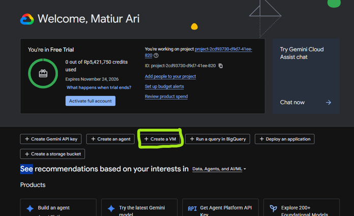

```bash
gcloud compute instances create "$VM_NAME" \
  --zone="$ZONE" \
  --machine-type="e2-medium" \
  --image-family="ubuntu-2204-lts" \
  --image-project="ubuntu-os-cloud" \
  --boot-disk-size="30GB" \
  --boot-disk-type="pd-balanced" \
  --service-account="$VM_SA" \
  --scopes="https://www.googleapis.com/auth/cloud-platform" \
  --tags="webgis-http,webgis-iap-ssh" \
  --metadata="enable-oslogin=TRUE"
```

### Tahap 8. Periksa VM dan firewall

Dijalankan di: Cloud Shell

```bash
gcloud compute firewall-rules list \
  --filter="name:(allow-webgis-http OR allow-webgis-iap-ssh)"

gcloud compute instances describe "$VM_NAME" \
  --zone="$ZONE" \
  --format="table(name,status,machineType.basename(),networkInterfaces[0].accessConfigs[0].natIP)"
```


Kedua firewall rule dibuat koordinator dan hasil perintah di atas seharusnya menampilkan keduanya.

**Bila daftar firewall kosong, berhenti dan lapor ke koordinator.** Jangan membuat rule sendiri. Nama yang sama dipakai seluruh peserta project ini, sehingga pembuatan ulang akan gagal dengan `ALREADY_EXISTS`, atau berhasil dan menambah satu rule yang bertabrakan dengan aturan koordinator.

### Tahap 9. Buat IP statis

Dijalankan di: Cloud Shell

Alamat IP perlu dikunci supaya tidak berubah saat VM dimatikan dan dinyalakan kembali. Ini penting karena record DNS pada halaman [Penambahan Subdomain](/hari-3/praktik-11-deploy/subdomain) menunjuk ke alamat tersebut.

```bash
EXTERNAL_IP="$(gcloud compute instances describe "$VM_NAME" \
  --zone="$ZONE" \
  --format='get(networkInterfaces[0].accessConfigs[0].natIP)')"

gcloud compute addresses create "$STATIC_IP_NAME" \
  --region="$VM_REGION" \
  --addresses="$EXTERNAL_IP"

gcloud compute addresses describe "$STATIC_IP_NAME" \
  --region="$VM_REGION" \
  --format="table(name,address,status)"
```

::: warning Kuota empat IP publik per region
Setiap project hanya mendapat empat alamat IP publik eksternal per region. Angka empat peserta per project bukan pilihan bebas, melainkan batas teknis itu. Karena alasan yang sama, jangan berpindah ke project kelompok lain tanpa sepengetahuan koordinator.
:::

## Bagian B. Menyiapkan Aplikasi di Dalam VM

### Tahap 10. Masuk ke VM

Dijalankan di: Cloud Shell menuju VM

```bash
gcloud compute ssh "$VM_NAME" \
  --zone="$ZONE" \
  --tunnel-through-iap
```


Setelah perintah ini berhasil, terminal yang Anda gunakan adalah terminal VM, bukan Cloud Shell. Semua perintah pada Bagian B dijalankan di sana.

### Tahap 11. Pasang Docker, Git, dan Google Cloud CLI

Dijalankan di: Terminal VM

```bash
sudo apt-get update
sudo apt-get install -y ca-certificates curl git gnupg

sudo install -m 0755 -d /etc/apt/keyrings
sudo curl -fsSL https://download.docker.com/linux/ubuntu/gpg \
  -o /etc/apt/keyrings/docker.asc
sudo chmod a+r /etc/apt/keyrings/docker.asc

sudo tee /etc/apt/sources.list.d/docker.sources > /dev/null <<EOF
Types: deb
URIs: https://download.docker.com/linux/ubuntu
Suites: $(. /etc/os-release && echo "${UBUNTU_CODENAME:-$VERSION_CODENAME}")
Components: stable
Architectures: $(dpkg --print-architecture)
Signed-By: /etc/apt/keyrings/docker.asc
EOF

sudo apt-get update
sudo apt-get install -y docker-ce docker-ce-cli containerd.io \
  docker-buildx-plugin docker-compose-plugin

curl -fsSL https://packages.cloud.google.com/apt/doc/apt-key.gpg | \
  sudo gpg --dearmor -o /usr/share/keyrings/cloud.google.gpg

echo "deb [signed-by=/usr/share/keyrings/cloud.google.gpg] \
https://packages.cloud.google.com/apt cloud-sdk main" | \
sudo tee /etc/apt/sources.list.d/google-cloud-sdk.list > /dev/null

sudo apt-get update
sudo apt-get install -y google-cloud-cli
```


### Tahap 12. Uji Docker dan gcloud

Dijalankan di: Terminal VM

```bash
sudo docker compose version
sudo docker run --rm hello-world
gcloud --version
```


### Tahap 13. Tambahkan user ke grup docker

Dijalankan di: Terminal VM

```bash
sudo usermod -aG docker "$USER"
exit
```

Perintah `exit` menutup sesi SSH dan mengembalikan terminal ke Cloud Shell. Ini perlu dilakukan supaya keanggotaan grup docker berlaku pada sesi berikutnya.

### Tahap 14. Masuk kembali ke VM

Dijalankan di: Cloud Shell menuju VM

```bash
gcloud compute ssh "$VM_NAME" \
  --zone="$ZONE" \
  --tunnel-through-iap
```

### Tahap 15. Siapkan folder aplikasi

Dijalankan di: Terminal VM

```bash
sudo mkdir -p /opt/webgis
sudo chown "$USER:$USER" /opt/webgis
ls -ld /opt/webgis
```


### Tahap 16. Pindahkan berkas konfigurasi ke VM

Dijalankan di: Terminal Laptop, lalu Terminal VM

Tiga berkas dari halaman [Konfigurasi Project](/hari-3/praktik-11-deploy/konfigurasi-project) ada di laptop. Salin ketiganya ke VM.

```bash
gcloud compute scp docker-compose.yml nginx.conf .env.example \
  "$VM_NAME:/opt/webgis/" \
  --zone="$ZONE" \
  --tunnel-through-iap
```

Selanjutnya di terminal VM, pindahkan ketiganya ke folder aplikasi:


```bash
sudo mkdir -p /opt/webgis/app
sudo chown "$USER:$USER" /opt/webgis/app
mv /opt/webgis/docker-compose.yml /opt/webgis/nginx.conf /opt/webgis/.env.example /opt/webgis/app/
ls -la /opt/webgis/app
```


### Tahap 17. Clone repositori

Dijalankan di: Terminal VM

Ganti `USERNAME_GITHUB_PESERTA` dengan username GitHub Anda.

```bash
GITHUB_USERNAME="USERNAME_GITHUB_PESERTA"
GITHUB_REPOSITORY="https://github.com/${GITHUB_USERNAME}/personal-geoportal.git"

git clone "$GITHUB_REPOSITORY" /opt/webgis/app
cd /opt/webgis/app
cp .env.example .env

ls -ld /opt/webgis/app
git remote -v
git log --oneline -1
```


Bila GitHub meminta kata sandi, isi dengan Personal Access Token, bukan kata sandi akun.


### Tahap 18. Isi berkas .env

Dijalankan di: Terminal VM

Buat lebih dahulu kata sandi GeoServer dan dua nilai acak. Simpan ketiga hasilnya.

```bash
GEOSERVER_PASSWORD="$(openssl rand -hex 16)"
echo "GEOSERVER_ADMIN_PASSWORD=$GEOSERVER_PASSWORD"

openssl rand -hex 32
openssl rand -hex 32
```

Selanjutnya buka berkas `.env` dan isi nilainya.

```bash
nano /opt/webgis/app/.env
```

| Variabel | Nilai |
|---|---|
| `NEXTJS_IMAGE` | Biarkan `nginx:1.27-alpine`. Diisi otomatis oleh Cloud Build pada deploy pertama. |
| `DATABASE_URL` | Connection string PostgreSQL dari materi basis data. Boleh dikosongkan untuk menguji build. |
| `JWT_SECRET` | Hasil `openssl rand -hex 32` yang pertama |
| `NEXTAUTH_SECRET` | Hasil `openssl rand -hex 32` yang kedua |
| `NEXTAUTH_URL` | `http://IP_EKSTERNAL_VM/portal/` |
| `GEOSERVER_ADMIN_PASSWORD` | Hasil `openssl rand -hex 16` |
| `BASE_URL` | `http://IP_EKSTERNAL_VM/portal` |


Dua hal tentang nilai di atas:

- `NEXTAUTH_URL` diakhiri slash, `BASE_URL` tidak. Keduanya memang berbeda bentuk.
- Kata sandi GeoServer sebaiknya hanya berisi huruf dan angka, karena tanda dolar dibaca compose sebagai awal nama variabel dan karakter setelahnya bisa hilang tanpa peringatan.

Saat login ke GeoServer nanti, gunakan username `admin` dan kata sandi hasil `GEOSERVER_PASSWORD`.

### Tahap 19. Bangun image aplikasi

Dijalankan di: Terminal VM

Sebelum Cloud Build dipakai, image dibangun sekali secara manual supaya masalah pada `Dockerfile` ketahuan lebih awal di terminal yang bisa dibaca langsung.

```bash
cd /opt/webgis/app
sudo docker build -t "asia-southeast2-docker.pkg.dev/${PROJECT_ID}/${REPOSITORY}/${IMAGE_NAME}:latest" .
```


### Tahap 20. Beri izin Artifact Registry pada Service Account VM

Dijalankan di: Google Cloud Console

VM perlu izin menulis image ke Artifact Registry. Buka IAM & Admin, lalu IAM, lalu Grant Access, dan tambahkan Service Account VM sebagai principal dengan dua role berikut.

| Role | Kegunaan |
|---|---|
| Artifact Registry Administrator | Mendorong image ke repository |
| Logs Writer | Menulis log dari VM |

Gunakan alamat `VM_SA` yang tercetak pada Tahap 6.


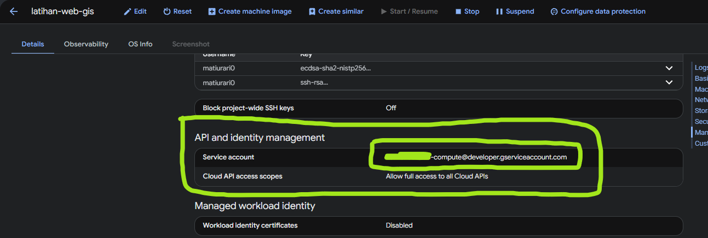


### Tahap 21. Dorong image ke Artifact Registry

Dijalankan di: Terminal VM

```bash
gcloud auth configure-docker asia-southeast2-docker.pkg.dev --quiet
sudo docker push "asia-southeast2-docker.pkg.dev/${PROJECT_ID}/${REPOSITORY}/${IMAGE_NAME}:latest"
```

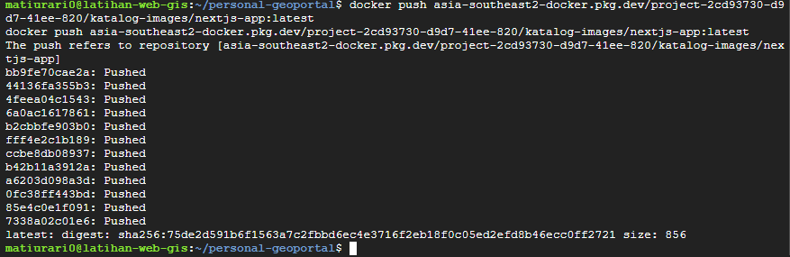

### Tahap 22. Jalankan GeoServer dan Nginx

Dijalankan di: Terminal VM

Jalankan kedua container itu lebih dahulu, tanpa `nextjs`, memakai `--no-deps`. Image `nextjs` belum dibangun pada tahap ini, dan tanpa `--no-deps` compose akan mencoba menariknya.

```bash
cd /opt/webgis/app
sudo docker compose up -d --no-deps geoserver nginx
sudo docker compose ps
```


### Tahap 23. Keluar dari VM

Dijalankan di: Terminal VM

```bash
exit
```

## Bagian C. Otomatisasi dengan Cloud Build

### Tahap 24. Tambahkan Dockerfile dan cloudbuild.yaml

Dijalankan di: Terminal Laptop

Ambil `Dockerfile` dan `.dockerignore` dari folder berkas pelatihan, lalu letakkan keduanya di root folder proyek. Pada `next.config.mjs`, tambahkan `output: "standalone"` supaya hasil build dapat dijalankan sebagai image ringan.


Selanjutnya buat berkas `cloudbuild.yaml`. Berkas ini menjalankan tiga hal setiap kali ada push ke branch `main`: membangun image dari `Dockerfile`, mendorongnya ke Artifact Registry, lalu masuk ke VM untuk menarik image terbaru dan menyalakan container.

```yaml
steps:
  # 1. Build image dari Dockerfile
  - name: "gcr.io/cloud-builders/docker"
    args:
      - "build"
      - "-t"
      - "asia-southeast2-docker.pkg.dev/$PROJECT_ID/katalog-images/${_IMAGE_NAME}:latest"
      - "."

  # 2. Push image ke Artifact Registry
  - name: "gcr.io/cloud-builders/docker"
    args:
      - "push"
      - "asia-southeast2-docker.pkg.dev/$PROJECT_ID/katalog-images/${_IMAGE_NAME}:latest"

  # 3. SSH ke VM, isi NEXTJS_IMAGE, tarik image, jalankan container
  - name: "gcr.io/cloud-builders/gcloud"
    entrypoint: "bash"
    args:
      - "-c"
      - |
        gcloud compute ssh ${_VM_NAME} \
          --zone=${_VM_ZONE} \
          --tunnel-through-iap \
          --quiet \
          --command="set -e && \
            cd ${_VM_APP_DIR} && \
            sudo gcloud auth configure-docker asia-southeast2-docker.pkg.dev --quiet && \
            sudo sed -i 's|^NEXTJS_IMAGE=.*|NEXTJS_IMAGE=asia-southeast2-docker.pkg.dev/$PROJECT_ID/katalog-images/${_IMAGE_NAME}:latest|' .env && \
            sudo -H docker compose pull nextjs && \
            sudo -H docker compose up -d && \
            sudo -H docker compose ps"

images:
  - "asia-southeast2-docker.pkg.dev/$PROJECT_ID/katalog-images/${_IMAGE_NAME}:latest"

options:
  logging: CLOUD_LOGGING_ONLY
```

Periksa kembali pemeriksa YAML pada Tahap 6 halaman [Konfigurasi Project](/hari-3/praktik-11-deploy/konfigurasi-project). Sekarang kedua berkas sudah ada, sehingga keluaran yang diharapkan adalah:

```
OK   docker-compose.yml -> services, networks
     service: nextjs, geoserver, nginx
OK   cloudbuild.yaml -> substitutions, steps, images, options
```

### Tahap 25. Commit dan push

Dijalankan di: Terminal Laptop

Periksa `git status --short` lebih dahulu, dan pastikan `.env` tidak ada di daftar itu.

```bash
git status --short
git add cloudbuild.yaml Dockerfile .dockerignore next.config.mjs
git commit -m "feat: tambah Cloud Build dan Dockerfile"
git push origin main
```


### Tahap 26. Hubungkan repositori GitHub

Dijalankan di: Google Cloud Console

Buka Cloud Build, lalu Repositories, lalu Connect repository. Buat connection dengan nama sesuai `CONNECTION_NAME` yang tercetak pada Tahap 2, pilih GitHub, masuk memakai akun pemilik fork, pilih repositori peserta, isi linked repository sesuai `LINKED_REPO_NAME`, lalu pastikan status connection berubah menjadi COMPLETE.

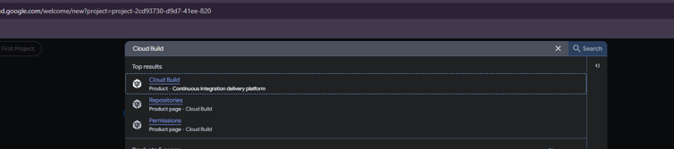

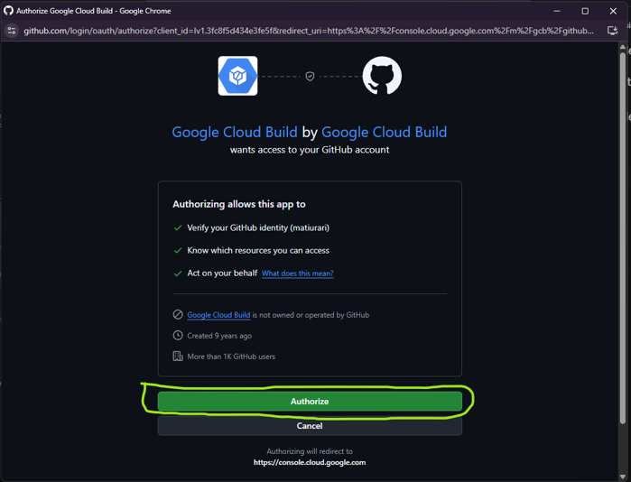


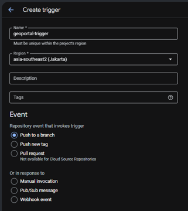


### Tahap 27. Buat trigger Cloud Build

Dijalankan di: Google Cloud Console

Buat trigger dengan pengaturan berikut.

| Kolom | Nilai |
|---|---|
| Event | Push to a branch |
| Source | Fork repositori peserta |
| Branch | `^main$` |
| Configuration | Cloud Build configuration file |
| Location | `cloudbuild.yaml` |
| Name | Sesuai `TRIGGER_NAME` |
| Service account | Sesuai `BUILD_SA` |


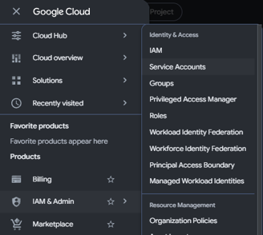

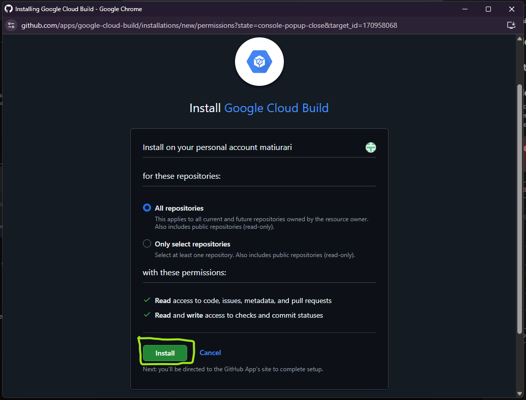


### Tahap 28. Isi substitution variable

Dijalankan di: Google Cloud Console

Tambahkan empat variabel berikut pada trigger. Ganti `PARTICIPANT_ID` dengan identitas Anda.

| Variabel | Nilai |
|---|---|
| `_VM_NAME` | `webgis-PARTICIPANT_ID` |
| `_VM_ZONE` | `asia-southeast2-b` |
| `_VM_APP_DIR` | `/opt/webgis/app` |
| `_IMAGE_NAME` | `nextjs-PARTICIPANT_ID` |


Bagian `PARTICIPANT_ID` pada dua nilai pertama dan terakhir itulah yang membuat trigger peserta A tidak pernah menyentuh VM peserta B.


### Tahap 29. Jalankan trigger dan pantau hasilnya

Dijalankan di: Google Cloud Console

Buka halaman History, lalu jalankan trigger dan pantau build yang sedang berjalan.


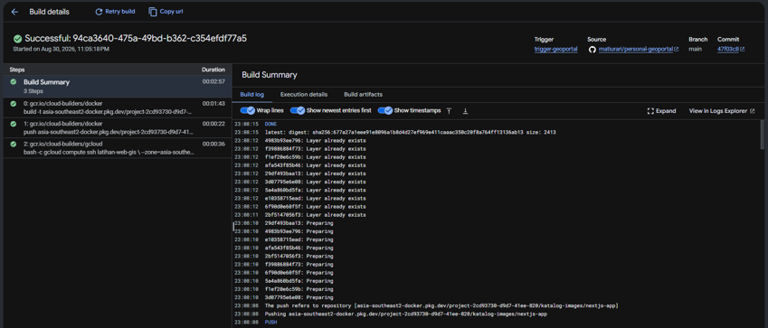


## Bagian D. Verifikasi

### Tahap 30. Periksa container

Dijalankan di: Cloud Shell

```bash
gcloud compute ssh "$VM_NAME" \
  --zone="$ZONE" \
  --tunnel-through-iap \
  --command='cd /opt/webgis/app && sudo docker compose ps'
```

Tiga container harus berstatus running: `nextjs_portal`, `geoserver_app`, dan `nginx_proxy`.

### Tahap 31. Periksa GeoServer

Dijalankan di: Cloud Shell

```bash
EXTERNAL_IP="$(gcloud compute instances describe "$VM_NAME" \
  --zone="$ZONE" \
  --format='get(networkInterfaces[0].accessConfigs[0].natIP)')"

echo "http://${EXTERNAL_IP}/geoserver/web"
curl -sSIL --max-redirs 3 "http://${EXTERNAL_IP}/geoserver/web"
```

### Tahap 32. Buka Geoportal

Dijalankan di: Cloud Shell menuju browser

```bash
EXTERNAL_IP="$(gcloud compute instances describe "$VM_NAME" \
  --zone="$ZONE" \
  --format='get(networkInterfaces[0].accessConfigs[0].natIP)')"

echo "http://${EXTERNAL_IP}/portal"
curl -sSIL --max-redirs 3 "http://${EXTERNAL_IP}/portal"
```

Buka alamat `http://IP_EKSTERNAL_VM/portal` di browser. Tulis `http://` secara eksplisit, karena sebagian browser mengubahnya menjadi `https://` lebih dahulu dan sertifikatnya belum ada pada tahap ini.

## Bila Ada yang Gagal

| Gejala | Penyebab yang paling sering |
|---|---|
| `ALREADY_EXISTS` saat membuat Service Account | Identitas peserta sama dengan peserta lain. Jalankan kembali blok Tahap 2 dan laporkan ke koordinator. |
| `host not found in upstream "nextjs"` | `nginx.conf` belum memakai pola `resolver` dengan `proxy_pass` variabel. Ambil berkas dari halaman Konfigurasi Project. |
| Container `nextjs` tidak muncul | Trigger belum pernah berjalan, atau `cloudbuild.yaml` belum ada di branch `main`. |
| Geoportal terbuka tetapi login gagal | `DATABASE_URL` masih kosong di `.env`. Isi, lalu jalankan `sudo docker compose up -d` lagi. |
| `pull access denied` untuk image nextjs | `NEXTJS_IMAGE` masih berisi nama karangan. Nilai sementara yang aman adalah `nginx:1.27-alpine`. |
| Build gagal pada langkah SSH ke VM | Service Account trigger belum diberi `roles/iam.serviceAccountUser` pada Service Account VM. Ulangi Tahap 6. |

## Hasil Tahap Ini

Geoportal berjalan di `http://IP_EKSTERNAL_VM/portal`, GeoServer dapat diakses dari halaman yang sama, dan setiap push ke branch `main` otomatis membangun ulang image serta menyalakan container di VM. Alamat itu belum memakai HTTPS, dan itu yang dikerjakan pada halaman berikutnya.

## Lampiran. Bila Memakai Akun Google Cloud Sendiri

Halaman ini mengasumsikan Anda memakai project kelompok yang disiapkan koordinator. Bila Anda menjalankan seluruh praktik dengan akun Google Cloud sendiri, projectnya dibuat lebih dahulu melalui pendaftaran akun gratis. Sebagian tahapan pada halaman ini tetap sama, tetapi nama resource tidak perlu memuat identitas peserta karena projectnya hanya dipakai satu orang.

| Bagian | Perbedaan pada akun sendiri |
|---|---|
| Tahap 2 | `PARTICIPANT_ID` boleh diisi nama sendiri. Penjagaan tabrakan tetap berguna bila Anda memakai lebih dari satu identitas. |
| Tahap 4 | Service Account dibuat di project sendiri, bukan project kelompok. |
| Tahap 5 | Repository `katalog-images` perlu dibuat sendiri di Artifact Registry. |
| Tahap 8 | Firewall rule perlu dibuat sendiri, karena tidak ada koordinator yang menyiapkannya. |
| Tahap 26 | Connection GitHub dibuat di project sendiri. |

### Pendaftaran akun

1. Buka [https://cloud.google.com/gcp](https://cloud.google.com/gcp).

   

2. Pilih **Get started for free**.

   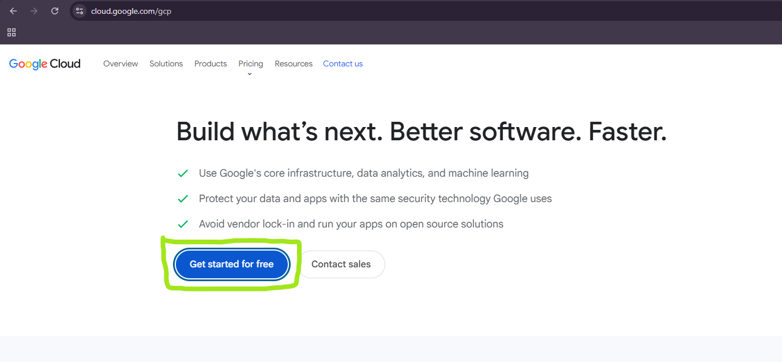

3. Pilih akun dan negara yang digunakan, lalu klik **Agree & continue**.

   

4. Isi **Contact Information**, lalu simpan.

   

   

5. Setelah organization dibuat, isi **Tax Information**. Pilih **Head Office**, masukkan NIK pada kolom NPWP, lalu simpan.

   

6. Isi **Add Payment Method** dengan detail kartu kredit.

   

7. Konfirmasi metode pembayaran, lalu klik **Start free**.

   

   

8. Buka kembali [https://cloud.google.com/gcp](https://cloud.google.com/gcp). Karena akun sudah terdaftar, tombol **Go to my console** akan muncul. Klik tombol itu untuk masuk ke dashboard project.

   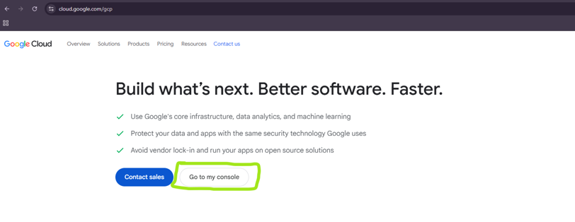

   

Setelah project tersedia, kembali ke Tahap 2 dan isi `PROJECT_ID` dengan Project ID milik Anda sendiri.
