# Membuat CRUD API Users

Halaman ini melanjutkan pekerjaan backend dari [Konfigurasi Prisma dan Membuat API Login](/hari-3/praktik-8/prisma-api-login). Seluruh endpoint di bawah bekerja pada tabel `users` yang sama dan memakai Prisma client dari `lib/db.js`.

## Endpoint yang dibuat

| Endpoint | Method | Akses | Fungsi |
|---|---|---|---|
| `/api/users/register` | POST | tanpa token | Mendaftarkan user baru |
| `/api/users/list` | GET | token `super_admin` | Mengambil daftar user |
| `/api/users/create` | POST | token `super_admin` | Membuat user baru |
| `/api/users/delete` | POST | token `super_admin` | Menghapus user |
| `/api/users/update` | POST | token `super_admin` | Memperbarui role dan status aktif user |
| `/api/users/login` | POST | tanpa token | Login dan mengeluarkan access token (dibuat pada praktik 8) |

## Persiapan

1. Buka project NextJS di VS Code, lalu jalankan tiga perintah berikut di terminal.

    ```bash
    npm install jsonwebtoken
    npm install bcryptjs
    npm install crypto
    ```

    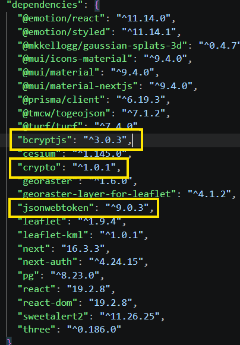

2. Tambahkan dua variabel berikut di berkas `.env`. Isi `JWT_SECRET` dengan hasil generator secret, misalnya dari `randomkeygen.com/jwt-secret`.

    ```text
    JWT_SECRET=hasil-paste-dari-generate-secret
    JWT_EXPIRES_IN=1h
    ```

    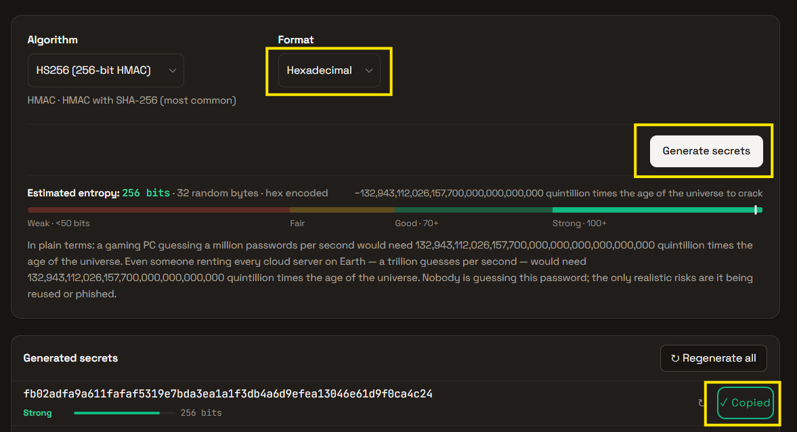

    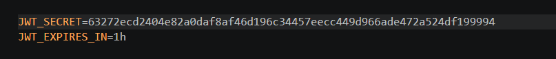

3. Buat password sementara untuk akun `super_admin`. Jalankan `node` di terminal, lalu tempel kode berikut. Ganti `PasswordRahasia123` sesuai keinginan.

    ```js
    const bcrypt = require('bcryptjs');
    const hash = bcrypt.hashSync('PasswordRahasia123', 10);
    console.log(hash);
    ```

    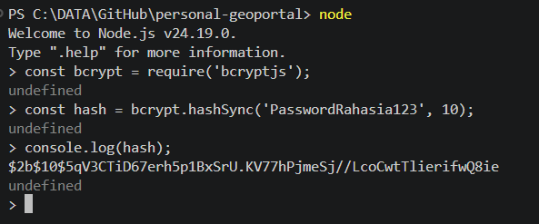

4. Salin nilai hash yang muncul ke kolom `password` pada baris akun `super_admin` di tabel `users`.

    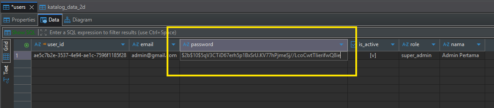

## Berkas pendukung autentikasi

Tiga berkas berikut sudah dibuat pada praktik 8, dan isinya tidak diulang di sini. Rujukan kodenya ada pada [Konfigurasi Prisma dan Membuat API Login](/hari-3/praktik-8/prisma-api-login) bagian Berkas Pendukung Autentikasi.

| Berkas | Isi |
|---|---|
| `lib/auth/verifyCredentials.js` | Mencocokkan email dan password dengan data di tabel `users` |
| `lib/auth/jwt.js` | `signAccessToken` dan `verifyAccessToken` |
| `lib/auth/roles.js` | `ROLE_LEVELS` dan `hasRequiredRole` |

5. Berkas `lib/auth/verifyCredentials.js`.

    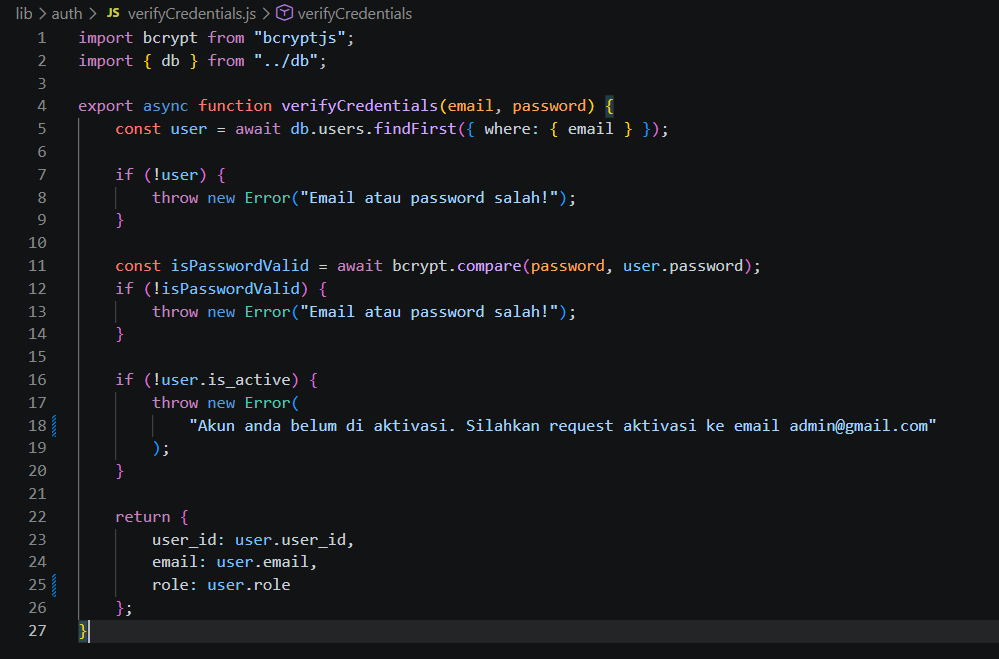

6. Berkas `lib/auth/jwt.js`.

    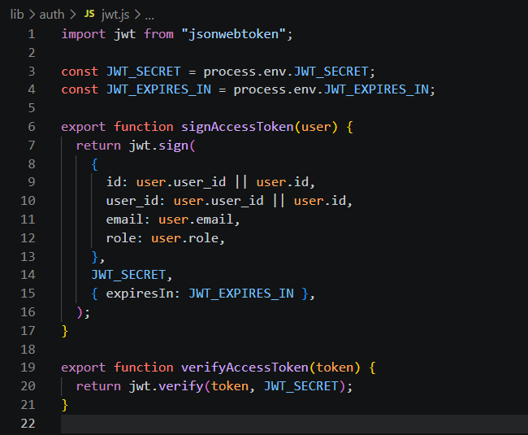

7. Berkas `lib/auth/roles.js`.

    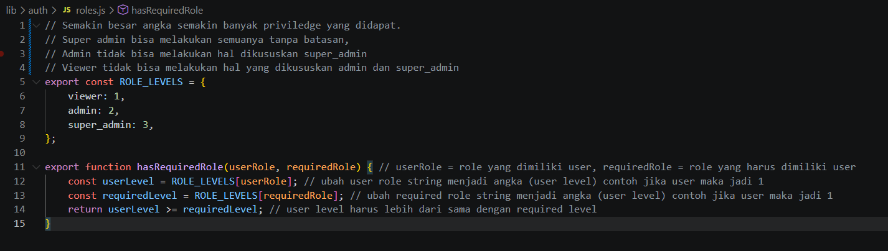

    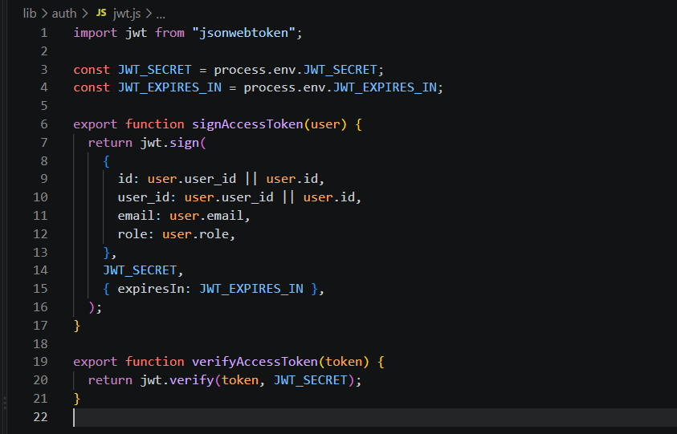

8. Route login `src/app/api/users/login/route.js` tetap seperti pada praktik 8.

    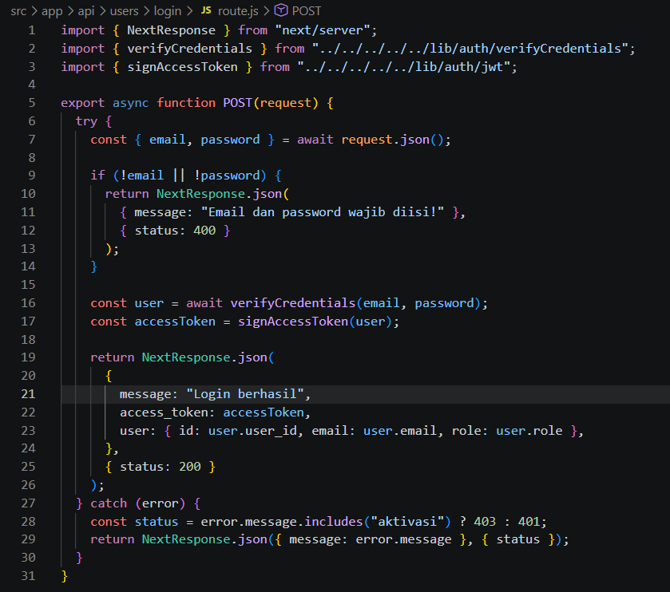

## Route API users

Route `list`, `create`, `delete`, dan `update` memanggil `requireAuth` dari `lib/auth/verifyBearerToken.js`. Berkas itu bukan bagian dari praktik 8 dan 9; pembuatannya ada pada halaman [Konfigurasi Access Token dan Next Auth](/hari-3/praktik-10/nextauth-access-token). Fungsi tersebut mengembalikan `payload`, `error`, dan `status`, dan setiap route menghentikan request begitu `error` berisi pesan.

::: tip Daftar role berbeda antara create dan update
`create` hanya menerima role `editor` dan `admin`, sedangkan `update` hanya menerima role `viewer` dan `admin`. Request dengan role di luar daftar itu dijawab status 400.
:::

::: warning Tiga tangkapan layar berhenti sebelum akhir berkas
Gambar route `register`, `create`, dan `update` pada slide berhenti di tengah berkas, sehingga kode di bawah disalin sampai baris terakhir yang terlihat. Bagian penutupnya mengikuti pola route `delete`: blok `catch (err)` mengembalikan `{ message: err.message }` dengan status 500.
:::

### src/app/api/users/register/route.js

| Field | Wajib | Keterangan |
|---|---|---|
| `nama` | ya | Nama user |
| `email` | ya | Harus belum terdaftar di tabel `users` |
| `password` | ya | Disimpan dalam bentuk hash Bcrypt |

Route ini tidak memakai `requireAuth`. Nilai `role` diisi `"editor"` dan `is_active` diisi `false` untuk setiap user baru.

```js
import { NextResponse } from "next/server";
import { db } from "../../../../../lib/db";
import bcrypt from "bcryptjs";

export async function POST(request) {
    try {
        const data = await request.json();

        // 1. Validasi sederhana input data
        if (!data.email || !data.password || !data.nama) {
            return NextResponse.json(
                { message: "Nama, email, dan password wajib diisi!" },
                { status: 400 }
            );
        }

        // 2. Cek apakah email sudah terdaftar di database
        const existingUser = await db.users.findUnique({
            where: {
                email: data.email,
            },
        });

        if (existingUser) {
            return NextResponse.json(
                { message: "Email sudah terdaftar. Silakan gunakan email lain!" },
                { status: 400 } // Status 400 Bad Request / 409 Conflict
            );
        }

        // 3. Hash password dan generate UUID
        const hashedPassword = await bcrypt.hash(data.password, 10);
        const user_id = crypto.randomUUID();

        // 4. Simpan user baru ke database
        const registerUser = await db.users.create({
            data: {
                user_id: user_id,
                nama: data.nama,
                email: data.email,
                password: hashedPassword,
                role: "editor", // Default role
                is_active: false, // Default status non-aktif
            },
```

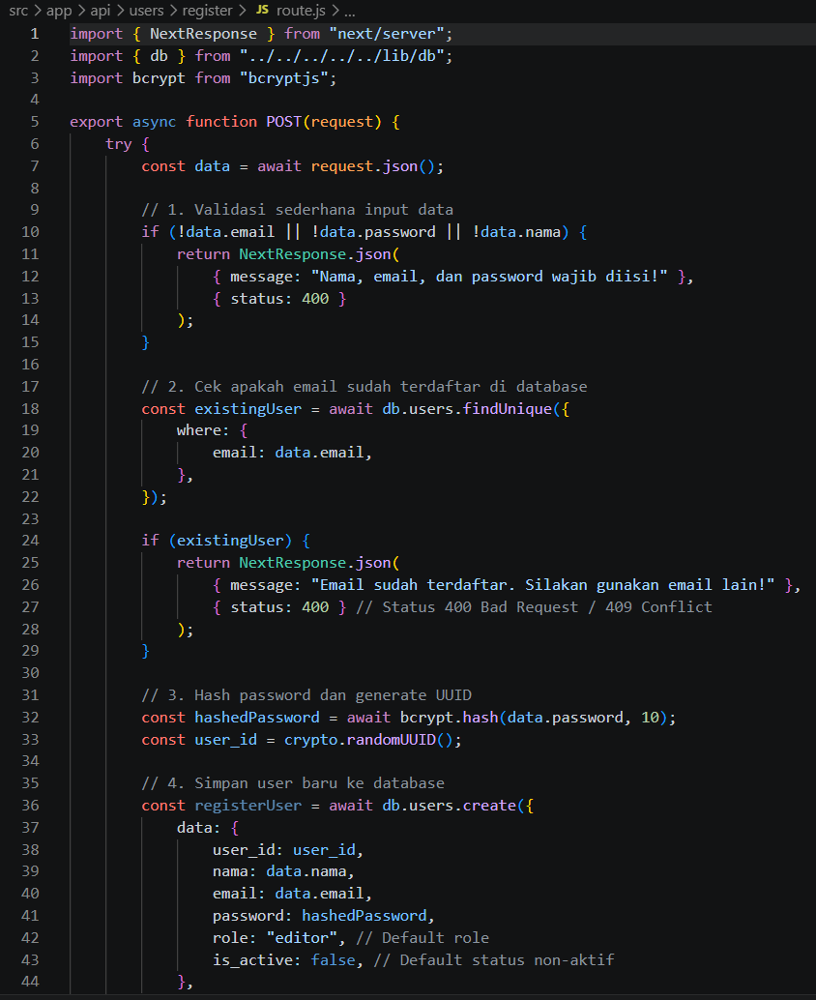

Kode yang terlihat mengembalikan status 400 untuk dua kondisi, yaitu field wajib yang kosong dan email yang sudah terdaftar. Gambar berhenti sebelum blok penutup berkas.

### src/app/api/users/list/route.js

| Parameter | Letak | Keterangan |
|---|---|---|
| `Authorization` | header | `Bearer <access_token>` milik user dengan role `super_admin` |

```js
import { NextResponse } from "next/server";
import { db } from "../../../../../lib/db";
import { requireAuth } from "../../../../../lib/auth/verifyBearerToken";

export async function GET(request) {
    const { payload, error, status } = requireAuth(request, "super_admin");
    if (error) {
        return NextResponse.json({ message: error }, { status });
    }

    try {
        const users = await db.users.findMany({ // ambil data user dari table users
            select: {
                user_id: true,
                nama: true,
                email: true,
                role: true,
                is_active: true,
            },
        });

        return NextResponse.json(
            { message: "Berhasil mengambil data user", data: users },
            { status: 200 }
        );
    } catch (error) {
        return NextResponse.json({ message: error.message }, { status: 500 });
    }
}
```

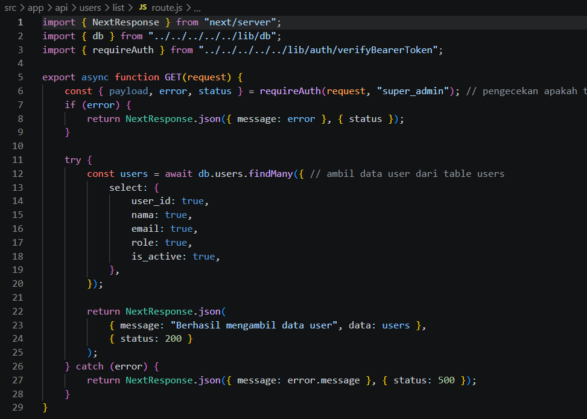

Respons 200 memuat `message` dan `data`, yaitu daftar user dengan field `user_id`, `nama`, `email`, `role`, dan `is_active`. Galat saat query dijawab status 500.

### src/app/api/users/create/route.js

| Field | Wajib | Keterangan |
|---|---|---|
| `nama` | ya | Nama user |
| `email` | ya | Harus belum terdaftar di tabel `users` |
| `password` | ya | Di-hash dengan `bcrypt.hashSync` sebelum disimpan |
| `role` | tidak | `"editor"` atau `"admin"` |
| `is_active` | tidak | Status aktif user |

```js
import { NextResponse } from "next/server";
import { requireAuth } from "../../../../../lib/auth/verifyBearerToken";
import { db } from "../../../../../lib/db";
import bcrypt from "bcryptjs";
import crypto from "crypto";

export async function POST(request) {
    const { payload, error, status } = requireAuth(request, "super_admin");
    if (error) {
        return NextResponse.json({ message: error }, { status });
    }

    const data = await request.json();
    const allowedRoles = ["editor", "admin"]; // daftar role yang diizinkan untuk dibuat

    if (data.role && !allowedRoles.includes(data.role)) {
        return NextResponse.json({ message: "Role tidak valid" }, { status: 400 });
    }

    const password = bcrypt.hashSync(data.password, 10);

    const isAlreadyExists = await db.users.findFirst({
        where: { email: data.email },
    });

    if (isAlreadyExists) {
        return NextResponse.json({ message: "Email sudah terdaftar" }, { status: 400 });
    }

    try {
        const newUser = await db.users.create({
            data: {
                user_id: crypto.randomUUID(),
                nama: data.nama,
                email: data.email,
                nama: data.nama,
                password: password,
                role: data.role,
                is_active: data.is_active,
            },
        });

        return NextResponse.json(
            { message: "Berhasil membuat user baru", data: newUser },
```

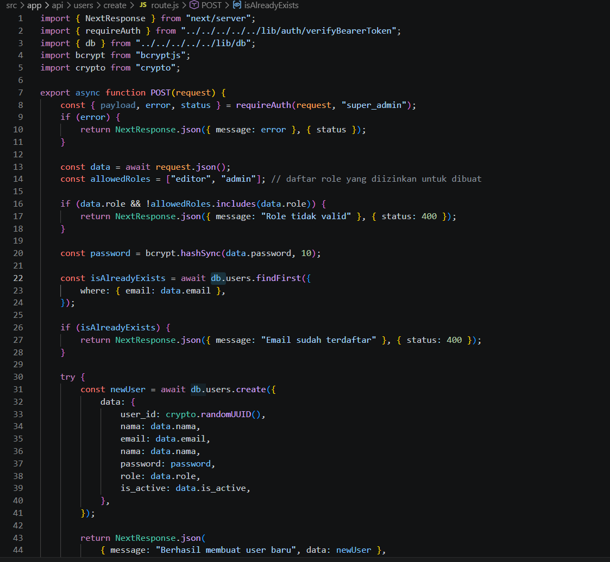

Dua kondisi yang dijawab status 400 adalah role di luar `allowedRoles` dan email yang sudah terdaftar. Baris `nama: data.nama` tertulis dua kali pada gambar aslinya, dan gambar berhenti sebelum blok penutup berkas.

### src/app/api/users/delete/route.js

| Field | Wajib | Keterangan |
|---|---|---|
| `user_id` | ya | ID user yang dihapus |

```js
import { NextResponse } from "next/server";
import { requireAuth } from "../../../../../lib/auth/verifyBearerToken";
import { db } from "../../../../../lib/db";

export async function POST(request) {
    const { payload, error, status } = requireAuth(request, "super_admin");
    if (error) {
        return NextResponse.json({ message: error }, { status });
    }

    const data = await request.json();

    try {
        const deletedUser = await db.users.delete({
            where: { user_id: data.user_id },
            select: {
                user_id: true,
                email: true
            }
        });

        return NextResponse.json({ message: "Berhasil menghapus user", data: deletedUser }, { status: 200 });

    } catch (err) {
        return NextResponse.json({ message: err.message }, { status: 500 });
    }
}
```

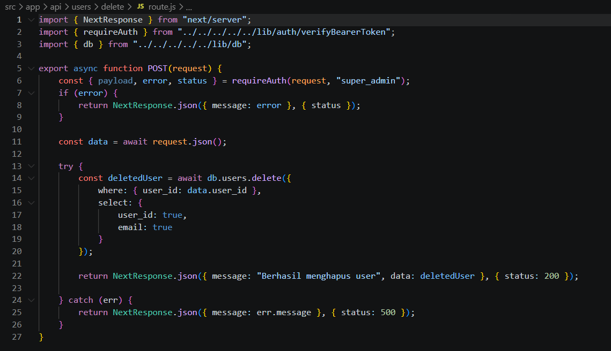

Respons 200 berisi data user yang dihapus, dengan field `user_id` dan `email`. Galat saat penghapusan dijawab status 500.

### src/app/api/users/update/route.js

| Field | Wajib | Keterangan |
|---|---|---|
| `user_id` | ya | ID user yang diperbarui |
| `role` | tidak | `"viewer"` atau `"admin"` |
| `is_active` | tidak | Status aktif user |

```js
import { NextResponse } from "next/server";
import { requireAuth } from "../../../../../lib/auth/verifyBearerToken";
import { db } from "../../../../../lib/db";

export async function POST(request) {
    const { payload, error, status } = requireAuth(request, "super_admin");
    if (error) {
        return NextResponse.json({ message: error }, { status });
    }

    const data = await request.json();

    // Validasi role yang diizinkan untuk diperbarui
    const allowedRoles = ["viewer", "admin"]; // daftar role yang diizinkan untuk diperbarui
    if (data.role && !allowedRoles.includes(data.role)) {
        return NextResponse.json({ message: "Role tidak valid" }, { status: 400 });
    }

    // Validasi apakah user_id ada di database
    const isExists = await db.users.findFirst({
        where: { user_id: data.user_id },
    });
    if (!isExists) {
        return NextResponse.json({ message: "User tidak ditemukan" }, { status: 404 });
    }

    try {
        const user = await db.users.update({
            where: { user_id: data.user_id },
            data: {
                role: data.role,
                is_active: data.is_active,
            },
            select: {
                user_id: true,
                email: true,
                role: true,
                is_active: true,
            },
        });

        return NextResponse.json(
            { message: "Berhasil memperbarui data user", data: user },
            { status: 200 }
```

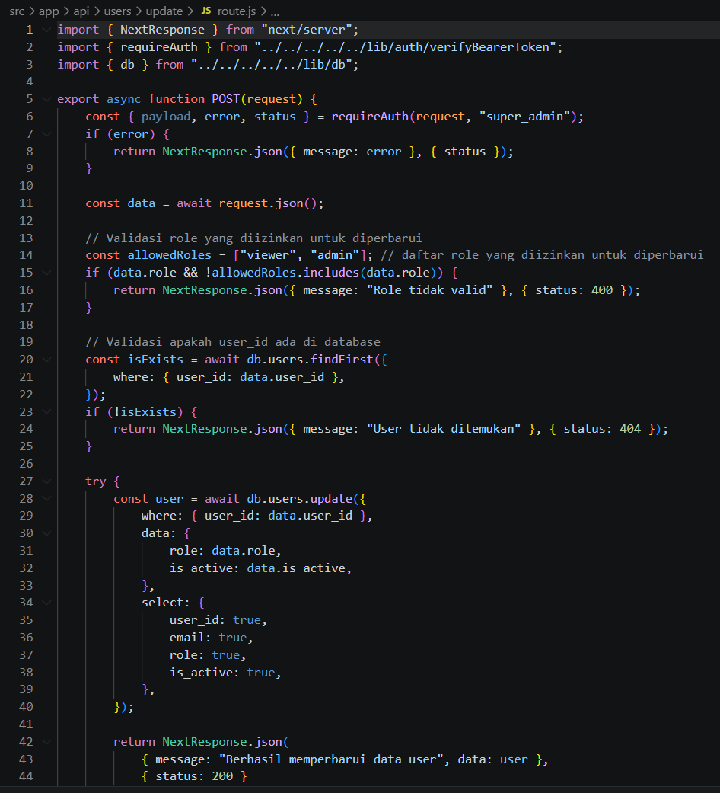

Status 400 dipakai untuk role di luar `allowedRoles`, status 404 untuk `user_id` yang tidak ada di database, dan status 200 untuk pembaruan yang berhasil. Gambar berhenti sebelum blok `catch` pada berkas ini.

## Setelah halaman ini

Kelima route di atas melengkapi pengelolaan tabel `users`: pendaftaran, pembacaan, pembuatan, pembaruan, dan penghapusan. Halaman [Konfigurasi Access Token dan Next Auth](/hari-3/praktik-10/nextauth-access-token) melanjutkan dengan pembuatan berkas `lib/auth/verifyBearerToken.js` yang dipakai route `list`, `create`, `delete`, dan `update`.
